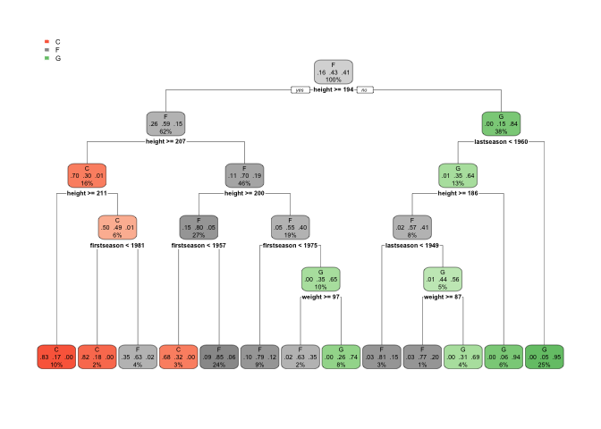
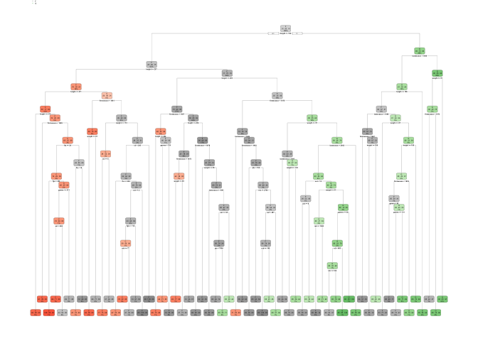
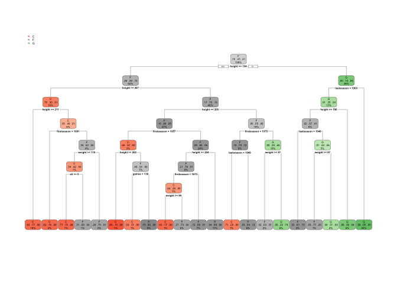

# Classification methods

Nalozimo potrebne knjiznice ki jih bomo uporabili za demonstracijo.

``` r
# install.packages(c("CORElearn", "e1071", "randomForest", "kernlab", "nnet"))
```

## Priprava podatkov

Nalozimo podatke v R, ter odstranimo atribut “id”, saj je neuporaben za
sklepanje (vsak primer ima drugacen id - ni nobene zakonitosti).

Odstranimo tudi primere, kateri nimajo vseh podatkov za vse atribute (5
primerov nima podatka za “weight”).

Na koncu generiramo se ucno in testno mnozico.

``` r
players <- read.table("players.txt", sep=",", header=T, stringsAsFactors=T)
summary(players)
```

    ##          id           height          weight      position  firstseason  
    ##  ABDELAL01:   1   Min.   :160.0   Min.   : 60.0   C: 520   Min.   :1946  
    ##  ABDULKA01:   1   1st Qu.:190.0   1st Qu.: 84.0   F:1340   1st Qu.:1962  
    ##  ABDULMA01:   1   Median :198.0   Median : 93.0   G:1299   Median :1979  
    ##  ABDULTA01:   1   Mean   :197.4   Mean   : 93.4            Mean   :1977  
    ##  ABDURSH01:   1   3rd Qu.:203.0   3rd Qu.:100.0            3rd Qu.:1991  
    ##  ABERNTO01:   1   Max.   :231.0   Max.   :150.0            Max.   :2008  
    ##  (Other)  :3153                   NA's   :5                              
    ##    lastseason       games             pts             reb       
    ##  Min.   :1946   Min.   :   1.0   Min.   :    0   Min.   :    0  
    ##  1st Qu.:1968   1st Qu.:  31.0   1st Qu.:   81   1st Qu.:   22  
    ##  Median :1984   Median : 115.0   Median :  542   Median :  196  
    ##  Mean   :1981   Mean   : 262.2   Mean   : 2649   Mean   : 1148  
    ##  3rd Qu.:1997   3rd Qu.: 438.5   3rd Qu.: 3257   3rd Qu.: 1419  
    ##  Max.   :2008   Max.   :1611.0   Max.   :38387   Max.   :23924  
    ##                                                                 
    ##       ast               stl              fga             fgm       
    ##  Min.   :    0.0   Min.   :   0.0   Min.   :    0   Min.   :    0  
    ##  1st Qu.:   15.0   1st Qu.:   0.0   1st Qu.:   88   1st Qu.:   31  
    ##  Median :  109.0   Median :  12.0   Median :  518   Median :  207  
    ##  Mean   :  602.8   Mean   : 161.9   Mean   : 2270   Mean   : 1024  
    ##  3rd Qu.:  635.0   3rd Qu.: 158.5   3rd Qu.: 2904   3rd Qu.: 1254  
    ##  Max.   :15806.0   Max.   :3265.0   Max.   :28307   Max.   :15837  
    ##                                                                    
    ##       fta               ftm        
    ##  Min.   :    0.0   Min.   :   0.0  
    ##  1st Qu.:   26.0   1st Qu.:  17.0  
    ##  Median :  162.0   Median : 110.0  
    ##  Mean   :  738.5   Mean   : 551.0  
    ##  3rd Qu.:  896.0   3rd Qu.: 653.5  
    ##  Max.   :13188.0   Max.   :9787.0  
    ## 

``` r
players$id <- NULL

players <- na.omit(players) # odstranimo ne popolne primere

set.seed(0)
sel <- sample(1:nrow(players), as.integer(nrow(players) * 0.7), replace=F)
train <- players[sel,]
test <- players[-sel,]
```

Pripravimo se matriko za razredni indikator z metodo `class.id`.
Definirajmo tudi `CA` in `brier.score` funkciji za pomoc pri evaluaciji
modela.

``` r
# ciljna spremenljivka je atribut "position"

# indikator razreda (potrebujemo ga za ocenjevanje verjetnostnih napovedi)
library(nnet)
obsMat <- class.ind(test$position)
head(obsMat)
```

    ##      C F G
    ## [1,] 0 1 0
    ## [2,] 1 0 0
    ## [3,] 0 1 0
    ## [4,] 0 0 1
    ## [5,] 0 1 0
    ## [6,] 0 0 1

``` r
# pravilni razredi testnih primerov (potrebujemo jih za ocenjevanje klasifikacijske tocnosti)
observed <- test$position
head(observed)
```

    ## [1] F C F G F G
    ## Levels: C F G

``` r
# funkcija za izracun klasifikacijske tocnosti
CA <- function(observed, predicted)
{
    mean(observed == predicted)
}

# funkcija za izracun povprecne Brierjeve mere
brier.score <- function(observedMatrix, predictedMatrix)
{
    sum((observedMatrix - predictedMatrix) ^ 2) / nrow(predictedMatrix)
}
```

## Odlocitveno drevo

Ustvarimo in evaluiramo zacetne predikcije.

``` r
library(rpart)
dt <- rpart(position ~ ., data=train) # zgradimo odlocitveno drevo (decision tree)
rpart.plot::rpart.plot(dt)
```



``` r
predicted <- predict(dt, test, type="class")
CA(observed, predicted)
```

    ## [1] 0.812038

``` r
predMat <- predict(dt, test, type="prob")
brier.score(obsMat, predMat)
```

    ## [1] 0.2931842

Izklopimo cp (Complexity Parameter) in s tem zgradimo odlocitveno drevo
neomejene kompleksnosti. Izpisemo razultate sprotnega precnega
preverjenja z metodo `printcp()`.

Zacetni model lahko izboljsamo, tako da sami nastavimo Complexity
Parameter, tako da najdemo vrednost cp, kjer je izracunana najmanjsa
napaka precnega preverjenja.

V tem primeru smo uspeli izboljsati brier score za 1%.

``` r
dt <- rpart(position ~ ., data=train, cp=0)
rpart.plot::rpart.plot(dt)
```

    ## Warning: labs do not fit even at cex 0.15, there may be some overplotting



``` r
tab <- printcp(dt)
```

    ## 
    ## Classification tree:
    ## rpart(formula = position ~ ., data = train, cp = 0)
    ## 
    ## Variables actually used in tree construction:
    ##  [1] ast         fga         fgm         firstseason fta         games      
    ##  [7] height      lastseason  pts         reb         stl         weight     
    ## 
    ## Root node error: 1268/2207 = 0.57454
    ## 
    ## n= 2207 
    ## 
    ##            CP nsplit rel error  xerror     xstd
    ## 1  0.46056782      0   1.00000 1.00000 0.018318
    ## 2  0.11119874      1   0.53943 0.55678 0.017281
    ## 3  0.02602524      2   0.42823 0.44558 0.016169
    ## 4  0.01656151      4   0.37618 0.38486 0.015375
    ## 5  0.01182965      5   0.35962 0.38091 0.015319
    ## 6  0.01064669      6   0.34779 0.36987 0.015156
    ## 7  0.01025237      8   0.32650 0.36278 0.015049
    ## 8  0.00552050     12   0.28233 0.32571 0.014450
    ## 9  0.00315457     13   0.27681 0.31625 0.014286
    ## 10 0.00276025     17   0.26420 0.30757 0.014132
    ## 11 0.00236593     20   0.25473 0.29811 0.013958
    ## 12 0.00197161     23   0.24763 0.30047 0.014002
    ## 13 0.00189274     27   0.23817 0.30284 0.014046
    ## 14 0.00157729     32   0.22871 0.30599 0.014103
    ## 15 0.00118297     34   0.22555 0.30757 0.014132
    ## 16 0.00094637     49   0.20741 0.31388 0.014244
    ## 17 0.00078864     54   0.20268 0.34069 0.014700
    ## 18 0.00052576     56   0.20110 0.34306 0.014739
    ## 19 0.00039432     59   0.19953 0.34385 0.014751
    ## 20 0.00000000     61   0.19874 0.34779 0.014815

``` r
tab
```

    ##              CP nsplit rel error    xerror       xstd
    ## 1  0.4605678233      0 1.0000000 1.0000000 0.01831774
    ## 2  0.1111987382      1 0.5394322 0.5567823 0.01728114
    ## 3  0.0260252366      2 0.4282334 0.4455836 0.01616927
    ## 4  0.0165615142      4 0.3761830 0.3848580 0.01537544
    ## 5  0.0118296530      5 0.3596215 0.3809148 0.01531870
    ## 6  0.0106466877      6 0.3477918 0.3698738 0.01515622
    ## 7  0.0102523659      8 0.3264984 0.3627760 0.01504891
    ## 8  0.0055205047     12 0.2823344 0.3257098 0.01444993
    ## 9  0.0031545741     13 0.2768139 0.3162461 0.01428600
    ## 10 0.0027602524     17 0.2641956 0.3075710 0.01413154
    ## 11 0.0023659306     20 0.2547319 0.2981073 0.01395829
    ## 12 0.0019716088     23 0.2476341 0.3004732 0.01400208
    ## 13 0.0018927445     27 0.2381703 0.3028391 0.01404554
    ## 14 0.0015772871     32 0.2287066 0.3059937 0.01410301
    ## 15 0.0011829653     34 0.2255521 0.3075710 0.01413154
    ## 16 0.0009463722     49 0.2074132 0.3138801 0.01424428
    ## 17 0.0007886435     54 0.2026814 0.3406940 0.01470011
    ## 18 0.0005257624     56 0.2011041 0.3430599 0.01473859
    ## 19 0.0003943218     59 0.1995268 0.3438486 0.01475136
    ## 20 0.0000000000     61 0.1987382 0.3477918 0.01481475

``` r
# izberemo vrednost parametra cp, ki ustreza minimalni napaki internega presnega preverjanja
row <- which.min(tab[,"xerror"])
th <- mean(c(tab[row, "CP"], tab[row-1, "CP"]))
th
```

    ## [1] 0.002563091

``` r
# porezemo drevo z izbrano nastavitvijo
dt <- prune(dt, cp=th)
rpart.plot::rpart.plot(dt)
```



``` r
predicted <- predict(dt, test, type="class")
CA(observed, predicted)
```

    ## [1] 0.8225977

``` r
predMat <- predict(dt, test, type = "prob")
brier.score(obsMat, predMat)
```

    ## [1] 0.2852387

Gradnja drevesa s pomocjo knjiznice CORElearn.

``` r
library(CORElearn)
dt <- CoreModel(position ~ ., data = train, model="tree")
predicted <- predict(dt, test, type="class")
CA(observed, predicted)
```

    ## [1] 0.812038

``` r
predMat <- predict(dt, test, type = "prob")
brier.score(obsMat, predMat)
```

    ## [1] 0.2804174

## Naivni Bayesov klasifikator

Naivni bayesov klasifikator predpostavlja, da so atributi med seboj
neodvisni.

``` r
library(e1071)

nb <- naiveBayes(position ~ ., data = train)
predicted <- predict(nb, test, type="class")
CA(observed, predicted)
```

    ## [1] 0.7381204

``` r
predMat <- predict(nb, test, type = "raw")
brier.score(obsMat, predMat)
```

    ## [1] 0.3797566

Gradnja bayesovega klasifikatorja z pomocjo knjiznice CORElearn.

``` r
library(CORElearn)
nb <- CoreModel(position ~ ., data = train, model="bayes")
predicted <- predict(nb, test, type="class")
CA(observed, predicted)
```

    ## [1] 0.7307286

``` r
predMat <- predict(nb, test, type = "prob")
brier.score(obsMat, predMat)
```

    ## [1] 0.396768

## K-nearest neighbours

``` r
library(CORElearn)
knn <- CoreModel(position ~ ., data = train, model="knn", kInNN = 5)
predicted <- predict(knn, test, type="class")
CA(observed, predicted)
```

    ## [1] 0.8057022

``` r
predMat <- predict(knn, test, type = "prob")
brier.score(obsMat, predMat)
```

    ## [1] 0.2960929

Model lahko izboljsamo z izbiro najbolj ustreznega parametra “kInNN”. Za
izbiro parametra “kInNN” lahko uporabimo precno preverjanje na ucni
mnozici.

``` r
n <- nrow(train)
k <- 10

set.seed(0)
fold.id <- rep(1:k, length.out=n)
s <- sample(1:n, n, FALSE)
fold.id <- fold.id[s]

# poskusili bomo vse vrednosti parametra "kInNN" na intervalu od 1 do 20
minkInNN <- 1
maxkInNN <- 20
est <- vector()
for (val in minkInNN:maxkInNN)
{
    print(paste("Testiram za nastavitev kInNN", val))
    flush.console()

    q <- vector()
    for (i in 1:k)
    {   
        sel <- fold.id == i
        knn <- CoreModel(position ~ ., data = train[!sel,], model="knn", kInNN = val)
        pred <- predict(knn, train[sel,], type= "class")
        obs <- train$position[sel]
        q[sel] <- pred == obs
    }

    est <- append(est, mean(q))
}
```

    ## [1] "Testiram za nastavitev kInNN 1"
    ## [1] "Testiram za nastavitev kInNN 2"
    ## [1] "Testiram za nastavitev kInNN 3"
    ## [1] "Testiram za nastavitev kInNN 4"
    ## [1] "Testiram za nastavitev kInNN 5"
    ## [1] "Testiram za nastavitev kInNN 6"
    ## [1] "Testiram za nastavitev kInNN 7"
    ## [1] "Testiram za nastavitev kInNN 8"
    ## [1] "Testiram za nastavitev kInNN 9"
    ## [1] "Testiram za nastavitev kInNN 10"
    ## [1] "Testiram za nastavitev kInNN 11"
    ## [1] "Testiram za nastavitev kInNN 12"
    ## [1] "Testiram za nastavitev kInNN 13"
    ## [1] "Testiram za nastavitev kInNN 14"
    ## [1] "Testiram za nastavitev kInNN 15"
    ## [1] "Testiram za nastavitev kInNN 16"
    ## [1] "Testiram za nastavitev kInNN 17"
    ## [1] "Testiram za nastavitev kInNN 18"
    ## [1] "Testiram za nastavitev kInNN 19"
    ## [1] "Testiram za nastavitev kInNN 20"

``` r
names(est) <- minkInNN:maxkInNN
est
```

    ##         1         2         3         4         5         6         7         8 
    ## 0.7575895 0.7408246 0.7811509 0.7784323 0.7906661 0.7888536 0.7902130 0.7924785 
    ##         9        10        11        12        13        14        15        16 
    ## 0.7979157 0.7893068 0.7974626 0.7942909 0.7979157 0.7961033 0.7992750 0.7947440 
    ##        17        18        19        20 
    ## 0.7947440 0.8010874 0.7956502 0.7956502

``` r
which.max(est)
```

    ## 18 
    ## 18

``` r
knn <- CoreModel(position ~ ., data = train, model="knn", kInNN = 18)
predicted <- predict(knn, test, type="class")
CA(observed, predicted)
```

    ## [1] 0.810982

``` r
predMat <- predict(knn, test, type = "prob")
brier.score(obsMat, predMat)
```

    ## [1] 0.2853195

## Random forest

Gradnja modela s pomocjo knjiznice “randomForest”.

``` r
library(randomForest)
```

    ## randomForest 4.6-14

    ## Type rfNews() to see new features/changes/bug fixes.

``` r
rf <- randomForest(position ~ ., data = train)
predicted <- predict(rf, test, type="class")
CA(observed, predicted)
```

    ## [1] 0.8458289

``` r
predMat <- predict(rf, test, type = "prob")
brier.score(obsMat, predMat)
```

    ## [1] 0.2339847

Gradnja modela s pomocjo knjiznice “CORElearn”.

``` r
library(CORElearn)
rf <- CoreModel(position ~ ., data = train, model="rf")
predicted <- predict(rf, test, type="class")
CA(observed, predicted)
```

    ## [1] 0.842661

``` r
predMat <- predict(rf, test, type = "prob")
brier.score(obsMat, predMat)
```

    ## [1] 0.2293421

## Support Vector Machine

``` r
library(e1071)

sm <- svm(position ~ ., data = train)
predicted <- predict(sm, test, type="class")
CA(observed, predicted)
```

    ## [1] 0.8394931

``` r
# nastavi probability=T, da nam model vrne verjetnostne napovedi
sm <- svm(position ~ ., train, probability = T)
pred <- predict(sm, test, probability = T)
predMat <- attr(pred, "probabilities")

# v tem konkretnem primeru, je vrstni red razredov (stolpcev) v matriki predMat drugacen kot 
# je v matriki obsMat. 
colnames(obsMat)
```

    ## [1] "C" "F" "G"

``` r
colnames(predMat)
```

    ## [1] "C" "G" "F"

``` r
# popravimo ga
predMat <- predMat[,colnames(obsMat)]

# Iz tega razloga zamenjemo vrstni red stolpcev v matriki predMat
brier.score(obsMat, predMat)
```

    ## [1] 0.2228859

Izdelava modela s pomocjo kernlab knjiznice.

``` r
library(kernlab)

sm <- ksvm(position ~ ., data = train, kernel = "rbfdot")
predicted <- predict(sm, test, type = "response")
CA(observed, predicted)
```

    ## [1] 0.8331573

``` r
sm <- ksvm(position ~ ., data = train, kernel = "rbfdot", prob.model = T)
predMat <- predict(sm, test, type = "prob")
brier.score(obsMat, predMat)
```

    ## [1] 0.2291072

## Artificial Neural Network

``` r
library(nnet)

set.seed(0)

# zgradimo nevronsko mrezo z enim skritim nivojem z 5 nevroni
nn <- nnet(position ~ ., data = train, size = 5, decay = 0.0001, maxit = 10000)
```

    ## # weights:  88
    ## initial  value 2972.581700 
    ## iter  10 value 2264.138790
    ## iter  20 value 2233.317747
    ## iter  30 value 2174.929206
    ## iter  40 value 2170.479863
    ## final  value 2170.451254 
    ## converged

``` r
predicted <- predict(nn, test, type = "class")
CA(observed, predicted)
```

    ## [1] 0.4741288

``` r
# implementacija funkcije za ucenje nevronske mreze daje boljse rezultate v primeru,
# ko so ucni primeri normalizirani. 

# poiscemo zalogo vrednosti zveznih atributov
# (v nasem primeru so vsi atributi zvezni, razen ciljne spr. "position", ki je 3. stolpec)

summary(train)
```

    ##      height          weight       position  firstseason     lastseason  
    ##  Min.   :160.0   Min.   : 62.00   C:356    Min.   :1946   Min.   :1946  
    ##  1st Qu.:190.0   1st Qu.: 84.00   F:939    1st Qu.:1962   1st Qu.:1968  
    ##  Median :198.0   Median : 93.00   G:912    Median :1979   Median :1983  
    ##  Mean   :197.3   Mean   : 93.18            Mean   :1977   Mean   :1981  
    ##  3rd Qu.:203.0   3rd Qu.:100.00            3rd Qu.:1992   3rd Qu.:1998  
    ##  Max.   :231.0   Max.   :150.00            Max.   :2008   Max.   :2008  
    ##      games             pts               reb             ast        
    ##  Min.   :   1.0   Min.   :    0.0   Min.   :    0   Min.   :   0.0  
    ##  1st Qu.:  30.0   1st Qu.:   76.5   1st Qu.:   20   1st Qu.:  14.0  
    ##  Median : 111.0   Median :  502.0   Median :  183   Median : 102.0  
    ##  Mean   : 256.6   Mean   : 2575.5   Mean   : 1110   Mean   : 586.1  
    ##  3rd Qu.: 423.0   3rd Qu.: 3191.5   3rd Qu.: 1362   3rd Qu.: 607.0  
    ##  Max.   :1611.0   Max.   :32292.0   Max.   :21620   Max.   :9887.0  
    ##       stl              fga             fgm               fta        
    ##  Min.   :   0.0   Min.   :    0   Min.   :    0.0   Min.   :   0.0  
    ##  1st Qu.:   0.0   1st Qu.:   84   1st Qu.:   29.0   1st Qu.:  24.0  
    ##  Median :  11.0   Median :  496   Median :  194.0   Median : 156.0  
    ##  Mean   : 156.7   Mean   : 2217   Mean   :  998.5   Mean   : 710.6  
    ##  3rd Qu.: 140.0   3rd Qu.: 2827   3rd Qu.: 1198.0   3rd Qu.: 878.0  
    ##  Max.   :2514.0   Max.   :24537   Max.   :12192.0   Max.   :9185.0  
    ##       ftm        
    ##  Min.   :   0.0  
    ##  1st Qu.:  15.0  
    ##  Median : 103.0  
    ##  Mean   : 530.6  
    ##  3rd Qu.: 634.0  
    ##  Max.   :7694.0

``` r
names(train)
```

    ##  [1] "height"      "weight"      "position"    "firstseason" "lastseason" 
    ##  [6] "games"       "pts"         "reb"         "ast"         "stl"        
    ## [11] "fga"         "fgm"         "fta"         "ftm"

``` r
class <- which(names(train) == "position")
class
```

    ## [1] 3

``` r
max_train <- apply(train[,-class], 2, max)
min_train <- apply(train[,-class], 2, min)

# normaliziramo podatke
train_scaled <- scale(train[,-class], center = min_train, scale = max_train - min_train)
train_scaled <- data.frame(train_scaled)
train_scaled$position <- train$position

# vse vrednosti atributov v ucni mnozici so na intervalu [0,1]
summary(train_scaled)
```

    ##      height           weight        firstseason       lastseason    
    ##  Min.   :0.0000   Min.   :0.0000   Min.   :0.0000   Min.   :0.0000  
    ##  1st Qu.:0.4225   1st Qu.:0.2500   1st Qu.:0.2581   1st Qu.:0.3548  
    ##  Median :0.5352   Median :0.3523   Median :0.5323   Median :0.5968  
    ##  Mean   :0.5259   Mean   :0.3544   Mean   :0.4967   Mean   :0.5624  
    ##  3rd Qu.:0.6056   3rd Qu.:0.4318   3rd Qu.:0.7419   3rd Qu.:0.8306  
    ##  Max.   :1.0000   Max.   :1.0000   Max.   :1.0000   Max.   :1.0000  
    ##      games              pts                reb                 ast          
    ##  Min.   :0.00000   Min.   :0.000000   Min.   :0.0000000   Min.   :0.000000  
    ##  1st Qu.:0.01801   1st Qu.:0.002369   1st Qu.:0.0009251   1st Qu.:0.001416  
    ##  Median :0.06832   Median :0.015546   Median :0.0084644   Median :0.010317  
    ##  Mean   :0.15879   Mean   :0.079757   Mean   :0.0513456   Mean   :0.059280  
    ##  3rd Qu.:0.26211   3rd Qu.:0.098833   3rd Qu.:0.0629972   3rd Qu.:0.061394  
    ##  Max.   :1.00000   Max.   :1.000000   Max.   :1.0000000   Max.   :1.000000  
    ##       stl                fga                fgm                fta          
    ##  Min.   :0.000000   Min.   :0.000000   Min.   :0.000000   Min.   :0.000000  
    ##  1st Qu.:0.000000   1st Qu.:0.003423   1st Qu.:0.002379   1st Qu.:0.002613  
    ##  Median :0.004376   Median :0.020214   Median :0.015912   Median :0.016984  
    ##  Mean   :0.062313   Mean   :0.090373   Mean   :0.081897   Mean   :0.077361  
    ##  3rd Qu.:0.055688   3rd Qu.:0.115214   3rd Qu.:0.098261   3rd Qu.:0.095591  
    ##  Max.   :1.000000   Max.   :1.000000   Max.   :1.000000   Max.   :1.000000  
    ##       ftm          position
    ##  Min.   :0.00000   C:356   
    ##  1st Qu.:0.00195   F:939   
    ##  Median :0.01339   G:912   
    ##  Mean   :0.06897           
    ##  3rd Qu.:0.08240           
    ##  Max.   :1.00000

``` r
# testno mnozico skaliramo na zalogo vrednosti iz ucne mnozice!
test_scaled <- scale(test[,-class], center = min_train, scale = max_train - min_train)
test_scaled <- data.frame(test_scaled)
test_scaled$position <- test$position

# v testni mnozici ne bodo vse vrednosti na intervalu [0,1]!
summary(test_scaled)
```

    ##      height           weight          firstseason       lastseason    
    ##  Min.   :0.1127   Min.   :-0.02273   Min.   :0.0000   Min.   :0.0000  
    ##  1st Qu.:0.4225   1st Qu.: 0.25000   1st Qu.:0.2903   1st Qu.:0.3710  
    ##  Median :0.5352   Median : 0.35227   Median :0.5484   Median :0.6290  
    ##  Mean   :0.5317   Mean   : 0.36257   Mean   :0.4992   Mean   :0.5703  
    ##  3rd Qu.:0.6479   3rd Qu.: 0.45455   3rd Qu.:0.7258   3rd Qu.:0.8226  
    ##  Max.   :0.9718   Max.   : 0.76136   Max.   :1.0000   Max.   :1.0000  
    ##      games             pts                reb                ast          
    ##  Min.   :0.0000   Min.   :0.000000   Min.   :0.000000   Min.   :0.000000  
    ##  1st Qu.:0.0205   1st Qu.:0.002973   1st Qu.:0.001156   1st Qu.:0.001821  
    ##  Median :0.0795   Median :0.020005   Median :0.011193   Median :0.014059  
    ##  Mean   :0.1711   Mean   :0.087791   Mean   :0.057390   Mean   :0.065214  
    ##  3rd Qu.:0.2901   3rd Qu.:0.107395   3rd Qu.:0.073289   3rd Qu.:0.074037  
    ##  Max.   :0.9683   Max.   :1.188746   Max.   :1.106568   Max.   :1.598665  
    ##       stl                fga                fgm                fta          
    ##  Min.   :0.000000   Min.   :0.000000   Min.   :0.000000   Min.   :0.000000  
    ##  1st Qu.:0.000000   1st Qu.:0.003892   1st Qu.:0.002871   1st Qu.:0.003375  
    ##  Median :0.005569   Median :0.025757   Median :0.020341   Median :0.020795  
    ##  Mean   :0.069514   Mean   :0.097996   Mean   :0.089401   Mean   :0.087886  
    ##  3rd Qu.:0.079356   3rd Qu.:0.123874   3rd Qu.:0.110154   3rd Qu.:0.102450  
    ##  Max.   :1.298727   Max.   :1.153646   Max.   :1.298966   Max.   :1.435819  
    ##       ftm           position
    ##  Min.   :0.000000   C:162   
    ##  1st Qu.:0.002599   F:401   
    ##  Median :0.017026   G:384   
    ##  Mean   :0.078166           
    ##  3rd Qu.:0.090525           
    ##  Max.   :1.272030

``` r
set.seed(0)
nn <- nnet(position ~ ., data = train_scaled, size = 5, decay = 0.0001, maxit = 10000)
```

    ## # weights:  88
    ## initial  value 2623.016718 
    ## iter  10 value 1067.278356
    ## iter  20 value 847.644079
    ## iter  30 value 795.726080
    ## iter  40 value 779.747694
    ## iter  50 value 770.781905
    ## iter  60 value 760.385021
    ## iter  70 value 756.306186
    ## iter  80 value 754.561930
    ## iter  90 value 753.757621
    ## iter 100 value 753.224221
    ## iter 110 value 753.088451
    ## iter 120 value 753.032493
    ## iter 130 value 752.945275
    ## iter 140 value 752.908929
    ## iter 150 value 752.863249
    ## iter 160 value 752.740833
    ## iter 170 value 752.386188
    ## iter 180 value 750.285770
    ## iter 190 value 750.100955
    ## iter 200 value 749.745822
    ## iter 210 value 749.148417
    ## iter 220 value 748.807760
    ## iter 230 value 748.655093
    ## iter 240 value 748.492037
    ## iter 250 value 748.374943
    ## iter 260 value 748.255076
    ## iter 270 value 748.151615
    ## iter 280 value 748.072989
    ## iter 290 value 747.906237
    ## iter 300 value 744.745356
    ## iter 310 value 741.257834
    ## iter 320 value 739.927676
    ## iter 330 value 739.043869
    ## iter 340 value 737.195376
    ## iter 350 value 735.413208
    ## iter 360 value 734.283513
    ## iter 370 value 734.115416
    ## iter 380 value 733.121728
    ## iter 390 value 731.189232
    ## iter 400 value 729.523086
    ## iter 410 value 729.017963
    ## iter 420 value 728.442729
    ## iter 430 value 727.620215
    ## iter 440 value 726.764008
    ## iter 450 value 725.507494
    ## iter 460 value 724.346085
    ## iter 470 value 722.733795
    ## iter 480 value 721.028851
    ## iter 490 value 718.458975
    ## iter 500 value 716.808045
    ## iter 510 value 715.641284
    ## iter 520 value 713.987300
    ## iter 530 value 712.130450
    ## iter 540 value 711.597326
    ## iter 550 value 711.166149
    ## iter 560 value 710.679997
    ## iter 570 value 710.229810
    ## iter 580 value 709.750359
    ## iter 590 value 708.986058
    ## iter 600 value 705.909648
    ## iter 610 value 704.519747
    ## iter 620 value 704.209255
    ## iter 630 value 703.923734
    ## iter 640 value 703.677371
    ## iter 650 value 703.427194
    ## iter 660 value 703.314725
    ## iter 670 value 703.204122
    ## iter 680 value 703.131922
    ## iter 690 value 703.088440
    ## iter 700 value 703.074632
    ## iter 710 value 703.068970
    ## iter 720 value 703.068649
    ## iter 730 value 703.067900
    ## iter 740 value 703.065818
    ## iter 750 value 703.063407
    ## iter 760 value 703.060917
    ## iter 770 value 703.059642
    ## iter 780 value 703.058275
    ## iter 790 value 703.055030
    ## iter 800 value 703.045215
    ## iter 810 value 703.038167
    ## iter 820 value 703.034678
    ## iter 830 value 703.030827
    ## iter 840 value 703.028572
    ## iter 850 value 703.027697
    ## iter 860 value 703.027329
    ## iter 870 value 703.026645
    ## final  value 703.026248 
    ## converged

``` r
predicted <- predict(nn, test_scaled, type = "class")
CA(observed, predicted)
```

    ## [1] 0.8606125

``` r
predMat <- predict(nn, test_scaled, type = "raw")
brier.score(obsMat, predMat)
```

    ## [1] 0.2089279

``` r
#
# POZOR!!!!!
#

# v primeru binarne klasifikacije bo funkcija predict na modelu nnet vrnila verjetnosti samo enega razreda.
# celotno matriko moramo rekonstruirati sami

data <- read.table("insurance.txt", sep=",", header=T, stringsAsFactors=T)
set.seed(0)
sel <- sample(1:nrow(data), as.integer(nrow(data) * 0.7), replace=F)
train <- data[sel,]
test <- data[-sel,]

summary(train)
```

    ##  insurance   fuel.type   aspiration  num.of.doors       body.style drive.wheels
    ##  risky:69   diesel: 16   std  :106   four:83      convertible: 3   4wd: 6      
    ##  safe :66   gas   :119   turbo: 29   two :52      hardtop    : 6   fwd:78      
    ##                                                   hatchback  :46   rwd:51      
    ##                                                   sedan      :59               
    ##                                                   wagon      :21               
    ##                                                                                
    ##  engine.location     length          width           height     
    ##  front:134       Min.   :144.6   Min.   :61.80   Min.   :47.80  
    ##  rear :  1       1st Qu.:166.8   1st Qu.:64.05   1st Qu.:52.00  
    ##                  Median :173.6   Median :65.50   Median :54.30  
    ##                  Mean   :174.9   Mean   :65.93   Mean   :54.02  
    ##                  3rd Qu.:186.6   3rd Qu.:66.90   3rd Qu.:55.70  
    ##                  Max.   :202.6   Max.   :71.70   Max.   :59.80  
    ##  num.of.cylinders  engine.size      horsepower     peak.rpm       city.mpg    
    ##  eight :  1       Min.   : 79.0   Min.   : 52   Min.   :4150   Min.   :13.00  
    ##  five  :  6       1st Qu.: 97.0   1st Qu.: 70   1st Qu.:4800   1st Qu.:20.00  
    ##  four  :109       Median :121.0   Median : 95   Median :5000   Median :25.00  
    ##  six   : 18       Mean   :128.3   Mean   :104   Mean   :5064   Mean   :25.37  
    ##  three :  0       3rd Qu.:146.0   3rd Qu.:121   3rd Qu.:5400   3rd Qu.:30.50  
    ##  twelve:  1       Max.   :326.0   Max.   :262   Max.   :6600   Max.   :49.00  
    ##   highway.mpg        price      
    ##  Min.   :17.00   Min.   : 5195  
    ##  1st Qu.:25.00   1st Qu.: 7782  
    ##  Median :30.00   Median :10698  
    ##  Mean   :30.72   Mean   :13028  
    ##  3rd Qu.:35.00   3rd Qu.:16536  
    ##  Max.   :54.00   Max.   :36880

``` r
# normaliziramo zvezne atribute
contatt <- c(8:10, 12:17)
max_train <- apply(train[,contatt], 2, max)
min_train <- apply(train[,contatt], 2, min)

# normaliziramo podatke
train_scaled <- scale(train[,contatt], center = min_train, scale = max_train - min_train)
train_scaled <- data.frame(train_scaled)
train_scaled <- cbind(train_scaled, train[,-contatt])
summary(train_scaled)
```

    ##      length           width            height        engine.size     
    ##  Min.   :0.0000   Min.   :0.0000   Min.   :0.0000   Min.   :0.00000  
    ##  1st Qu.:0.3828   1st Qu.:0.2273   1st Qu.:0.3500   1st Qu.:0.07287  
    ##  Median :0.5000   Median :0.3737   Median :0.5417   Median :0.17004  
    ##  Mean   :0.5216   Mean   :0.4169   Mean   :0.5181   Mean   :0.19973  
    ##  3rd Qu.:0.7241   3rd Qu.:0.5152   3rd Qu.:0.6583   3rd Qu.:0.27126  
    ##  Max.   :1.0000   Max.   :1.0000   Max.   :1.0000   Max.   :1.00000  
    ##    horsepower         peak.rpm         city.mpg       highway.mpg    
    ##  Min.   :0.00000   Min.   :0.0000   Min.   :0.0000   Min.   :0.0000  
    ##  1st Qu.:0.08571   1st Qu.:0.2653   1st Qu.:0.1944   1st Qu.:0.2162  
    ##  Median :0.20476   Median :0.3469   Median :0.3333   Median :0.3514  
    ##  Mean   :0.24776   Mean   :0.3732   Mean   :0.3436   Mean   :0.3708  
    ##  3rd Qu.:0.32857   3rd Qu.:0.5102   3rd Qu.:0.4861   3rd Qu.:0.4865  
    ##  Max.   :1.00000   Max.   :1.0000   Max.   :1.0000   Max.   :1.0000  
    ##      price         insurance   fuel.type   aspiration  num.of.doors
    ##  Min.   :0.00000   risky:69   diesel: 16   std  :106   four:83     
    ##  1st Qu.:0.08163   safe :66   gas   :119   turbo: 29   two :52     
    ##  Median :0.17368                                                   
    ##  Mean   :0.24723                                                   
    ##  3rd Qu.:0.35795                                                   
    ##  Max.   :1.00000                                                   
    ##        body.style drive.wheels engine.location num.of.cylinders
    ##  convertible: 3   4wd: 6       front:134       eight :  1      
    ##  hardtop    : 6   fwd:78       rear :  1       five  :  6      
    ##  hatchback  :46   rwd:51                       four  :109      
    ##  sedan      :59                                six   : 18      
    ##  wagon      :21                                three :  0      
    ##                                                twelve:  1

``` r
test_scaled <- scale(test[,contatt], center = min_train, scale = max_train - min_train)
test_scaled <- data.frame(test_scaled)
test_scaled <- cbind(test_scaled, test[,-contatt])


observed <- test_scaled$insurance
obsMat <- class.ind(test_scaled$insurance)

nn <- nnet(insurance ~ ., data = train_scaled, size = 5, decay = 0.0001, maxit = 10000)
```

    ## # weights:  131
    ## initial  value 93.012615 
    ## iter  10 value 36.914347
    ## iter  20 value 24.600231
    ## iter  30 value 19.494635
    ## iter  40 value 15.608765
    ## iter  50 value 10.271754
    ## iter  60 value 9.788784
    ## iter  70 value 9.414582
    ## iter  80 value 8.677705
    ## iter  90 value 8.038595
    ## iter 100 value 7.550157
    ## iter 110 value 6.669032
    ## iter 120 value 6.255222
    ## iter 130 value 6.094393
    ## iter 140 value 5.931019
    ## iter 150 value 5.725720
    ## iter 160 value 5.496981
    ## iter 170 value 5.285021
    ## iter 180 value 5.200842
    ## iter 190 value 5.127903
    ## iter 200 value 4.888586
    ## iter 210 value 4.788434
    ## iter 220 value 4.521922
    ## iter 230 value 3.517149
    ## iter 240 value 2.446596
    ## iter 250 value 1.137391
    ## iter 260 value 1.006847
    ## iter 270 value 0.959328
    ## iter 280 value 0.911884
    ## iter 290 value 0.842047
    ## iter 300 value 0.781431
    ## iter 310 value 0.744956
    ## iter 320 value 0.715664
    ## iter 330 value 0.702820
    ## iter 340 value 0.692315
    ## iter 350 value 0.683993
    ## iter 360 value 0.678262
    ## iter 370 value 0.673151
    ## iter 380 value 0.670096
    ## iter 390 value 0.664492
    ## iter 400 value 0.654157
    ## iter 410 value 0.635949
    ## iter 420 value 0.624450
    ## iter 430 value 0.618323
    ## iter 440 value 0.613783
    ## iter 450 value 0.607687
    ## iter 460 value 0.602899
    ## iter 470 value 0.596783
    ## iter 480 value 0.585405
    ## iter 490 value 0.580466
    ## iter 500 value 0.573827
    ## iter 510 value 0.569030
    ## iter 520 value 0.564753
    ## iter 530 value 0.559585
    ## iter 540 value 0.556756
    ## iter 550 value 0.555367
    ## iter 560 value 0.553353
    ## iter 570 value 0.549852
    ## iter 580 value 0.543587
    ## iter 590 value 0.539461
    ## iter 600 value 0.534656
    ## iter 610 value 0.530676
    ## iter 620 value 0.527605
    ## iter 630 value 0.524918
    ## iter 640 value 0.524218
    ## iter 650 value 0.523401
    ## iter 660 value 0.522380
    ## iter 670 value 0.520241
    ## iter 680 value 0.512058
    ## iter 690 value 0.503631
    ## iter 700 value 0.496632
    ## iter 710 value 0.488568
    ## iter 720 value 0.480743
    ## iter 730 value 0.474676
    ## iter 740 value 0.470038
    ## iter 750 value 0.465381
    ## iter 760 value 0.459959
    ## iter 770 value 0.457195
    ## iter 780 value 0.454648
    ## iter 790 value 0.451929
    ## iter 800 value 0.449951
    ## iter 810 value 0.447398
    ## iter 820 value 0.445347
    ## iter 830 value 0.444452
    ## iter 840 value 0.443515
    ## iter 850 value 0.442946
    ## iter 860 value 0.442384
    ## iter 870 value 0.442134
    ## iter 880 value 0.441958
    ## iter 890 value 0.441815
    ## iter 900 value 0.441794
    ## iter 910 value 0.441768
    ## iter 920 value 0.441748
    ## iter 930 value 0.441721
    ## iter 940 value 0.441702
    ## iter 950 value 0.441688
    ## iter 960 value 0.441670
    ## iter 970 value 0.441662
    ## iter 980 value 0.441654
    ## iter 990 value 0.441648
    ## iter1000 value 0.441644
    ## iter1010 value 0.441641
    ## iter1020 value 0.441636
    ## iter1030 value 0.441634
    ## iter1040 value 0.441632
    ## iter1050 value 0.441630
    ## iter1060 value 0.441629
    ## iter1070 value 0.441628
    ## final  value 0.441628 
    ## converged

``` r
predicted <- predict(nn, test_scaled, type = "class")
CA(observed, predicted)
```

    ## [1] 0.8275862

``` r
pm <- predict(nn, test_scaled, type = "raw")
head(pm)
```

    ##           [,1]
    ## 2 0.000000e+00
    ## 3 1.334382e-06
    ## 4 4.856730e-02
    ## 5 9.280922e-01
    ## 6 9.866169e-01
    ## 8 8.085267e-01

``` r
predMat <- cbind(1-pm, pm)
brier.score(obsMat, predMat)
```

    ## [1] 0.3207764
