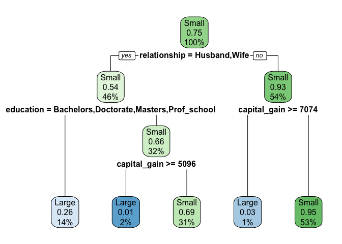
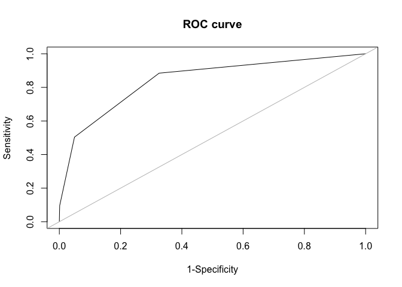

# Klasifikacija

## Priprava podatkov

Najprej nalozimo podatke iz `census.txt` s pomocjo `read.table()` ali
`read.csv()`:

``` r
# stringsAsFactors - faktorizira vse atribute tipa string
census <- read.table("census.txt", header=T, sep=",", stringsAsFactors=T)
# zgornji in spodnji izraz sta ekvivalentna
census <- read.csv("census.txt", stringsAsFactors=T)

summary(census)
```

    ##       age                   workclass            education   
    ##  Min.   :17.00   Federal_gov     :  943   HS_grad     :9840  
    ##  1st Qu.:28.00   Local_gov       : 2067   Some_college:6678  
    ##  Median :37.00   Private         :22286   Bachelors   :5044  
    ##  Mean   :38.44   Self_emp_inc    : 1074   Masters     :1627  
    ##  3rd Qu.:47.00   Self_emp_not_inc: 2499   Assoc_voc   :1307  
    ##  Max.   :90.00   State_gov       : 1279   11th        :1048  
    ##                  Without_pay     :   14   (Other)     :4618  
    ##                marital_status            occupation           relationship  
    ##  Divorced             : 4214   Prof_specialty :4038   Husband       :12463  
    ##  Married_AF_spouse    :   21   Craft_repair   :4030   Not_in_family : 7726  
    ##  Married_civ_spouse   :14065   Exec_managerial:3992   Other_relative:  889  
    ##  Married_spouse_absent:  370   Adm_clerical   :3721   Own_child     : 4466  
    ##  Never_married        : 9726   Sales          :3584   Unmarried     : 3212  
    ##  Separated            :  939   Other_service  :3212   Wife          : 1406  
    ##  Widowed              :  827   (Other)        :7585                         
    ##                  race           sex         capital_gain    capital_loss    
    ##  Amer_Indian_Eskimo:  286   Female: 9782   Min.   :    0   Min.   :   0.00  
    ##  Asian_Pac_Islander:  895   Male  :20380   1st Qu.:    0   1st Qu.:   0.00  
    ##  Black             : 2817                  Median :    0   Median :   0.00  
    ##  Other             :  231                  Mean   : 1092   Mean   :  88.37  
    ##  White             :25933                  3rd Qu.:    0   3rd Qu.:   0.00  
    ##                                            Max.   :99999   Max.   :4356.00  
    ##                                                                             
    ##  hours_per_week        native_country    income     
    ##  Min.   : 1.00   United_States:27504   Large: 7508  
    ##  1st Qu.:40.00   Mexico       :  610   Small:22654  
    ##  Median :40.00   Philippines  :  188                
    ##  Mean   :40.93   Germany      :  128                
    ##  3rd Qu.:45.00   Puerto_Rico  :  109                
    ##  Max.   :99.00   Canada       :  107                
    ##                  (Other)      : 1516

Nato moramo celotno mnozico podatkov razdeliti na *ucno* in *testno*
mnozico. V nasem primeru bomo 70% podatkov uporabili v ucni mnozici, ter
30% podatkov v testni:

``` r
# nastavimo seed za generiranje nakljucnih stevil, da dosezemo ponovljive poskuse
set.seed(0)

# sample() vzame vzorec velikosti "size" iz elementov "x" (prvi argument)
# z replace=F zagotovimo da se nakljucna stevila nebodo ponavljala
sel <- sample(1:nrow(census), size=as.integer(nrow(census) * 0.7), replace=F)

# zgradimo ucno in testno mnozico
train <- census[sel,]
test <- census[-sel,]

nrow(train)
```

    ## [1] 21113

``` r
nrow(test)
```

    ## [1] 9049

## Ucenje

Brez kakrsnega koli ucenja bi do najboljse predikcije prisli z t.i.
*vecinskim klasifikatorjem* (vse napovedi poda v vecinski razred). Ta
klasifikator predstavlja spodnjo mejo za tocnost vseh drugih modelov.

``` r
# v tem primeru je vecinski razred "Small"
table(train$income)
```

    ## 
    ## Large Small 
    ##  5289 15824

``` r
# klasifikacijska tocnost tega modela
sum(test$income == "Small") / length(test$income)
```

    ## [1] 0.7547795

### Odlocitveno drevo

Pri gradnji odlocitvenega drevesa bomo uporablili knjiznico `rpart`, ki
je ze vkljucena v R.

Prvi argument funckcije `rpart` je formula, ki jo definiramo z uporabo
[`~`
operatorja](https://stackoverflow.com/questions/14976331/use-of-tilde-in-r-programming-language/14976479).
Nekaj primerov formul: - `income ~ .`: napovej `income` z uporabo vseh
atributov - `income ~ workclass`: napovej `income` z uporabo `workclass`
atributa - `income ~ workclass + education`: napovej `income` z uporabo
`workclass` in `education` atributov

``` r
library(rpart)
# namestimo zunanjo knjiznico
#install.packages("rpart.plot")
# nalozimo zunanjo knjiznico rpart.plot
library(rpart.plot)

# zgradimo drevo
dt <- rpart(income ~ ., data=train)

rpart.plot(dt)
```



Izvedemo predikcije, ter evaluiramo model z uporabo *tabele zmot*
(confusion matrix) - primerjamo dejanske vrednosti iz testne mnozice
(`observed`) z napovedanimi vrednosti (`predicted`):

``` r
observed <- test$income
predicted <- predict(dt, test, type="class")

# primerjamo testne in napovedane vrednost z tabelom table
# elementi ki niso na diagonali, so napake
tab <- table(observed, predicted)

# klasifikacijska tocnost (vec kot pri vecinskem klasifikatorju - 0.7547795)
tocnost <- sum(diag(tab)) / sum(tab)
```

Za lazje delo, abstraktirajmo zgornjo logiko v funkcijo:

``` r
# CA - classification accuracy
CA <- function (observed, predicted)
{
  tab <- table(observed, predicted)
  sum(diag(tab)) / sum(tab) # zadnji izraz v funkciji se samodejno vrne kot razultat
}

CA(observed, predicted)
```

    ## [1] 0.8409769

``` r
# se en mozni nacin za izracun CA
# primerjamo istolezne elemente, dobimo logicni vektor
q <- observed == predicted
head(q)
```

    ## [1]  TRUE  TRUE FALSE  TRUE  TRUE  TRUE

``` r
# izracunamo povprecje True vrednosti v vektorju
mean(q)
```

    ## [1] 0.8409769

Pri binarih klasifikacijskih modelih se uporabljajo se druge ocene
kvalitete modele, ki so definirane samo za binarne klasifikatorje:

``` r
Sensitivity <- function(obs, pred, pos.class)
{
    tab <- table(obs, pred)

    tab[pos.class, pos.class] / sum(tab[pos.class,])
}

Specificity <- function(obs, pred, pos.class)
{
    tab <- table(obs, pred)
    neg.class <- which(row.names(tab) != pos.class)

    tab[neg.class, neg.class] / sum(tab[neg.class,])
}

Precision <- function(obs, pred, pos.class)
{
    tab <- table(obs, pred)

    tab[pos.class, pos.class] / sum(tab[, pos.class])
}

table(observed, predicted)
```

    ##         predicted
    ## observed Large Small
    ##    Large  1118  1101
    ##    Small   338  6492

``` r
Sensitivity(observed, predicted, "Large")
```

    ## [1] 0.5038306

``` r
Specificity(observed, predicted, "Large")
```

    ## [1] 0.9505124

``` r
Precision(observed, predicted, "Large")
```

    ## [1] 0.7678571

### Verjetnostne napovedi

Za doloceno vozlisce drevesa zgornja stevilka pove verjetnost, da primer
pripada dolocenemu razredu.

Za korensko vozlisce, lahko povemo, da je iz vseh primerov, ki se
propagirajo skozi to vozlisce (katerih je 100%), verjetno 75%, da
dolocen primer pripada razredu “Small”.

Za skrajno levi list drevesa lahko povemo, da je verjetnost da primer
pripada razredu “Small” 26% (verjetno da pripada razredu “Large” pa
74%).

``` r
rpart.plot(dt)
```


#### Brier score

``` r
# namesto dejanskih predikcij nas zdaj zanimajo verjetnosti danih predikcij
# zato podamo argument type="prob"
# dobimo matriko verjetnosti (vsak stolpec je razred, vsaka vrstica je testni primer)
predictedMat <- predict(dt, test, type="prob")
head(predictedMat)
```

    ##         Large      Small
    ## 9  0.97129187 0.02870813
    ## 10 0.73628258 0.26371742
    ## 11 0.30615076 0.69384924
    ## 12 0.73628258 0.26371742
    ## 13 0.05291053 0.94708947
    ## 22 0.30615076 0.69384924

``` r
library(nnet)

# uporabimo nnet knjiznico kjer najdemo funkcijo class.ind()
# funkcija vrne tocne napovedi (dejanske razrede katerim pripadajo primeri)
observedMat <- class.ind(test$income)
head(observedMat)
```

    ##      Large Small
    ## [1,]     1     0
    ## [2,]     1     0
    ## [3,]     1     0
    ## [4,]     1     0
    ## [5,]     0     1
    ## [6,]     0     1

``` r
brier.score <- function(obsMat, predMat)
{
    sum((obsMat - predMat) ^ 2) / nrow(predMat)
}

# kvadrat razdalje med predikcijo in dejansko vrednostjo (max=2, min=0)
brier.score(observedMat, predictedMat)
```

    ## [1] 0.2377539

Potrebujemo nekaksen trivialni model, katerega bomo lahko primerjali z
nasimi naucenimi modeli. Trivialni model bo napovedoval glede na
[apriorno
verjetnost](https://en.wikipedia.org/wiki/A_priori_probability)
razredov. Nas model pa vraca [aposteriorno
napoved](https://encyclopediaofmath.org/wiki/A_posteriori_probability).

> A posteriori probability is a conditional probability of an event
> taking place under certain conditions, to be contrasted with its
> unconditional or a priori probability

``` r
# apriorna porazdelitev po razredih
p0 <- table(train$income) / nrow(train)

p0Mat <- matrix(rep(p0, times=nrow(test)), nrow = nrow(test), byrow=T)
colnames(p0Mat) <- names(p0)
head(p0Mat)
```

    ##          Large     Small
    ## [1,] 0.2505092 0.7494908
    ## [2,] 0.2505092 0.7494908
    ## [3,] 0.2505092 0.7494908
    ## [4,] 0.2505092 0.7494908
    ## [5,] 0.2505092 0.7494908
    ## [6,] 0.2505092 0.7494908

``` r
# primerjamo brier score nasega modela in trivialnega klasifikatorja

# apriorna napoved (vnaprej napovedljiva brez vrednosti atributov)
brier.score(observedMat, p0Mat)
```

    ## [1] 0.3702307

``` r
# aposteriorna napoved (napovedljiva z vrednostjo atributov)
brier.score(observedMat, predictedMat)
```

    ## [1] 0.2377539

#### Information score

Ta mera nam pove pridobljeno kolicino informacije (min=0, max=entripija
razreda). Trivialni model ima pridobljeno informacijsko vrednost enako
0, saj vedno napove glede na apriorne verjetnosti.

``` r
inf.score <- function(trainClass, testClass, predMat)
{
    result <- 0

    priors <- table(trainClass) / length(trainClass)

    for (i in 1:nrow(predMat))
    {
        p.prior <- priors[[testClass[i]]]
        p.posterior <- predMat[i, testClass[i]]

        if (p.posterior >= p.prior)
          # vem vec kot prej, pristejemo kolicino informacije
            result <- result - log2(p.prior) + log2(p.posterior)
        else
          # vem manj, odstejemo
            result <- result + log2(1-p.prior) - log2(1-p.posterior)                
    }

    result / nrow(predMat)
}

inf.score(train$income, test$income, p0Mat) # trivialni model
```

    ## Large 
    ##     0

``` r
inf.score(train$income, test$income, predictedMat)
```

    ## [1] 0.272398

#### Krivulja ROC

ROC krivulja idealnega modela bi vsebovala tudi tocko `(1,1)`
(Specificnost=1, Senzitivnost=1). Ta model pravilno klasificira vse
primere iz pozitivnega in negativnega razreda.

Blizje kot smo tocki `(1,1)`, boljsi je nas model.

Tehnicno bi bil pri binarni klasifikaciji najslabsi tisti model, ki bi
dosegel tocko `(0,0)`, ampak hkrati bi to pomenilo, da lahko vse
odgovore tega modela samo invertiramo, ter s tem dobimo dober model.
Zato je najslabsi model tisti, ki se pribliza premici `x=y`, saj ga
nemoremo zlahka izboljsati.

AUC (Area Under Curve) predstavlja verjetnost, da bo klasifikator
nakljucno izbranemu pozitivnemu primeru dodelil visjo oceno (pripadnost
pozitivnemu razredu) kot nakljucno izbranemu negativnemu primeru.

``` r
# napovedane verjetnosti za pozitiven razred uredimo narascajoce in odstranimo ponovitve
p <- unique(sort(predictedMat[,"Large"]))
p
```

    ## [1] 0.05291053 0.30615076 0.73628258 0.97129187 0.98644986

``` r
# pragove dolocimo kot vmesne vrednosti med elementi vektorja p 
threshVec <- p[-length(p)] + diff(p)/2
threshVec
```

    ## [1] 0.1795306 0.5212167 0.8537872 0.9788709

``` r
# dodamo se -Inf in Inf, ter pragove uredimo padajoce
threshVec <- c(-Inf, threshVec, Inf)
threshVec <- sort(threshVec, decreasing=T)
threshVec
```

    ## [1]       Inf 0.9788709 0.8537872 0.5212167 0.1795306      -Inf

``` r
sensVec <- vector()
specVec <- vector()
for (th in threshVec)
{
    predicted <- ifelse(predictedMat[,"Large"] > th, "Large", "Small")
    predicted <- factor(predicted, levels=c("Large", "Small"))

    sensVec <- append(sensVec, Sensitivity(observed, predicted, "Large"))
    specVec <- append(specVec, Specificity(observed, predicted, "Large"))
}

sensVec
```

    ## [1] 0.00000000 0.05723299 0.09643984 0.50383055 0.88463272 1.00000000

``` r
specVec
```

    ## [1] 1.0000000 0.9994143 0.9988287 0.9505124 0.6742313 0.0000000

``` r
plot(x=1-specVec, y=sensVec, type="l", xlab="1-Specificity", ylab="Sensitivity", main="ROC curve")
abline(a=0, b=1, col="grey")
```



``` r
# Ploscina pod krivuljo ROC
dX <- c(diff(1-specVec), 0)
dY <- c(diff(sensVec), 0)
AUC <- sum(sensVec * dX) + sum(dY * dX)/2
AUC
```

    ## [1] 0.8417055
