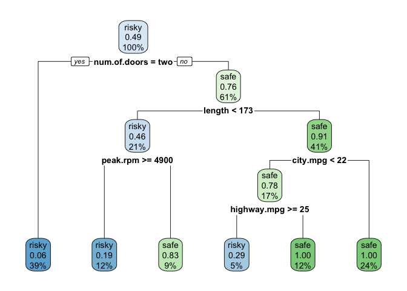

# Ocenjevanje ucenja

Nalozimo podatke ki jih bomo uporabili za demonstracijo.

``` r
data <- read.table("insurance.txt", sep=",", header=T, stringsAsFactors=T)
```

### Ocenjevanje z neodvisno testno mnozico

Pri tem nacinu locimo celotno podatkovno mnozico na dve neodvisni
mnozici: ucno in testno. Za ucenje modela uporabimo samo ucno mnozico,
ter za testiranje samo testno.

``` r
nrow(data)
```

    ## [1] 193

``` r
set.seed(0)
sel <- sample(1:nrow(data), as.integer(nrow(data) * 0.7), replace=F)
train <- data[sel,]
test <- data[-sel,]

library(rpart)
library(rpart.plot)

dt <- rpart(insurance ~ ., train)
rpart.plot(dt)
```



``` r
observed <- test$insurance
predicted <- predict(dt, test, type="class")

q <- observed == predicted
sum(q)/length(q)
```

    ## [1] 0.7931034

Problem tega pristopa je, da je lahko razultat bistveno drugacen v
odvisnosti od razbitja podatkov na ucno in testno mnozico.

``` r
set.seed(100)
sel <- sample(1:nrow(data), as.integer(nrow(data) * 0.7), replace=F)
train <- data[sel,]
test <- data[-sel,]
dt <- rpart(insurance ~ ., train)
observed <- test$insurance
predicted <- predict(dt, test, type="class")
q <- observed == predicted
sum(q)/length(q)
```

    ## [1] 0.862069

### K-kratko precno preverjanje

Razbijemo podatkovno mnozico na `k` blokov, ter v vsaki ucni iteraciji
uporabimo drugo kombinacijo blokov za ucno in testno mnozico. S tem bo
vsak primer oziroma blok enkrat imel vlogo ucne in vlogo testne mnozice.

Dodatna razlaga: <https://www.youtube.com/watch?v=fSytzGwwBVw>

``` r
# stevilo vseh primerov v podatkovni mnozici
n <- nrow(data)

# parameter postopka
k <- 10

# nastavimmo seed za ponavljive poskuse 
set.seed(0)

# primere nakljucno razbijemo v k priblizno enako mocnih podmnozic
fold.id <- rep(1:k, length.out=n)
fold.id
```

    ##   [1]  1  2  3  4  5  6  7  8  9 10  1  2  3  4  5  6  7  8  9 10  1  2  3  4  5
    ##  [26]  6  7  8  9 10  1  2  3  4  5  6  7  8  9 10  1  2  3  4  5  6  7  8  9 10
    ##  [51]  1  2  3  4  5  6  7  8  9 10  1  2  3  4  5  6  7  8  9 10  1  2  3  4  5
    ##  [76]  6  7  8  9 10  1  2  3  4  5  6  7  8  9 10  1  2  3  4  5  6  7  8  9 10
    ## [101]  1  2  3  4  5  6  7  8  9 10  1  2  3  4  5  6  7  8  9 10  1  2  3  4  5
    ## [126]  6  7  8  9 10  1  2  3  4  5  6  7  8  9 10  1  2  3  4  5  6  7  8  9 10
    ## [151]  1  2  3  4  5  6  7  8  9 10  1  2  3  4  5  6  7  8  9 10  1  2  3  4  5
    ## [176]  6  7  8  9 10  1  2  3  4  5  6  7  8  9 10  1  2  3

``` r
s <- sample(1:n, n, FALSE) # permutiraj mnozico brez ponavljanja
s
```

    ##   [1] 142  68 167 129 162  43  14  51  85  21 106 182  74   7  73  79  37 105
    ##  [19] 110 165  34 183 126  89  33  84 163  70 181  42 111 148 156  20  44 121
    ##  [37]  87 166 158  40  25 119 122  39 164 134  24 187 130  45  22 115 104 161
    ##  [55] 140 141 103  75  13 154 170  23 175 168 137  29 135 124 143  93  28 108
    ##  [73]  48 169 144 184  31 102  17 179 190 157  83  90 155 107  64  94  96 113
    ##  [91]  60 186 171 173  10   1 188  59  26  15  58 128 147 149 109  76 150  91
    ## [109]  53 189 191  35  97  98  92  78 125 139 123 177  61  46  67 116 159  49
    ## [127] 138  56 192  50  55  47  27 180  62 160  57  86  88 185  16  19  36   2
    ## [145] 133  80  69 112  41 127  95 100 151  52 193 131  11 117  82 145 174  54
    ## [163]   8   9  18 136  81  66  99 172   3   5  77  71 118  12 146 178   6   4
    ## [181] 152  65 132  63  30 114  32  72  38 101 120 176 153

``` r
fold.id <- fold.id[s]
fold.id
```

    ##   [1]  2  8  7  9  2  3  4  1  5  1  6  2  4  7  3  9  7  5 10  5  4  3  6  9  3
    ##  [26]  4  3 10  1  2  1  8  6 10  4  1  7  6  8 10  5  9  2  9  4  4  4  7 10  5
    ##  [51]  2  5  4  1 10  1  3  5  3  4 10  3  5  8  7  9  5  4  3  3  8  8  8  9  4
    ##  [76]  4  1  2  7  9 10  7  3 10  5  7  4  4  6  3 10  6  1  3 10  1  8  9  6  5
    ## [101]  8  8  7  9  9  6 10  1  3  9  1  5  7  8  2  8  5  9  3  7  1  6  7  6  9
    ## [126]  9  8  6  2 10  5  7  7 10  2 10  7  6  8  5  6  9  6  2  3 10  9  2  1  7
    ## [151]  5 10  1  2  3  1  1  7  2  5  4  4  8  9  8  6  1  6  9  2  3  5  7  1  8
    ## [176]  2  6  8  6  4  2  5  2  3 10  4  2  2  8  1 10  6  3

``` r
cv.dt <- vector()
for (i in 1:k)
{   
    print(paste("Iteracija", i))
    flush.console()

    sel <- fold.id == i

    dt <- rpart(insurance ~ ., data[!sel,])
    predicted <- predict(dt, data[sel,], type= "class")
    observed <- data[sel,]$insurance
    q <- observed == predicted
    cv.dt[i] <- sum(q)/length(q)
}
```

    ## [1] "Iteracija 1"
    ## [1] "Iteracija 2"
    ## [1] "Iteracija 3"
    ## [1] "Iteracija 4"
    ## [1] "Iteracija 5"
    ## [1] "Iteracija 6"
    ## [1] "Iteracija 7"
    ## [1] "Iteracija 8"
    ## [1] "Iteracija 9"
    ## [1] "Iteracija 10"

``` r
cv.dt
```

    ##  [1] 0.8000000 0.7000000 1.0000000 0.8421053 0.8421053 0.7894737 0.8421053
    ##  [8] 0.9473684 0.7894737 0.8421053

``` r
mean(cv.dt) # koncna tocnost je povprecje vseh tocnosti
```

    ## [1] 0.8394737

``` r
sd(cv.dt) / sqrt(length(cv.dt)) # standardna napaka
```

    ## [1] 0.02655158

V ekstremnem primeru, je lahko vsak ucni primer svoj blok
`k=nrow(data)`. Temu principu recemo izpusti enega (*Leave One Out Cross
Validation*).

``` r
predicted <- factor(levels=levels(data$insurance))

k <- nrow(data)

for (i in 1:k)
{   
    # print(paste("Izlocen primer na indeksu", i))
    # flush.console()

    dt <- rpart(insurance ~ ., data[-i,])
    predicted[i] <- predict(dt, data[i,], type="class")
}

q <- data$insurance == predicted
mean(q) # koncna tocnost je povprecje vseh tocnosti
```

    ## [1] 0.8963731

``` r
sd(q) / sqrt(length(q)) # standardna napaka
```

    ## [1] 0.02199531
