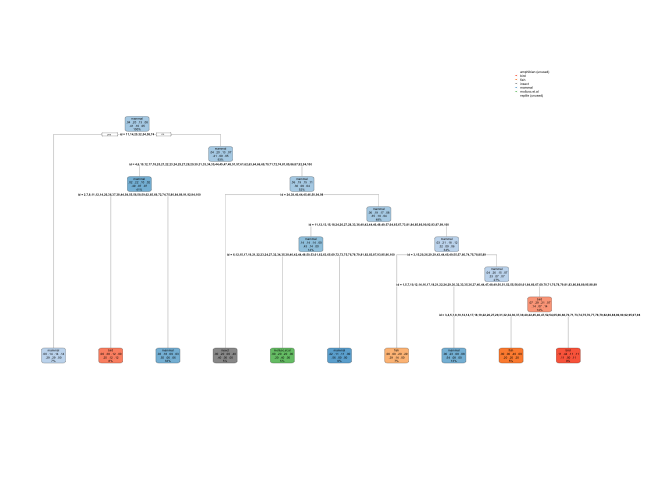
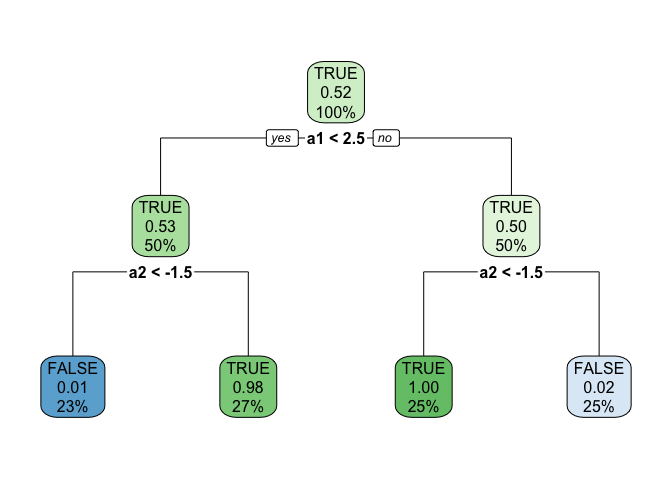

# Feature evaluation

## Priprava podatkov

Faktorizirati je potrebno vse atribute (tudi non-character atribut kot
je `legs`).

``` r
library(CORElearn)
zoo <- read.table(file="zoo.txt", sep=",", header=T)

summary(zoo)
```

    ##     hair          feathers          eggs            milk        
    ##  Mode :logical   Mode :logical   Mode :logical   Mode :logical  
    ##  FALSE:58        FALSE:81        FALSE:42        FALSE:60       
    ##  TRUE :43        TRUE :20        TRUE :59        TRUE :41       
    ##                                                                 
    ##                                                                 
    ##                                                                 
    ##   airborne        aquatic         predator        toothed       
    ##  Mode :logical   Mode :logical   Mode :logical   Mode :logical  
    ##  FALSE:77        FALSE:65        FALSE:45        FALSE:40       
    ##  TRUE :24        TRUE :36        TRUE :56        TRUE :61       
    ##                                                                 
    ##                                                                 
    ##                                                                 
    ##   backbone        breathes        venomous          fins        
    ##  Mode :logical   Mode :logical   Mode :logical   Mode :logical  
    ##  FALSE:18        FALSE:21        FALSE:93        FALSE:84       
    ##  TRUE :83        TRUE :80        TRUE :8         TRUE :17       
    ##                                                                 
    ##                                                                 
    ##                                                                 
    ##       legs          tail          domestic        catsize       
    ##  Min.   :0.000   Mode :logical   Mode :logical   Mode :logical  
    ##  1st Qu.:2.000   FALSE:26        FALSE:88        FALSE:57       
    ##  Median :4.000   TRUE :75        TRUE :13        TRUE :44       
    ##  Mean   :2.842                                                  
    ##  3rd Qu.:4.000                                                  
    ##  Max.   :8.000                                                  
    ##      type          
    ##  Length:101        
    ##  Class :character  
    ##  Mode  :character  
    ##                    
    ##                    
    ## 

``` r
for (i in 1:ncol(zoo))
  zoo[,i] <- as.factor(zoo[,i])

summary(zoo)
```

    ##     hair     feathers     eggs       milk     airborne   aquatic    predator 
    ##  FALSE:58   FALSE:81   FALSE:42   FALSE:60   FALSE:77   FALSE:65   FALSE:45  
    ##  TRUE :43   TRUE :20   TRUE :59   TRUE :41   TRUE :24   TRUE :36   TRUE :56  
    ##                                                                              
    ##                                                                              
    ##                                                                              
    ##                                                                              
    ##                                                                              
    ##   toothed    backbone   breathes   venomous     fins    legs      tail   
    ##  FALSE:40   FALSE:18   FALSE:21   FALSE:93   FALSE:84   0:23   FALSE:26  
    ##  TRUE :61   TRUE :83   TRUE :80   TRUE : 8   TRUE :17   2:27   TRUE :75  
    ##                                                         4:38             
    ##                                                         5: 1             
    ##                                                         6:10             
    ##                                                         8: 2             
    ##                                                                          
    ##   domestic   catsize              type   
    ##  FALSE:88   FALSE:57   amphibian    : 4  
    ##  TRUE :13   TRUE :44   bird         :20  
    ##                        fish         :13  
    ##                        insect       : 8  
    ##                        mammal       :41  
    ##                        mollusc.et.al:10  
    ##                        reptile      : 5

## Pregled ocen

Evaluiramo atribute, glede na vrednost [informacijskega
prispevka](https://en.wikipedia.org/wiki/Information_gain_in_decision_trees).

``` r
sort(attrEval(type ~ ., zoo, "InfGain"), decreasing=T)
```

    ##       legs       milk    toothed       eggs       hair   feathers   backbone 
    ## 1.36304690 0.97431972 0.86569415 0.83013845 0.79067457 0.71794998 0.67616274 
    ##   breathes       tail   airborne       fins    aquatic    catsize   venomous 
    ## 0.61449403 0.50046045 0.46970261 0.46661357 0.38948748 0.30849034 0.13308963 
    ##   predator   domestic 
    ## 0.09344704 0.05066878

Kaze, da ima atribut `legs` najvecji informacijski prispevek. Ampak to
ne nujno zares drzi, saj ima atribut legs tudi najvec razlicnih
vrednosti. Da preverimo ali je temu res tako, lahko dodamo dodaten
atribute `id`, ki ima maksimalno stevilo razlicnih vrednosti (enako
stevilu primerov).

``` r
id <- 1:nrow(zoo)
zoo$id <- as.factor(id)
sort(attrEval(type ~ ., zoo, "InfGain"), decreasing=T)
```

    ##         id       legs       milk    toothed       eggs       hair   feathers 
    ## 2.39055968 1.36304690 0.97431972 0.86569415 0.83013845 0.79067457 0.71794998 
    ##   backbone   breathes       tail   airborne       fins    aquatic    catsize 
    ## 0.67616274 0.61449403 0.50046045 0.46970261 0.46661357 0.38948748 0.30849034 
    ##   venomous   predator   domestic 
    ## 0.13308963 0.09344704 0.05066878

Vidimo da ima informacijska vrednost atributa `id` maskimalno vrednost -
enako entropiji razredov.

``` r
# apriorne verjetnosti razredov
p0 <- table(zoo$type) / length(zoo$type)

# entropija razreda (potrebno stevilo bitov za dolocitev razreda primera)
-sum(p0 * log2(p0))
```

    ## [1] 2.39056

Ce zdaj zgradimo odlocitveno drevo z ten, bo algoritem preferiral
atribut `id`, saj maksimizira informacijski prispevek. Tak model je
popolnoma prilagojen na podatke in ni zmozen generalizacije.

Model si ucne primere samo zapomni, ne pridobi pa nobenega znanja, s
katerim bil lahko izvajal predikcije o ne videnih primerih.

``` r
dt <- CoreModel(type ~ ., zoo, model="tree", selectionEstimator="InfGain")
plot(dt, zoo)
```



Isto slabo lastnost ima tudi ocena *gini*:

``` r
sort(attrEval(type ~ ., zoo, "Gini"), decreasing=T)
```

    ##          id        legs        milk        eggs        hair    feathers 
    ## 0.759337320 0.364266249 0.293000686 0.262345974 0.237856062 0.208548908 
    ##     toothed    breathes    backbone    airborne        fins     catsize 
    ## 0.191759005 0.133135057 0.122837525 0.119459046 0.099756656 0.094841923 
    ##        tail     aquatic    venomous    predator    domestic 
    ## 0.072086749 0.071269282 0.026105126 0.011136786 0.009077679

Z oceno *Gain Ratio* pa poskusamo problem precenjevanja vec vrednostnih
atributov resiti tako, da vrednost informacijskega prispevka nekega
atributa deli z entropijo nekega atributa.

Ce ima atribut veliko razlicnih vrednosti, je njegova entropija tudi
visoka.

Sicer ima tudi ta ocena eno slabo lastnost, in sicer precenjevanje
konstantnih atributov (ki imajo entropijo=0 - `infoPrispevek / 0`).

``` r
sort(attrEval(type ~ ., zoo, "GainRatio"), decreasing=T)
```

    ##       milk   backbone   feathers    toothed       eggs   breathes       hair 
    ## 1.00000000 1.00000000 1.00000000 0.89377042 0.84754168 0.83322403 0.80350619 
    ##       fins       legs       tail   airborne    aquatic         id   venomous 
    ## 0.71365113 0.67019338 0.60821344 0.59375884 0.41448743 0.35903931 0.33323886 
    ##    catsize   predator   domestic 
    ## 0.31223207 0.09425512 0.09147679

Poznamo pa tudi druge mere, ki resijo zgornje probleme. Se najbolje se
obnese ocena *MDL*.

``` r
sort(attrEval(type ~ ., zoo, "ReliefFequalK"), decreasing=T)
```

    ##         milk         legs         eggs      toothed         hair     feathers 
    ## 6.835524e-01 6.219210e-01 6.098097e-01 5.930575e-01 5.780719e-01 4.198599e-01 
    ##     backbone     breathes         tail     airborne         fins      aquatic 
    ## 3.697423e-01 3.501856e-01 3.011171e-01 2.910008e-01 2.734531e-01 2.511323e-01 
    ##      catsize     predator     venomous     domestic           id 
    ## 2.304183e-01 8.432337e-02 3.508479e-02 7.443938e-03 7.035077e-16

``` r
sort(attrEval(type ~ ., zoo, "MDL"), decreasing=T)
```

    ##         legs         milk      toothed         eggs         hair     feathers 
    ##  0.846289978  0.749817238  0.668718422  0.645441232  0.601879876  0.526790949 
    ##     backbone     breathes         tail     airborne         fins      aquatic 
    ##  0.491237789  0.452129932  0.345602181  0.324956163  0.307725532  0.250171733 
    ##      catsize     venomous     predator     domestic           id 
    ##  0.180224185  0.072991026 -0.002234781 -0.040442802 -0.278024652

Se ena moznost, da resimo precenjevanje atributov pri oceni
*informacijskega prispevka* in *gini*, je da atribute biniraliziramo:

``` r
sort(attrEval(type ~ ., zoo, "GainRatio", binaryEvaluation=T), decreasing=T)
```

    ##       milk   backbone   feathers    toothed       eggs       legs   breathes 
    ## 1.00000000 1.00000000 1.00000000 0.89377042 0.84754168 0.84656401 0.83322403 
    ##       hair       fins       tail   airborne    aquatic   venomous    catsize 
    ## 0.80350619 0.71365113 0.60821344 0.59375884 0.41448743 0.33323886 0.31223207 
    ##         id   predator   domestic 
    ## 0.29248695 0.09425512 0.09147679

``` r
sort(attrEval(type ~ ., zoo, "Gini", binaryEvaluation=T), decreasing=T)
```

    ##        milk        eggs        hair    feathers     toothed        legs 
    ## 0.293000686 0.262345974 0.237856062 0.208548908 0.191759005 0.144541254 
    ##    breathes    backbone    airborne        fins     catsize        tail 
    ## 0.133135057 0.122837525 0.119459046 0.099756656 0.094841923 0.072086749 
    ##     aquatic    venomous    predator    domestic          id 
    ## 0.071269282 0.026105126 0.011136786 0.009077679 0.008662252

## Kratkovidnost ocen

Pri spodnjem primeru vidimo, da ni nobene korelacije oz. interakcije med
atributi, razen med atributoma `a1` in `a2`, ki pa nista linearno
locljiva.

``` r
quadrant <- read.table("quadrant.txt", sep=",", header=T)
summary(quadrant)
```

    ##        a1                a2                a3                a4         
    ##  Min.   :-99.000   Min.   :-99.000   Min.   :-99.000   Min.   :-99.000  
    ##  1st Qu.:-47.000   1st Qu.:-48.000   1st Qu.:-47.250   1st Qu.:-51.000  
    ##  Median :  3.000   Median :  3.000   Median :  0.000   Median :  6.500  
    ##  Mean   :  1.975   Mean   :  1.482   Mean   :  0.698   Mean   :  2.459  
    ##  3rd Qu.: 51.000   3rd Qu.: 49.000   3rd Qu.: 50.000   3rd Qu.: 55.250  
    ##  Max.   :100.000   Max.   :100.000   Max.   :100.000   Max.   : 99.000  
    ##        a5                a6                a7                a8         
    ##  Min.   :-99.000   Min.   :-99.000   Min.   :-99.000   Min.   :-98.000  
    ##  1st Qu.:-53.000   1st Qu.:-48.250   1st Qu.:-44.000   1st Qu.:-51.000  
    ##  Median :  0.000   Median :  0.000   Median :  1.500   Median : -3.500  
    ##  Mean   : -0.435   Mean   :  1.142   Mean   :  1.557   Mean   : -1.557  
    ##  3rd Qu.: 51.000   3rd Qu.: 51.250   3rd Qu.: 51.000   3rd Qu.: 48.000  
    ##  Max.   :100.000   Max.   :100.000   Max.   :100.000   Max.   : 99.000  
    ##    Class        
    ##  Mode :logical  
    ##  FALSE:481      
    ##  TRUE :519      
    ##                 
    ##                 
    ## 

``` r
quadrant$Class <- as.factor(quadrant$Class)
plot(quadrant, col=quadrant$Class)
```


``` r
plot(quadrant$a1, quadrant$a2, col=quadrant$Class)
```


Pri takih primerih so problematicne tiste ocene (npr. informacijski
prispevek) ki vsak atribut ocenjujejo zase. Tem ocenam recemo
*kratkovidne ocene*, saj ne zaznajo interakcije med atributi.

``` r
# najbolje je ocenjen a4, ki pa nima nobenega vpliva
sort(attrEval(Class ~ ., quadrant, "InfGain"), decreasing=T)
```

    ##          a4          a6          a2          a7          a3          a5 
    ## 0.012425376 0.005560487 0.005278532 0.004093416 0.003862697 0.003486800 
    ##          a1          a8 
    ## 0.003307057 0.002338508

``` r
sort(attrEval(Class ~ ., quadrant, "GainRatio"), decreasing=T)
```

    ##          a1          a8          a4          a7          a2          a6 
    ## 0.044193599 0.044193599 0.030584692 0.017710791 0.013124827 0.011329430 
    ##          a3          a5 
    ## 0.009415935 0.006926726

``` r
sort(attrEval(Class ~ ., quadrant, "Gini"), decreasing=T)
```

    ##          a4          a6          a2          a7          a3          a5 
    ## 0.008438527 0.003833389 0.003581261 0.002831915 0.002664392 0.002413258 
    ##          a1          a8 
    ## 0.002250613 0.001498657

``` r
sort(attrEval(Class ~ ., quadrant, "MDL"), decreasing=T)
```

    ##           a4           a6           a2           a1           a8           a7 
    ## 0.0094776190 0.0025507197 0.0024110605 0.0014803450 0.0008504131 0.0006186450 
    ##           a3           a5 
    ## 0.0003283162 0.0001686661

Posledica te slabe ocene, je da ne zgradimo zelo slab model:

``` r
dt <- CoreModel(Class ~ ., quadrant, model="tree", selectionEstimator="InfGain")
plot(dt, zoo)
```


Primer ocen, ki upostevajo ocene drugih atributov, ter posledicno znajo
zaznati interakcije med atributi.

``` r
sort(attrEval(Class ~ ., quadrant, "Relief"), decreasing=T)
```

    ##           a1           a2           a7           a8           a6           a3 
    ##  0.298696817  0.256572864 -0.007969849 -0.040099831 -0.049028476 -0.051887772 
    ##           a5           a4 
    ## -0.058882747 -0.071313131

``` r
sort(attrEval(Class ~ ., quadrant, "ReliefFequalK"), decreasing=T)
```

    ##          a1          a2          a8          a3          a7          a6 
    ##  0.18883970  0.18100302 -0.02126007 -0.02766231 -0.03267437 -0.03359313 
    ##          a5          a4 
    ## -0.03463317 -0.04187172

``` r
sort(attrEval(Class ~ ., quadrant, "ReliefFexpRank"), decreasing=T)
```

    ##          a2          a1          a8          a6          a7          a3 
    ##  0.14710730  0.14184485 -0.02245258 -0.02259435 -0.02293287 -0.02638782 
    ##          a4          a5 
    ## -0.02846338 -0.03187863

Zato je tudi samo odlocitveno drevo primerno zgrajeno.

``` r
dt <- CoreModel(Class ~ ., quadrant, model="tree", selectionEstimator="Relief")
plot(dt, zoo)
```



## Reduciran model

``` r
ins <- read.table("insurance.txt", sep=",", header=T, stringsAsFactors=T)
summary(ins)
```

    ##  insurance    fuel.type   aspiration  num.of.doors       body.style
    ##  risky:105   diesel: 19   std  :158   four:112     convertible: 6  
    ##  safe : 88   gas   :174   turbo: 35   two : 81     hardtop    : 8  
    ##                                                    hatchback  :63  
    ##                                                    sedan      :92  
    ##                                                    wagon      :24  
    ##                                                                    
    ##  drive.wheels engine.location     length          width           height     
    ##  4wd:  8      front:190       Min.   :141.1   Min.   :60.30   Min.   :47.80  
    ##  fwd:114      rear :  3       1st Qu.:166.3   1st Qu.:64.10   1st Qu.:52.00  
    ##  rwd: 71                      Median :173.2   Median :65.40   Median :54.10  
    ##                               Mean   :174.3   Mean   :65.89   Mean   :53.87  
    ##                               3rd Qu.:184.6   3rd Qu.:66.90   3rd Qu.:55.70  
    ##                               Max.   :208.1   Max.   :72.00   Max.   :59.80  
    ##  num.of.cylinders  engine.size      horsepower       peak.rpm   
    ##  eight :  4       Min.   : 61.0   Min.   : 48.0   Min.   :4150  
    ##  five  : 10       1st Qu.: 98.0   1st Qu.: 70.0   1st Qu.:4800  
    ##  four  :153       Median :120.0   Median : 95.0   Median :5100  
    ##  six   : 24       Mean   :128.1   Mean   :103.5   Mean   :5100  
    ##  three :  1       3rd Qu.:146.0   3rd Qu.:116.0   3rd Qu.:5500  
    ##  twelve:  1       Max.   :326.0   Max.   :262.0   Max.   :6600  
    ##     city.mpg      highway.mpg        price      
    ##  Min.   :13.00   Min.   :16.00   Min.   : 5118  
    ##  1st Qu.:19.00   1st Qu.:25.00   1st Qu.: 7738  
    ##  Median :25.00   Median :30.00   Median :10245  
    ##  Mean   :25.33   Mean   :30.79   Mean   :13285  
    ##  3rd Qu.:30.00   3rd Qu.:34.00   3rd Qu.:16515  
    ##  Max.   :49.00   Max.   :54.00   Max.   :45400

``` r
sel <- sample(1:nrow(ins), round(nrow(ins) * 0.7), replace=T)
train <- ins[sel,]
test <- ins[-sel,]

table(train$insurance)
```

    ## 
    ## risky  safe 
    ##    74    61

V spodnjem primeru smo prvotni model, ki je vposteval vse atribute,
reducirali tako, da smo vzeli samo najboljsih `n` atributov. Vidimo da
je reduciran model boljsi od prvotnega.

``` r
library(kernlab)

modelFull <- ksvm(insurance ~ ., train)
predictedFull <- predict(modelFull, test, type="response")

set.seed(0)
sort(attrEval(insurance ~ ., train, "ReliefFequalK"), decreasing=T)
```

    ##     num.of.doors           height       body.style         city.mpg 
    ##      0.273333333      0.248711898      0.191851852      0.133132716 
    ##      highway.mpg         peak.rpm     drive.wheels            width 
    ##      0.127421932      0.105799950      0.093333333      0.069421448 
    ##           length       horsepower num.of.cylinders      engine.size 
    ##      0.048714347      0.043774250      0.021481481      0.017459720 
    ##  engine.location        fuel.type            price       aspiration 
    ##      0.005185185      0.002962963     -0.014986371     -0.028888889

``` r
# reduciramo model, ter upostevamo samo boljse atribute
modelReduced <- ksvm(insurance ~ num.of.doors + height + body.style + length, train)
predictedReduced <- predict(modelReduced, test, type="response")

# dobimo boljse razultate iz reduciranega modela
mean(test$insurance == predictedFull)
```

    ## [1] 0.9021739

``` r
mean(test$insurance == predictedReduced)
```

    ## [1] 0.8804348

## Metoda ovojnice

Preveri vse potencne mnozice atributov, ter najde najde mnozico
atributov, ki minimizira napako.

``` r
library(rpart)
source("wrapper.R")

modelFull <- rpart(insurance ~ ., train)
predicted <- predict(modelFull, test, type="class")
mean(test$insurance == predicted)
```

    ## [1] 0.9130435

``` r
myTrainFunc <- function(formula, traindata)
{
    rpart(formula, traindata)   
}

# Funkcija za pridobivanje napovedi modela (razredi)
myPredictFunc <- function(model, testdata)
{
    predict(model, testdata, type="class")
}

# Atribute lahko izberemo glede na klasifikacijsko tocnost modela
myEvalFunc <- function(predicted, observed, trained)
{
    # vracamo napako modela, saj wrapper minimizira vrednost ocene
    1.0 - mean(observed == predicted)   
}

set.seed(0)
wrapper(insurance ~ ., train, myTrainFunc, myPredictFunc, myEvalFunc, cvfolds=10)
```

    ## formula to evaluate: insurance ~ fuel.type ...
    ## formula to evaluate: insurance ~ aspiration ...
    ## formula to evaluate: insurance ~ num.of.doors ...
    ## formula to evaluate: insurance ~ body.style ...
    ## formula to evaluate: insurance ~ drive.wheels ...
    ## formula to evaluate: insurance ~ engine.location ...
    ## formula to evaluate: insurance ~ length ...
    ## formula to evaluate: insurance ~ width ...
    ## formula to evaluate: insurance ~ height ...
    ## formula to evaluate: insurance ~ num.of.cylinders ...
    ## formula to evaluate: insurance ~ engine.size ...
    ## formula to evaluate: insurance ~ horsepower ...
    ## formula to evaluate: insurance ~ peak.rpm ...
    ## formula to evaluate: insurance ~ city.mpg ...
    ## formula to evaluate: insurance ~ highway.mpg ...
    ## formula to evaluate: insurance ~ price ...
    ## selected attribute:  length 
    ## formula to evaluate: insurance ~ length + fuel.type ...
    ## formula to evaluate: insurance ~ length + aspiration ...
    ## formula to evaluate: insurance ~ length + num.of.doors ...
    ## formula to evaluate: insurance ~ length + body.style ...
    ## formula to evaluate: insurance ~ length + drive.wheels ...
    ## formula to evaluate: insurance ~ length + engine.location ...
    ## formula to evaluate: insurance ~ length + width ...
    ## formula to evaluate: insurance ~ length + height ...
    ## formula to evaluate: insurance ~ length + num.of.cylinders ...
    ## formula to evaluate: insurance ~ length + engine.size ...
    ## formula to evaluate: insurance ~ length + horsepower ...
    ## formula to evaluate: insurance ~ length + peak.rpm ...
    ## formula to evaluate: insurance ~ length + city.mpg ...
    ## formula to evaluate: insurance ~ length + highway.mpg ...
    ## formula to evaluate: insurance ~ length + price ...
    ## selected attribute:  num.of.doors 
    ## formula to evaluate: insurance ~ length + num.of.doors + fuel.type ...
    ## formula to evaluate: insurance ~ length + num.of.doors + aspiration ...
    ## formula to evaluate: insurance ~ length + num.of.doors + body.style ...
    ## formula to evaluate: insurance ~ length + num.of.doors + drive.wheels ...
    ## formula to evaluate: insurance ~ length + num.of.doors + engine.location ...
    ## formula to evaluate: insurance ~ length + num.of.doors + width ...
    ## formula to evaluate: insurance ~ length + num.of.doors + height ...
    ## formula to evaluate: insurance ~ length + num.of.doors + num.of.cylinders ...
    ## formula to evaluate: insurance ~ length + num.of.doors + engine.size ...
    ## formula to evaluate: insurance ~ length + num.of.doors + horsepower ...
    ## formula to evaluate: insurance ~ length + num.of.doors + peak.rpm ...
    ## formula to evaluate: insurance ~ length + num.of.doors + city.mpg ...
    ## formula to evaluate: insurance ~ length + num.of.doors + highway.mpg ...
    ## formula to evaluate: insurance ~ length + num.of.doors + price ...
    ## selected attribute:  drive.wheels 
    ## formula to evaluate: insurance ~ length + num.of.doors + drive.wheels + fuel.type ...
    ## formula to evaluate: insurance ~ length + num.of.doors + drive.wheels + aspiration ...
    ## formula to evaluate: insurance ~ length + num.of.doors + drive.wheels + body.style ...
    ## formula to evaluate: insurance ~ length + num.of.doors + drive.wheels + engine.location ...
    ## formula to evaluate: insurance ~ length + num.of.doors + drive.wheels + width ...
    ## formula to evaluate: insurance ~ length + num.of.doors + drive.wheels + height ...
    ## formula to evaluate: insurance ~ length + num.of.doors + drive.wheels + num.of.cylinders ...
    ## formula to evaluate: insurance ~ length + num.of.doors + drive.wheels + engine.size ...
    ## formula to evaluate: insurance ~ length + num.of.doors + drive.wheels + horsepower ...
    ## formula to evaluate: insurance ~ length + num.of.doors + drive.wheels + peak.rpm ...
    ## formula to evaluate: insurance ~ length + num.of.doors + drive.wheels + city.mpg ...
    ## formula to evaluate: insurance ~ length + num.of.doors + drive.wheels + highway.mpg ...
    ## formula to evaluate: insurance ~ length + num.of.doors + drive.wheels + price ...
    ## selected attribute:  horsepower 
    ## formula to evaluate: insurance ~ length + num.of.doors + drive.wheels + horsepower + fuel.type ...
    ## formula to evaluate: insurance ~ length + num.of.doors + drive.wheels + horsepower + aspiration ...
    ## formula to evaluate: insurance ~ length + num.of.doors + drive.wheels + horsepower + body.style ...
    ## formula to evaluate: insurance ~ length + num.of.doors + drive.wheels + horsepower + engine.location ...
    ## formula to evaluate: insurance ~ length + num.of.doors + drive.wheels + horsepower + width ...
    ## formula to evaluate: insurance ~ length + num.of.doors + drive.wheels + horsepower + height ...
    ## formula to evaluate: insurance ~ length + num.of.doors + drive.wheels + horsepower + num.of.cylinders ...
    ## formula to evaluate: insurance ~ length + num.of.doors + drive.wheels + horsepower + engine.size ...
    ## formula to evaluate: insurance ~ length + num.of.doors + drive.wheels + horsepower + peak.rpm ...
    ## formula to evaluate: insurance ~ length + num.of.doors + drive.wheels + horsepower + city.mpg ...
    ## formula to evaluate: insurance ~ length + num.of.doors + drive.wheels + horsepower + highway.mpg ...
    ## formula to evaluate: insurance ~ length + num.of.doors + drive.wheels + horsepower + price ...
    ## selected attribute:  fuel.type 
    ## formula to evaluate: insurance ~ length + num.of.doors + drive.wheels + horsepower + fuel.type + aspiration ...
    ## formula to evaluate: insurance ~ length + num.of.doors + drive.wheels + horsepower + fuel.type + body.style ...
    ## formula to evaluate: insurance ~ length + num.of.doors + drive.wheels + horsepower + fuel.type + engine.location ...
    ## formula to evaluate: insurance ~ length + num.of.doors + drive.wheels + horsepower + fuel.type + width ...
    ## formula to evaluate: insurance ~ length + num.of.doors + drive.wheels + horsepower + fuel.type + height ...
    ## formula to evaluate: insurance ~ length + num.of.doors + drive.wheels + horsepower + fuel.type + num.of.cylinders ...
    ## formula to evaluate: insurance ~ length + num.of.doors + drive.wheels + horsepower + fuel.type + engine.size ...
    ## formula to evaluate: insurance ~ length + num.of.doors + drive.wheels + horsepower + fuel.type + peak.rpm ...
    ## formula to evaluate: insurance ~ length + num.of.doors + drive.wheels + horsepower + fuel.type + city.mpg ...
    ## formula to evaluate: insurance ~ length + num.of.doors + drive.wheels + horsepower + fuel.type + highway.mpg ...
    ## formula to evaluate: insurance ~ length + num.of.doors + drive.wheels + horsepower + fuel.type + price ...
    ## selected attribute:  aspiration 
    ## formula to evaluate: insurance ~ length + num.of.doors + drive.wheels + horsepower + fuel.type + aspiration + body.style ...
    ## formula to evaluate: insurance ~ length + num.of.doors + drive.wheels + horsepower + fuel.type + aspiration + engine.location ...
    ## formula to evaluate: insurance ~ length + num.of.doors + drive.wheels + horsepower + fuel.type + aspiration + width ...
    ## formula to evaluate: insurance ~ length + num.of.doors + drive.wheels + horsepower + fuel.type + aspiration + height ...
    ## formula to evaluate: insurance ~ length + num.of.doors + drive.wheels + horsepower + fuel.type + aspiration + num.of.cylinders ...
    ## formula to evaluate: insurance ~ length + num.of.doors + drive.wheels + horsepower + fuel.type + aspiration + engine.size ...
    ## formula to evaluate: insurance ~ length + num.of.doors + drive.wheels + horsepower + fuel.type + aspiration + peak.rpm ...
    ## formula to evaluate: insurance ~ length + num.of.doors + drive.wheels + horsepower + fuel.type + aspiration + city.mpg ...
    ## formula to evaluate: insurance ~ length + num.of.doors + drive.wheels + horsepower + fuel.type + aspiration + highway.mpg ...
    ## formula to evaluate: insurance ~ length + num.of.doors + drive.wheels + horsepower + fuel.type + aspiration + price ...
    ## selected attribute:  engine.location 
    ## formula to evaluate: insurance ~ length + num.of.doors + drive.wheels + horsepower + fuel.type + aspiration + engine.location + body.style ...
    ## formula to evaluate: insurance ~ length + num.of.doors + drive.wheels + horsepower + fuel.type + aspiration + engine.location + width ...
    ## formula to evaluate: insurance ~ length + num.of.doors + drive.wheels + horsepower + fuel.type + aspiration + engine.location + height ...
    ## formula to evaluate: insurance ~ length + num.of.doors + drive.wheels + horsepower + fuel.type + aspiration + engine.location + num.of.cylinders ...
    ## formula to evaluate: insurance ~ length + num.of.doors + drive.wheels + horsepower + fuel.type + aspiration + engine.location + engine.size ...
    ## formula to evaluate: insurance ~ length + num.of.doors + drive.wheels + horsepower + fuel.type + aspiration + engine.location + peak.rpm ...
    ## formula to evaluate: insurance ~ length + num.of.doors + drive.wheels + horsepower + fuel.type + aspiration + engine.location + city.mpg ...
    ## formula to evaluate: insurance ~ length + num.of.doors + drive.wheels + horsepower + fuel.type + aspiration + engine.location + highway.mpg ...
    ## formula to evaluate: insurance ~ length + num.of.doors + drive.wheels + horsepower + fuel.type + aspiration + engine.location + price ...
    ## selected attribute:  num.of.cylinders 
    ## formula to evaluate: insurance ~ length + num.of.doors + drive.wheels + horsepower + fuel.type + aspiration + engine.location + num.of.cylinders + body.style ...
    ## formula to evaluate: insurance ~ length + num.of.doors + drive.wheels + horsepower + fuel.type + aspiration + engine.location + num.of.cylinders + width ...
    ## formula to evaluate: insurance ~ length + num.of.doors + drive.wheels + horsepower + fuel.type + aspiration + engine.location + num.of.cylinders + height ...
    ## formula to evaluate: insurance ~ length + num.of.doors + drive.wheels + horsepower + fuel.type + aspiration + engine.location + num.of.cylinders + engine.size ...
    ## formula to evaluate: insurance ~ length + num.of.doors + drive.wheels + horsepower + fuel.type + aspiration + engine.location + num.of.cylinders + peak.rpm ...
    ## formula to evaluate: insurance ~ length + num.of.doors + drive.wheels + horsepower + fuel.type + aspiration + engine.location + num.of.cylinders + city.mpg ...
    ## formula to evaluate: insurance ~ length + num.of.doors + drive.wheels + horsepower + fuel.type + aspiration + engine.location + num.of.cylinders + highway.mpg ...
    ## formula to evaluate: insurance ~ length + num.of.doors + drive.wheels + horsepower + fuel.type + aspiration + engine.location + num.of.cylinders + price ...
    ## selected attribute:  body.style 
    ## formula to evaluate: insurance ~ length + num.of.doors + drive.wheels + horsepower + fuel.type + aspiration + engine.location + num.of.cylinders + body.style + width ...
    ## formula to evaluate: insurance ~ length + num.of.doors + drive.wheels + horsepower + fuel.type + aspiration + engine.location + num.of.cylinders + body.style + height ...
    ## formula to evaluate: insurance ~ length + num.of.doors + drive.wheels + horsepower + fuel.type + aspiration + engine.location + num.of.cylinders + body.style + engine.size ...
    ## formula to evaluate: insurance ~ length + num.of.doors + drive.wheels + horsepower + fuel.type + aspiration + engine.location + num.of.cylinders + body.style + peak.rpm ...
    ## formula to evaluate: insurance ~ length + num.of.doors + drive.wheels + horsepower + fuel.type + aspiration + engine.location + num.of.cylinders + body.style + city.mpg ...
    ## formula to evaluate: insurance ~ length + num.of.doors + drive.wheels + horsepower + fuel.type + aspiration + engine.location + num.of.cylinders + body.style + highway.mpg ...
    ## formula to evaluate: insurance ~ length + num.of.doors + drive.wheels + horsepower + fuel.type + aspiration + engine.location + num.of.cylinders + body.style + price ...
    ## selected attribute:  engine.size 
    ## formula to evaluate: insurance ~ length + num.of.doors + drive.wheels + horsepower + fuel.type + aspiration + engine.location + num.of.cylinders + body.style + engine.size + width ...
    ## formula to evaluate: insurance ~ length + num.of.doors + drive.wheels + horsepower + fuel.type + aspiration + engine.location + num.of.cylinders + body.style + engine.size + height ...
    ## formula to evaluate: insurance ~ length + num.of.doors + drive.wheels + horsepower + fuel.type + aspiration + engine.location + num.of.cylinders + body.style + engine.size + peak.rpm ...
    ## formula to evaluate: insurance ~ length + num.of.doors + drive.wheels + horsepower + fuel.type + aspiration + engine.location + num.of.cylinders + body.style + engine.size + city.mpg ...
    ## formula to evaluate: insurance ~ length + num.of.doors + drive.wheels + horsepower + fuel.type + aspiration + engine.location + num.of.cylinders + body.style + engine.size + highway.mpg ...
    ## formula to evaluate: insurance ~ length + num.of.doors + drive.wheels + horsepower + fuel.type + aspiration + engine.location + num.of.cylinders + body.style + engine.size + price ...
    ## selected attribute:  height 
    ## formula to evaluate: insurance ~ length + num.of.doors + drive.wheels + horsepower + fuel.type + aspiration + engine.location + num.of.cylinders + body.style + engine.size + height + width ...
    ## formula to evaluate: insurance ~ length + num.of.doors + drive.wheels + horsepower + fuel.type + aspiration + engine.location + num.of.cylinders + body.style + engine.size + height + peak.rpm ...
    ## formula to evaluate: insurance ~ length + num.of.doors + drive.wheels + horsepower + fuel.type + aspiration + engine.location + num.of.cylinders + body.style + engine.size + height + city.mpg ...
    ## formula to evaluate: insurance ~ length + num.of.doors + drive.wheels + horsepower + fuel.type + aspiration + engine.location + num.of.cylinders + body.style + engine.size + height + highway.mpg ...
    ## formula to evaluate: insurance ~ length + num.of.doors + drive.wheels + horsepower + fuel.type + aspiration + engine.location + num.of.cylinders + body.style + engine.size + height + price ...
    ## selected attribute:  peak.rpm 
    ## formula to evaluate: insurance ~ length + num.of.doors + drive.wheels + horsepower + fuel.type + aspiration + engine.location + num.of.cylinders + body.style + engine.size + height + peak.rpm + width ...
    ## formula to evaluate: insurance ~ length + num.of.doors + drive.wheels + horsepower + fuel.type + aspiration + engine.location + num.of.cylinders + body.style + engine.size + height + peak.rpm + city.mpg ...
    ## formula to evaluate: insurance ~ length + num.of.doors + drive.wheels + horsepower + fuel.type + aspiration + engine.location + num.of.cylinders + body.style + engine.size + height + peak.rpm + highway.mpg ...
    ## formula to evaluate: insurance ~ length + num.of.doors + drive.wheels + horsepower + fuel.type + aspiration + engine.location + num.of.cylinders + body.style + engine.size + height + peak.rpm + price ...
    ## selected attribute:  width 
    ## formula to evaluate: insurance ~ length + num.of.doors + drive.wheels + horsepower + fuel.type + aspiration + engine.location + num.of.cylinders + body.style + engine.size + height + peak.rpm + width + city.mpg ...
    ## formula to evaluate: insurance ~ length + num.of.doors + drive.wheels + horsepower + fuel.type + aspiration + engine.location + num.of.cylinders + body.style + engine.size + height + peak.rpm + width + highway.mpg ...
    ## formula to evaluate: insurance ~ length + num.of.doors + drive.wheels + horsepower + fuel.type + aspiration + engine.location + num.of.cylinders + body.style + engine.size + height + peak.rpm + width + price ...
    ## selected attribute:  city.mpg 
    ## formula to evaluate: insurance ~ length + num.of.doors + drive.wheels + horsepower + fuel.type + aspiration + engine.location + num.of.cylinders + body.style + engine.size + height + peak.rpm + width + city.mpg + highway.mpg ...
    ## formula to evaluate: insurance ~ length + num.of.doors + drive.wheels + horsepower + fuel.type + aspiration + engine.location + num.of.cylinders + body.style + engine.size + height + peak.rpm + width + city.mpg + price ...
    ## selected attribute:  highway.mpg 
    ## formula to evaluate: insurance ~ length + num.of.doors + drive.wheels + horsepower + fuel.type + aspiration + engine.location + num.of.cylinders + body.style + engine.size + height + peak.rpm + width + city.mpg + highway.mpg + price ...
    ## selected attribute:  price 
    ## best model: estimated error =  0.1186813 , selected feature subset =  insurance ~ length + num.of.doors + drive.wheels + horsepower + fuel.type + aspiration + engine.location

``` r
# testirajmo na neodvisni testni mnozici
modelWrap <- rpart(insurance ~ num.of.doors + height + fuel.type + peak.rpm + aspiration + length, train)
predicted <- predict(modelWrap, test, type="class")
mean(test$insurance == predicted)
```

    ## [1] 0.9021739

``` r
modelWrap <- rpart(insurance ~ height + width + body.style + drive.wheels, train)
predicted <- predict(modelWrap, test, type="class")
mean(test$insurance == predicted)
```

    ## [1] 0.8369565
