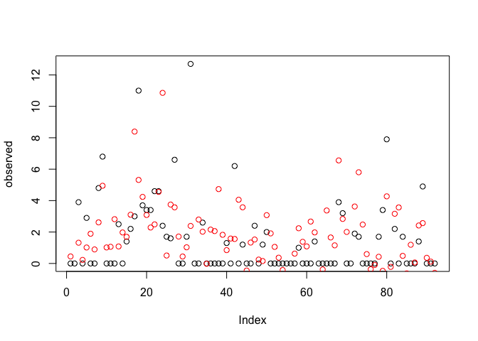
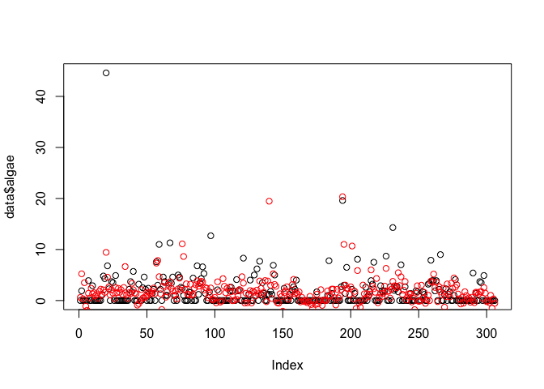
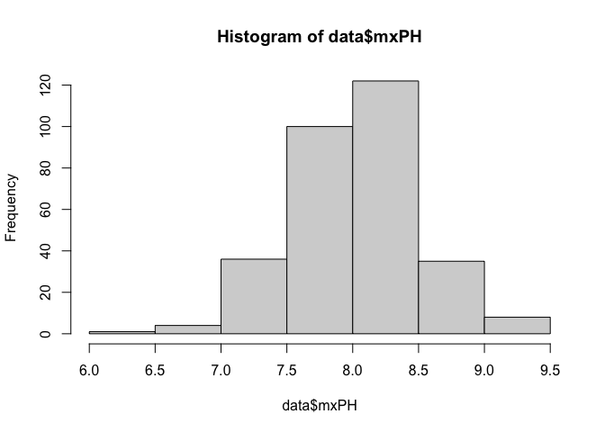
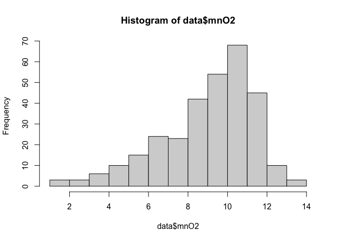
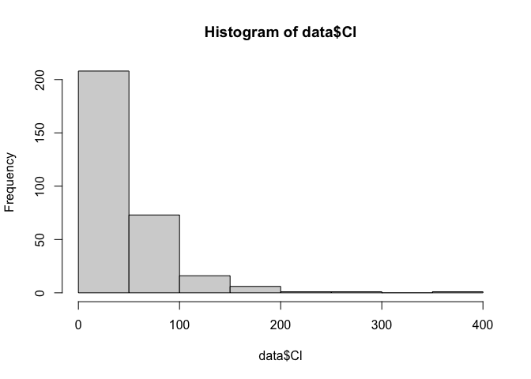
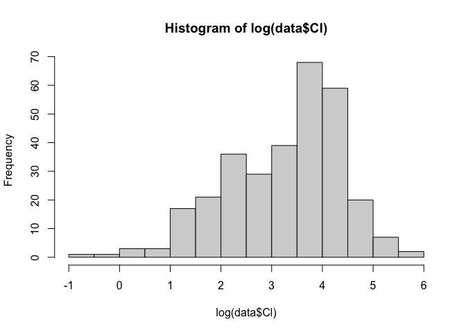
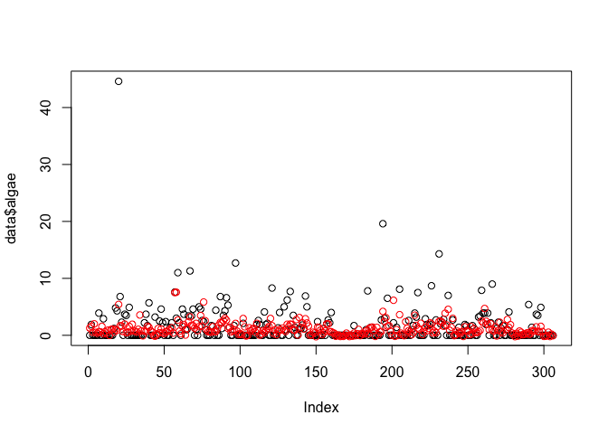
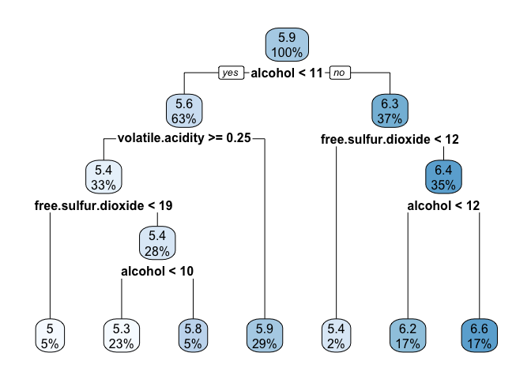
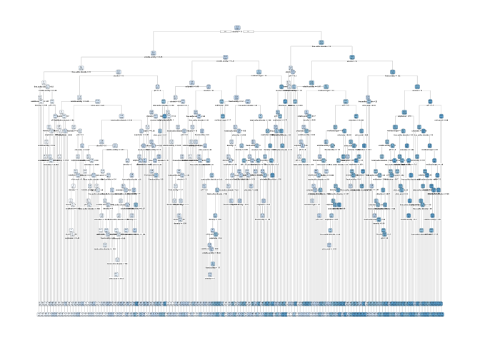
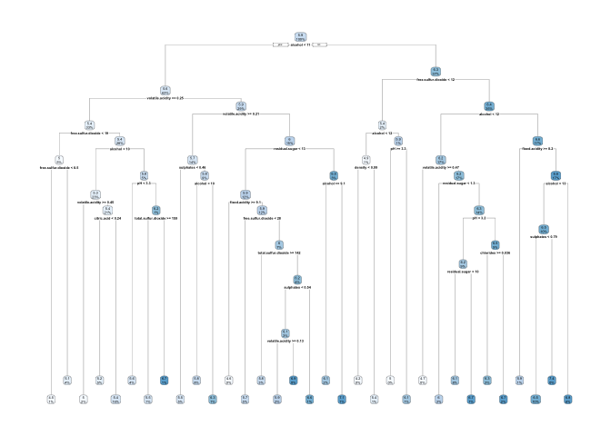

# Regression

## Priprava podatkov

``` r
data <- read.csv("algae.txt", stringsAsFactors=T)
summary(data)
```

    ##     season       size        speed          mxPH            mnO2       
    ##  autumn:72   large : 76   high  :125   Min.   :6.130   Min.   : 1.500  
    ##  spring:77   medium:135   low   : 54   1st Qu.:7.800   1st Qu.: 7.808  
    ##  summer:80   small : 95   medium:127   Median :8.100   Median : 9.600  
    ##  winter:77                             Mean   :8.066   Mean   : 9.048  
    ##                                        3rd Qu.:8.400   3rd Qu.:10.700  
    ##                                        Max.   :9.500   Max.   :13.400  
    ##        Cl              NO3              NH4                oPO4        
    ##  Min.   :  0.50   Min.   : 0.000   Min.   :    5.80   Min.   :   1.25  
    ##  1st Qu.: 11.86   1st Qu.: 1.224   1st Qu.:   46.27   1st Qu.:  16.87  
    ##  Median : 34.65   Median : 2.595   Median :  120.94   Median :  41.40  
    ##  Mean   : 43.88   Mean   : 3.220   Mean   :  514.58   Mean   :  78.05  
    ##  3rd Qu.: 58.21   3rd Qu.: 4.406   3rd Qu.:  262.67   3rd Qu.:  93.16  
    ##  Max.   :391.50   Max.   :45.650   Max.   :24064.00   Max.   :1435.00  
    ##       PO4                Chla             algae       
    ##  Min.   :   2.088   Min.   :  0.200   Min.   : 0.000  
    ##  1st Qu.:  49.743   1st Qu.:  2.137   1st Qu.: 0.000  
    ##  Median : 113.857   Median :  5.200   Median : 0.000  
    ##  Mean   : 145.695   Mean   : 12.754   Mean   : 1.752  
    ##  3rd Qu.: 208.300   3rd Qu.: 17.200   3rd Qu.: 2.375  
    ##  Max.   :1690.000   Max.   :110.456   Max.   :44.600

``` r
# nakljucno razdelimo podatke na ucno in testni mnozico v razmerju 70:30
set.seed(0)
sel <- sample(1:nrow(data), as.integer(nrow(data) * 0.7), F)
train <- data[sel,]
test <- data[-sel,]
```

## Linearna regresija

Metoda `lm` obravnava tudi nominalne (nezvezne) atribute, tako da jih
predstavi z mnozico binarnih atributov. Tako lahko izracunamo tudi
prispevke nominalnih vrednosti.

``` r
model <- lm(algae ~ ., train)
model
```

    ## 
    ## Call:
    ## lm(formula = algae ~ ., data = train)
    ## 
    ## Coefficients:
    ##  (Intercept)  seasonspring  seasonsummer  seasonwinter    sizemedium  
    ##   17.4388151     0.5961246    -0.4423794    -0.2179141     0.1979400  
    ##    sizesmall      speedlow   speedmedium          mxPH          mnO2  
    ##    0.0465797    -0.7388511    -0.1076750    -1.7347503    -0.2451999  
    ##           Cl           NO3           NH4          oPO4           PO4  
    ##    0.0062169    -0.3702892     0.0007768    -0.0081899     0.0133347  
    ##         Chla  
    ##   -0.0060408

``` r
predicted <- predict(model, test)
observed <- test$algae
plot(observed)
points(predicted, col="red")
```



### Merjenje napake

V regresiji merimo napako kot razdaljo med dejansko in napovedano
vrednostjo.

``` r
# srednja absolutna napaka (vse napake enako obravnavamo)
mae <- function(obs, pred)
{
    mean(abs(obs - pred))
}

# srednja kvadratna napaka (velike napake bolj obtezimo/kaznujemo)
mse <- function(obs, pred)
{
    mean((obs - pred)^2)
}

mae(observed, predicted)
```

    ## [1] 1.710337

``` r
mse(observed, predicted)
```

    ## [1] 5.789076

### Trivialni model

Model ki vedno napove povprecno vrednost ciljne spremenljivke.

``` r
meanVal <- mean(train$algae)
meanVal
```

    ## [1] 1.859346

``` r
predTrivial <- rep(meanVal, nrow(test))

mae(observed, predTrivial)
```

    ## [1] 1.856034

``` r
mse(observed, predTrivial)
```

    ## [1] 5.908022

### Relativna srednja absolutna napaka

Izracuna srednjo absolutno napako nasega modela relativno z srednjo
absolutno napako trivialnega modela.

``` r
# relativna srednja absolutna napaka
rmae <- function(obs, pred, mean.val) 
{  
    sum(abs(obs - pred)) / sum(abs(obs - mean.val))
}

# relativna srednja kvadratna napaka
rmse <- function(obs, pred, mean.val) 
{  
    sum((obs - pred)^2)/sum((obs - mean.val)^2)
}


rmae(observed, predicted, mean(train$algae))
```

    ## [1] 0.9215008

``` r
rmse(observed, predicted, mean(train$algae))
```

    ## [1] 0.979867

### Precno preverjanje (leave one out)

Ucim na toliko blokih, kolikor je vrstic podatkov.

``` r
predicted <- vector()

for (i in 1:nrow(data))
{   
    model <- lm(algae ~ ., data[-i,]) # naucim model na vseh vrsticah, razen na i-ti
    predicted[i] <- predict(model, data[i,]) # testiram model na i=ti vrstici
}

plot(data$algae)
points(predicted, col="red")
```



``` r
# srednje napake (absolutna, kvadratna)
mae(data$algae, predicted)
```

    ## [1] 1.810243

``` r
mse(data$algae, predicted)
```

    ## [1] 10.65452

``` r
# relativne napake (absolutna, kvadratna)
rmae(data$algae, predicted, mean(data$algae))
```

    ## [1] 0.8939135

``` r
rmse(data$algae, predicted, mean(data$algae))
```

    ## [1] 0.8310852

### Predhodna obdelava podatkov

Dobljene rezultate je mozno izboljsati z ustrezno predpripravo podatkov.
Poglejmo si porazdelitvene vrednosti posameznih atributov.

Opazimo, da ima vecina atributov ne-normalno porazdelitev, ki nebo dobro
delovala z linearnim regresijskim modelom. Zato je dobro, da tovrstne
atribute predhodno obdelamo (transformiramo) - v nasem primeru z
`log1p(x) = log(x + 1)` funkcijo.

``` r
# nekateri atributi imajo priblizno normalno porazdelitev
hist(data$mxPH)
```



``` r
hist(data$mnO2)
```



``` r
# drugi nimajo niti priblizno normalne porazdelitve...
hist(data$Cl)
```



``` r
# z logaritmiranjem jih skusamo transformirati v normalne
hist(log(data$Cl))
```



``` r
# tezave nastanejo, ce je vsaj ena izmed vrednosti atributa enaka 0
summary(data$NO3)
```

    ##    Min. 1st Qu.  Median    Mean 3rd Qu.    Max. 
    ##   0.000   1.224   2.595   3.220   4.406  45.650

``` r
summary(log(data$NO3))
```

    ##    Min. 1st Qu.  Median    Mean 3rd Qu.    Max. 
    ##    -Inf  0.2023  0.9534    -Inf  1.4830  3.8210

``` r
# zaradi tega atribute transformiramo s funkcijo log1p(x), ki izracuna log(1+x)

# v izvirni obliki obdrzimo kategoricne atribute in tiste zvezne, ki imajo priblizno normalno porazdelitev.
# ostale pa transformiramo.

dataTrans <- data[,c("season", "size", "speed", "mxPH", "mnO2")]
dataTrans$logCl <- log1p(data$Cl)
dataTrans$logNO3 <- log1p(data$NO3)
dataTrans$logNH4 <- log1p(data$NH4)
dataTrans$logoPO4 <- log1p(data$oPO4)
dataTrans$logPO4 <- log1p(data$PO4)
dataTrans$logChla <- log1p(data$Chla)
dataTrans$logAlgae <- log1p(data$algae)
summary(dataTrans)
```

    ##     season       size        speed          mxPH            mnO2       
    ##  autumn:72   large : 76   high  :125   Min.   :6.130   Min.   : 1.500  
    ##  spring:77   medium:135   low   : 54   1st Qu.:7.800   1st Qu.: 7.808  
    ##  summer:80   small : 95   medium:127   Median :8.100   Median : 9.600  
    ##  winter:77                             Mean   :8.066   Mean   : 9.048  
    ##                                        3rd Qu.:8.400   3rd Qu.:10.700  
    ##                                        Max.   :9.500   Max.   :13.400  
    ##      logCl            logNO3           logNH4          logoPO4      
    ##  Min.   :0.4055   Min.   :0.0000   Min.   : 1.917   Min.   :0.8109  
    ##  1st Qu.:2.5544   1st Qu.:0.7994   1st Qu.: 3.856   1st Qu.:2.8834  
    ##  Median :3.5737   Median :1.2794   Median : 4.803   Median :3.7471  
    ##  Mean   :3.3394   Mean   :1.2598   Mean   : 4.864   Mean   :3.6891  
    ##  3rd Qu.:4.0811   3rd Qu.:1.6875   3rd Qu.: 5.575   3rd Qu.:4.5450  
    ##  Max.   :5.9725   Max.   :3.8427   Max.   :10.089   Max.   :7.2696  
    ##      logPO4         logChla          logAlgae     
    ##  Min.   :1.128   Min.   :0.1823   Min.   :0.0000  
    ##  1st Qu.:3.927   1st Qu.:1.1433   1st Qu.:0.0000  
    ##  Median :4.744   Median :1.8245   Median :0.0000  
    ##  Mean   :4.514   Mean   :2.0035   Mean   :0.6324  
    ##  3rd Qu.:5.344   3rd Qu.:2.9014   3rd Qu.:1.2163  
    ##  Max.   :7.433   Max.   :4.7136   Max.   :3.8199

``` r
# sedaj izvedemo precno preverjanje po principu izpusti enega
logPredicted <- vector()

for (i in 1:nrow(dataTrans))
{   
    model <- lm(logAlgae ~ ., dataTrans[-i,])
    logPredicted[i] <- predict(model, dataTrans[i,])
}

# dobljene napovedi je potrebno transformirati v originalni prostor
# uporabimo metodo expm1(x), ki izracuna exp(x)-1

predicted <- expm1(logPredicted)

plot(data$algae)
points(predicted, col="red")
```



``` r
mae(data$algae, predicted)
```

    ## [1] 1.556773

``` r
mse(data$algae, predicted)
```

    ## [1] 10.57673

``` r
rmae(data$algae, predicted, mean(data$algae))
```

    ## [1] 0.7687482

``` r
rmse(data$algae, predicted, mean(data$algae))
```

    ## [1] 0.825017

## Ostali regresijsk modeli

``` r
wine <- read.table("winequality.txt", sep=",", header=T)
summary(wine)
```

    ##  fixed.acidity    volatile.acidity  citric.acid     residual.sugar  
    ##  Min.   : 3.800   Min.   :0.0800   Min.   :0.0000   Min.   : 0.600  
    ##  1st Qu.: 6.300   1st Qu.:0.2100   1st Qu.:0.2700   1st Qu.: 1.700  
    ##  Median : 6.800   Median :0.2600   Median :0.3200   Median : 5.200  
    ##  Mean   : 6.855   Mean   :0.2782   Mean   :0.3342   Mean   : 6.391  
    ##  3rd Qu.: 7.300   3rd Qu.:0.3200   3rd Qu.:0.3900   3rd Qu.: 9.900  
    ##  Max.   :14.200   Max.   :1.1000   Max.   :1.6600   Max.   :65.800  
    ##    chlorides       free.sulfur.dioxide total.sulfur.dioxide    density      
    ##  Min.   :0.00900   Min.   :  2.00      Min.   :  9.0        Min.   :0.9871  
    ##  1st Qu.:0.03600   1st Qu.: 23.00      1st Qu.:108.0        1st Qu.:0.9917  
    ##  Median :0.04300   Median : 34.00      Median :134.0        Median :0.9937  
    ##  Mean   :0.04577   Mean   : 35.31      Mean   :138.4        Mean   :0.9940  
    ##  3rd Qu.:0.05000   3rd Qu.: 46.00      3rd Qu.:167.0        3rd Qu.:0.9961  
    ##  Max.   :0.34600   Max.   :289.00      Max.   :440.0        Max.   :1.0390  
    ##        pH          sulphates         alcohol         quality     
    ##  Min.   :2.720   Min.   :0.2200   Min.   : 8.00   Min.   :3.000  
    ##  1st Qu.:3.090   1st Qu.:0.4100   1st Qu.: 9.50   1st Qu.:5.000  
    ##  Median :3.180   Median :0.4700   Median :10.40   Median :6.000  
    ##  Mean   :3.188   Mean   :0.4898   Mean   :10.51   Mean   :5.878  
    ##  3rd Qu.:3.280   3rd Qu.:0.5500   3rd Qu.:11.40   3rd Qu.:6.000  
    ##  Max.   :3.820   Max.   :1.0800   Max.   :14.20   Max.   :9.000

``` r
set.seed(0)

sel <- sample(1:nrow(wine), as.integer(nrow(wine) * 0.7), F)
train <- wine[sel,]
test <- wine[-sel,]
```

### Regresijsko drevo

``` r
library(rpart)
library(rpart.plot)

rt.model <- rpart(quality ~ ., data=train)
rpart.plot(rt.model)
```



``` r
predicted <- predict(rt.model, test)
mae(test$quality, predicted)
```

    ## [1] 0.5767543

``` r
rmae(test$quality, predicted, mean(train$quality))
```

    ## [1] 0.8718667

``` r
# do boljsega rezultat lahko pridemo z usreznim rezanjem drevesa

# najprej zgradimo veliko drevo (nastavitev cp=0)
rt.model <- rpart(quality ~ ., data=train, cp=0)
rpart.plot(rt.model)
```

    ## Warning: labs do not fit even at cex 0.15, there may be some overplotting



``` r
# rpart med gradnjo drevesa interno ocenjuje njegovo kvaliteto 
tab <- printcp(rt.model)
```

    ## 
    ## Regression tree:
    ## rpart(formula = quality ~ ., data = train, cp = 0)
    ## 
    ## Variables actually used in tree construction:
    ##  [1] alcohol              chlorides            citric.acid         
    ##  [4] density              fixed.acidity        free.sulfur.dioxide 
    ##  [7] pH                   residual.sugar       sulphates           
    ## [10] total.sulfur.dioxide volatile.acidity    
    ## 
    ## Root node error: 2738.6/3428 = 0.79888
    ## 
    ## n= 3428 
    ## 
    ##             CP nsplit rel error  xerror     xstd
    ## 1   1.6322e-01      0   1.00000 1.00028 0.025603
    ## 2   5.1322e-02      1   0.83678 0.83968 0.023612
    ## 3   2.7672e-02      2   0.78546 0.78909 0.022885
    ## 4   1.6054e-02      3   0.75779 0.76513 0.021434
    ## 5   1.1170e-02      4   0.74173 0.75344 0.021059
    ## 6   8.7435e-03      6   0.71939 0.74162 0.021026
    ## 7   8.2126e-03      8   0.70191 0.73355 0.020784
    ## 8   7.7306e-03      9   0.69369 0.73089 0.020638
    ## 9   5.8275e-03     10   0.68596 0.72079 0.020525
    ## 10  5.6297e-03     11   0.68014 0.72683 0.020804
    ## 11  5.1785e-03     12   0.67451 0.72712 0.020801
    ## 12  4.7200e-03     14   0.66415 0.72499 0.020624
    ## 13  4.5413e-03     15   0.65943 0.72413 0.020857
    ## 14  4.1286e-03     16   0.65489 0.72130 0.020813
    ## 15  3.8596e-03     17   0.65076 0.71832 0.020683
    ## 16  3.4529e-03     18   0.64690 0.71824 0.020804
    ## 17  3.4445e-03     19   0.64345 0.71794 0.020806
    ## 18  3.4403e-03     20   0.64000 0.71780 0.020802
    ## 19  3.3944e-03     21   0.63656 0.71670 0.020781
    ## 20  3.3095e-03     23   0.62977 0.71214 0.020685
    ## 21  3.1571e-03     26   0.61984 0.70804 0.020508
    ## 22  3.1255e-03     28   0.61353 0.70955 0.020588
    ## 23  2.9923e-03     29   0.61040 0.71153 0.020795
    ## 24  2.6510e-03     31   0.60442 0.71026 0.020882
    ## 25  2.6075e-03     32   0.60177 0.70801 0.020705
    ## 26  2.5813e-03     33   0.59916 0.70903 0.020760
    ## 27  2.5344e-03     34   0.59658 0.71091 0.021026
    ## 28  2.5118e-03     35   0.59405 0.71064 0.021026
    ## 29  2.3821e-03     36   0.59153 0.71117 0.020983
    ## 30  2.3336e-03     37   0.58915 0.71476 0.021075
    ## 31  2.1115e-03     38   0.58682 0.71636 0.021071
    ## 32  2.0984e-03     41   0.58048 0.72032 0.021153
    ## 33  2.0513e-03     42   0.57839 0.72330 0.021256
    ## 34  1.9974e-03     44   0.57428 0.72249 0.021327
    ## 35  1.9559e-03     47   0.56829 0.72222 0.021280
    ## 36  1.9130e-03     48   0.56633 0.72418 0.021421
    ## 37  1.9113e-03     50   0.56251 0.72380 0.021405
    ## 38  1.8327e-03     51   0.56060 0.72549 0.021391
    ## 39  1.8201e-03     53   0.55693 0.72604 0.021273
    ## 40  1.8200e-03     56   0.55147 0.72677 0.021312
    ## 41  1.8067e-03     58   0.54783 0.72647 0.021310
    ## 42  1.8030e-03     59   0.54603 0.72732 0.021321
    ## 43  1.8001e-03     61   0.54242 0.72758 0.021351
    ## 44  1.7936e-03     62   0.54062 0.72690 0.021242
    ## 45  1.7787e-03     64   0.53703 0.72745 0.021281
    ## 46  1.7781e-03     65   0.53525 0.72745 0.021281
    ## 47  1.7395e-03     66   0.53347 0.72655 0.021281
    ## 48  1.7117e-03     67   0.53174 0.72804 0.021466
    ## 49  1.7018e-03     68   0.53002 0.72775 0.021476
    ## 50  1.6997e-03     69   0.52832 0.72853 0.021487
    ## 51  1.6839e-03     70   0.52662 0.72917 0.021491
    ## 52  1.6777e-03     71   0.52494 0.72953 0.021496
    ## 53  1.6601e-03     72   0.52326 0.73087 0.021528
    ## 54  1.6554e-03     73   0.52160 0.73135 0.021659
    ## 55  1.6248e-03     76   0.51656 0.72834 0.021313
    ## 56  1.6179e-03     77   0.51494 0.72768 0.021314
    ## 57  1.6005e-03     78   0.51332 0.72870 0.021325
    ## 58  1.5941e-03     79   0.51172 0.72884 0.021332
    ## 59  1.5623e-03     80   0.51012 0.73100 0.021393
    ## 60  1.5475e-03     81   0.50856 0.73286 0.021430
    ## 61  1.5474e-03     82   0.50701 0.73249 0.021428
    ## 62  1.5398e-03     83   0.50547 0.73240 0.021429
    ## 63  1.5225e-03     84   0.50393 0.73166 0.021315
    ## 64  1.5216e-03     85   0.50240 0.72826 0.021256
    ## 65  1.5013e-03     87   0.49936 0.72729 0.021232
    ## 66  1.4796e-03     89   0.49636 0.72652 0.021241
    ## 67  1.4532e-03     90   0.49488 0.72734 0.021225
    ## 68  1.4529e-03     91   0.49342 0.72695 0.021211
    ## 69  1.4233e-03     92   0.49197 0.72450 0.021234
    ## 70  1.4088e-03     93   0.49055 0.72586 0.021276
    ## 71  1.4000e-03     94   0.48914 0.72542 0.021269
    ## 72  1.3757e-03     95   0.48774 0.72474 0.021252
    ## 73  1.3302e-03     96   0.48636 0.72328 0.021166
    ## 74  1.2781e-03     97   0.48503 0.72489 0.021257
    ## 75  1.2680e-03     98   0.48376 0.72669 0.021284
    ## 76  1.2637e-03    101   0.47995 0.72613 0.021216
    ## 77  1.2448e-03    102   0.47869 0.72756 0.021292
    ## 78  1.2352e-03    103   0.47744 0.72749 0.021278
    ## 79  1.2304e-03    106   0.47373 0.72837 0.021297
    ## 80  1.2300e-03    109   0.47004 0.72765 0.021293
    ## 81  1.2074e-03    110   0.46881 0.72703 0.021301
    ## 82  1.2018e-03    111   0.46760 0.72670 0.021297
    ## 83  1.1995e-03    112   0.46640 0.72637 0.021296
    ## 84  1.1947e-03    114   0.46400 0.72674 0.021293
    ## 85  1.1928e-03    115   0.46281 0.72625 0.021288
    ## 86  1.1665e-03    116   0.46162 0.72588 0.021323
    ## 87  1.1535e-03    117   0.46045 0.72503 0.021278
    ## 88  1.1485e-03    118   0.45930 0.72498 0.021276
    ## 89  1.1317e-03    119   0.45815 0.72356 0.021226
    ## 90  1.1305e-03    120   0.45702 0.72494 0.021256
    ## 91  1.1297e-03    123   0.45362 0.72508 0.021249
    ## 92  1.1278e-03    124   0.45249 0.72508 0.021249
    ## 93  1.0943e-03    126   0.45024 0.72608 0.021260
    ## 94  1.0897e-03    127   0.44914 0.72723 0.021279
    ## 95  1.0796e-03    128   0.44806 0.72692 0.021313
    ## 96  1.0777e-03    129   0.44698 0.72757 0.021321
    ## 97  1.0665e-03    130   0.44590 0.72757 0.021313
    ## 98  1.0588e-03    131   0.44483 0.72716 0.021325
    ## 99  1.0540e-03    132   0.44377 0.72817 0.021344
    ## 100 1.0347e-03    134   0.44166 0.72745 0.021338
    ## 101 1.0214e-03    135   0.44063 0.72798 0.021349
    ## 102 1.0117e-03    138   0.43755 0.72850 0.021341
    ## 103 1.0038e-03    139   0.43653 0.72803 0.021311
    ## 104 1.0013e-03    140   0.43553 0.72964 0.021328
    ## 105 9.7375e-04    141   0.43453 0.73014 0.021355
    ## 106 9.6871e-04    142   0.43356 0.72894 0.021341
    ## 107 9.6391e-04    143   0.43259 0.72972 0.021353
    ## 108 9.6217e-04    144   0.43162 0.72910 0.021290
    ## 109 9.5797e-04    146   0.42970 0.72889 0.021292
    ## 110 9.5071e-04    148   0.42778 0.72966 0.021316
    ## 111 9.4940e-04    149   0.42683 0.73034 0.021315
    ## 112 9.2982e-04    150   0.42588 0.72963 0.021206
    ## 113 9.2376e-04    152   0.42402 0.72958 0.021125
    ## 114 9.1893e-04    153   0.42310 0.73011 0.021122
    ## 115 9.1826e-04    154   0.42218 0.73018 0.021122
    ## 116 9.1778e-04    155   0.42126 0.73018 0.021122
    ## 117 9.1556e-04    157   0.41943 0.73018 0.021122
    ## 118 9.1546e-04    158   0.41851 0.73018 0.021122
    ## 119 9.0752e-04    159   0.41760 0.72954 0.021208
    ## 120 9.0632e-04    163   0.41397 0.72913 0.021193
    ## 121 8.8952e-04    164   0.41306 0.73014 0.021256
    ## 122 8.8556e-04    167   0.41039 0.73047 0.021262
    ## 123 8.8391e-04    168   0.40951 0.73047 0.021262
    ## 124 8.7637e-04    170   0.40774 0.73102 0.021269
    ## 125 8.6731e-04    171   0.40686 0.73138 0.021246
    ## 126 8.6144e-04    172   0.40599 0.73231 0.021261
    ## 127 8.4507e-04    173   0.40513 0.73268 0.021267
    ## 128 8.4501e-04    174   0.40429 0.73284 0.021268
    ## 129 8.3481e-04    175   0.40344 0.73316 0.021267
    ## 130 8.2889e-04    177   0.40177 0.73434 0.021275
    ## 131 8.0493e-04    178   0.40094 0.73577 0.021301
    ## 132 8.0188e-04    179   0.40014 0.73564 0.021319
    ## 133 7.9996e-04    180   0.39934 0.73561 0.021321
    ## 134 7.9954e-04    181   0.39854 0.73561 0.021321
    ## 135 7.9392e-04    183   0.39694 0.73573 0.021318
    ## 136 7.9041e-04    184   0.39614 0.73547 0.021342
    ## 137 7.8638e-04    185   0.39535 0.73445 0.021227
    ## 138 7.8574e-04    186   0.39457 0.73478 0.021229
    ## 139 7.6074e-04    187   0.39378 0.73327 0.021226
    ## 140 7.4073e-04    188   0.39302 0.73425 0.021271
    ## 141 7.3485e-04    191   0.39080 0.73647 0.021267
    ## 142 7.3465e-04    192   0.39006 0.73683 0.021262
    ## 143 7.3247e-04    196   0.38712 0.73683 0.021262
    ## 144 7.3094e-04    198   0.38566 0.73683 0.021262
    ## 145 7.2236e-04    199   0.38493 0.73673 0.021267
    ## 146 7.1966e-04    201   0.38348 0.73735 0.021261
    ## 147 7.0199e-04    204   0.38133 0.73921 0.021331
    ## 148 7.0014e-04    206   0.37992 0.73977 0.021347
    ## 149 6.9430e-04    208   0.37852 0.74015 0.021352
    ## 150 6.8467e-04    210   0.37713 0.74102 0.021353
    ## 151 6.8400e-04    211   0.37645 0.74294 0.021363
    ## 152 6.7621e-04    213   0.37508 0.74293 0.021358
    ## 153 6.7494e-04    214   0.37440 0.74350 0.021372
    ## 154 6.7235e-04    215   0.37373 0.74351 0.021372
    ## 155 6.5958e-04    216   0.37306 0.74427 0.021395
    ## 156 6.4531e-04    218   0.37174 0.74517 0.021457
    ## 157 6.4452e-04    219   0.37109 0.74616 0.021456
    ## 158 6.3437e-04    220   0.37045 0.74648 0.021458
    ## 159 6.3054e-04    221   0.36981 0.74783 0.021493
    ## 160 6.2213e-04    223   0.36855 0.74856 0.021485
    ## 161 6.1933e-04    224   0.36793 0.74819 0.021482
    ## 162 6.1741e-04    225   0.36731 0.74826 0.021482
    ## 163 6.0226e-04    226   0.36669 0.74869 0.021544
    ## 164 5.9919e-04    227   0.36609 0.74931 0.021535
    ## 165 5.8820e-04    228   0.36549 0.74975 0.021545
    ## 166 5.8264e-04    229   0.36490 0.75002 0.021544
    ## 167 5.8201e-04    230   0.36432 0.75086 0.021559
    ## 168 5.7779e-04    231   0.36374 0.75149 0.021573
    ## 169 5.7652e-04    232   0.36316 0.75201 0.021581
    ## 170 5.7311e-04    234   0.36201 0.75191 0.021581
    ## 171 5.6730e-04    236   0.36086 0.75027 0.021461
    ## 172 5.6405e-04    237   0.36029 0.75077 0.021461
    ## 173 5.5405e-04    238   0.35973 0.75269 0.021503
    ## 174 5.4252e-04    239   0.35918 0.75439 0.021536
    ## 175 5.3351e-04    240   0.35863 0.75439 0.021538
    ## 176 5.2974e-04    241   0.35810 0.75407 0.021522
    ## 177 5.2420e-04    242   0.35757 0.75292 0.021516
    ## 178 5.2185e-04    244   0.35652 0.75294 0.021517
    ## 179 5.2037e-04    245   0.35600 0.75276 0.021520
    ## 180 4.9955e-04    246   0.35548 0.75321 0.021527
    ## 181 4.8809e-04    248   0.35448 0.75196 0.021490
    ## 182 4.6945e-04    249   0.35399 0.75403 0.021511
    ## 183 4.5775e-04    250   0.35352 0.75341 0.021511
    ## 184 4.5210e-04    251   0.35307 0.75294 0.021498
    ## 185 4.5183e-04    252   0.35261 0.75260 0.021500
    ## 186 4.3718e-04    253   0.35216 0.75226 0.021488
    ## 187 4.3620e-04    254   0.35172 0.75234 0.021488
    ## 188 4.3592e-04    255   0.35129 0.75234 0.021488
    ## 189 4.2445e-04    256   0.35085 0.75210 0.021485
    ## 190 3.9519e-04    257   0.35043 0.75241 0.021463
    ## 191 3.8701e-04    258   0.35003 0.75208 0.021467
    ## 192 3.7705e-04    259   0.34965 0.75250 0.021457
    ## 193 3.7049e-04    260   0.34927 0.75304 0.021461
    ## 194 3.6411e-04    261   0.34890 0.75249 0.021414
    ## 195 3.3803e-04    262   0.34853 0.75309 0.021422
    ## 196 3.2532e-04    263   0.34820 0.75343 0.021394
    ## 197 2.9995e-04    264   0.34787 0.75358 0.021394
    ## 198 2.7443e-04    265   0.34757 0.75485 0.021437
    ## 199 2.6142e-04    266   0.34730 0.75576 0.021442
    ## 200 2.5213e-04    267   0.34703 0.75552 0.021442
    ## 201 2.1735e-04    268   0.34678 0.75581 0.021443
    ## 202 2.1249e-04    269   0.34657 0.75557 0.021443
    ## 203 2.0441e-04    271   0.34614 0.75546 0.021443
    ## 204 1.8394e-04    272   0.34594 0.75552 0.021457
    ## 205 1.7131e-04    274   0.34557 0.75538 0.021444
    ## 206 1.6440e-04    275   0.34540 0.75531 0.021443
    ## 207 1.6054e-04    276   0.34523 0.75510 0.021443
    ## 208 1.3911e-04    277   0.34507 0.75470 0.021441
    ## 209 1.0955e-04    278   0.34493 0.75499 0.021443
    ## 210 7.9451e-05    279   0.34482 0.75494 0.021442
    ## 211 7.6509e-05    281   0.34466 0.75513 0.021449
    ## 212 7.1134e-05    282   0.34459 0.75514 0.021449
    ## 213 3.8121e-05    283   0.34452 0.75547 0.021451
    ## 214 0.0000e+00    284   0.34448 0.75576 0.021484

``` r
# izberemo vrednost parametra cp, ki ustreza minimalni napaki internega presnega preverjanja
row <- which.min(tab[,"xerror"])
th <- mean(c(tab[row, "CP"], tab[row-1, "CP"]))
th
```

    ## [1] 0.002629214

``` r
# porezemo drevo z izbrano nastavitvijo
rt.model <- prune(rt.model, cp=th)
rpart.plot(rt.model)
```



``` r
predicted <- predict(rt.model, test)
mae(test$quality, predicted)
```

    ## [1] 0.5636793

``` r
rmae(test$quality, predicted, mean(train$quality))
```

    ## [1] 0.8521015

### Nakljucni gozd

``` r
library(randomForest)
```

    ## randomForest 4.6-14

    ## Type rfNews() to see new features/changes/bug fixes.

``` r
rf.model <- randomForest(quality ~ ., train)
predicted <- predict(rf.model, test)
mae(test$quality, predicted)
```

    ## [1] 0.4317387

``` r
rmae(test$quality, predicted, mean(train$quality))
```

    ## [1] 0.6526499

### Support Vector Machine

``` r
library(e1071)

svm.model <- svm(quality ~ ., train)
predicted <- predict(svm.model, test)
mae(test$quality, predicted)
```

    ## [1] 0.5054599

``` r
rmae(test$quality, predicted, mean(train$quality))
```

    ## [1] 0.7640926

### K-najblizjih sosedov

``` r
library(kknn)

knn.model <- kknn(quality ~ ., train, test, k = 5)
predicted <- fitted(knn.model)
mae(test$quality, predicted)
```

    ## [1] 0.4838722

``` r
rmae(test$quality, predicted, mean(train$quality))
```

    ## [1] 0.7314589

### Nevronske mreze

> POMEMBNO: Za regresijo je potrebno nastaviti linout = T.

``` r
library(nnet)

# zaradi nakljucne izbire zacetnih utezi bo vsakic nekoliko drugacen rezultat
# ce zelimo ponovljiv model, nastavimo generator nakljucnih stevil
set.seed(0)

nn.model <- nnet(quality ~ ., train, size = 5, decay = 0.0001, maxit = 10000, linout = T)
```

    ## # weights:  66
    ## initial  value 121869.927051 
    ## iter  10 value 2734.889149
    ## iter  20 value 2675.100947
    ## iter  30 value 2492.008900
    ## iter  40 value 2472.309036
    ## iter  50 value 2465.704172
    ## iter  60 value 2465.428959
    ## iter  70 value 2464.451432
    ## iter  80 value 2281.062582
    ## iter  90 value 2116.705042
    ## iter 100 value 2030.858428
    ## iter 110 value 2006.426264
    ## iter 120 value 1977.265473
    ## iter 130 value 1972.537845
    ## iter 140 value 1969.127458
    ## iter 150 value 1952.021525
    ## iter 160 value 1951.411674
    ## iter 170 value 1950.824746
    ## iter 180 value 1948.884759
    ## iter 190 value 1947.881596
    ## iter 200 value 1947.229563
    ## iter 210 value 1947.186283
    ## iter 220 value 1947.182042
    ## iter 230 value 1947.180727
    ## final  value 1947.149872 
    ## converged

``` r
predicted <- predict(nn.model, test)
mae(test$quality, predicted)
```

    ## [1] 0.5749413

``` r
rmae(test$quality, predicted, mean(train$quality))
```

    ## [1] 0.869126

``` r
# pri ucenju nevronskih mrez je priporocljivo normalizirati ucne podatke

# zvezne atribute normaliziramo na interval [0,1]:

min_vals <- apply(train[,1:11], 2, min)
max_vals <- apply(train[,1:11], 2, max)

normTrain <- as.data.frame(scale(train[,1:11], center = min_vals, scale = max_vals - min_vals))
normTrain$quality <- train$quality


# na enak nacin (z istimi mejnimi vrednostmi!) normaliziramo tudi testno mnozico
normTest <- as.data.frame(scale(test[,1:11], center = min_vals, scale = max_vals - min_vals))
normTest$quality <- test$quality

set.seed(0)
nn.model <- nnet(quality ~ ., normTrain, size = 5, decay = 0.0001, maxit = 10000, linout = T)
```

    ## # weights:  66
    ## initial  value 120446.950985 
    ## iter  10 value 2025.108945
    ## iter  20 value 1891.176700
    ## iter  30 value 1779.712210
    ## iter  40 value 1747.458459
    ## iter  50 value 1723.097196
    ## iter  60 value 1694.818996
    ## iter  70 value 1680.328108
    ## iter  80 value 1674.407087
    ## iter  90 value 1672.027259
    ## iter 100 value 1670.594669
    ## iter 110 value 1669.550399
    ## iter 120 value 1668.139380
    ## iter 130 value 1667.300942
    ## iter 140 value 1666.806070
    ## iter 150 value 1666.352790
    ## iter 160 value 1665.739436
    ## iter 170 value 1665.043619
    ## iter 180 value 1664.133432
    ## iter 190 value 1660.164039
    ## iter 200 value 1655.952072
    ## iter 210 value 1652.034007
    ## iter 220 value 1647.469198
    ## iter 230 value 1644.219678
    ## iter 240 value 1641.823614
    ## iter 250 value 1640.362807
    ## iter 260 value 1639.027909
    ## iter 270 value 1637.534174
    ## iter 280 value 1637.102361
    ## iter 290 value 1636.276149
    ## iter 300 value 1635.797653
    ## iter 310 value 1635.407742
    ## iter 320 value 1634.971222
    ## iter 330 value 1634.615024
    ## iter 340 value 1633.918547
    ## iter 350 value 1632.530320
    ## iter 360 value 1630.235716
    ## iter 370 value 1627.820015
    ## iter 380 value 1623.884971
    ## iter 390 value 1621.863533
    ## iter 400 value 1619.527046
    ## iter 410 value 1618.593656
    ## iter 420 value 1617.499156
    ## iter 430 value 1615.699479
    ## iter 440 value 1614.782407
    ## iter 450 value 1613.631775
    ## iter 460 value 1612.679423
    ## iter 470 value 1611.911314
    ## iter 480 value 1611.598395
    ## iter 490 value 1611.447375
    ## iter 500 value 1611.334300
    ## iter 510 value 1611.260866
    ## iter 520 value 1611.178813
    ## iter 530 value 1611.082705
    ## iter 540 value 1611.025443
    ## iter 550 value 1611.000839
    ## iter 560 value 1610.924284
    ## iter 570 value 1610.876774
    ## iter 580 value 1610.798061
    ## iter 590 value 1610.658816
    ## iter 600 value 1609.859179
    ## iter 610 value 1609.331472
    ## iter 620 value 1609.263071
    ## iter 630 value 1609.244519
    ## iter 640 value 1609.236319
    ## iter 650 value 1609.220345
    ## iter 660 value 1609.211061
    ## final  value 1609.208982 
    ## converged

``` r
predicted <- predict(nn.model, normTest)
mae(test$quality, predicted)
```

    ## [1] 0.5368023

``` r
rmae(test$quality, predicted, mean(train$quality))
```

    ## [1] 0.8114722

## Ocenjevanje atributov

``` r
student <- read.table("student.txt", sep=",", header=T, stringsAsFactors=T)
summary(student)
```

    ##  sex          age       address famsize   Pstatus      Medu      
    ##  F:208   Min.   :15.0   R: 88   GT3:281   A: 41   Min.   :0.000  
    ##  M:187   1st Qu.:16.0   U:307   LE3:114   T:354   1st Qu.:2.000  
    ##          Median :17.0                             Median :3.000  
    ##          Mean   :16.7                             Mean   :2.749  
    ##          3rd Qu.:18.0                             3rd Qu.:4.000  
    ##          Max.   :22.0                             Max.   :4.000  
    ##       Fedu             Mjob           Fjob            reason      guardian  
    ##  Min.   :0.000   at_home : 59   at_home : 20   course    :145   father: 90  
    ##  1st Qu.:2.000   health  : 34   health  : 18   home      :109   mother:273  
    ##  Median :2.000   other   :141   other   :217   other     : 36   other : 32  
    ##  Mean   :2.522   services:103   services:111   reputation:105               
    ##  3rd Qu.:3.000   teacher : 58   teacher : 29                                
    ##  Max.   :4.000                                                              
    ##    traveltime      studytime        failures      schoolsup famsup     paid    
    ##  Min.   :1.000   Min.   :1.000   Min.   :0.0000   no :344   no :153   no :214  
    ##  1st Qu.:1.000   1st Qu.:1.000   1st Qu.:0.0000   yes: 51   yes:242   yes:181  
    ##  Median :1.000   Median :2.000   Median :0.0000                                
    ##  Mean   :1.448   Mean   :2.035   Mean   :0.3342                                
    ##  3rd Qu.:2.000   3rd Qu.:2.000   3rd Qu.:0.0000                                
    ##  Max.   :4.000   Max.   :4.000   Max.   :3.0000                                
    ##  activities nursery   higher    internet  romantic      famrel     
    ##  no :194    no : 81   no : 20   no : 66   no :263   Min.   :1.000  
    ##  yes:201    yes:314   yes:375   yes:329   yes:132   1st Qu.:4.000  
    ##                                                     Median :4.000  
    ##                                                     Mean   :3.944  
    ##                                                     3rd Qu.:5.000  
    ##                                                     Max.   :5.000  
    ##     freetime         goout            Dalc            Walc      
    ##  Min.   :1.000   Min.   :1.000   Min.   :1.000   Min.   :1.000  
    ##  1st Qu.:3.000   1st Qu.:2.000   1st Qu.:1.000   1st Qu.:1.000  
    ##  Median :3.000   Median :3.000   Median :1.000   Median :2.000  
    ##  Mean   :3.235   Mean   :3.109   Mean   :1.481   Mean   :2.291  
    ##  3rd Qu.:4.000   3rd Qu.:4.000   3rd Qu.:2.000   3rd Qu.:3.000  
    ##  Max.   :5.000   Max.   :5.000   Max.   :5.000   Max.   :5.000  
    ##      health         absences            G1              G2       
    ##  Min.   :1.000   Min.   : 0.000   Min.   : 3.00   Min.   : 0.00  
    ##  1st Qu.:3.000   1st Qu.: 0.000   1st Qu.: 8.00   1st Qu.: 9.00  
    ##  Median :4.000   Median : 4.000   Median :11.00   Median :11.00  
    ##  Mean   :3.554   Mean   : 5.709   Mean   :10.91   Mean   :10.71  
    ##  3rd Qu.:5.000   3rd Qu.: 8.000   3rd Qu.:13.00   3rd Qu.:13.00  
    ##  Max.   :5.000   Max.   :75.000   Max.   :19.00   Max.   :19.00  
    ##        G3       
    ##  Min.   : 0.00  
    ##  1st Qu.: 8.00  
    ##  Median :11.00  
    ##  Mean   :10.42  
    ##  3rd Qu.:14.00  
    ##  Max.   :20.00

``` r
set.seed(0)
sel <- sample(1:nrow(student), as.integer(nrow(student) * 0.7), F)
train <- student[sel,]
test <- student[-sel,]


library(kknn)
modelFull <- train.kknn(G3 ~ ., train, ks=5)
predicted <- predict(modelFull, test)
rmse(test$G3, predicted, mean(train$G3))
```

    ## [1] 0.5463817

Izbira podmnozice atributov s filter metodo

``` r
# atribute ocenimo z neko mero
library(CORElearn)
sort(attrEval(G3 ~ ., train, "MSEofMean"), decreasing = TRUE)
```

    ##         G2         G1   failures   absences       Mjob  studytime       Medu 
    ##  -9.286094 -10.680318 -17.145737 -19.336052 -19.683467 -19.715781 -19.770494 
    ##     higher        age      goout       Fedu   romantic       paid       Dalc 
    ## -19.800577 -20.100526 -20.111582 -20.123937 -20.124111 -20.141341 -20.158919 
    ##     reason     health       Fjob  schoolsup        sex       Walc traveltime 
    ## -20.222164 -20.237595 -20.271711 -20.276334 -20.279038 -20.283457 -20.285168 
    ##    address   internet    Pstatus   guardian   freetime     famrel    famsize 
    ## -20.298143 -20.300364 -20.378594 -20.385003 -20.385200 -20.411449 -20.456787 
    ## activities     famsup    nursery 
    ## -20.479550 -20.481019 -20.481272

``` r
sort(attrEval(G3 ~ ., train, "RReliefFexpRank"), decreasing = TRUE)
```

    ##           G2           G1     failures     absences    schoolsup       higher 
    ##  0.557490121  0.270597086  0.055080032  0.037026186  0.009485730  0.007863364 
    ##     internet   traveltime      address     romantic        goout         Medu 
    ##  0.004406871 -0.002927889 -0.005943208 -0.007177589 -0.007805286 -0.008058021 
    ##         paid      Pstatus       famrel      famsize         Walc   activities 
    ## -0.008549478 -0.009679389 -0.010123101 -0.015860875 -0.016153914 -0.016792424 
    ##    studytime       reason       famsup     freetime      nursery       health 
    ## -0.019654718 -0.020523032 -0.022094580 -0.022851333 -0.025849288 -0.026158368 
    ##         Mjob         Fjob         Dalc          sex         Fedu     guardian 
    ## -0.029185476 -0.029591754 -0.030928753 -0.033703565 -0.037355335 -0.042918944 
    ##          age 
    ## -0.047993866

``` r
# model zgradimo s pomocjo nekaj najbolje ocenjenih atributov
modelReduced <- train.kknn(G3 ~ G2 + G1, train, ks=5)
predicted <- predict(modelReduced, test)
rmse(test$G3, predicted, mean(train$G3))
```

    ## [1] 0.2577631

Izbira podmnozice atributov z metodo ovojnice (wrapper).

``` r
source("../wrapper.R")


# Funkcija za ucenje modela
myTrainFuncReg <- function(formula, traindata)
{
    train.kknn(formula, traindata, ks=5)
}


# Funkcija za pridobivanje napovedi modela
myPredictFuncReg <- function(model, testdata)
{
    predict(model, testdata)
}


# Funkcija za ocenjevanje kvalitete modela (v tem primeru RMSE)

myEvalFuncRMSE <- function(predicted, observed, trained)
{
    sum((observed - predicted)^2)/sum((observed - mean(trained))^2) 
}

set.seed(0)
wrapper(G3 ~ ., train, myTrainFuncReg, myPredictFuncReg, myEvalFuncRMSE, cvfolds=10)
```

    ## formula to evaluate: G3 ~ sex ...
    ## formula to evaluate: G3 ~ age ...
    ## formula to evaluate: G3 ~ address ...
    ## formula to evaluate: G3 ~ famsize ...
    ## formula to evaluate: G3 ~ Pstatus ...
    ## formula to evaluate: G3 ~ Medu ...
    ## formula to evaluate: G3 ~ Fedu ...
    ## formula to evaluate: G3 ~ Mjob ...
    ## formula to evaluate: G3 ~ Fjob ...
    ## formula to evaluate: G3 ~ reason ...
    ## formula to evaluate: G3 ~ guardian ...
    ## formula to evaluate: G3 ~ traveltime ...
    ## formula to evaluate: G3 ~ studytime ...
    ## formula to evaluate: G3 ~ failures ...
    ## formula to evaluate: G3 ~ schoolsup ...
    ## formula to evaluate: G3 ~ famsup ...
    ## formula to evaluate: G3 ~ paid ...
    ## formula to evaluate: G3 ~ activities ...
    ## formula to evaluate: G3 ~ nursery ...
    ## formula to evaluate: G3 ~ higher ...
    ## formula to evaluate: G3 ~ internet ...
    ## formula to evaluate: G3 ~ romantic ...
    ## formula to evaluate: G3 ~ famrel ...
    ## formula to evaluate: G3 ~ freetime ...
    ## formula to evaluate: G3 ~ goout ...
    ## formula to evaluate: G3 ~ Dalc ...
    ## formula to evaluate: G3 ~ Walc ...
    ## formula to evaluate: G3 ~ health ...
    ## formula to evaluate: G3 ~ absences ...
    ## formula to evaluate: G3 ~ G1 ...
    ## formula to evaluate: G3 ~ G2 ...
    ## selected attribute:  G2 
    ## formula to evaluate: G3 ~ G2 + sex ...
    ## formula to evaluate: G3 ~ G2 + age ...
    ## formula to evaluate: G3 ~ G2 + address ...
    ## formula to evaluate: G3 ~ G2 + famsize ...
    ## formula to evaluate: G3 ~ G2 + Pstatus ...
    ## formula to evaluate: G3 ~ G2 + Medu ...
    ## formula to evaluate: G3 ~ G2 + Fedu ...
    ## formula to evaluate: G3 ~ G2 + Mjob ...
    ## formula to evaluate: G3 ~ G2 + Fjob ...
    ## formula to evaluate: G3 ~ G2 + reason ...
    ## formula to evaluate: G3 ~ G2 + guardian ...
    ## formula to evaluate: G3 ~ G2 + traveltime ...
    ## formula to evaluate: G3 ~ G2 + studytime ...
    ## formula to evaluate: G3 ~ G2 + failures ...
    ## formula to evaluate: G3 ~ G2 + schoolsup ...
    ## formula to evaluate: G3 ~ G2 + famsup ...
    ## formula to evaluate: G3 ~ G2 + paid ...
    ## formula to evaluate: G3 ~ G2 + activities ...
    ## formula to evaluate: G3 ~ G2 + nursery ...
    ## formula to evaluate: G3 ~ G2 + higher ...
    ## formula to evaluate: G3 ~ G2 + internet ...
    ## formula to evaluate: G3 ~ G2 + romantic ...
    ## formula to evaluate: G3 ~ G2 + famrel ...
    ## formula to evaluate: G3 ~ G2 + freetime ...
    ## formula to evaluate: G3 ~ G2 + goout ...
    ## formula to evaluate: G3 ~ G2 + Dalc ...
    ## formula to evaluate: G3 ~ G2 + Walc ...
    ## formula to evaluate: G3 ~ G2 + health ...
    ## formula to evaluate: G3 ~ G2 + absences ...
    ## formula to evaluate: G3 ~ G2 + G1 ...
    ## selected attribute:  absences 
    ## formula to evaluate: G3 ~ G2 + absences + sex ...
    ## formula to evaluate: G3 ~ G2 + absences + age ...
    ## formula to evaluate: G3 ~ G2 + absences + address ...
    ## formula to evaluate: G3 ~ G2 + absences + famsize ...
    ## formula to evaluate: G3 ~ G2 + absences + Pstatus ...
    ## formula to evaluate: G3 ~ G2 + absences + Medu ...
    ## formula to evaluate: G3 ~ G2 + absences + Fedu ...
    ## formula to evaluate: G3 ~ G2 + absences + Mjob ...
    ## formula to evaluate: G3 ~ G2 + absences + Fjob ...
    ## formula to evaluate: G3 ~ G2 + absences + reason ...
    ## formula to evaluate: G3 ~ G2 + absences + guardian ...
    ## formula to evaluate: G3 ~ G2 + absences + traveltime ...
    ## formula to evaluate: G3 ~ G2 + absences + studytime ...
    ## formula to evaluate: G3 ~ G2 + absences + failures ...
    ## formula to evaluate: G3 ~ G2 + absences + schoolsup ...
    ## formula to evaluate: G3 ~ G2 + absences + famsup ...
    ## formula to evaluate: G3 ~ G2 + absences + paid ...
    ## formula to evaluate: G3 ~ G2 + absences + activities ...
    ## formula to evaluate: G3 ~ G2 + absences + nursery ...
    ## formula to evaluate: G3 ~ G2 + absences + higher ...
    ## formula to evaluate: G3 ~ G2 + absences + internet ...
    ## formula to evaluate: G3 ~ G2 + absences + romantic ...
    ## formula to evaluate: G3 ~ G2 + absences + famrel ...
    ## formula to evaluate: G3 ~ G2 + absences + freetime ...
    ## formula to evaluate: G3 ~ G2 + absences + goout ...
    ## formula to evaluate: G3 ~ G2 + absences + Dalc ...
    ## formula to evaluate: G3 ~ G2 + absences + Walc ...
    ## formula to evaluate: G3 ~ G2 + absences + health ...
    ## formula to evaluate: G3 ~ G2 + absences + G1 ...
    ## selected attribute:  failures 
    ## formula to evaluate: G3 ~ G2 + absences + failures + sex ...
    ## formula to evaluate: G3 ~ G2 + absences + failures + age ...
    ## formula to evaluate: G3 ~ G2 + absences + failures + address ...
    ## formula to evaluate: G3 ~ G2 + absences + failures + famsize ...
    ## formula to evaluate: G3 ~ G2 + absences + failures + Pstatus ...
    ## formula to evaluate: G3 ~ G2 + absences + failures + Medu ...
    ## formula to evaluate: G3 ~ G2 + absences + failures + Fedu ...
    ## formula to evaluate: G3 ~ G2 + absences + failures + Mjob ...
    ## formula to evaluate: G3 ~ G2 + absences + failures + Fjob ...
    ## formula to evaluate: G3 ~ G2 + absences + failures + reason ...
    ## formula to evaluate: G3 ~ G2 + absences + failures + guardian ...
    ## formula to evaluate: G3 ~ G2 + absences + failures + traveltime ...
    ## formula to evaluate: G3 ~ G2 + absences + failures + studytime ...
    ## formula to evaluate: G3 ~ G2 + absences + failures + schoolsup ...
    ## formula to evaluate: G3 ~ G2 + absences + failures + famsup ...
    ## formula to evaluate: G3 ~ G2 + absences + failures + paid ...
    ## formula to evaluate: G3 ~ G2 + absences + failures + activities ...
    ## formula to evaluate: G3 ~ G2 + absences + failures + nursery ...
    ## formula to evaluate: G3 ~ G2 + absences + failures + higher ...
    ## formula to evaluate: G3 ~ G2 + absences + failures + internet ...
    ## formula to evaluate: G3 ~ G2 + absences + failures + romantic ...
    ## formula to evaluate: G3 ~ G2 + absences + failures + famrel ...
    ## formula to evaluate: G3 ~ G2 + absences + failures + freetime ...
    ## formula to evaluate: G3 ~ G2 + absences + failures + goout ...
    ## formula to evaluate: G3 ~ G2 + absences + failures + Dalc ...
    ## formula to evaluate: G3 ~ G2 + absences + failures + Walc ...
    ## formula to evaluate: G3 ~ G2 + absences + failures + health ...
    ## formula to evaluate: G3 ~ G2 + absences + failures + G1 ...
    ## selected attribute:  G1 
    ## formula to evaluate: G3 ~ G2 + absences + failures + G1 + sex ...
    ## formula to evaluate: G3 ~ G2 + absences + failures + G1 + age ...
    ## formula to evaluate: G3 ~ G2 + absences + failures + G1 + address ...
    ## formula to evaluate: G3 ~ G2 + absences + failures + G1 + famsize ...
    ## formula to evaluate: G3 ~ G2 + absences + failures + G1 + Pstatus ...
    ## formula to evaluate: G3 ~ G2 + absences + failures + G1 + Medu ...
    ## formula to evaluate: G3 ~ G2 + absences + failures + G1 + Fedu ...
    ## formula to evaluate: G3 ~ G2 + absences + failures + G1 + Mjob ...
    ## formula to evaluate: G3 ~ G2 + absences + failures + G1 + Fjob ...
    ## formula to evaluate: G3 ~ G2 + absences + failures + G1 + reason ...
    ## formula to evaluate: G3 ~ G2 + absences + failures + G1 + guardian ...
    ## formula to evaluate: G3 ~ G2 + absences + failures + G1 + traveltime ...
    ## formula to evaluate: G3 ~ G2 + absences + failures + G1 + studytime ...
    ## formula to evaluate: G3 ~ G2 + absences + failures + G1 + schoolsup ...
    ## formula to evaluate: G3 ~ G2 + absences + failures + G1 + famsup ...
    ## formula to evaluate: G3 ~ G2 + absences + failures + G1 + paid ...
    ## formula to evaluate: G3 ~ G2 + absences + failures + G1 + activities ...
    ## formula to evaluate: G3 ~ G2 + absences + failures + G1 + nursery ...
    ## formula to evaluate: G3 ~ G2 + absences + failures + G1 + higher ...
    ## formula to evaluate: G3 ~ G2 + absences + failures + G1 + internet ...
    ## formula to evaluate: G3 ~ G2 + absences + failures + G1 + romantic ...
    ## formula to evaluate: G3 ~ G2 + absences + failures + G1 + famrel ...
    ## formula to evaluate: G3 ~ G2 + absences + failures + G1 + freetime ...
    ## formula to evaluate: G3 ~ G2 + absences + failures + G1 + goout ...
    ## formula to evaluate: G3 ~ G2 + absences + failures + G1 + Dalc ...
    ## formula to evaluate: G3 ~ G2 + absences + failures + G1 + Walc ...
    ## formula to evaluate: G3 ~ G2 + absences + failures + G1 + health ...
    ## selected attribute:  address 
    ## formula to evaluate: G3 ~ G2 + absences + failures + G1 + address + sex ...
    ## formula to evaluate: G3 ~ G2 + absences + failures + G1 + address + age ...
    ## formula to evaluate: G3 ~ G2 + absences + failures + G1 + address + famsize ...
    ## formula to evaluate: G3 ~ G2 + absences + failures + G1 + address + Pstatus ...
    ## formula to evaluate: G3 ~ G2 + absences + failures + G1 + address + Medu ...
    ## formula to evaluate: G3 ~ G2 + absences + failures + G1 + address + Fedu ...
    ## formula to evaluate: G3 ~ G2 + absences + failures + G1 + address + Mjob ...
    ## formula to evaluate: G3 ~ G2 + absences + failures + G1 + address + Fjob ...
    ## formula to evaluate: G3 ~ G2 + absences + failures + G1 + address + reason ...
    ## formula to evaluate: G3 ~ G2 + absences + failures + G1 + address + guardian ...
    ## formula to evaluate: G3 ~ G2 + absences + failures + G1 + address + traveltime ...
    ## formula to evaluate: G3 ~ G2 + absences + failures + G1 + address + studytime ...
    ## formula to evaluate: G3 ~ G2 + absences + failures + G1 + address + schoolsup ...
    ## formula to evaluate: G3 ~ G2 + absences + failures + G1 + address + famsup ...
    ## formula to evaluate: G3 ~ G2 + absences + failures + G1 + address + paid ...
    ## formula to evaluate: G3 ~ G2 + absences + failures + G1 + address + activities ...
    ## formula to evaluate: G3 ~ G2 + absences + failures + G1 + address + nursery ...
    ## formula to evaluate: G3 ~ G2 + absences + failures + G1 + address + higher ...
    ## formula to evaluate: G3 ~ G2 + absences + failures + G1 + address + internet ...
    ## formula to evaluate: G3 ~ G2 + absences + failures + G1 + address + romantic ...
    ## formula to evaluate: G3 ~ G2 + absences + failures + G1 + address + famrel ...
    ## formula to evaluate: G3 ~ G2 + absences + failures + G1 + address + freetime ...
    ## formula to evaluate: G3 ~ G2 + absences + failures + G1 + address + goout ...
    ## formula to evaluate: G3 ~ G2 + absences + failures + G1 + address + Dalc ...
    ## formula to evaluate: G3 ~ G2 + absences + failures + G1 + address + Walc ...
    ## formula to evaluate: G3 ~ G2 + absences + failures + G1 + address + health ...
    ## selected attribute:  paid 
    ## formula to evaluate: G3 ~ G2 + absences + failures + G1 + address + paid + sex ...
    ## formula to evaluate: G3 ~ G2 + absences + failures + G1 + address + paid + age ...
    ## formula to evaluate: G3 ~ G2 + absences + failures + G1 + address + paid + famsize ...
    ## formula to evaluate: G3 ~ G2 + absences + failures + G1 + address + paid + Pstatus ...
    ## formula to evaluate: G3 ~ G2 + absences + failures + G1 + address + paid + Medu ...
    ## formula to evaluate: G3 ~ G2 + absences + failures + G1 + address + paid + Fedu ...
    ## formula to evaluate: G3 ~ G2 + absences + failures + G1 + address + paid + Mjob ...
    ## formula to evaluate: G3 ~ G2 + absences + failures + G1 + address + paid + Fjob ...
    ## formula to evaluate: G3 ~ G2 + absences + failures + G1 + address + paid + reason ...
    ## formula to evaluate: G3 ~ G2 + absences + failures + G1 + address + paid + guardian ...
    ## formula to evaluate: G3 ~ G2 + absences + failures + G1 + address + paid + traveltime ...
    ## formula to evaluate: G3 ~ G2 + absences + failures + G1 + address + paid + studytime ...
    ## formula to evaluate: G3 ~ G2 + absences + failures + G1 + address + paid + schoolsup ...
    ## formula to evaluate: G3 ~ G2 + absences + failures + G1 + address + paid + famsup ...
    ## formula to evaluate: G3 ~ G2 + absences + failures + G1 + address + paid + activities ...
    ## formula to evaluate: G3 ~ G2 + absences + failures + G1 + address + paid + nursery ...
    ## formula to evaluate: G3 ~ G2 + absences + failures + G1 + address + paid + higher ...
    ## formula to evaluate: G3 ~ G2 + absences + failures + G1 + address + paid + internet ...
    ## formula to evaluate: G3 ~ G2 + absences + failures + G1 + address + paid + romantic ...
    ## formula to evaluate: G3 ~ G2 + absences + failures + G1 + address + paid + famrel ...
    ## formula to evaluate: G3 ~ G2 + absences + failures + G1 + address + paid + freetime ...
    ## formula to evaluate: G3 ~ G2 + absences + failures + G1 + address + paid + goout ...
    ## formula to evaluate: G3 ~ G2 + absences + failures + G1 + address + paid + Dalc ...
    ## formula to evaluate: G3 ~ G2 + absences + failures + G1 + address + paid + Walc ...
    ## formula to evaluate: G3 ~ G2 + absences + failures + G1 + address + paid + health ...
    ## selected attribute:  Mjob 
    ## formula to evaluate: G3 ~ G2 + absences + failures + G1 + address + paid + Mjob + sex ...
    ## formula to evaluate: G3 ~ G2 + absences + failures + G1 + address + paid + Mjob + age ...
    ## formula to evaluate: G3 ~ G2 + absences + failures + G1 + address + paid + Mjob + famsize ...
    ## formula to evaluate: G3 ~ G2 + absences + failures + G1 + address + paid + Mjob + Pstatus ...
    ## formula to evaluate: G3 ~ G2 + absences + failures + G1 + address + paid + Mjob + Medu ...
    ## formula to evaluate: G3 ~ G2 + absences + failures + G1 + address + paid + Mjob + Fedu ...
    ## formula to evaluate: G3 ~ G2 + absences + failures + G1 + address + paid + Mjob + Fjob ...
    ## formula to evaluate: G3 ~ G2 + absences + failures + G1 + address + paid + Mjob + reason ...
    ## formula to evaluate: G3 ~ G2 + absences + failures + G1 + address + paid + Mjob + guardian ...
    ## formula to evaluate: G3 ~ G2 + absences + failures + G1 + address + paid + Mjob + traveltime ...
    ## formula to evaluate: G3 ~ G2 + absences + failures + G1 + address + paid + Mjob + studytime ...
    ## formula to evaluate: G3 ~ G2 + absences + failures + G1 + address + paid + Mjob + schoolsup ...
    ## formula to evaluate: G3 ~ G2 + absences + failures + G1 + address + paid + Mjob + famsup ...
    ## formula to evaluate: G3 ~ G2 + absences + failures + G1 + address + paid + Mjob + activities ...
    ## formula to evaluate: G3 ~ G2 + absences + failures + G1 + address + paid + Mjob + nursery ...
    ## formula to evaluate: G3 ~ G2 + absences + failures + G1 + address + paid + Mjob + higher ...
    ## formula to evaluate: G3 ~ G2 + absences + failures + G1 + address + paid + Mjob + internet ...
    ## formula to evaluate: G3 ~ G2 + absences + failures + G1 + address + paid + Mjob + romantic ...
    ## formula to evaluate: G3 ~ G2 + absences + failures + G1 + address + paid + Mjob + famrel ...
    ## formula to evaluate: G3 ~ G2 + absences + failures + G1 + address + paid + Mjob + freetime ...
    ## formula to evaluate: G3 ~ G2 + absences + failures + G1 + address + paid + Mjob + goout ...
    ## formula to evaluate: G3 ~ G2 + absences + failures + G1 + address + paid + Mjob + Dalc ...
    ## formula to evaluate: G3 ~ G2 + absences + failures + G1 + address + paid + Mjob + Walc ...
    ## formula to evaluate: G3 ~ G2 + absences + failures + G1 + address + paid + Mjob + health ...
    ## selected attribute:  Pstatus 
    ## formula to evaluate: G3 ~ G2 + absences + failures + G1 + address + paid + Mjob + Pstatus + sex ...
    ## formula to evaluate: G3 ~ G2 + absences + failures + G1 + address + paid + Mjob + Pstatus + age ...
    ## formula to evaluate: G3 ~ G2 + absences + failures + G1 + address + paid + Mjob + Pstatus + famsize ...
    ## formula to evaluate: G3 ~ G2 + absences + failures + G1 + address + paid + Mjob + Pstatus + Medu ...
    ## formula to evaluate: G3 ~ G2 + absences + failures + G1 + address + paid + Mjob + Pstatus + Fedu ...
    ## formula to evaluate: G3 ~ G2 + absences + failures + G1 + address + paid + Mjob + Pstatus + Fjob ...
    ## formula to evaluate: G3 ~ G2 + absences + failures + G1 + address + paid + Mjob + Pstatus + reason ...
    ## formula to evaluate: G3 ~ G2 + absences + failures + G1 + address + paid + Mjob + Pstatus + guardian ...
    ## formula to evaluate: G3 ~ G2 + absences + failures + G1 + address + paid + Mjob + Pstatus + traveltime ...
    ## formula to evaluate: G3 ~ G2 + absences + failures + G1 + address + paid + Mjob + Pstatus + studytime ...
    ## formula to evaluate: G3 ~ G2 + absences + failures + G1 + address + paid + Mjob + Pstatus + schoolsup ...
    ## formula to evaluate: G3 ~ G2 + absences + failures + G1 + address + paid + Mjob + Pstatus + famsup ...
    ## formula to evaluate: G3 ~ G2 + absences + failures + G1 + address + paid + Mjob + Pstatus + activities ...
    ## formula to evaluate: G3 ~ G2 + absences + failures + G1 + address + paid + Mjob + Pstatus + nursery ...
    ## formula to evaluate: G3 ~ G2 + absences + failures + G1 + address + paid + Mjob + Pstatus + higher ...
    ## formula to evaluate: G3 ~ G2 + absences + failures + G1 + address + paid + Mjob + Pstatus + internet ...
    ## formula to evaluate: G3 ~ G2 + absences + failures + G1 + address + paid + Mjob + Pstatus + romantic ...
    ## formula to evaluate: G3 ~ G2 + absences + failures + G1 + address + paid + Mjob + Pstatus + famrel ...
    ## formula to evaluate: G3 ~ G2 + absences + failures + G1 + address + paid + Mjob + Pstatus + freetime ...
    ## formula to evaluate: G3 ~ G2 + absences + failures + G1 + address + paid + Mjob + Pstatus + goout ...
    ## formula to evaluate: G3 ~ G2 + absences + failures + G1 + address + paid + Mjob + Pstatus + Dalc ...
    ## formula to evaluate: G3 ~ G2 + absences + failures + G1 + address + paid + Mjob + Pstatus + Walc ...
    ## formula to evaluate: G3 ~ G2 + absences + failures + G1 + address + paid + Mjob + Pstatus + health ...
    ## selected attribute:  Walc 
    ## formula to evaluate: G3 ~ G2 + absences + failures + G1 + address + paid + Mjob + Pstatus + Walc + sex ...
    ## formula to evaluate: G3 ~ G2 + absences + failures + G1 + address + paid + Mjob + Pstatus + Walc + age ...
    ## formula to evaluate: G3 ~ G2 + absences + failures + G1 + address + paid + Mjob + Pstatus + Walc + famsize ...
    ## formula to evaluate: G3 ~ G2 + absences + failures + G1 + address + paid + Mjob + Pstatus + Walc + Medu ...
    ## formula to evaluate: G3 ~ G2 + absences + failures + G1 + address + paid + Mjob + Pstatus + Walc + Fedu ...
    ## formula to evaluate: G3 ~ G2 + absences + failures + G1 + address + paid + Mjob + Pstatus + Walc + Fjob ...
    ## formula to evaluate: G3 ~ G2 + absences + failures + G1 + address + paid + Mjob + Pstatus + Walc + reason ...
    ## formula to evaluate: G3 ~ G2 + absences + failures + G1 + address + paid + Mjob + Pstatus + Walc + guardian ...
    ## formula to evaluate: G3 ~ G2 + absences + failures + G1 + address + paid + Mjob + Pstatus + Walc + traveltime ...
    ## formula to evaluate: G3 ~ G2 + absences + failures + G1 + address + paid + Mjob + Pstatus + Walc + studytime ...
    ## formula to evaluate: G3 ~ G2 + absences + failures + G1 + address + paid + Mjob + Pstatus + Walc + schoolsup ...
    ## formula to evaluate: G3 ~ G2 + absences + failures + G1 + address + paid + Mjob + Pstatus + Walc + famsup ...
    ## formula to evaluate: G3 ~ G2 + absences + failures + G1 + address + paid + Mjob + Pstatus + Walc + activities ...
    ## formula to evaluate: G3 ~ G2 + absences + failures + G1 + address + paid + Mjob + Pstatus + Walc + nursery ...
    ## formula to evaluate: G3 ~ G2 + absences + failures + G1 + address + paid + Mjob + Pstatus + Walc + higher ...
    ## formula to evaluate: G3 ~ G2 + absences + failures + G1 + address + paid + Mjob + Pstatus + Walc + internet ...
    ## formula to evaluate: G3 ~ G2 + absences + failures + G1 + address + paid + Mjob + Pstatus + Walc + romantic ...
    ## formula to evaluate: G3 ~ G2 + absences + failures + G1 + address + paid + Mjob + Pstatus + Walc + famrel ...
    ## formula to evaluate: G3 ~ G2 + absences + failures + G1 + address + paid + Mjob + Pstatus + Walc + freetime ...
    ## formula to evaluate: G3 ~ G2 + absences + failures + G1 + address + paid + Mjob + Pstatus + Walc + goout ...
    ## formula to evaluate: G3 ~ G2 + absences + failures + G1 + address + paid + Mjob + Pstatus + Walc + Dalc ...
    ## formula to evaluate: G3 ~ G2 + absences + failures + G1 + address + paid + Mjob + Pstatus + Walc + health ...
    ## selected attribute:  Dalc 
    ## formula to evaluate: G3 ~ G2 + absences + failures + G1 + address + paid + Mjob + Pstatus + Walc + Dalc + sex ...
    ## formula to evaluate: G3 ~ G2 + absences + failures + G1 + address + paid + Mjob + Pstatus + Walc + Dalc + age ...
    ## formula to evaluate: G3 ~ G2 + absences + failures + G1 + address + paid + Mjob + Pstatus + Walc + Dalc + famsize ...
    ## formula to evaluate: G3 ~ G2 + absences + failures + G1 + address + paid + Mjob + Pstatus + Walc + Dalc + Medu ...
    ## formula to evaluate: G3 ~ G2 + absences + failures + G1 + address + paid + Mjob + Pstatus + Walc + Dalc + Fedu ...
    ## formula to evaluate: G3 ~ G2 + absences + failures + G1 + address + paid + Mjob + Pstatus + Walc + Dalc + Fjob ...
    ## formula to evaluate: G3 ~ G2 + absences + failures + G1 + address + paid + Mjob + Pstatus + Walc + Dalc + reason ...
    ## formula to evaluate: G3 ~ G2 + absences + failures + G1 + address + paid + Mjob + Pstatus + Walc + Dalc + guardian ...
    ## formula to evaluate: G3 ~ G2 + absences + failures + G1 + address + paid + Mjob + Pstatus + Walc + Dalc + traveltime ...
    ## formula to evaluate: G3 ~ G2 + absences + failures + G1 + address + paid + Mjob + Pstatus + Walc + Dalc + studytime ...
    ## formula to evaluate: G3 ~ G2 + absences + failures + G1 + address + paid + Mjob + Pstatus + Walc + Dalc + schoolsup ...
    ## formula to evaluate: G3 ~ G2 + absences + failures + G1 + address + paid + Mjob + Pstatus + Walc + Dalc + famsup ...
    ## formula to evaluate: G3 ~ G2 + absences + failures + G1 + address + paid + Mjob + Pstatus + Walc + Dalc + activities ...
    ## formula to evaluate: G3 ~ G2 + absences + failures + G1 + address + paid + Mjob + Pstatus + Walc + Dalc + nursery ...
    ## formula to evaluate: G3 ~ G2 + absences + failures + G1 + address + paid + Mjob + Pstatus + Walc + Dalc + higher ...
    ## formula to evaluate: G3 ~ G2 + absences + failures + G1 + address + paid + Mjob + Pstatus + Walc + Dalc + internet ...
    ## formula to evaluate: G3 ~ G2 + absences + failures + G1 + address + paid + Mjob + Pstatus + Walc + Dalc + romantic ...
    ## formula to evaluate: G3 ~ G2 + absences + failures + G1 + address + paid + Mjob + Pstatus + Walc + Dalc + famrel ...
    ## formula to evaluate: G3 ~ G2 + absences + failures + G1 + address + paid + Mjob + Pstatus + Walc + Dalc + freetime ...
    ## formula to evaluate: G3 ~ G2 + absences + failures + G1 + address + paid + Mjob + Pstatus + Walc + Dalc + goout ...
    ## formula to evaluate: G3 ~ G2 + absences + failures + G1 + address + paid + Mjob + Pstatus + Walc + Dalc + health ...
    ## selected attribute:  famrel 
    ## formula to evaluate: G3 ~ G2 + absences + failures + G1 + address + paid + Mjob + Pstatus + Walc + Dalc + famrel + sex ...
    ## formula to evaluate: G3 ~ G2 + absences + failures + G1 + address + paid + Mjob + Pstatus + Walc + Dalc + famrel + age ...
    ## formula to evaluate: G3 ~ G2 + absences + failures + G1 + address + paid + Mjob + Pstatus + Walc + Dalc + famrel + famsize ...
    ## formula to evaluate: G3 ~ G2 + absences + failures + G1 + address + paid + Mjob + Pstatus + Walc + Dalc + famrel + Medu ...
    ## formula to evaluate: G3 ~ G2 + absences + failures + G1 + address + paid + Mjob + Pstatus + Walc + Dalc + famrel + Fedu ...
    ## formula to evaluate: G3 ~ G2 + absences + failures + G1 + address + paid + Mjob + Pstatus + Walc + Dalc + famrel + Fjob ...
    ## formula to evaluate: G3 ~ G2 + absences + failures + G1 + address + paid + Mjob + Pstatus + Walc + Dalc + famrel + reason ...
    ## formula to evaluate: G3 ~ G2 + absences + failures + G1 + address + paid + Mjob + Pstatus + Walc + Dalc + famrel + guardian ...
    ## formula to evaluate: G3 ~ G2 + absences + failures + G1 + address + paid + Mjob + Pstatus + Walc + Dalc + famrel + traveltime ...
    ## formula to evaluate: G3 ~ G2 + absences + failures + G1 + address + paid + Mjob + Pstatus + Walc + Dalc + famrel + studytime ...
    ## formula to evaluate: G3 ~ G2 + absences + failures + G1 + address + paid + Mjob + Pstatus + Walc + Dalc + famrel + schoolsup ...
    ## formula to evaluate: G3 ~ G2 + absences + failures + G1 + address + paid + Mjob + Pstatus + Walc + Dalc + famrel + famsup ...
    ## formula to evaluate: G3 ~ G2 + absences + failures + G1 + address + paid + Mjob + Pstatus + Walc + Dalc + famrel + activities ...
    ## formula to evaluate: G3 ~ G2 + absences + failures + G1 + address + paid + Mjob + Pstatus + Walc + Dalc + famrel + nursery ...
    ## formula to evaluate: G3 ~ G2 + absences + failures + G1 + address + paid + Mjob + Pstatus + Walc + Dalc + famrel + higher ...
    ## formula to evaluate: G3 ~ G2 + absences + failures + G1 + address + paid + Mjob + Pstatus + Walc + Dalc + famrel + internet ...
    ## formula to evaluate: G3 ~ G2 + absences + failures + G1 + address + paid + Mjob + Pstatus + Walc + Dalc + famrel + romantic ...
    ## formula to evaluate: G3 ~ G2 + absences + failures + G1 + address + paid + Mjob + Pstatus + Walc + Dalc + famrel + freetime ...
    ## formula to evaluate: G3 ~ G2 + absences + failures + G1 + address + paid + Mjob + Pstatus + Walc + Dalc + famrel + goout ...
    ## formula to evaluate: G3 ~ G2 + absences + failures + G1 + address + paid + Mjob + Pstatus + Walc + Dalc + famrel + health ...
    ## selected attribute:  goout 
    ## formula to evaluate: G3 ~ G2 + absences + failures + G1 + address + paid + Mjob + Pstatus + Walc + Dalc + famrel + goout + sex ...
    ## formula to evaluate: G3 ~ G2 + absences + failures + G1 + address + paid + Mjob + Pstatus + Walc + Dalc + famrel + goout + age ...
    ## formula to evaluate: G3 ~ G2 + absences + failures + G1 + address + paid + Mjob + Pstatus + Walc + Dalc + famrel + goout + famsize ...
    ## formula to evaluate: G3 ~ G2 + absences + failures + G1 + address + paid + Mjob + Pstatus + Walc + Dalc + famrel + goout + Medu ...
    ## formula to evaluate: G3 ~ G2 + absences + failures + G1 + address + paid + Mjob + Pstatus + Walc + Dalc + famrel + goout + Fedu ...
    ## formula to evaluate: G3 ~ G2 + absences + failures + G1 + address + paid + Mjob + Pstatus + Walc + Dalc + famrel + goout + Fjob ...
    ## formula to evaluate: G3 ~ G2 + absences + failures + G1 + address + paid + Mjob + Pstatus + Walc + Dalc + famrel + goout + reason ...
    ## formula to evaluate: G3 ~ G2 + absences + failures + G1 + address + paid + Mjob + Pstatus + Walc + Dalc + famrel + goout + guardian ...
    ## formula to evaluate: G3 ~ G2 + absences + failures + G1 + address + paid + Mjob + Pstatus + Walc + Dalc + famrel + goout + traveltime ...
    ## formula to evaluate: G3 ~ G2 + absences + failures + G1 + address + paid + Mjob + Pstatus + Walc + Dalc + famrel + goout + studytime ...
    ## formula to evaluate: G3 ~ G2 + absences + failures + G1 + address + paid + Mjob + Pstatus + Walc + Dalc + famrel + goout + schoolsup ...
    ## formula to evaluate: G3 ~ G2 + absences + failures + G1 + address + paid + Mjob + Pstatus + Walc + Dalc + famrel + goout + famsup ...
    ## formula to evaluate: G3 ~ G2 + absences + failures + G1 + address + paid + Mjob + Pstatus + Walc + Dalc + famrel + goout + activities ...
    ## formula to evaluate: G3 ~ G2 + absences + failures + G1 + address + paid + Mjob + Pstatus + Walc + Dalc + famrel + goout + nursery ...
    ## formula to evaluate: G3 ~ G2 + absences + failures + G1 + address + paid + Mjob + Pstatus + Walc + Dalc + famrel + goout + higher ...
    ## formula to evaluate: G3 ~ G2 + absences + failures + G1 + address + paid + Mjob + Pstatus + Walc + Dalc + famrel + goout + internet ...
    ## formula to evaluate: G3 ~ G2 + absences + failures + G1 + address + paid + Mjob + Pstatus + Walc + Dalc + famrel + goout + romantic ...
    ## formula to evaluate: G3 ~ G2 + absences + failures + G1 + address + paid + Mjob + Pstatus + Walc + Dalc + famrel + goout + freetime ...
    ## formula to evaluate: G3 ~ G2 + absences + failures + G1 + address + paid + Mjob + Pstatus + Walc + Dalc + famrel + goout + health ...
    ## selected attribute:  freetime 
    ## formula to evaluate: G3 ~ G2 + absences + failures + G1 + address + paid + Mjob + Pstatus + Walc + Dalc + famrel + goout + freetime + sex ...
    ## formula to evaluate: G3 ~ G2 + absences + failures + G1 + address + paid + Mjob + Pstatus + Walc + Dalc + famrel + goout + freetime + age ...
    ## formula to evaluate: G3 ~ G2 + absences + failures + G1 + address + paid + Mjob + Pstatus + Walc + Dalc + famrel + goout + freetime + famsize ...
    ## formula to evaluate: G3 ~ G2 + absences + failures + G1 + address + paid + Mjob + Pstatus + Walc + Dalc + famrel + goout + freetime + Medu ...
    ## formula to evaluate: G3 ~ G2 + absences + failures + G1 + address + paid + Mjob + Pstatus + Walc + Dalc + famrel + goout + freetime + Fedu ...
    ## formula to evaluate: G3 ~ G2 + absences + failures + G1 + address + paid + Mjob + Pstatus + Walc + Dalc + famrel + goout + freetime + Fjob ...
    ## formula to evaluate: G3 ~ G2 + absences + failures + G1 + address + paid + Mjob + Pstatus + Walc + Dalc + famrel + goout + freetime + reason ...
    ## formula to evaluate: G3 ~ G2 + absences + failures + G1 + address + paid + Mjob + Pstatus + Walc + Dalc + famrel + goout + freetime + guardian ...
    ## formula to evaluate: G3 ~ G2 + absences + failures + G1 + address + paid + Mjob + Pstatus + Walc + Dalc + famrel + goout + freetime + traveltime ...
    ## formula to evaluate: G3 ~ G2 + absences + failures + G1 + address + paid + Mjob + Pstatus + Walc + Dalc + famrel + goout + freetime + studytime ...
    ## formula to evaluate: G3 ~ G2 + absences + failures + G1 + address + paid + Mjob + Pstatus + Walc + Dalc + famrel + goout + freetime + schoolsup ...
    ## formula to evaluate: G3 ~ G2 + absences + failures + G1 + address + paid + Mjob + Pstatus + Walc + Dalc + famrel + goout + freetime + famsup ...
    ## formula to evaluate: G3 ~ G2 + absences + failures + G1 + address + paid + Mjob + Pstatus + Walc + Dalc + famrel + goout + freetime + activities ...
    ## formula to evaluate: G3 ~ G2 + absences + failures + G1 + address + paid + Mjob + Pstatus + Walc + Dalc + famrel + goout + freetime + nursery ...
    ## formula to evaluate: G3 ~ G2 + absences + failures + G1 + address + paid + Mjob + Pstatus + Walc + Dalc + famrel + goout + freetime + higher ...
    ## formula to evaluate: G3 ~ G2 + absences + failures + G1 + address + paid + Mjob + Pstatus + Walc + Dalc + famrel + goout + freetime + internet ...
    ## formula to evaluate: G3 ~ G2 + absences + failures + G1 + address + paid + Mjob + Pstatus + Walc + Dalc + famrel + goout + freetime + romantic ...
    ## formula to evaluate: G3 ~ G2 + absences + failures + G1 + address + paid + Mjob + Pstatus + Walc + Dalc + famrel + goout + freetime + health ...
    ## selected attribute:  reason 
    ## formula to evaluate: G3 ~ G2 + absences + failures + G1 + address + paid + Mjob + Pstatus + Walc + Dalc + famrel + goout + freetime + reason + sex ...
    ## formula to evaluate: G3 ~ G2 + absences + failures + G1 + address + paid + Mjob + Pstatus + Walc + Dalc + famrel + goout + freetime + reason + age ...
    ## formula to evaluate: G3 ~ G2 + absences + failures + G1 + address + paid + Mjob + Pstatus + Walc + Dalc + famrel + goout + freetime + reason + famsize ...
    ## formula to evaluate: G3 ~ G2 + absences + failures + G1 + address + paid + Mjob + Pstatus + Walc + Dalc + famrel + goout + freetime + reason + Medu ...
    ## formula to evaluate: G3 ~ G2 + absences + failures + G1 + address + paid + Mjob + Pstatus + Walc + Dalc + famrel + goout + freetime + reason + Fedu ...
    ## formula to evaluate: G3 ~ G2 + absences + failures + G1 + address + paid + Mjob + Pstatus + Walc + Dalc + famrel + goout + freetime + reason + Fjob ...
    ## formula to evaluate: G3 ~ G2 + absences + failures + G1 + address + paid + Mjob + Pstatus + Walc + Dalc + famrel + goout + freetime + reason + guardian ...
    ## formula to evaluate: G3 ~ G2 + absences + failures + G1 + address + paid + Mjob + Pstatus + Walc + Dalc + famrel + goout + freetime + reason + traveltime ...
    ## formula to evaluate: G3 ~ G2 + absences + failures + G1 + address + paid + Mjob + Pstatus + Walc + Dalc + famrel + goout + freetime + reason + studytime ...
    ## formula to evaluate: G3 ~ G2 + absences + failures + G1 + address + paid + Mjob + Pstatus + Walc + Dalc + famrel + goout + freetime + reason + schoolsup ...
    ## formula to evaluate: G3 ~ G2 + absences + failures + G1 + address + paid + Mjob + Pstatus + Walc + Dalc + famrel + goout + freetime + reason + famsup ...
    ## formula to evaluate: G3 ~ G2 + absences + failures + G1 + address + paid + Mjob + Pstatus + Walc + Dalc + famrel + goout + freetime + reason + activities ...
    ## formula to evaluate: G3 ~ G2 + absences + failures + G1 + address + paid + Mjob + Pstatus + Walc + Dalc + famrel + goout + freetime + reason + nursery ...
    ## formula to evaluate: G3 ~ G2 + absences + failures + G1 + address + paid + Mjob + Pstatus + Walc + Dalc + famrel + goout + freetime + reason + higher ...
    ## formula to evaluate: G3 ~ G2 + absences + failures + G1 + address + paid + Mjob + Pstatus + Walc + Dalc + famrel + goout + freetime + reason + internet ...
    ## formula to evaluate: G3 ~ G2 + absences + failures + G1 + address + paid + Mjob + Pstatus + Walc + Dalc + famrel + goout + freetime + reason + romantic ...
    ## formula to evaluate: G3 ~ G2 + absences + failures + G1 + address + paid + Mjob + Pstatus + Walc + Dalc + famrel + goout + freetime + reason + health ...
    ## selected attribute:  age 
    ## formula to evaluate: G3 ~ G2 + absences + failures + G1 + address + paid + Mjob + Pstatus + Walc + Dalc + famrel + goout + freetime + reason + age + sex ...
    ## formula to evaluate: G3 ~ G2 + absences + failures + G1 + address + paid + Mjob + Pstatus + Walc + Dalc + famrel + goout + freetime + reason + age + famsize ...
    ## formula to evaluate: G3 ~ G2 + absences + failures + G1 + address + paid + Mjob + Pstatus + Walc + Dalc + famrel + goout + freetime + reason + age + Medu ...
    ## formula to evaluate: G3 ~ G2 + absences + failures + G1 + address + paid + Mjob + Pstatus + Walc + Dalc + famrel + goout + freetime + reason + age + Fedu ...
    ## formula to evaluate: G3 ~ G2 + absences + failures + G1 + address + paid + Mjob + Pstatus + Walc + Dalc + famrel + goout + freetime + reason + age + Fjob ...
    ## formula to evaluate: G3 ~ G2 + absences + failures + G1 + address + paid + Mjob + Pstatus + Walc + Dalc + famrel + goout + freetime + reason + age + guardian ...
    ## formula to evaluate: G3 ~ G2 + absences + failures + G1 + address + paid + Mjob + Pstatus + Walc + Dalc + famrel + goout + freetime + reason + age + traveltime ...
    ## formula to evaluate: G3 ~ G2 + absences + failures + G1 + address + paid + Mjob + Pstatus + Walc + Dalc + famrel + goout + freetime + reason + age + studytime ...
    ## formula to evaluate: G3 ~ G2 + absences + failures + G1 + address + paid + Mjob + Pstatus + Walc + Dalc + famrel + goout + freetime + reason + age + schoolsup ...
    ## formula to evaluate: G3 ~ G2 + absences + failures + G1 + address + paid + Mjob + Pstatus + Walc + Dalc + famrel + goout + freetime + reason + age + famsup ...
    ## formula to evaluate: G3 ~ G2 + absences + failures + G1 + address + paid + Mjob + Pstatus + Walc + Dalc + famrel + goout + freetime + reason + age + activities ...
    ## formula to evaluate: G3 ~ G2 + absences + failures + G1 + address + paid + Mjob + Pstatus + Walc + Dalc + famrel + goout + freetime + reason + age + nursery ...
    ## formula to evaluate: G3 ~ G2 + absences + failures + G1 + address + paid + Mjob + Pstatus + Walc + Dalc + famrel + goout + freetime + reason + age + higher ...
    ## formula to evaluate: G3 ~ G2 + absences + failures + G1 + address + paid + Mjob + Pstatus + Walc + Dalc + famrel + goout + freetime + reason + age + internet ...
    ## formula to evaluate: G3 ~ G2 + absences + failures + G1 + address + paid + Mjob + Pstatus + Walc + Dalc + famrel + goout + freetime + reason + age + romantic ...
    ## formula to evaluate: G3 ~ G2 + absences + failures + G1 + address + paid + Mjob + Pstatus + Walc + Dalc + famrel + goout + freetime + reason + age + health ...
    ## selected attribute:  studytime 
    ## formula to evaluate: G3 ~ G2 + absences + failures + G1 + address + paid + Mjob + Pstatus + Walc + Dalc + famrel + goout + freetime + reason + age + studytime + sex ...
    ## formula to evaluate: G3 ~ G2 + absences + failures + G1 + address + paid + Mjob + Pstatus + Walc + Dalc + famrel + goout + freetime + reason + age + studytime + famsize ...
    ## formula to evaluate: G3 ~ G2 + absences + failures + G1 + address + paid + Mjob + Pstatus + Walc + Dalc + famrel + goout + freetime + reason + age + studytime + Medu ...
    ## formula to evaluate: G3 ~ G2 + absences + failures + G1 + address + paid + Mjob + Pstatus + Walc + Dalc + famrel + goout + freetime + reason + age + studytime + Fedu ...
    ## formula to evaluate: G3 ~ G2 + absences + failures + G1 + address + paid + Mjob + Pstatus + Walc + Dalc + famrel + goout + freetime + reason + age + studytime + Fjob ...
    ## formula to evaluate: G3 ~ G2 + absences + failures + G1 + address + paid + Mjob + Pstatus + Walc + Dalc + famrel + goout + freetime + reason + age + studytime + guardian ...
    ## formula to evaluate: G3 ~ G2 + absences + failures + G1 + address + paid + Mjob + Pstatus + Walc + Dalc + famrel + goout + freetime + reason + age + studytime + traveltime ...
    ## formula to evaluate: G3 ~ G2 + absences + failures + G1 + address + paid + Mjob + Pstatus + Walc + Dalc + famrel + goout + freetime + reason + age + studytime + schoolsup ...
    ## formula to evaluate: G3 ~ G2 + absences + failures + G1 + address + paid + Mjob + Pstatus + Walc + Dalc + famrel + goout + freetime + reason + age + studytime + famsup ...
    ## formula to evaluate: G3 ~ G2 + absences + failures + G1 + address + paid + Mjob + Pstatus + Walc + Dalc + famrel + goout + freetime + reason + age + studytime + activities ...
    ## formula to evaluate: G3 ~ G2 + absences + failures + G1 + address + paid + Mjob + Pstatus + Walc + Dalc + famrel + goout + freetime + reason + age + studytime + nursery ...
    ## formula to evaluate: G3 ~ G2 + absences + failures + G1 + address + paid + Mjob + Pstatus + Walc + Dalc + famrel + goout + freetime + reason + age + studytime + higher ...
    ## formula to evaluate: G3 ~ G2 + absences + failures + G1 + address + paid + Mjob + Pstatus + Walc + Dalc + famrel + goout + freetime + reason + age + studytime + internet ...
    ## formula to evaluate: G3 ~ G2 + absences + failures + G1 + address + paid + Mjob + Pstatus + Walc + Dalc + famrel + goout + freetime + reason + age + studytime + romantic ...
    ## formula to evaluate: G3 ~ G2 + absences + failures + G1 + address + paid + Mjob + Pstatus + Walc + Dalc + famrel + goout + freetime + reason + age + studytime + health ...
    ## selected attribute:  Fedu 
    ## formula to evaluate: G3 ~ G2 + absences + failures + G1 + address + paid + Mjob + Pstatus + Walc + Dalc + famrel + goout + freetime + reason + age + studytime + Fedu + sex ...
    ## formula to evaluate: G3 ~ G2 + absences + failures + G1 + address + paid + Mjob + Pstatus + Walc + Dalc + famrel + goout + freetime + reason + age + studytime + Fedu + famsize ...
    ## formula to evaluate: G3 ~ G2 + absences + failures + G1 + address + paid + Mjob + Pstatus + Walc + Dalc + famrel + goout + freetime + reason + age + studytime + Fedu + Medu ...
    ## formula to evaluate: G3 ~ G2 + absences + failures + G1 + address + paid + Mjob + Pstatus + Walc + Dalc + famrel + goout + freetime + reason + age + studytime + Fedu + Fjob ...
    ## formula to evaluate: G3 ~ G2 + absences + failures + G1 + address + paid + Mjob + Pstatus + Walc + Dalc + famrel + goout + freetime + reason + age + studytime + Fedu + guardian ...
    ## formula to evaluate: G3 ~ G2 + absences + failures + G1 + address + paid + Mjob + Pstatus + Walc + Dalc + famrel + goout + freetime + reason + age + studytime + Fedu + traveltime ...
    ## formula to evaluate: G3 ~ G2 + absences + failures + G1 + address + paid + Mjob + Pstatus + Walc + Dalc + famrel + goout + freetime + reason + age + studytime + Fedu + schoolsup ...
    ## formula to evaluate: G3 ~ G2 + absences + failures + G1 + address + paid + Mjob + Pstatus + Walc + Dalc + famrel + goout + freetime + reason + age + studytime + Fedu + famsup ...
    ## formula to evaluate: G3 ~ G2 + absences + failures + G1 + address + paid + Mjob + Pstatus + Walc + Dalc + famrel + goout + freetime + reason + age + studytime + Fedu + activities ...
    ## formula to evaluate: G3 ~ G2 + absences + failures + G1 + address + paid + Mjob + Pstatus + Walc + Dalc + famrel + goout + freetime + reason + age + studytime + Fedu + nursery ...
    ## formula to evaluate: G3 ~ G2 + absences + failures + G1 + address + paid + Mjob + Pstatus + Walc + Dalc + famrel + goout + freetime + reason + age + studytime + Fedu + higher ...
    ## formula to evaluate: G3 ~ G2 + absences + failures + G1 + address + paid + Mjob + Pstatus + Walc + Dalc + famrel + goout + freetime + reason + age + studytime + Fedu + internet ...
    ## formula to evaluate: G3 ~ G2 + absences + failures + G1 + address + paid + Mjob + Pstatus + Walc + Dalc + famrel + goout + freetime + reason + age + studytime + Fedu + romantic ...
    ## formula to evaluate: G3 ~ G2 + absences + failures + G1 + address + paid + Mjob + Pstatus + Walc + Dalc + famrel + goout + freetime + reason + age + studytime + Fedu + health ...
    ## selected attribute:  schoolsup 
    ## formula to evaluate: G3 ~ G2 + absences + failures + G1 + address + paid + Mjob + Pstatus + Walc + Dalc + famrel + goout + freetime + reason + age + studytime + Fedu + schoolsup + sex ...
    ## formula to evaluate: G3 ~ G2 + absences + failures + G1 + address + paid + Mjob + Pstatus + Walc + Dalc + famrel + goout + freetime + reason + age + studytime + Fedu + schoolsup + famsize ...
    ## formula to evaluate: G3 ~ G2 + absences + failures + G1 + address + paid + Mjob + Pstatus + Walc + Dalc + famrel + goout + freetime + reason + age + studytime + Fedu + schoolsup + Medu ...
    ## formula to evaluate: G3 ~ G2 + absences + failures + G1 + address + paid + Mjob + Pstatus + Walc + Dalc + famrel + goout + freetime + reason + age + studytime + Fedu + schoolsup + Fjob ...
    ## formula to evaluate: G3 ~ G2 + absences + failures + G1 + address + paid + Mjob + Pstatus + Walc + Dalc + famrel + goout + freetime + reason + age + studytime + Fedu + schoolsup + guardian ...
    ## formula to evaluate: G3 ~ G2 + absences + failures + G1 + address + paid + Mjob + Pstatus + Walc + Dalc + famrel + goout + freetime + reason + age + studytime + Fedu + schoolsup + traveltime ...
    ## formula to evaluate: G3 ~ G2 + absences + failures + G1 + address + paid + Mjob + Pstatus + Walc + Dalc + famrel + goout + freetime + reason + age + studytime + Fedu + schoolsup + famsup ...
    ## formula to evaluate: G3 ~ G2 + absences + failures + G1 + address + paid + Mjob + Pstatus + Walc + Dalc + famrel + goout + freetime + reason + age + studytime + Fedu + schoolsup + activities ...
    ## formula to evaluate: G3 ~ G2 + absences + failures + G1 + address + paid + Mjob + Pstatus + Walc + Dalc + famrel + goout + freetime + reason + age + studytime + Fedu + schoolsup + nursery ...
    ## formula to evaluate: G3 ~ G2 + absences + failures + G1 + address + paid + Mjob + Pstatus + Walc + Dalc + famrel + goout + freetime + reason + age + studytime + Fedu + schoolsup + higher ...
    ## formula to evaluate: G3 ~ G2 + absences + failures + G1 + address + paid + Mjob + Pstatus + Walc + Dalc + famrel + goout + freetime + reason + age + studytime + Fedu + schoolsup + internet ...
    ## formula to evaluate: G3 ~ G2 + absences + failures + G1 + address + paid + Mjob + Pstatus + Walc + Dalc + famrel + goout + freetime + reason + age + studytime + Fedu + schoolsup + romantic ...
    ## formula to evaluate: G3 ~ G2 + absences + failures + G1 + address + paid + Mjob + Pstatus + Walc + Dalc + famrel + goout + freetime + reason + age + studytime + Fedu + schoolsup + health ...
    ## selected attribute:  Fjob 
    ## formula to evaluate: G3 ~ G2 + absences + failures + G1 + address + paid + Mjob + Pstatus + Walc + Dalc + famrel + goout + freetime + reason + age + studytime + Fedu + schoolsup + Fjob + sex ...
    ## formula to evaluate: G3 ~ G2 + absences + failures + G1 + address + paid + Mjob + Pstatus + Walc + Dalc + famrel + goout + freetime + reason + age + studytime + Fedu + schoolsup + Fjob + famsize ...
    ## formula to evaluate: G3 ~ G2 + absences + failures + G1 + address + paid + Mjob + Pstatus + Walc + Dalc + famrel + goout + freetime + reason + age + studytime + Fedu + schoolsup + Fjob + Medu ...
    ## formula to evaluate: G3 ~ G2 + absences + failures + G1 + address + paid + Mjob + Pstatus + Walc + Dalc + famrel + goout + freetime + reason + age + studytime + Fedu + schoolsup + Fjob + guardian ...
    ## formula to evaluate: G3 ~ G2 + absences + failures + G1 + address + paid + Mjob + Pstatus + Walc + Dalc + famrel + goout + freetime + reason + age + studytime + Fedu + schoolsup + Fjob + traveltime ...
    ## formula to evaluate: G3 ~ G2 + absences + failures + G1 + address + paid + Mjob + Pstatus + Walc + Dalc + famrel + goout + freetime + reason + age + studytime + Fedu + schoolsup + Fjob + famsup ...
    ## formula to evaluate: G3 ~ G2 + absences + failures + G1 + address + paid + Mjob + Pstatus + Walc + Dalc + famrel + goout + freetime + reason + age + studytime + Fedu + schoolsup + Fjob + activities ...
    ## formula to evaluate: G3 ~ G2 + absences + failures + G1 + address + paid + Mjob + Pstatus + Walc + Dalc + famrel + goout + freetime + reason + age + studytime + Fedu + schoolsup + Fjob + nursery ...
    ## formula to evaluate: G3 ~ G2 + absences + failures + G1 + address + paid + Mjob + Pstatus + Walc + Dalc + famrel + goout + freetime + reason + age + studytime + Fedu + schoolsup + Fjob + higher ...
    ## formula to evaluate: G3 ~ G2 + absences + failures + G1 + address + paid + Mjob + Pstatus + Walc + Dalc + famrel + goout + freetime + reason + age + studytime + Fedu + schoolsup + Fjob + internet ...
    ## formula to evaluate: G3 ~ G2 + absences + failures + G1 + address + paid + Mjob + Pstatus + Walc + Dalc + famrel + goout + freetime + reason + age + studytime + Fedu + schoolsup + Fjob + romantic ...
    ## formula to evaluate: G3 ~ G2 + absences + failures + G1 + address + paid + Mjob + Pstatus + Walc + Dalc + famrel + goout + freetime + reason + age + studytime + Fedu + schoolsup + Fjob + health ...
    ## selected attribute:  activities 
    ## formula to evaluate: G3 ~ G2 + absences + failures + G1 + address + paid + Mjob + Pstatus + Walc + Dalc + famrel + goout + freetime + reason + age + studytime + Fedu + schoolsup + Fjob + activities + sex ...
    ## formula to evaluate: G3 ~ G2 + absences + failures + G1 + address + paid + Mjob + Pstatus + Walc + Dalc + famrel + goout + freetime + reason + age + studytime + Fedu + schoolsup + Fjob + activities + famsize ...
    ## formula to evaluate: G3 ~ G2 + absences + failures + G1 + address + paid + Mjob + Pstatus + Walc + Dalc + famrel + goout + freetime + reason + age + studytime + Fedu + schoolsup + Fjob + activities + Medu ...
    ## formula to evaluate: G3 ~ G2 + absences + failures + G1 + address + paid + Mjob + Pstatus + Walc + Dalc + famrel + goout + freetime + reason + age + studytime + Fedu + schoolsup + Fjob + activities + guardian ...
    ## formula to evaluate: G3 ~ G2 + absences + failures + G1 + address + paid + Mjob + Pstatus + Walc + Dalc + famrel + goout + freetime + reason + age + studytime + Fedu + schoolsup + Fjob + activities + traveltime ...
    ## formula to evaluate: G3 ~ G2 + absences + failures + G1 + address + paid + Mjob + Pstatus + Walc + Dalc + famrel + goout + freetime + reason + age + studytime + Fedu + schoolsup + Fjob + activities + famsup ...
    ## formula to evaluate: G3 ~ G2 + absences + failures + G1 + address + paid + Mjob + Pstatus + Walc + Dalc + famrel + goout + freetime + reason + age + studytime + Fedu + schoolsup + Fjob + activities + nursery ...
    ## formula to evaluate: G3 ~ G2 + absences + failures + G1 + address + paid + Mjob + Pstatus + Walc + Dalc + famrel + goout + freetime + reason + age + studytime + Fedu + schoolsup + Fjob + activities + higher ...
    ## formula to evaluate: G3 ~ G2 + absences + failures + G1 + address + paid + Mjob + Pstatus + Walc + Dalc + famrel + goout + freetime + reason + age + studytime + Fedu + schoolsup + Fjob + activities + internet ...
    ## formula to evaluate: G3 ~ G2 + absences + failures + G1 + address + paid + Mjob + Pstatus + Walc + Dalc + famrel + goout + freetime + reason + age + studytime + Fedu + schoolsup + Fjob + activities + romantic ...
    ## formula to evaluate: G3 ~ G2 + absences + failures + G1 + address + paid + Mjob + Pstatus + Walc + Dalc + famrel + goout + freetime + reason + age + studytime + Fedu + schoolsup + Fjob + activities + health ...
    ## selected attribute:  romantic 
    ## formula to evaluate: G3 ~ G2 + absences + failures + G1 + address + paid + Mjob + Pstatus + Walc + Dalc + famrel + goout + freetime + reason + age + studytime + Fedu + schoolsup + Fjob + activities + romantic + sex ...
    ## formula to evaluate: G3 ~ G2 + absences + failures + G1 + address + paid + Mjob + Pstatus + Walc + Dalc + famrel + goout + freetime + reason + age + studytime + Fedu + schoolsup + Fjob + activities + romantic + famsize ...
    ## formula to evaluate: G3 ~ G2 + absences + failures + G1 + address + paid + Mjob + Pstatus + Walc + Dalc + famrel + goout + freetime + reason + age + studytime + Fedu + schoolsup + Fjob + activities + romantic + Medu ...
    ## formula to evaluate: G3 ~ G2 + absences + failures + G1 + address + paid + Mjob + Pstatus + Walc + Dalc + famrel + goout + freetime + reason + age + studytime + Fedu + schoolsup + Fjob + activities + romantic + guardian ...
    ## formula to evaluate: G3 ~ G2 + absences + failures + G1 + address + paid + Mjob + Pstatus + Walc + Dalc + famrel + goout + freetime + reason + age + studytime + Fedu + schoolsup + Fjob + activities + romantic + traveltime ...
    ## formula to evaluate: G3 ~ G2 + absences + failures + G1 + address + paid + Mjob + Pstatus + Walc + Dalc + famrel + goout + freetime + reason + age + studytime + Fedu + schoolsup + Fjob + activities + romantic + famsup ...
    ## formula to evaluate: G3 ~ G2 + absences + failures + G1 + address + paid + Mjob + Pstatus + Walc + Dalc + famrel + goout + freetime + reason + age + studytime + Fedu + schoolsup + Fjob + activities + romantic + nursery ...
    ## formula to evaluate: G3 ~ G2 + absences + failures + G1 + address + paid + Mjob + Pstatus + Walc + Dalc + famrel + goout + freetime + reason + age + studytime + Fedu + schoolsup + Fjob + activities + romantic + higher ...
    ## formula to evaluate: G3 ~ G2 + absences + failures + G1 + address + paid + Mjob + Pstatus + Walc + Dalc + famrel + goout + freetime + reason + age + studytime + Fedu + schoolsup + Fjob + activities + romantic + internet ...
    ## formula to evaluate: G3 ~ G2 + absences + failures + G1 + address + paid + Mjob + Pstatus + Walc + Dalc + famrel + goout + freetime + reason + age + studytime + Fedu + schoolsup + Fjob + activities + romantic + health ...
    ## selected attribute:  sex 
    ## formula to evaluate: G3 ~ G2 + absences + failures + G1 + address + paid + Mjob + Pstatus + Walc + Dalc + famrel + goout + freetime + reason + age + studytime + Fedu + schoolsup + Fjob + activities + romantic + sex + famsize ...
    ## formula to evaluate: G3 ~ G2 + absences + failures + G1 + address + paid + Mjob + Pstatus + Walc + Dalc + famrel + goout + freetime + reason + age + studytime + Fedu + schoolsup + Fjob + activities + romantic + sex + Medu ...
    ## formula to evaluate: G3 ~ G2 + absences + failures + G1 + address + paid + Mjob + Pstatus + Walc + Dalc + famrel + goout + freetime + reason + age + studytime + Fedu + schoolsup + Fjob + activities + romantic + sex + guardian ...
    ## formula to evaluate: G3 ~ G2 + absences + failures + G1 + address + paid + Mjob + Pstatus + Walc + Dalc + famrel + goout + freetime + reason + age + studytime + Fedu + schoolsup + Fjob + activities + romantic + sex + traveltime ...
    ## formula to evaluate: G3 ~ G2 + absences + failures + G1 + address + paid + Mjob + Pstatus + Walc + Dalc + famrel + goout + freetime + reason + age + studytime + Fedu + schoolsup + Fjob + activities + romantic + sex + famsup ...
    ## formula to evaluate: G3 ~ G2 + absences + failures + G1 + address + paid + Mjob + Pstatus + Walc + Dalc + famrel + goout + freetime + reason + age + studytime + Fedu + schoolsup + Fjob + activities + romantic + sex + nursery ...
    ## formula to evaluate: G3 ~ G2 + absences + failures + G1 + address + paid + Mjob + Pstatus + Walc + Dalc + famrel + goout + freetime + reason + age + studytime + Fedu + schoolsup + Fjob + activities + romantic + sex + higher ...
    ## formula to evaluate: G3 ~ G2 + absences + failures + G1 + address + paid + Mjob + Pstatus + Walc + Dalc + famrel + goout + freetime + reason + age + studytime + Fedu + schoolsup + Fjob + activities + romantic + sex + internet ...
    ## formula to evaluate: G3 ~ G2 + absences + failures + G1 + address + paid + Mjob + Pstatus + Walc + Dalc + famrel + goout + freetime + reason + age + studytime + Fedu + schoolsup + Fjob + activities + romantic + sex + health ...
    ## selected attribute:  traveltime 
    ## formula to evaluate: G3 ~ G2 + absences + failures + G1 + address + paid + Mjob + Pstatus + Walc + Dalc + famrel + goout + freetime + reason + age + studytime + Fedu + schoolsup + Fjob + activities + romantic + sex + traveltime + famsize ...
    ## formula to evaluate: G3 ~ G2 + absences + failures + G1 + address + paid + Mjob + Pstatus + Walc + Dalc + famrel + goout + freetime + reason + age + studytime + Fedu + schoolsup + Fjob + activities + romantic + sex + traveltime + Medu ...
    ## formula to evaluate: G3 ~ G2 + absences + failures + G1 + address + paid + Mjob + Pstatus + Walc + Dalc + famrel + goout + freetime + reason + age + studytime + Fedu + schoolsup + Fjob + activities + romantic + sex + traveltime + guardian ...
    ## formula to evaluate: G3 ~ G2 + absences + failures + G1 + address + paid + Mjob + Pstatus + Walc + Dalc + famrel + goout + freetime + reason + age + studytime + Fedu + schoolsup + Fjob + activities + romantic + sex + traveltime + famsup ...
    ## formula to evaluate: G3 ~ G2 + absences + failures + G1 + address + paid + Mjob + Pstatus + Walc + Dalc + famrel + goout + freetime + reason + age + studytime + Fedu + schoolsup + Fjob + activities + romantic + sex + traveltime + nursery ...
    ## formula to evaluate: G3 ~ G2 + absences + failures + G1 + address + paid + Mjob + Pstatus + Walc + Dalc + famrel + goout + freetime + reason + age + studytime + Fedu + schoolsup + Fjob + activities + romantic + sex + traveltime + higher ...
    ## formula to evaluate: G3 ~ G2 + absences + failures + G1 + address + paid + Mjob + Pstatus + Walc + Dalc + famrel + goout + freetime + reason + age + studytime + Fedu + schoolsup + Fjob + activities + romantic + sex + traveltime + internet ...
    ## formula to evaluate: G3 ~ G2 + absences + failures + G1 + address + paid + Mjob + Pstatus + Walc + Dalc + famrel + goout + freetime + reason + age + studytime + Fedu + schoolsup + Fjob + activities + romantic + sex + traveltime + health ...
    ## selected attribute:  health 
    ## formula to evaluate: G3 ~ G2 + absences + failures + G1 + address + paid + Mjob + Pstatus + Walc + Dalc + famrel + goout + freetime + reason + age + studytime + Fedu + schoolsup + Fjob + activities + romantic + sex + traveltime + health + famsize ...
    ## formula to evaluate: G3 ~ G2 + absences + failures + G1 + address + paid + Mjob + Pstatus + Walc + Dalc + famrel + goout + freetime + reason + age + studytime + Fedu + schoolsup + Fjob + activities + romantic + sex + traveltime + health + Medu ...
    ## formula to evaluate: G3 ~ G2 + absences + failures + G1 + address + paid + Mjob + Pstatus + Walc + Dalc + famrel + goout + freetime + reason + age + studytime + Fedu + schoolsup + Fjob + activities + romantic + sex + traveltime + health + guardian ...
    ## formula to evaluate: G3 ~ G2 + absences + failures + G1 + address + paid + Mjob + Pstatus + Walc + Dalc + famrel + goout + freetime + reason + age + studytime + Fedu + schoolsup + Fjob + activities + romantic + sex + traveltime + health + famsup ...
    ## formula to evaluate: G3 ~ G2 + absences + failures + G1 + address + paid + Mjob + Pstatus + Walc + Dalc + famrel + goout + freetime + reason + age + studytime + Fedu + schoolsup + Fjob + activities + romantic + sex + traveltime + health + nursery ...
    ## formula to evaluate: G3 ~ G2 + absences + failures + G1 + address + paid + Mjob + Pstatus + Walc + Dalc + famrel + goout + freetime + reason + age + studytime + Fedu + schoolsup + Fjob + activities + romantic + sex + traveltime + health + higher ...
    ## formula to evaluate: G3 ~ G2 + absences + failures + G1 + address + paid + Mjob + Pstatus + Walc + Dalc + famrel + goout + freetime + reason + age + studytime + Fedu + schoolsup + Fjob + activities + romantic + sex + traveltime + health + internet ...
    ## selected attribute:  guardian 
    ## formula to evaluate: G3 ~ G2 + absences + failures + G1 + address + paid + Mjob + Pstatus + Walc + Dalc + famrel + goout + freetime + reason + age + studytime + Fedu + schoolsup + Fjob + activities + romantic + sex + traveltime + health + guardian + famsize ...
    ## formula to evaluate: G3 ~ G2 + absences + failures + G1 + address + paid + Mjob + Pstatus + Walc + Dalc + famrel + goout + freetime + reason + age + studytime + Fedu + schoolsup + Fjob + activities + romantic + sex + traveltime + health + guardian + Medu ...
    ## formula to evaluate: G3 ~ G2 + absences + failures + G1 + address + paid + Mjob + Pstatus + Walc + Dalc + famrel + goout + freetime + reason + age + studytime + Fedu + schoolsup + Fjob + activities + romantic + sex + traveltime + health + guardian + famsup ...
    ## formula to evaluate: G3 ~ G2 + absences + failures + G1 + address + paid + Mjob + Pstatus + Walc + Dalc + famrel + goout + freetime + reason + age + studytime + Fedu + schoolsup + Fjob + activities + romantic + sex + traveltime + health + guardian + nursery ...
    ## formula to evaluate: G3 ~ G2 + absences + failures + G1 + address + paid + Mjob + Pstatus + Walc + Dalc + famrel + goout + freetime + reason + age + studytime + Fedu + schoolsup + Fjob + activities + romantic + sex + traveltime + health + guardian + higher ...
    ## formula to evaluate: G3 ~ G2 + absences + failures + G1 + address + paid + Mjob + Pstatus + Walc + Dalc + famrel + goout + freetime + reason + age + studytime + Fedu + schoolsup + Fjob + activities + romantic + sex + traveltime + health + guardian + internet ...
    ## selected attribute:  famsup 
    ## formula to evaluate: G3 ~ G2 + absences + failures + G1 + address + paid + Mjob + Pstatus + Walc + Dalc + famrel + goout + freetime + reason + age + studytime + Fedu + schoolsup + Fjob + activities + romantic + sex + traveltime + health + guardian + famsup + famsize ...
    ## formula to evaluate: G3 ~ G2 + absences + failures + G1 + address + paid + Mjob + Pstatus + Walc + Dalc + famrel + goout + freetime + reason + age + studytime + Fedu + schoolsup + Fjob + activities + romantic + sex + traveltime + health + guardian + famsup + Medu ...
    ## formula to evaluate: G3 ~ G2 + absences + failures + G1 + address + paid + Mjob + Pstatus + Walc + Dalc + famrel + goout + freetime + reason + age + studytime + Fedu + schoolsup + Fjob + activities + romantic + sex + traveltime + health + guardian + famsup + nursery ...
    ## formula to evaluate: G3 ~ G2 + absences + failures + G1 + address + paid + Mjob + Pstatus + Walc + Dalc + famrel + goout + freetime + reason + age + studytime + Fedu + schoolsup + Fjob + activities + romantic + sex + traveltime + health + guardian + famsup + higher ...
    ## formula to evaluate: G3 ~ G2 + absences + failures + G1 + address + paid + Mjob + Pstatus + Walc + Dalc + famrel + goout + freetime + reason + age + studytime + Fedu + schoolsup + Fjob + activities + romantic + sex + traveltime + health + guardian + famsup + internet ...
    ## selected attribute:  Medu 
    ## formula to evaluate: G3 ~ G2 + absences + failures + G1 + address + paid + Mjob + Pstatus + Walc + Dalc + famrel + goout + freetime + reason + age + studytime + Fedu + schoolsup + Fjob + activities + romantic + sex + traveltime + health + guardian + famsup + Medu + famsize ...
    ## formula to evaluate: G3 ~ G2 + absences + failures + G1 + address + paid + Mjob + Pstatus + Walc + Dalc + famrel + goout + freetime + reason + age + studytime + Fedu + schoolsup + Fjob + activities + romantic + sex + traveltime + health + guardian + famsup + Medu + nursery ...
    ## formula to evaluate: G3 ~ G2 + absences + failures + G1 + address + paid + Mjob + Pstatus + Walc + Dalc + famrel + goout + freetime + reason + age + studytime + Fedu + schoolsup + Fjob + activities + romantic + sex + traveltime + health + guardian + famsup + Medu + higher ...
    ## formula to evaluate: G3 ~ G2 + absences + failures + G1 + address + paid + Mjob + Pstatus + Walc + Dalc + famrel + goout + freetime + reason + age + studytime + Fedu + schoolsup + Fjob + activities + romantic + sex + traveltime + health + guardian + famsup + Medu + internet ...
    ## selected attribute:  higher 
    ## formula to evaluate: G3 ~ G2 + absences + failures + G1 + address + paid + Mjob + Pstatus + Walc + Dalc + famrel + goout + freetime + reason + age + studytime + Fedu + schoolsup + Fjob + activities + romantic + sex + traveltime + health + guardian + famsup + Medu + higher + famsize ...
    ## formula to evaluate: G3 ~ G2 + absences + failures + G1 + address + paid + Mjob + Pstatus + Walc + Dalc + famrel + goout + freetime + reason + age + studytime + Fedu + schoolsup + Fjob + activities + romantic + sex + traveltime + health + guardian + famsup + Medu + higher + nursery ...
    ## formula to evaluate: G3 ~ G2 + absences + failures + G1 + address + paid + Mjob + Pstatus + Walc + Dalc + famrel + goout + freetime + reason + age + studytime + Fedu + schoolsup + Fjob + activities + romantic + sex + traveltime + health + guardian + famsup + Medu + higher + internet ...
    ## selected attribute:  internet 
    ## formula to evaluate: G3 ~ G2 + absences + failures + G1 + address + paid + Mjob + Pstatus + Walc + Dalc + famrel + goout + freetime + reason + age + studytime + Fedu + schoolsup + Fjob + activities + romantic + sex + traveltime + health + guardian + famsup + Medu + higher + internet + famsize ...
    ## formula to evaluate: G3 ~ G2 + absences + failures + G1 + address + paid + Mjob + Pstatus + Walc + Dalc + famrel + goout + freetime + reason + age + studytime + Fedu + schoolsup + Fjob + activities + romantic + sex + traveltime + health + guardian + famsup + Medu + higher + internet + nursery ...
    ## selected attribute:  famsize 
    ## formula to evaluate: G3 ~ G2 + absences + failures + G1 + address + paid + Mjob + Pstatus + Walc + Dalc + famrel + goout + freetime + reason + age + studytime + Fedu + schoolsup + Fjob + activities + romantic + sex + traveltime + health + guardian + famsup + Medu + higher + internet + famsize + nursery ...
    ## selected attribute:  nursery 
    ## best model: estimated error =  0.1449607 , selected feature subset =  G3 ~ G2 + absences + failures + G1 + address

``` r
# testirajmo na neodvisni testni mnozici
modelWrap <- train.kknn(G3 ~ G2 + absences, train, ks=5)
predicted <- predict(modelWrap, test)
rmse(test$G3, predicted, mean(train$G3))
```

    ## [1] 0.1589291
