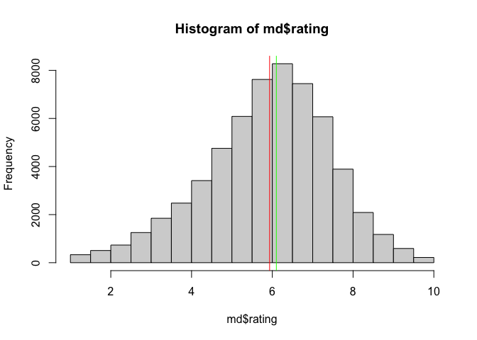
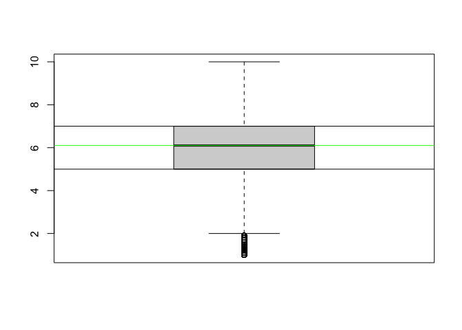
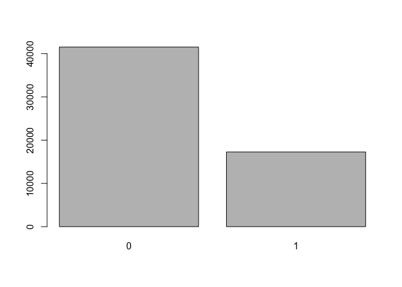
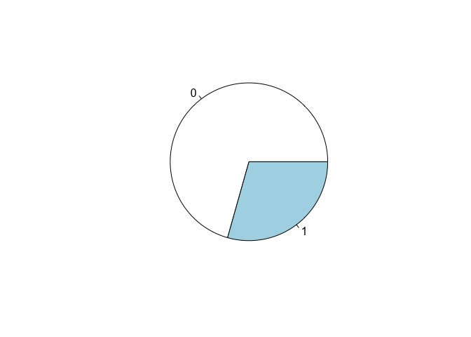
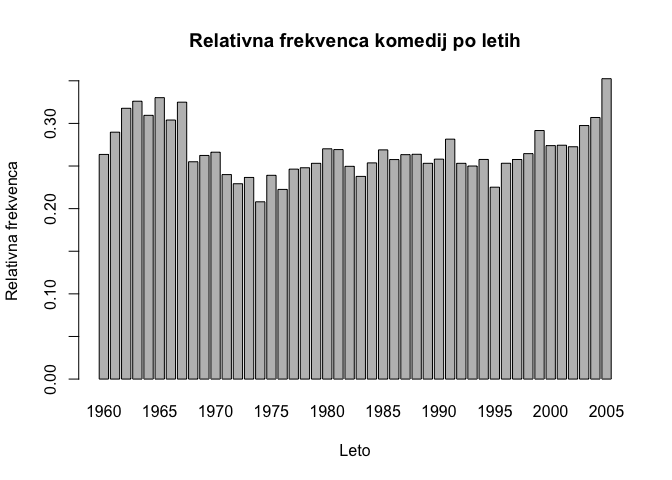
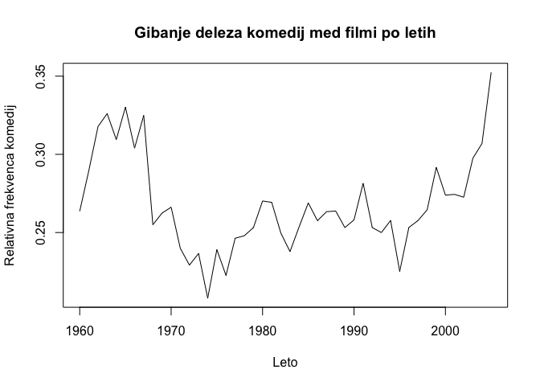
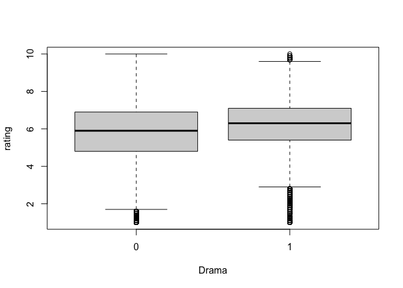
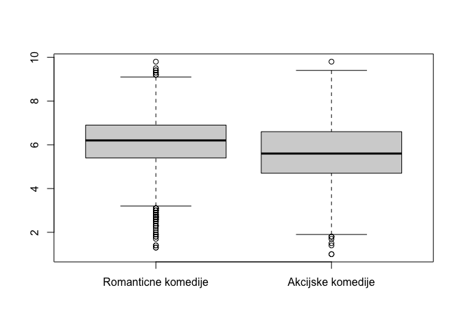
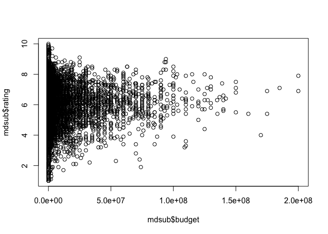
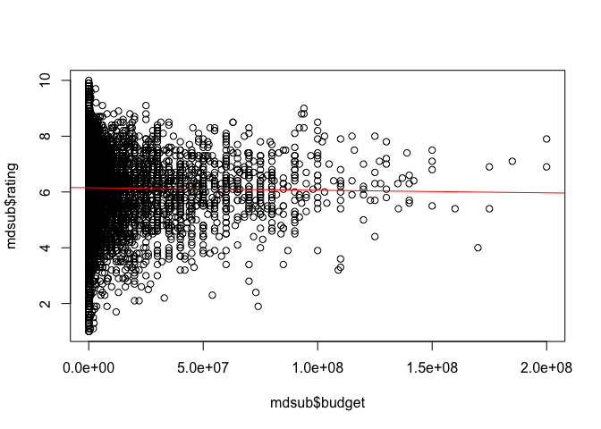

# Vizualizacija podatkov

## Priprava podatkov

Nalozimo podatke v tabelno strukturo

``` r
md <- read.table(file="./lectures/visualization/movies.txt", sep=",", header=TRUE)
```

Prvotna struktura podatkov

``` r
str(md)
```

    ## 'data.frame':    58788 obs. of  24 variables:
    ##  $ title      : chr  "$" "$1000 a Touchdown" "$21 a Day Once a Month" "$40,000" ...
    ##  $ year       : int  1971 1939 1941 1996 1975 2000 2002 2002 1987 1917 ...
    ##  $ length     : int  121 71 7 70 71 91 93 25 97 61 ...
    ##  $ budget     : int  NA NA NA NA NA NA NA NA NA NA ...
    ##  $ rating     : num  6.4 6 8.2 8.2 3.4 4.3 5.3 6.7 6.6 6 ...
    ##  $ votes      : int  348 20 5 6 17 45 200 24 18 51 ...
    ##  $ r1         : num  4.5 0 0 14.5 24.5 4.5 4.5 4.5 4.5 4.5 ...
    ##  $ r2         : num  4.5 14.5 0 0 4.5 4.5 0 4.5 4.5 0 ...
    ##  $ r3         : num  4.5 4.5 0 0 0 4.5 4.5 4.5 4.5 4.5 ...
    ##  $ r4         : num  4.5 24.5 0 0 14.5 14.5 4.5 4.5 0 4.5 ...
    ##  $ r5         : num  14.5 14.5 0 0 14.5 14.5 24.5 4.5 0 4.5 ...
    ##  $ r6         : num  24.5 14.5 24.5 0 4.5 14.5 24.5 14.5 0 44.5 ...
    ##  $ r7         : num  24.5 14.5 0 0 0 4.5 14.5 14.5 34.5 14.5 ...
    ##  $ r8         : num  14.5 4.5 44.5 0 0 4.5 4.5 14.5 14.5 4.5 ...
    ##  $ r9         : num  4.5 4.5 24.5 34.5 0 14.5 4.5 4.5 4.5 4.5 ...
    ##  $ r10        : num  4.5 14.5 24.5 45.5 24.5 14.5 14.5 14.5 24.5 4.5 ...
    ##  $ mpaa       : chr  "" "" "" "" ...
    ##  $ Action     : int  0 0 0 0 0 0 1 0 0 0 ...
    ##  $ Animation  : int  0 0 1 0 0 0 0 0 0 0 ...
    ##  $ Comedy     : int  1 1 0 1 0 0 0 0 0 0 ...
    ##  $ Drama      : int  1 0 0 0 0 1 1 0 1 0 ...
    ##  $ Documentary: int  0 0 0 0 0 0 0 1 0 0 ...
    ##  $ Romance    : int  0 0 0 0 0 0 0 0 0 0 ...
    ##  $ Short      : int  0 0 1 0 0 0 0 1 0 0 ...

Faktoriziramo (omejimo oz kategoriziramo zalogo vrednosti) za smiselne
stolpce, npr. za tiste ki imajo lahko samo vrednosti TRUE/FALSE.

``` r
for (i in 18:24)
  md[,i] <- as.factor(md[,i])
```

Zdaj bo ukaz `str(md)` vrnil drugacno (faktorizirano) strukturo objekta,
npr. stolpec “Action” ima namesto zaloge vrednosti “int”, binarno zalogo
vrednosti.

``` r
str(md)
```

    ## 'data.frame':    58788 obs. of  24 variables:
    ##  $ title      : chr  "$" "$1000 a Touchdown" "$21 a Day Once a Month" "$40,000" ...
    ##  $ year       : int  1971 1939 1941 1996 1975 2000 2002 2002 1987 1917 ...
    ##  $ length     : int  121 71 7 70 71 91 93 25 97 61 ...
    ##  $ budget     : int  NA NA NA NA NA NA NA NA NA NA ...
    ##  $ rating     : num  6.4 6 8.2 8.2 3.4 4.3 5.3 6.7 6.6 6 ...
    ##  $ votes      : int  348 20 5 6 17 45 200 24 18 51 ...
    ##  $ r1         : num  4.5 0 0 14.5 24.5 4.5 4.5 4.5 4.5 4.5 ...
    ##  $ r2         : num  4.5 14.5 0 0 4.5 4.5 0 4.5 4.5 0 ...
    ##  $ r3         : num  4.5 4.5 0 0 0 4.5 4.5 4.5 4.5 4.5 ...
    ##  $ r4         : num  4.5 24.5 0 0 14.5 14.5 4.5 4.5 0 4.5 ...
    ##  $ r5         : num  14.5 14.5 0 0 14.5 14.5 24.5 4.5 0 4.5 ...
    ##  $ r6         : num  24.5 14.5 24.5 0 4.5 14.5 24.5 14.5 0 44.5 ...
    ##  $ r7         : num  24.5 14.5 0 0 0 4.5 14.5 14.5 34.5 14.5 ...
    ##  $ r8         : num  14.5 4.5 44.5 0 0 4.5 4.5 14.5 14.5 4.5 ...
    ##  $ r9         : num  4.5 4.5 24.5 34.5 0 14.5 4.5 4.5 4.5 4.5 ...
    ##  $ r10        : num  4.5 14.5 24.5 45.5 24.5 14.5 14.5 14.5 24.5 4.5 ...
    ##  $ mpaa       : chr  "" "" "" "" ...
    ##  $ Action     : Factor w/ 2 levels "0","1": 1 1 1 1 1 1 2 1 1 1 ...
    ##  $ Animation  : Factor w/ 2 levels "0","1": 1 1 2 1 1 1 1 1 1 1 ...
    ##  $ Comedy     : Factor w/ 2 levels "0","1": 2 2 1 2 1 1 1 1 1 1 ...
    ##  $ Drama      : Factor w/ 2 levels "0","1": 2 1 1 1 1 2 2 1 2 1 ...
    ##  $ Documentary: Factor w/ 2 levels "0","1": 1 1 1 1 1 1 1 2 1 1 ...
    ##  $ Romance    : Factor w/ 2 levels "0","1": 1 1 1 1 1 1 1 1 1 1 ...
    ##  $ Short      : Factor w/ 2 levels "0","1": 1 1 2 1 1 1 1 2 1 1 ...

Poglejmo se statistiko podatkov

``` r
summary(md)
```

    ##     title                year          length            budget         
    ##  Length:58788       Min.   :1893   Min.   :   1.00   Min.   :        0  
    ##  Class :character   1st Qu.:1958   1st Qu.:  74.00   1st Qu.:   250000  
    ##  Mode  :character   Median :1983   Median :  90.00   Median :  3000000  
    ##                     Mean   :1976   Mean   :  82.34   Mean   : 13412513  
    ##                     3rd Qu.:1997   3rd Qu.: 100.00   3rd Qu.: 15000000  
    ##                     Max.   :2005   Max.   :5220.00   Max.   :200000000  
    ##                                                      NA's   :53573      
    ##      rating           votes                r1                r2        
    ##  Min.   : 1.000   Min.   :     5.0   Min.   :  0.000   Min.   : 0.000  
    ##  1st Qu.: 5.000   1st Qu.:    11.0   1st Qu.:  0.000   1st Qu.: 0.000  
    ##  Median : 6.100   Median :    30.0   Median :  4.500   Median : 4.500  
    ##  Mean   : 5.933   Mean   :   632.1   Mean   :  7.014   Mean   : 4.022  
    ##  3rd Qu.: 7.000   3rd Qu.:   112.0   3rd Qu.:  4.500   3rd Qu.: 4.500  
    ##  Max.   :10.000   Max.   :157608.0   Max.   :100.000   Max.   :84.500  
    ##                                                                        
    ##        r3               r4                r5                r6       
    ##  Min.   : 0.000   Min.   :  0.000   Min.   :  0.000   Min.   : 0.00  
    ##  1st Qu.: 0.000   1st Qu.:  0.000   1st Qu.:  4.500   1st Qu.: 4.50  
    ##  Median : 4.500   Median :  4.500   Median :  4.500   Median :14.50  
    ##  Mean   : 4.721   Mean   :  6.375   Mean   :  9.797   Mean   :13.04  
    ##  3rd Qu.: 4.500   3rd Qu.:  4.500   3rd Qu.: 14.500   3rd Qu.:14.50  
    ##  Max.   :84.500   Max.   :100.000   Max.   :100.000   Max.   :84.50  
    ##                                                                      
    ##        r7               r8               r9               r10        
    ##  Min.   :  0.00   Min.   :  0.00   Min.   :  0.000   Min.   :  0.00  
    ##  1st Qu.:  4.50   1st Qu.:  4.50   1st Qu.:  4.500   1st Qu.:  4.50  
    ##  Median : 14.50   Median : 14.50   Median :  4.500   Median : 14.50  
    ##  Mean   : 15.55   Mean   : 13.88   Mean   :  8.954   Mean   : 16.85  
    ##  3rd Qu.: 24.50   3rd Qu.: 24.50   3rd Qu.: 14.500   3rd Qu.: 24.50  
    ##  Max.   :100.00   Max.   :100.00   Max.   :100.000   Max.   :100.00  
    ##                                                                      
    ##      mpaa           Action    Animation Comedy    Drama     Documentary
    ##  Length:58788       0:54100   0:55098   0:41517   0:36977   0:55316    
    ##  Class :character   1: 4688   1: 3690   1:17271   1:21811   1: 3472    
    ##  Mode  :character                                                      
    ##                                                                        
    ##                                                                        
    ##                                                                        
    ##                                                                        
    ##  Romance   Short    
    ##  0:54044   0:49330  
    ##  1: 4744   1: 9458  
    ##                     
    ##                     
    ##                     
    ##                     
    ## 

### Vaja 1

Ali ima vecina filmov vecji ali manjsi rating od povprecja ?

Do odgovora lahko pridemo na vec nacinov:

1.  S spodnjim izrazom prestejemo koliko vrstic ima vecji rating od
    povprecja

``` r
rating_greater_than_avg <- md$rating > mean(md$rating)
# izpisimo razultat v obliki tabele
table(rating_greater_than_avg)
```

    ## rating_greater_than_avg
    ## FALSE  TRUE 
    ## 27296 31492

1.  Izrisemo histogram z vertikalnima premicama za srednjo in povprecno
    vrednost

``` r
hist(md$rating)
abline(v=mean(md$rating), col="red") # mean=5.93285
abline(v=median(md$rating), col="green") # median=6.1
```

 3.
Izrisemo skatlo z brki (boxplot)

``` r
boxplot(md$rating)
abline(h=median(md$rating), col="green")
abline(h=7.0) # vrednost prvega kvartila
abline(h=5.0) # vrednost drugega kvartila
```



#### Zakljucek

Ker je mediana vecja od povprecja, potemi da je vec kot polovico filmov
ocenjeno vec od povprecja.

### Vaja 2

Kaksen je delez komedij med vsemi filmi v nasi bazi ?

Prestejemo pojavitev vrednosti z ukazom `table()`:

``` r
delez <- table(md$Comedy)
```

Izrisemo zgornjo statistiko s pomocjo razlicnih diagramov:

``` r
barplot(delez)
```



``` r
pie(delez)
```



### Vaja 3

Koliko filmov je mlajsih od leta `1960` ?

``` r
pogoj <- md$year >= 1960 # pogoj ali selektor
tab <- table(md$Comedy[pogoj], md$year[pogoj]) # v ukaz table() lahko podamo tudi vektorja istih dimenzij
```

Koliko filmov je bilo posnetih nekega specificnega leta:

``` r
tab[,"2001"] # vseh film (0=ne komedij, 1=komedij)
```

    ##    0    1 
    ## 1539  582

``` r
tab["1","2001"] # samo komedij
```

    ## [1] 582

Prikaz relativne frekvence komedij glede na leta:

``` r
allComedies <- table(md$year[pogoj])
ratio <- tab[2,] / allComedies

barplot(ratio, xlab="Leto", ylab="Relativna frekvenca", main="Relativna frekvenca komedij po letih")
```



``` r
plot(x=names(ratio), y=as.vector(ratio), type="l", xlab="Leto", ylab="Relativna frekvenca komedij", main="Gibanje deleza komedij med filmi po letih")
```



### Vaja 4

Ali so drame v povprecju res bolje ocenjene kot ostale zvrsti ?

``` r
selDrama <- md$Drama == "1"

dramaMean <- mean(md[selDrama, "rating"])
dramaMean <- mean(md$rating[selDrama]) # ekvivalentno zgodnjemu zapisu

neDramaMean <- mean(md$rating[!selDrama])
```

``` r
# izrisi boxplot za vrednosti "rating" glede na "Drama" (iz podatkov "md")
boxplot(rating ~ Drama, data=md)
```



### Vaja 5

Ali so romanticne komedije v povprecju bolj ocenjene kot akcijske
komedije ?

``` r
selRomCom <- md$Comedy == "1" & md$Romance == "1"
selActCom <- md$Comedy == "1" & md$Action == "1"

ratingRC <- md$rating[selRomCom]
ratingAC <- md$rating[selActCom]

mean(ratingRC)
```

    ## [1] 6.09631

``` r
mean(ratingAC)
```

    ## [1] 5.567526

Poglejmo se boxplot:

``` r
boxplot(ratingRC, ratingAC, names=c("Romanticne komedije", "Akcijske komedije"))
```



### Vaja 6

Ali drzi, da pridobivajo filmi z vecjim proracunom tudi boljse ocene ?

Ugotovimo da je veliko filmov brez podatka o proracunu (`NA's` stolpec):

``` r
summary(md$budget)
```

    ##      Min.   1st Qu.    Median      Mean   3rd Qu.      Max.      NA's 
    ##         0    250000   3000000  13412513  15000000 200000000     53573

``` r
# ali je znan podatek ?
table(is.na(md$budget))
```

    ## 
    ## FALSE  TRUE 
    ##  5215 53573

V analizo bomo vzeli samo filme, ki imajo podatke o proracunu:

``` r
sel <- is.na(md$budget)
mdsub <- md[!sel,]
plot(mdsub$budget, mdsub$rating)
```



Ker korelacijski vzorec iz grafa ni jasno viden, si lahko pomagamo z
izracunom korelacije:

``` r
cor(mdsub$budget, mdsub$rating) # korelacija med atributoma max=1, min=-1
```

    ## [1] -0.01422905

``` r
cor.test(mdsub$budget, mdsub$rating) # testiramo zanesljivost korelacije
```

    ## 
    ##  Pearson's product-moment correlation
    ## 
    ## data:  mdsub$budget and mdsub$rating
    ## t = -1.0275, df = 5213, p-value = 0.3043
    ## alternative hypothesis: true correlation is not equal to 0
    ## 95 percent confidence interval:
    ##  -0.04135492  0.01291777
    ## sample estimates:
    ##         cor 
    ## -0.01422905

#### Zakljucek

Korelacija je `-0.01422`, kar pomeni da ne vidimo bistvene korelacije.
Rating filmov se z vecjimi proracuni celo malenkostno zmanjsuje (zaradi
negativnega odvoda).

``` r
linearModel <- lm(formula = rating ~ budget, data = mdsub)
plot(mdsub$budget, mdsub$rating)
abline(linearModel, col="red")
```


