# Seminarska naloga

Cilj seminarske naloge je uporabiti metode strojnega učenja za gradnjo
modelov za napovedovanje porabe električne energije (regresijski
problem) in namembnosti stavbe (klasifikacijski problem), ustrezno
ovrednotiti modele in jasno predstaviti dobljene rezultate.

## Knjiznice in orodja

Vecina uporabljenih knjiznic je ze privzeto namescenih. Potrebno pa bo
namestiti tudi nekaj zunanjih knjicnic, kot sta `ggplot2` in
`ggcorrplot` (za risanje grafov).

Vecina pomoznih metod se nahaja v zunanji R skripti `common.R`.

``` r
library(lubridate) # delo z datumi
```

    ## 
    ## Attaching package: 'lubridate'

    ## The following objects are masked from 'package:base':
    ## 
    ##     date, intersect, setdiff, union

``` r
library(stringr) # delo z znakovnimi nizi
library(ggplot2)
library(ggcorrplot)
library(rpart)
library(rpart.plot)
library(CORElearn) # za ucenje
library(nnet)
library(randomForest)
```

    ## randomForest 4.6-14

    ## Type rfNews() to see new features/changes/bug fixes.

    ## 
    ## Attaching package: 'randomForest'

    ## The following object is masked from 'package:ggplot2':
    ## 
    ##     margin

``` r
library(ipred) # bagging
library(adabag) # boosting
```

    ## Loading required package: caret

    ## Loading required package: lattice

    ## Loading required package: foreach

    ## Loading required package: doParallel

    ## Loading required package: iterators

    ## Loading required package: parallel

    ## 
    ## Attaching package: 'adabag'

    ## The following object is masked from 'package:ipred':
    ## 
    ##     bagging

``` r
source("./common.R") # pomozne metode

set.seed(0) # nastavimo random seed
```

## Vizualizacija podatkov

### Uvoz podatkov

Najprej uvozimo in na kratko preglejmo podatke.

Opazimo, da imamo 3 atribute tipa “character”: `datum`, `regija` in
`namembnost`. Atributa `regija` in `namembnost` (z indeksi `2` in `4`)
imata le majhno stevilo vrednosti, zato jih bomo faktorizirali. Datum
bomo pa kasneje preuredili v bolj smiselno obliko.

``` r
train <- read.table("trainset.txt", header=T, sep=",")
test <- read.table("testset.txt", header=T, sep=",")
allData <- rbind(test, train)

# zmanjsamo mnozici za potrebo razvoja
trainSel <- sample(1:nrow(train), as.integer(nrow(train) * 0.1), replace=T)
testSel <- sample(1:nrow(test), as.integer(nrow(test) * 0.1), replace=T)
train <- train[trainSel,]
test <- test[testSel,]

summary(train)
```

    ##     datum              regija              stavba        namembnost       
    ##  Length:2412        Length:2412        Min.   :  1.00   Length:2412       
    ##  Class :character   Class :character   1st Qu.: 39.00   Class :character  
    ##  Mode  :character   Mode  :character   Median : 77.00   Mode  :character  
    ##                                        Mean   : 87.63                     
    ##                                        3rd Qu.:135.00                     
    ##                                        Max.   :193.00                     
    ##     povrsina       leto_izgradnje   temp_zraka     temp_rosisca    
    ##  Min.   :  329.3   Min.   :1903   Min.   :-7.20   Min.   :-19.400  
    ##  1st Qu.: 4274.2   1st Qu.:1950   1st Qu.:10.00   1st Qu.: -2.800  
    ##  Median : 6735.1   Median :1970   Median :19.40   Median :  2.800  
    ##  Mean   :10907.0   Mean   :1971   Mean   :19.18   Mean   :  3.844  
    ##  3rd Qu.:14409.3   3rd Qu.:2001   3rd Qu.:28.90   3rd Qu.: 10.600  
    ##  Max.   :79000.4   Max.   :2017   Max.   :41.70   Max.   : 25.000  
    ##    oblacnost        padavine          pritisk         smer_vetra   
    ##  Min.   :0.000   Min.   :-1.0000   Min.   : 997.2   Min.   :  0.0  
    ##  1st Qu.:2.000   1st Qu.: 0.0000   1st Qu.:1011.9   1st Qu.: 70.0  
    ##  Median :4.000   Median : 0.0000   Median :1015.9   Median :140.0  
    ##  Mean   :3.676   Mean   : 0.3922   Mean   :1017.2   Mean   :153.8  
    ##  3rd Qu.:6.000   3rd Qu.: 0.0000   3rd Qu.:1022.2   3rd Qu.:240.0  
    ##  Max.   :9.000   Max.   :56.0000   Max.   :1040.9   Max.   :360.0  
    ##  hitrost_vetra        poraba      
    ##  Min.   : 0.000   Min.   :   0.0  
    ##  1st Qu.: 2.100   1st Qu.:  54.5  
    ##  Median : 3.600   Median : 110.0  
    ##  Mean   : 3.746   Mean   : 224.2  
    ##  3rd Qu.: 5.100   3rd Qu.: 211.6  
    ##  Max.   :12.400   Max.   :2683.3

``` r
train <- Factorize(train)
test <- Factorize(test)

summary(train)
```

    ##      datum                regija         stavba      
    ##  Min.   :2016-01-01   vzhodna:1118   Min.   :  1.00  
    ##  1st Qu.:2016-03-08   zahodna:1294   1st Qu.: 39.00  
    ##  Median :2016-07-09                  Median : 77.00  
    ##  Mean   :2016-07-02                  Mean   : 87.63  
    ##  3rd Qu.:2016-10-25                  3rd Qu.:135.00  
    ##  Max.   :2016-12-31                  Max.   :193.00  
    ##                 namembnost      povrsina       leto_izgradnje   temp_zraka   
    ##  izobrazevalna       :1359   Min.   :  329.3   Min.   :1903   Min.   :-7.20  
    ##  javno_storitvena    : 282   1st Qu.: 4274.2   1st Qu.:1950   1st Qu.:10.00  
    ##  kulturno_razvedrilna: 298   Median : 6735.1   Median :1970   Median :19.40  
    ##  poslovna            : 316   Mean   :10907.0   Mean   :1971   Mean   :19.18  
    ##  stanovanjska        : 157   3rd Qu.:14409.3   3rd Qu.:2001   3rd Qu.:28.90  
    ##                              Max.   :79000.4   Max.   :2017   Max.   :41.70  
    ##   temp_rosisca       oblacnost        padavine          pritisk      
    ##  Min.   :-19.400   Min.   :0.000   Min.   :-1.0000   Min.   : 997.2  
    ##  1st Qu.: -2.800   1st Qu.:2.000   1st Qu.: 0.0000   1st Qu.:1011.9  
    ##  Median :  2.800   Median :4.000   Median : 0.0000   Median :1015.9  
    ##  Mean   :  3.844   Mean   :3.676   Mean   : 0.3922   Mean   :1017.2  
    ##  3rd Qu.: 10.600   3rd Qu.:6.000   3rd Qu.: 0.0000   3rd Qu.:1022.2  
    ##  Max.   : 25.000   Max.   :9.000   Max.   :56.0000   Max.   :1040.9  
    ##    smer_vetra    hitrost_vetra        poraba      
    ##  Min.   :  0.0   Min.   : 0.000   Min.   :   0.0  
    ##  1st Qu.: 70.0   1st Qu.: 2.100   1st Qu.:  54.5  
    ##  Median :140.0   Median : 3.600   Median : 110.0  
    ##  Mean   :153.8   Mean   : 3.746   Mean   : 224.2  
    ##  3rd Qu.:240.0   3rd Qu.: 5.100   3rd Qu.: 211.6  
    ##  Max.   :360.0   Max.   :12.400   Max.   :2683.3

### Izris grafov

#### Porazdelitvene vrednosti

Vizualizirajmo porazdelitvene vrednosti posameznih atributov, da dobimo
boljsi vpogled v vsak atribut posebej.

``` r
pie(table(allData$namembnost), xlab="Namembnost")
```


``` r
hist(allData$povrsina, xlab="Povrsina (m^2)", main="Histogram povrsine stavb")
```


``` r
hist(allData$poraba, xlab="Poraba (kWh)", main="Histogram porabe stavb")
```

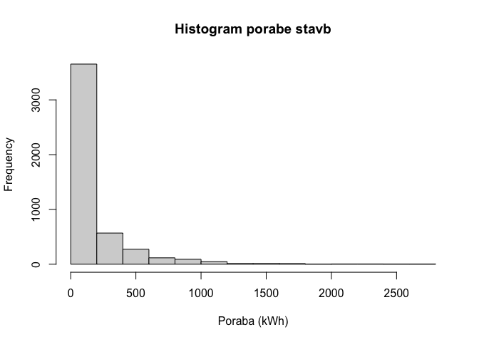

``` r
hist(allData$leto_izgradnje, xlab="Leto izgradnje", main="Histogram leta izgradnje stavb")
```

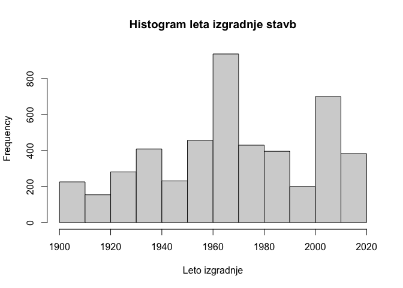

``` r
hist(allData$temp_zraka, xlab="Temperatura zraka (°C)", main="Histogram temperature zraka")
```


``` r
hist(allData$temp_rosisca, xlab="Temperatura rosisca (°C)", main="Histogram temperature rosisca")
```


``` r
hist(allData$oblacnost, xlab="Oblacnost", main="Histogram stopnje pokritosti neba z oblaki")
```


``` r
hist(allData$padavine, xlab="Padavine (mm)", main="Histogram kolicine padavin")
```


``` r
hist(allData$pritisk, xlab="Pritisk (mbar)", main="Histogram zracnega pritiska")
```

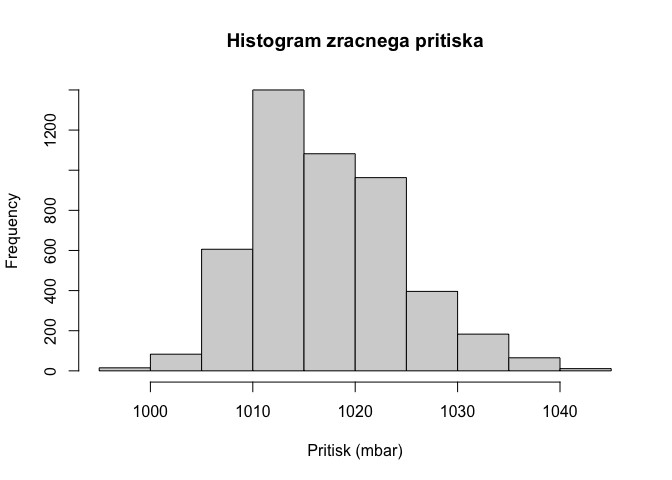

``` r
hist(allData$smer_vetra, xlab="Smer vetra (°)", main="Histogram smeri vetra")
```


``` r
hist(allData$hitrost_vetra, xlab="Hitrost vetra (m/s)", main="Histogram hitrosti vetra")
```

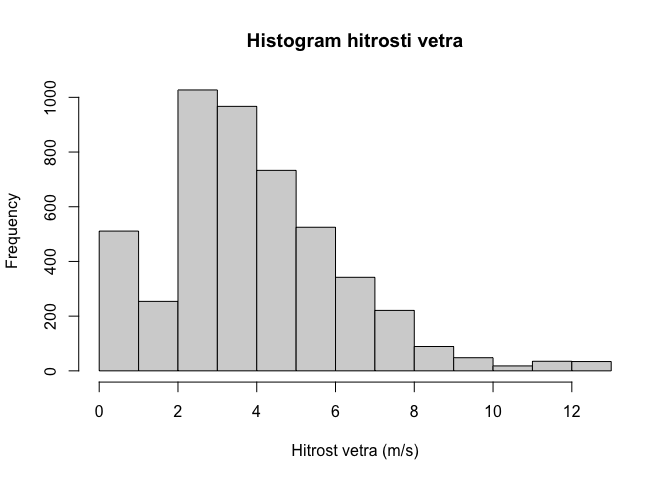

#### Namembnost in regija

*Ugotovitve:* - priblizno polovica stavb sluzi izobrazevalnemu namenu -
stavb z zahodno lego je malo vec kot stavb z zahodno lego - stavbe z
vzhodno lego imajo za skoraj 13% vec stavb za izobrazevalne namene kot
stavbe z zahodno lego

``` r
CalcEducationalPercentage <- function(regija)
{
  filtered <- allData[allData$regija == regija,]
  nrow(filtered[filtered$namembnost == "izobrazevalna",]) / nrow(filtered)
}
p <- ggplot(allData, aes(regija))
p + geom_bar(aes(fill=namembnost), width = 0.5)
```


``` r
paste("Odstotek izobrazevalnih stavb z vzhodno regijo", CalcEducationalPercentage("vzhodna"))
```

    ## [1] "Odstotek izobrazevalnih stavb z vzhodno regijo 0.577881828316611"

``` r
paste("Odstotek izobrazevalnih stavb z zahodno regijo", CalcEducationalPercentage("zahodna"))
```

    ## [1] "Odstotek izobrazevalnih stavb z zahodno regijo 0.452380952380952"

#### Soodvisnost atributov

Pri nadalnji predikciji nam bo koristilo tudi nekaj intuicije o
soodvisnosti med doloceni atributi.

Ze samo po sebi je logicno, da bodo nekateri atributi (npr. povrsina
train \<-> poraba energije) v vecji medsebojni odvisnosti, kot nekateri
drugi atributi (npr. smer vetra \<-> poraba energije);

Naso hipotezo lahko dodatno potrdimo z nekaj grafi, kjer prikazemo
korelacijo med izbranimi pari atributov.

Pri porabi elektricne energije v odvisnosti z povrsino train vidimo, da
obstaja jasen pozitiven trend.

``` r
x <- train$povrsina
y <- train$poraba
plot(x, y, col="lightblue")
abline(lm(y ~ x), col = "red", lwd = 3)
```


Medtem ko pri grafu porabe energije v odvisnosti od smeri vetra jasne
korelacije ni.

``` r
x <- train$smer_vetra
y <- train$poraba
plot(x, y, col="lightblue")
abline(lm(y ~ x), col = "red", lwd = 3)
```


Najboljse bi bilo primerjati vse (numericne) atribute z vsemi drugimi
atributi, ter prikazati medsebojne odvisnosti, tako bi pridobili visoko
nivojski pogled na odvisnosti med atributi.

Za to vrstno vizualizacijo bomo uporabili dve zunanji knjiznici
`ggplot2` in `ggcorrplot`, ki jih moramo prenesti in namestiti.

Ta graf nam izpise korelacijsko matriko, iz katere lahko razberemo
korelacije med vsemi numericni atributi. Opazimo, da sta v najvecji
medsebojni korelaciji res atributa `poraba` in `povrsina`.

``` r
data(train, package="mosaicData")
```

    ## Warning in data(train, package = "mosaicData"): data set 'train' not found

``` r
# izberemo samo numericne atribute
df <- dplyr::select_if(train, is.numeric)

# izracunamo korelacije z metodo cor
r <- cor(df, use="complete.obs")
round(r,2)
```

    ##                stavba povrsina leto_izgradnje temp_zraka temp_rosisca oblacnost
    ## stavba           1.00     0.16          -0.22      -0.53         0.00      0.15
    ## povrsina         0.16     1.00           0.11      -0.11        -0.01      0.05
    ## leto_izgradnje  -0.22     0.11           1.00       0.14        -0.02      0.00
    ## temp_zraka      -0.53    -0.11           0.14       1.00         0.61     -0.26
    ## temp_rosisca     0.00    -0.01          -0.02       0.61         1.00      0.07
    ## oblacnost        0.15     0.05           0.00      -0.26         0.07      1.00
    ## padavine         0.10    -0.01          -0.02      -0.08         0.06      0.17
    ## pritisk          0.41     0.04          -0.12      -0.56        -0.31     -0.05
    ## smer_vetra       0.26     0.06          -0.05      -0.26        -0.13      0.06
    ## hitrost_vetra    0.18     0.04          -0.03      -0.22        -0.17      0.08
    ## poraba           0.13     0.83           0.15      -0.05         0.04      0.03
    ##                padavine pritisk smer_vetra hitrost_vetra poraba
    ## stavba             0.10    0.41       0.26          0.18   0.13
    ## povrsina          -0.01    0.04       0.06          0.04   0.83
    ## leto_izgradnje    -0.02   -0.12      -0.05         -0.03   0.15
    ## temp_zraka        -0.08   -0.56      -0.26         -0.22  -0.05
    ## temp_rosisca       0.06   -0.31      -0.13         -0.17   0.04
    ## oblacnost          0.17   -0.05       0.06          0.08   0.03
    ## padavine           1.00   -0.15       0.03         -0.01   0.00
    ## pritisk           -0.15    1.00      -0.03         -0.03   0.01
    ## smer_vetra         0.03   -0.03       1.00          0.54   0.05
    ## hitrost_vetra     -0.01   -0.03       0.54          1.00   0.04
    ## poraba             0.00    0.01       0.05          0.04   1.00

``` r
ggcorrplot(r,
           hc.order=T, # uredi po korelaciji
           type="lower") # prikazi samo v spodnjem trikotniku
```

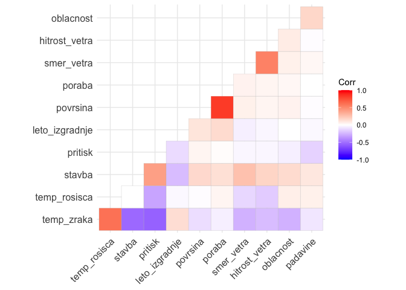

## Priprava atributov

### Pomozne metode

Sedaj bomo poskusali izboljsati kvaliteto posameznih atributov. Pri tem
bomo uporabili nekaj pomoznih metod za evaluacijo.

Metoda `evalClassFeatures` bo evaluirala podatke z dano formulo z vsemi
definiranimi ocenami za klasifikacijske probleme. Prav tako bo metoda
`evalRegrFeatures` evaluirala atribute z definiranimi ocenami za
regresijske probleme.

``` r
evalFeatures <- function (formula, data, estimators)
{
  for (estimator in estimators) {
    score = attrEval(formula, data, estimator);
    
    cat(paste(estimator, "\n"))
    print(sort(score, decreasing=T))
    cat("\n\n")
  }
}

evalClassFeatures <- function (formula, data)
{
  shortSighted <- list("InfGain", "GainRatio", "Gini", "MDL")
  nonShortSighted <- list("Relief", "ReliefFequalK", "ReliefFexpRank")
  estimators <- c(shortSighted, nonShortSighted)
  evalFeatures(formula, data, estimators)
}

evalRegrFeatures <- function (formula, data)
{
  estimators <- list("MSEofMean", "RReliefFexpRank")
  evalFeatures(formula, data, estimators)
}
```

### Izboljsava mnozice atributov

Poskusimo izboljsati prvotno podatkovno mnozico z dodajanjem /
odstranjevanjem atributov. Namen je najti cim manjso mnozico atributov
ki maksimizira kvaliteto modela.

``` r
# atributi za klasifikacijski problem
classSetBase <- list(train=train, test=test)
classSetExt <- list(train=train, test=test)

ExtendClassSet <- function (set)
{
  set$oblacnost <- log1p(set$oblacnost)
  set$poraba <- log1p(set$poraba)
  set$povrsina <- log1p(set$povrsina)
  set$datum <- NULL
  set
}

classSetExt$train <- ExtendClassSet(classSetExt$train)
classSetExt$test <- ExtendClassSet(classSetExt$test)

# atributi za regresijski problem
regSetBase <- list(train=train, test=test)
regSetExt <- list(train=train, test=test)

ExtendRegSet <- function (set)
{
  set$letni_cas <- as.factor(ToSeason(set$datum))
  set$mesec <- as.factor(ToMonth(set$datum))
  set$zima <- as.factor(IsWinter(set$datum))
  set$vikend <- as.factor(IsWeekend(set$datum))
  set$pritisk <- log1p(set$pritisk)
  set$hitrost_vetra <- log1p(set$hitrost_vetra)
  
  set$datum <- NULL
  set$stavba <- NULL
  set$temp_rosisca <- NULL
  set$padavine <- NULL
  set$smer_vetra <- NULL
  
  set$namembnost <- NULL
  set$temp_zraka <- NULL
  
  set$oblacnost <- log1p(set$oblacnost)
  set$poraba <- log1p(set$poraba)
  set$povrsina <- log1p(set$povrsina)
  
  set
}

regSetExt$train <- ExtendRegSet(regSetExt$train)
regSetExt$test <- ExtendRegSet(regSetExt$test)
```

### Evalvacija atributov

Poglejmo si vse ocene za prvotni mnozici atributov:

``` r
evalClassFeatures(namembnost ~ ., classSetBase$train)
```

    ## InfGain 
    ##       povrsina         regija         stavba leto_izgradnje     temp_zraka 
    ##    0.250101491    0.190977025    0.190977025    0.162119934    0.057770952 
    ##         poraba        pritisk     smer_vetra      oblacnost   temp_rosisca 
    ##    0.055103230    0.036248185    0.035262339    0.016920944    0.008302622 
    ##       padavine  hitrost_vetra          datum 
    ##    0.008242992    0.007069367    0.006675803 
    ## 
    ## 
    ## GainRatio 
    ##         stavba       povrsina         poraba         regija leto_izgradnje 
    ##     0.38984167     0.36987727     0.34551681     0.19171400     0.16259839 
    ##   temp_rosisca        pritisk     temp_zraka  hitrost_vetra       padavine 
    ##     0.09561334     0.08004080     0.07467698     0.07173461     0.06723994 
    ##          datum     smer_vetra      oblacnost 
    ##     0.06017320     0.03583389     0.03192463 
    ## 
    ## 
    ## Gini 
    ##       povrsina leto_izgradnje         regija         stavba         poraba 
    ##    0.074979035    0.046192178    0.028507919    0.028507919    0.019063586 
    ##     temp_zraka        pritisk     smer_vetra      oblacnost          datum 
    ##    0.009468243    0.007142769    0.005958509    0.003026184    0.001867707 
    ##  hitrost_vetra   temp_rosisca       padavine 
    ##    0.001713742    0.001514270    0.001168672 
    ## 
    ## 
    ## MDL 
    ##       povrsina         regija         stavba leto_izgradnje     temp_zraka 
    ##    0.242232153    0.182346126    0.182346126    0.155104530    0.050977478 
    ##         poraba        pritisk     smer_vetra      oblacnost   temp_rosisca 
    ##    0.048718048    0.029652532    0.028674621    0.011039282    0.003219395 
    ##       padavine          datum  hitrost_vetra 
    ##    0.003206210    0.002645080    0.001615114 
    ## 
    ## 
    ## Relief 
    ## leto_izgradnje         stavba       povrsina         poraba         regija 
    ##   0.3391643149   0.2109360604   0.2093195908   0.1433817086   0.0008291874 
    ##       padavine     temp_zraka      oblacnost        pritisk   temp_rosisca 
    ##  -0.0009552627  -0.0693258882  -0.0737976783  -0.0824222392  -0.0835101270 
    ##          datum  hitrost_vetra     smer_vetra 
    ##  -0.0840583990  -0.1075870647  -0.1216141515 
    ## 
    ## 
    ## ReliefFequalK 
    ## leto_izgradnje         stavba       povrsina         regija         poraba 
    ##   0.3748615641   0.3417402901   0.2220847867   0.1771195457   0.1239372049 
    ##     temp_zraka     smer_vetra        pritisk          datum   temp_rosisca 
    ##   0.0619396491   0.0467935444   0.0355393489   0.0239461498   0.0205776214 
    ##      oblacnost  hitrost_vetra       padavine 
    ##   0.0162916729   0.0072822804   0.0007959659 
    ## 
    ## 
    ## ReliefFexpRank 
    ## leto_izgradnje         stavba       povrsina         regija         poraba 
    ##   0.3594335021   0.3329030457   0.2105280298   0.2029986303   0.1138472395 
    ##     temp_zraka     smer_vetra        pritisk          datum   temp_rosisca 
    ##   0.0610981372   0.0302705419   0.0276094367   0.0181816406   0.0170283848 
    ##      oblacnost       padavine  hitrost_vetra 
    ##   0.0100941989  -0.0004917695  -0.0062426174

``` r
evalRegrFeatures(poraba ~ ., regSetBase$train)
```

    ## MSEofMean 
    ##       povrsina leto_izgradnje         stavba     namembnost         regija 
    ##      -50576.57      -95339.86      -98047.76     -101243.82     -101924.27 
    ##   temp_rosisca     temp_zraka      oblacnost          datum     smer_vetra 
    ##     -102319.77     -102331.27     -102339.53     -102653.93     -103055.20 
    ##        pritisk  hitrost_vetra       padavine 
    ##     -103086.97     -103121.73     -103231.44 
    ## 
    ## 
    ## RReliefFexpRank 
    ##       povrsina leto_izgradnje     namembnost         stavba       padavine 
    ##   0.4413738717   0.1890857951   0.1254954539   0.1065823219   0.0013918771 
    ##         regija        pritisk     temp_zraka      oblacnost   temp_rosisca 
    ##  -0.0001330178  -0.0835504967  -0.0873438431  -0.0880498899  -0.1008200969 
    ##  hitrost_vetra          datum     smer_vetra 
    ##  -0.1086545339  -0.1188974223  -0.1253054663

Ponovno evaluiramo atribute za popravljeni mnozici atributov:

``` r
evalClassFeatures(namembnost ~ ., classSetExt$train)
```

    ## InfGain 
    ##       povrsina         regija         stavba leto_izgradnje     temp_zraka 
    ##    0.250101491    0.190977025    0.190977025    0.162119934    0.057770952 
    ##         poraba        pritisk     smer_vetra      oblacnost   temp_rosisca 
    ##    0.055103230    0.036248185    0.035262339    0.016920944    0.008302622 
    ##       padavine  hitrost_vetra 
    ##    0.008242992    0.007069367 
    ## 
    ## 
    ## GainRatio 
    ##         stavba       povrsina         poraba         regija leto_izgradnje 
    ##     0.38984167     0.36987727     0.34551681     0.19171400     0.16259839 
    ##   temp_rosisca        pritisk     temp_zraka  hitrost_vetra       padavine 
    ##     0.09561334     0.08004080     0.07467698     0.07173461     0.06723994 
    ##     smer_vetra      oblacnost 
    ##     0.03583389     0.03192463 
    ## 
    ## 
    ## Gini 
    ##       povrsina leto_izgradnje         regija         stavba         poraba 
    ##    0.074979035    0.046192178    0.028507919    0.028507919    0.019063586 
    ##     temp_zraka        pritisk     smer_vetra      oblacnost  hitrost_vetra 
    ##    0.009468243    0.007142769    0.005958509    0.003026184    0.001713742 
    ##   temp_rosisca       padavine 
    ##    0.001514270    0.001168672 
    ## 
    ## 
    ## MDL 
    ##       povrsina         regija         stavba leto_izgradnje     temp_zraka 
    ##    0.242232153    0.182346126    0.182346126    0.155104530    0.050977478 
    ##         poraba        pritisk     smer_vetra      oblacnost   temp_rosisca 
    ##    0.048718048    0.029652532    0.028674621    0.011039282    0.003219395 
    ##       padavine  hitrost_vetra 
    ##    0.003206210    0.001615114 
    ## 
    ## 
    ## Relief 
    ## leto_izgradnje       povrsina         stavba         poraba         regija 
    ##    0.464638309    0.418794058    0.330566496    0.304080488    0.002487562 
    ##       padavine        pritisk      oblacnost     temp_zraka   temp_rosisca 
    ##   -0.004744795   -0.117071963   -0.117369800   -0.120678701   -0.138032933 
    ##  hitrost_vetra     smer_vetra 
    ##   -0.140582928   -0.164532277 
    ## 
    ## 
    ## ReliefFequalK 
    ## leto_izgradnje         stavba       povrsina         poraba         regija 
    ##   0.4752112064   0.4313454768   0.4216174488   0.2715857680   0.1655832174 
    ##     temp_zraka       padavine        pritisk     smer_vetra   temp_rosisca 
    ##   0.0119328704   0.0010015730  -0.0004986693  -0.0035302509  -0.0202235950 
    ##      oblacnost  hitrost_vetra 
    ##  -0.0249773120  -0.0339796996 
    ## 
    ## 
    ## ReliefFexpRank 
    ## leto_izgradnje         stavba       povrsina         poraba         regija 
    ##    0.446276723    0.412888415    0.403565235    0.253276937    0.189818904 
    ##     temp_zraka       padavine        pritisk     smer_vetra   temp_rosisca 
    ##    0.010362965   -0.001088266   -0.006924251   -0.008219028   -0.018061265 
    ##      oblacnost  hitrost_vetra 
    ##   -0.024973839   -0.043946605

``` r
evalRegrFeatures(poraba ~ ., regSetExt$train)
```

    ## MSEofMean 
    ##       povrsina leto_izgradnje          mesec      letni_cas         regija 
    ##     -0.9014081     -1.3289248     -1.4152002     -1.4253287     -1.4302387 
    ##  hitrost_vetra      oblacnost        pritisk           zima         vikend 
    ##     -1.4328816     -1.4329784     -1.4335648     -1.4350186     -1.4357428 
    ## 
    ## 
    ## RReliefFexpRank 
    ##       povrsina leto_izgradnje         regija           zima      letni_cas 
    ##    0.334633512    0.160609243    0.009354531   -0.002923525   -0.024754519 
    ##         vikend        pritisk      oblacnost          mesec  hitrost_vetra 
    ##   -0.037839612   -0.064911551   -0.088202775   -0.095756261   -0.101081968

## Modeliranje

### Klasifikacija

#### Vecinski klasifikator

Vecinski klasifikator uvrsti vsak primer v razred ki se najveckrat
pojavi. Ta klasifikator bo predstavljal spodnjo mejo kvalitete ucnih
modelov.

``` r
# najveckrat se ponovi "izobrazevalna" namembnost
sum(test$namembnost == "izobrazevalna") / length(test$namembnost)
```

    ## [1] 0.4824415

#### Odlocitveno drevo

``` r
# osnovna mnozica atributov
dtBase <- rpart(namembnost ~ pritisk, data=classSetBase$train)
EvaluateClassModel(dtBase, classSetBase$train, classSetBase$test)
```

    ## [1] "Brier score: 0.710537640877757"
    ## [1] "Classification accuracy: 0.482441471571906"
    ## [1] "Information score: 0"

``` r
# popravljena mnozica atributov
dtExt <- rpart(namembnost ~ ., data=classSetExt$train)
EvaluateClassModel(dtExt, classSetExt$train, classSetExt$test)
```

    ## [1] "Brier score: 0.950634076175541"
    ## [1] "Classification accuracy: 0.519648829431438"
    ## [1] "Information score: 0.58246480113884"

#### Odlocitveno drevo z rezanjem

Izberemo vrednost parametra cp, ki ustreza minimalni napaki internega
presnega preverjanja.

``` r
dtBase <- rpart(namembnost ~ ., data=classSetBase$train, cp=0)
cpTab <- printcp(dtBase)
```

    ## 
    ## Classification tree:
    ## rpart(formula = namembnost ~ ., data = classSetBase$train, cp = 0)
    ## 
    ## Variables actually used in tree construction:
    ## [1] leto_izgradnje poraba         povrsina       regija         stavba        
    ## 
    ## Root node error: 1053/2412 = 0.43657
    ## 
    ## n= 2412 
    ## 
    ##          CP nsplit rel error   xerror      xstd
    ## 1  0.104463      0  1.000000 1.000000 0.0231317
    ## 2  0.093067      1  0.895537 0.889839 0.0227326
    ## 3  0.063628      2  0.802469 0.802469 0.0222508
    ## 4  0.039411      3  0.738841 0.754036 0.0219171
    ## 5  0.037037      5  0.660019 0.515670 0.0194799
    ## 6  0.036087      6  0.622982 0.474834 0.0189065
    ## 7  0.032605      7  0.586895 0.427350 0.0181693
    ## 8  0.025641     14  0.301994 0.334283 0.0164660
    ## 9  0.024691     15  0.276353 0.297246 0.0156733
    ## 10 0.018044     16  0.251662 0.254511 0.0146576
    ## 11 0.017569     17  0.233618 0.169991 0.0122251
    ## 12 0.017094     22  0.116809 0.163343 0.0120025
    ## 13 0.012979     23  0.099715 0.105413 0.0097724
    ## 14 0.011871     27  0.045584 0.075024 0.0083014
    ## 15 0.008547     29  0.021842 0.036087 0.0058078
    ## 16 0.000000     30  0.013295 0.011396 0.0032816

``` r
row <- which.min(cpTab[,"xerror"])
th <- mean(c(cpTab[row, "CP"], cpTab[row-1, "CP"]))
dtBase <- prune(dtBase, cp=th)
EvaluateClassModel(dtBase, classSetBase$train, classSetBase$test)
```

    ## [1] "Brier score: 0.957759819795006"
    ## [1] "Classification accuracy: 0.519648829431438"
    ## [1] "Information score: 0.583020764473835"

``` r
dtExt <- rpart(namembnost ~ ., data=classSetExt$train, cp=0)
cpTab <- printcp(dtExt)
```

    ## 
    ## Classification tree:
    ## rpart(formula = namembnost ~ ., data = classSetExt$train, cp = 0)
    ## 
    ## Variables actually used in tree construction:
    ## [1] leto_izgradnje poraba         povrsina       regija         stavba        
    ## 
    ## Root node error: 1053/2412 = 0.43657
    ## 
    ## n= 2412 
    ## 
    ##          CP nsplit rel error   xerror      xstd
    ## 1  0.104463      0  1.000000 1.000000 0.0231317
    ## 2  0.093067      1  0.895537 0.884141 0.0227057
    ## 3  0.063628      2  0.802469 0.806268 0.0222749
    ## 4  0.039411      3  0.738841 0.747388 0.0218674
    ## 5  0.037037      5  0.660019 0.547009 0.0198852
    ## 6  0.036087      6  0.622982 0.520418 0.0195432
    ## 7  0.032605      7  0.586895 0.473884 0.0188926
    ## 8  0.025641     14  0.301994 0.342830 0.0166387
    ## 9  0.024691     15  0.276353 0.306743 0.0158838
    ## 10 0.018044     16  0.251662 0.272555 0.0151009
    ## 11 0.017569     17  0.233618 0.190883 0.0128907
    ## 12 0.017094     22  0.116809 0.152896 0.0116408
    ## 13 0.012979     23  0.099715 0.105413 0.0097724
    ## 14 0.011871     27  0.045584 0.048433 0.0067099
    ## 15 0.008547     29  0.021842 0.031339 0.0054180
    ## 16 0.000000     30  0.013295 0.017094 0.0040140

``` r
row <- which.min(cpTab[,"xerror"])
th <- mean(c(cpTab[row, "CP"], cpTab[row-1, "CP"]))
dtExt <- prune(dtExt, cp=th)
EvaluateClassModel(dtExt, classSetExt$train, classSetExt$test)
```

    ## [1] "Brier score: 0.957759819795006"
    ## [1] "Classification accuracy: 0.519648829431438"
    ## [1] "Information score: 0.583020764473835"

#### Naivni Bayes

``` r
nbBase <- CoreModel(namembnost ~ ., data=classSetBase$train, model="bayes")
EvaluateClassModel(nbBase, classSetBase$train, classSetBase$test)
```

    ## [1] "Brier score: 0.790209760992438"
    ## [1] "Classification accuracy: 0.42433110367893"
    ## [1] "Information score: 0.451920418933791"

``` r
nbExt <- CoreModel(namembnost ~ ., data=classSetExt$train, model="bayes")
EvaluateClassModel(nbExt, classSetExt$train, classSetExt$test)
```

    ## [1] "Brier score: 0.785229865345594"
    ## [1] "Classification accuracy: 0.427675585284281"
    ## [1] "Information score: 0.457855777660092"

#### K-bliznjih sosedov

``` r
knnBase <- CoreModel(namembnost ~ ., data=classSetBase$train, model="knn", kInNN=5)
EvaluateClassModel(knnBase, classSetBase$train, classSetBase$test)
```

    ## [1] "Brier score: 0.789866220735777"
    ## [1] "Classification accuracy: 0.442307692307692"
    ## [1] "Information score: 0.365209513261892"

``` r
knnExt <- CoreModel(namembnost ~ ., data=classSetExt$train, model="knn", kInNN=5)
EvaluateClassModel(knnExt, classSetExt$train, classSetExt$test)
```

    ## [1] "Brier score: 0.761003344481592"
    ## [1] "Classification accuracy: 0.48494983277592"
    ## [1] "Information score: 0.456475810952357"

#### Nakljucni gozd

``` r
rfBase <- randomForest(namembnost ~ ., data=classSetBase$train)
EvaluateClassModel(rfBase, classSetBase$train, classSetBase$test)
```

    ## [1] "Brier score: 0.656205588628747"
    ## [1] "Classification accuracy: 0.565635451505017"
    ## [1] "Information score: 0.6030941254262"

``` r
rfExt <- randomForest(namembnost ~ ., data=classSetExt$train)
EvaluateClassModel(rfExt, classSetExt$train, classSetExt$test)
```

    ## [1] "Brier score: 0.652024361203998"
    ## [1] "Classification accuracy: 0.56814381270903"
    ## [1] "Information score: 0.620822906335984"

### Regresija

#### Trivialni model

Trivialni model vedno vraca povprecno vrednost ciljne spremenljivke,
glede na vse ucne primere. Ta model bo predstavljal spodnjo mejo
kvalitete ucnih modelov.

``` r
meanValue <- mean(regSetBase$train$poraba)
predicted <- rep(meanValue, nrow(regSetBase$test))
observed <- regSetBase$test$poraba

EvaluateTrivialRegModel(observed, predicted)
```

    ## [1] "Srednja absolutna napaka: 156.129714419125"
    ## [1] "Srednja kvadratna napaka: 43242.2118842803"
    ## [1] "Relativna srednja absolutna napaka: 1"
    ## [1] "Relativna srednja kvadratna napaka: 1"

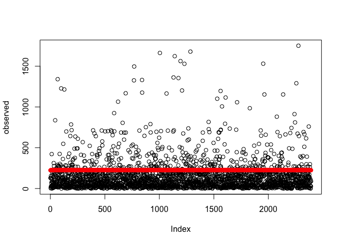

#### Linearna regresija

``` r
# osnovna mnozica atributov
lmBase <- lm(poraba ~ povrsina + leto_izgradnje, regSetBase$train)
EvaluateRegBaseModel(lmBase, regSetBase$train, regSetBase$test)
```

    ## [1] "Srednja absolutna napaka: 107.298030128528"
    ## [1] "Srednja kvadratna napaka: 47465.6068612006"
    ## [1] "Relativna srednja absolutna napaka: 0.687236446487628"
    ## [1] "Relativna srednja kvadratna napaka: 1.09766833824834"

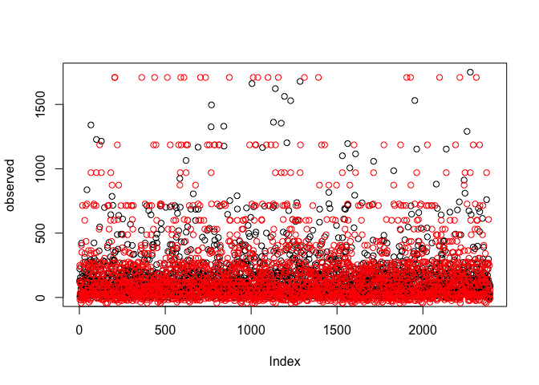

``` r
# popravljena mnozica atributov
lmExt <- lm(poraba ~ ., regSetExt$train)
EvaluateRegExtModel(lmExt, regSetExt$train, regSetExt$test)
```

    ## Warning in predict.lm(model, test): prediction from a rank-deficient fit may be
    ## misleading

    ## [1] "Srednja absolutna napaka: 74.0012295363632"
    ## [1] "Srednja kvadratna napaka: 19916.7077316699"
    ## [1] "Relativna srednja absolutna napaka: 0.495351783374952"
    ## [1] "Relativna srednja kvadratna napaka: 0.328755734403337"


#### Regresijsko drevo

``` r
# osnovna mnozica atributov
baseModel <- rpart(poraba ~ ., data=regSetBase$train)
EvaluateRegBaseModel(baseModel, regSetBase$train, regSetBase$test)
```

    ## [1] "Srednja absolutna napaka: 131.411079679798"
    ## [1] "Srednja kvadratna napaka: 90642.5989139421"
    ## [1] "Relativna srednja absolutna napaka: 0.841678857664654"
    ## [1] "Relativna srednja kvadratna napaka: 2.09616009367211"

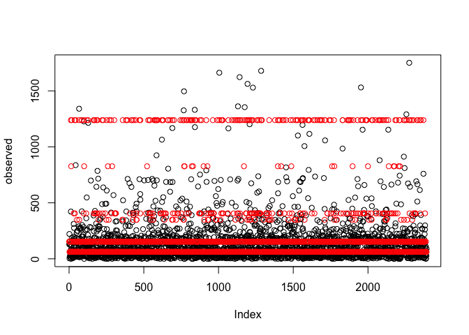

``` r
# popravljena mnozica atributov
extModel <- rpart(poraba ~ ., data=regSetExt$train)
EvaluateRegExtModel(extModel, regSetExt$train, regSetExt$test)
```

    ## [1] "Srednja absolutna napaka: 97.6424658945491"
    ## [1] "Srednja kvadratna napaka: 31421.5743820927"
    ## [1] "Relativna srednja absolutna napaka: 0.653602243057674"
    ## [1] "Relativna srednja kvadratna napaka: 0.518661161335819"


#### Nakljucni gozd

``` r
# osnovna mnozica atributov
baseModel <- randomForest(poraba ~ ., data=regSetBase$train)
EvaluateRegBaseModel(baseModel, regSetBase$train, regSetBase$test)
```

    ## [1] "Srednja absolutna napaka: 96.5330809300327"
    ## [1] "Srednja kvadratna napaka: 25582.2719345468"
    ## [1] "Relativna srednja absolutna napaka: 0.618287692955694"
    ## [1] "Relativna srednja kvadratna napaka: 0.591604148349465"


``` r
# popravljena mnozica atributov
extModel <- randomForest(poraba ~ ., data=regSetExt$train)
EvaluateRegExtModel(extModel, regSetExt$train, regSetExt$test)
```

    ## [1] "Srednja absolutna napaka: 78.3879489789711"
    ## [1] "Srednja kvadratna napaka: 21329.4179641908"
    ## [1] "Relativna srednja absolutna napaka: 0.524715745469577"
    ## [1] "Relativna srednja kvadratna napaka: 0.35207467828948"


#### Nevronske mreze

``` r
# osnovna mnozica atributov
baseModel <- nnet(poraba ~ ., regSetBase$train, size=5, decay=0.001, maxit=10000, linout=T)
```

    ## # weights:  91
    ## initial  value 370994700.372666 
    ## final  value 249206001.413665 
    ## converged

``` r
EvaluateRegBaseModel(baseModel, regSetBase$train, regSetBase$test)
```

    ## [1] "Srednja absolutna napaka: 156.129621657455"
    ## [1] "Srednja kvadratna napaka: 43242.1913023466"
    ## [1] "Relativna srednja absolutna napaka: 0.999999405867931"
    ## [1] "Relativna srednja kvadratna napaka: 0.999999524031428"


``` r
# popravljena mnozica atributov
extModel <- nnet(poraba ~ ., regSetExt$train, size=5, decay=0.001, maxit=10000, linout=T)
```

    ## # weights:  121
    ## initial  value 33786.792735 
    ## iter  10 value 3463.168298
    ## iter  20 value 3463.150458
    ## iter  30 value 3453.852050
    ## iter  40 value 2884.543830
    ## iter  50 value 2483.606368
    ## iter  60 value 2012.801329
    ## iter  70 value 1789.832926
    ## iter  80 value 1604.558993
    ## iter  90 value 1435.595895
    ## iter 100 value 1411.877983
    ## iter 110 value 1408.862694
    ## iter 120 value 1407.505882
    ## iter 130 value 1405.345119
    ## iter 140 value 1404.731765
    ## iter 150 value 1404.317679
    ## iter 160 value 1404.041677
    ## iter 170 value 1403.315886
    ## iter 180 value 1403.170145
    ## iter 190 value 1403.115655
    ## iter 200 value 1403.056179
    ## iter 210 value 1403.032289
    ## iter 220 value 1403.025350
    ## iter 230 value 1403.023959
    ## iter 240 value 1403.022255
    ## final  value 1403.022119 
    ## converged

``` r
EvaluateRegExtModel(extModel, regSetExt$train, regSetExt$test)
```

    ## [1] "Srednja absolutna napaka: 77.938639121452"
    ## [1] "Srednja kvadratna napaka: 23484.1965754327"
    ## [1] "Relativna srednja absolutna napaka: 0.521708140858081"
    ## [1] "Relativna srednja kvadratna napaka: 0.387642596158205"

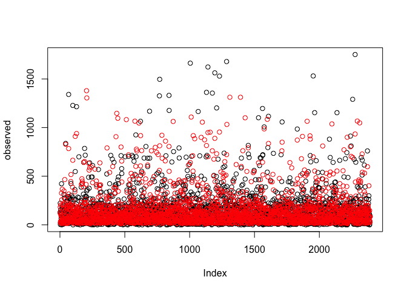

## Izboljsava klasifikacijskih modelov

### Metoda ovojnice

Izboljsava klasifikacijskega modela z izbiro optimalne podmnozice
atributov, ki minimizira doloceno oceno.

``` r
runWrapper(namembnost ~ ., classSetBase$train)
```

    ## formula to evaluate: namembnost ~ datum ...
    ## formula to evaluate: namembnost ~ regija ...
    ## formula to evaluate: namembnost ~ stavba ...
    ## formula to evaluate: namembnost ~ povrsina ...
    ## formula to evaluate: namembnost ~ leto_izgradnje ...
    ## formula to evaluate: namembnost ~ temp_zraka ...
    ## formula to evaluate: namembnost ~ temp_rosisca ...
    ## formula to evaluate: namembnost ~ oblacnost ...
    ## formula to evaluate: namembnost ~ padavine ...
    ## formula to evaluate: namembnost ~ pritisk ...
    ## formula to evaluate: namembnost ~ smer_vetra ...
    ## formula to evaluate: namembnost ~ hitrost_vetra ...
    ## formula to evaluate: namembnost ~ poraba ...
    ## selected attribute:  povrsina 
    ## formula to evaluate: namembnost ~ povrsina + datum ...
    ## formula to evaluate: namembnost ~ povrsina + regija ...
    ## formula to evaluate: namembnost ~ povrsina + stavba ...
    ## formula to evaluate: namembnost ~ povrsina + leto_izgradnje ...
    ## formula to evaluate: namembnost ~ povrsina + temp_zraka ...
    ## formula to evaluate: namembnost ~ povrsina + temp_rosisca ...
    ## formula to evaluate: namembnost ~ povrsina + oblacnost ...
    ## formula to evaluate: namembnost ~ povrsina + padavine ...
    ## formula to evaluate: namembnost ~ povrsina + pritisk ...
    ## formula to evaluate: namembnost ~ povrsina + smer_vetra ...
    ## formula to evaluate: namembnost ~ povrsina + hitrost_vetra ...
    ## formula to evaluate: namembnost ~ povrsina + poraba ...
    ## selected attribute:  leto_izgradnje 
    ## formula to evaluate: namembnost ~ povrsina + leto_izgradnje + datum ...
    ## formula to evaluate: namembnost ~ povrsina + leto_izgradnje + regija ...
    ## formula to evaluate: namembnost ~ povrsina + leto_izgradnje + stavba ...
    ## formula to evaluate: namembnost ~ povrsina + leto_izgradnje + temp_zraka ...
    ## formula to evaluate: namembnost ~ povrsina + leto_izgradnje + temp_rosisca ...
    ## formula to evaluate: namembnost ~ povrsina + leto_izgradnje + oblacnost ...
    ## formula to evaluate: namembnost ~ povrsina + leto_izgradnje + padavine ...
    ## formula to evaluate: namembnost ~ povrsina + leto_izgradnje + pritisk ...
    ## formula to evaluate: namembnost ~ povrsina + leto_izgradnje + smer_vetra ...
    ## formula to evaluate: namembnost ~ povrsina + leto_izgradnje + hitrost_vetra ...
    ## formula to evaluate: namembnost ~ povrsina + leto_izgradnje + poraba ...
    ## selected attribute:  datum 
    ## formula to evaluate: namembnost ~ povrsina + leto_izgradnje + datum + regija ...
    ## formula to evaluate: namembnost ~ povrsina + leto_izgradnje + datum + stavba ...
    ## formula to evaluate: namembnost ~ povrsina + leto_izgradnje + datum + temp_zraka ...
    ## formula to evaluate: namembnost ~ povrsina + leto_izgradnje + datum + temp_rosisca ...
    ## formula to evaluate: namembnost ~ povrsina + leto_izgradnje + datum + oblacnost ...
    ## formula to evaluate: namembnost ~ povrsina + leto_izgradnje + datum + padavine ...
    ## formula to evaluate: namembnost ~ povrsina + leto_izgradnje + datum + pritisk ...
    ## formula to evaluate: namembnost ~ povrsina + leto_izgradnje + datum + smer_vetra ...
    ## formula to evaluate: namembnost ~ povrsina + leto_izgradnje + datum + hitrost_vetra ...
    ## formula to evaluate: namembnost ~ povrsina + leto_izgradnje + datum + poraba ...
    ## selected attribute:  temp_rosisca 
    ## formula to evaluate: namembnost ~ povrsina + leto_izgradnje + datum + temp_rosisca + regija ...
    ## formula to evaluate: namembnost ~ povrsina + leto_izgradnje + datum + temp_rosisca + stavba ...
    ## formula to evaluate: namembnost ~ povrsina + leto_izgradnje + datum + temp_rosisca + temp_zraka ...
    ## formula to evaluate: namembnost ~ povrsina + leto_izgradnje + datum + temp_rosisca + oblacnost ...
    ## formula to evaluate: namembnost ~ povrsina + leto_izgradnje + datum + temp_rosisca + padavine ...
    ## formula to evaluate: namembnost ~ povrsina + leto_izgradnje + datum + temp_rosisca + pritisk ...
    ## formula to evaluate: namembnost ~ povrsina + leto_izgradnje + datum + temp_rosisca + smer_vetra ...
    ## formula to evaluate: namembnost ~ povrsina + leto_izgradnje + datum + temp_rosisca + hitrost_vetra ...
    ## formula to evaluate: namembnost ~ povrsina + leto_izgradnje + datum + temp_rosisca + poraba ...
    ## selected attribute:  oblacnost 
    ## formula to evaluate: namembnost ~ povrsina + leto_izgradnje + datum + temp_rosisca + oblacnost + regija ...
    ## formula to evaluate: namembnost ~ povrsina + leto_izgradnje + datum + temp_rosisca + oblacnost + stavba ...
    ## formula to evaluate: namembnost ~ povrsina + leto_izgradnje + datum + temp_rosisca + oblacnost + temp_zraka ...
    ## formula to evaluate: namembnost ~ povrsina + leto_izgradnje + datum + temp_rosisca + oblacnost + padavine ...
    ## formula to evaluate: namembnost ~ povrsina + leto_izgradnje + datum + temp_rosisca + oblacnost + pritisk ...
    ## formula to evaluate: namembnost ~ povrsina + leto_izgradnje + datum + temp_rosisca + oblacnost + smer_vetra ...
    ## formula to evaluate: namembnost ~ povrsina + leto_izgradnje + datum + temp_rosisca + oblacnost + hitrost_vetra ...
    ## formula to evaluate: namembnost ~ povrsina + leto_izgradnje + datum + temp_rosisca + oblacnost + poraba ...
    ## selected attribute:  stavba 
    ## formula to evaluate: namembnost ~ povrsina + leto_izgradnje + datum + temp_rosisca + oblacnost + stavba + regija ...
    ## formula to evaluate: namembnost ~ povrsina + leto_izgradnje + datum + temp_rosisca + oblacnost + stavba + temp_zraka ...
    ## formula to evaluate: namembnost ~ povrsina + leto_izgradnje + datum + temp_rosisca + oblacnost + stavba + padavine ...
    ## formula to evaluate: namembnost ~ povrsina + leto_izgradnje + datum + temp_rosisca + oblacnost + stavba + pritisk ...
    ## formula to evaluate: namembnost ~ povrsina + leto_izgradnje + datum + temp_rosisca + oblacnost + stavba + smer_vetra ...
    ## formula to evaluate: namembnost ~ povrsina + leto_izgradnje + datum + temp_rosisca + oblacnost + stavba + hitrost_vetra ...
    ## formula to evaluate: namembnost ~ povrsina + leto_izgradnje + datum + temp_rosisca + oblacnost + stavba + poraba ...
    ## selected attribute:  regija 
    ## formula to evaluate: namembnost ~ povrsina + leto_izgradnje + datum + temp_rosisca + oblacnost + stavba + regija + temp_zraka ...
    ## formula to evaluate: namembnost ~ povrsina + leto_izgradnje + datum + temp_rosisca + oblacnost + stavba + regija + padavine ...
    ## formula to evaluate: namembnost ~ povrsina + leto_izgradnje + datum + temp_rosisca + oblacnost + stavba + regija + pritisk ...
    ## formula to evaluate: namembnost ~ povrsina + leto_izgradnje + datum + temp_rosisca + oblacnost + stavba + regija + smer_vetra ...
    ## formula to evaluate: namembnost ~ povrsina + leto_izgradnje + datum + temp_rosisca + oblacnost + stavba + regija + hitrost_vetra ...
    ## formula to evaluate: namembnost ~ povrsina + leto_izgradnje + datum + temp_rosisca + oblacnost + stavba + regija + poraba ...
    ## selected attribute:  temp_zraka 
    ## formula to evaluate: namembnost ~ povrsina + leto_izgradnje + datum + temp_rosisca + oblacnost + stavba + regija + temp_zraka + padavine ...
    ## formula to evaluate: namembnost ~ povrsina + leto_izgradnje + datum + temp_rosisca + oblacnost + stavba + regija + temp_zraka + pritisk ...
    ## formula to evaluate: namembnost ~ povrsina + leto_izgradnje + datum + temp_rosisca + oblacnost + stavba + regija + temp_zraka + smer_vetra ...
    ## formula to evaluate: namembnost ~ povrsina + leto_izgradnje + datum + temp_rosisca + oblacnost + stavba + regija + temp_zraka + hitrost_vetra ...
    ## formula to evaluate: namembnost ~ povrsina + leto_izgradnje + datum + temp_rosisca + oblacnost + stavba + regija + temp_zraka + poraba ...
    ## selected attribute:  padavine 
    ## formula to evaluate: namembnost ~ povrsina + leto_izgradnje + datum + temp_rosisca + oblacnost + stavba + regija + temp_zraka + padavine + pritisk ...
    ## formula to evaluate: namembnost ~ povrsina + leto_izgradnje + datum + temp_rosisca + oblacnost + stavba + regija + temp_zraka + padavine + smer_vetra ...
    ## formula to evaluate: namembnost ~ povrsina + leto_izgradnje + datum + temp_rosisca + oblacnost + stavba + regija + temp_zraka + padavine + hitrost_vetra ...
    ## formula to evaluate: namembnost ~ povrsina + leto_izgradnje + datum + temp_rosisca + oblacnost + stavba + regija + temp_zraka + padavine + poraba ...
    ## selected attribute:  pritisk 
    ## formula to evaluate: namembnost ~ povrsina + leto_izgradnje + datum + temp_rosisca + oblacnost + stavba + regija + temp_zraka + padavine + pritisk + smer_vetra ...
    ## formula to evaluate: namembnost ~ povrsina + leto_izgradnje + datum + temp_rosisca + oblacnost + stavba + regija + temp_zraka + padavine + pritisk + hitrost_vetra ...
    ## formula to evaluate: namembnost ~ povrsina + leto_izgradnje + datum + temp_rosisca + oblacnost + stavba + regija + temp_zraka + padavine + pritisk + poraba ...
    ## selected attribute:  smer_vetra 
    ## formula to evaluate: namembnost ~ povrsina + leto_izgradnje + datum + temp_rosisca + oblacnost + stavba + regija + temp_zraka + padavine + pritisk + smer_vetra + hitrost_vetra ...
    ## formula to evaluate: namembnost ~ povrsina + leto_izgradnje + datum + temp_rosisca + oblacnost + stavba + regija + temp_zraka + padavine + pritisk + smer_vetra + poraba ...
    ## selected attribute:  hitrost_vetra 
    ## formula to evaluate: namembnost ~ povrsina + leto_izgradnje + datum + temp_rosisca + oblacnost + stavba + regija + temp_zraka + padavine + pritisk + smer_vetra + hitrost_vetra + poraba ...
    ## selected attribute:  poraba 
    ## best model: estimated error =  0.003732725 , selected feature subset =  namembnost ~ povrsina + leto_izgradnje

``` r
dtBase <- rpart(namembnost ~ povrsina + leto_izgradnje + stavba + datum + regija + temp_zraka + temp_rosisca + oblacnost, data=classSetBase$train)
EvaluateClassModel(dtBase, classSetBase$train, classSetBase$test)
```

    ## [1] "Brier score: 0.963653660864007"
    ## [1] "Classification accuracy: 0.514632107023411"
    ## [1] "Information score: 0.599764290298839"

### Glasovanje

Zgradimo modele z osnovno in popravljeno mnozico atributov:

``` r
dtBase <- rpart(namembnost ~ pritisk, data=classSetBase$train)
knnBase <- CoreModel(namembnost ~ ., data=classSetBase$train, model="knn", kInNN=5)
rfBase <- randomForest(namembnost ~ ., data=classSetBase$train)

dtExt <- rpart(namembnost ~ pritisk, data=classSetExt$train)
knnExt <- CoreModel(namembnost ~ ., data=classSetExt$train, model="knn", kInNN=5)
rfExt <- randomForest(namembnost ~ ., data=classSetExt$train)
```

Glasovanje z osnovno mnozico atributov:

``` r
predDtBase <- predict(dtBase, classSetBase$test, type="class")
predKnnBase <- predict(knnBase, classSetBase$test, type="class")
predRfBase <- predict(rfBase, classSetBase$test, type="class")

modelsDf <- data.frame(
  predDtBase,
  predKnnBase,
  predRfBase
)

runVoting(modelsDf, classSetBase$test$namembnost)
```

    ## [1] "Classification accuracy: 0.5"

Glasovanje z popravljeno mnozico atributov:

``` r
predDtExt <- predict(dtExt, classSetExt$test, type="class")
predKnnExt <- predict(knnExt, classSetExt$test, type="class")
predRfExt <- predict(rfExt, classSetExt$test, type="class")

modelsDf <- data.frame(
  predDtExt,
  predKnnExt,
  predRfExt
)

runVoting(modelsDf, classSetExt$test$namembnost)
```

    ## [1] "Classification accuracy: 0.522157190635452"

### Utezeno glasovanje

Glasovanje z osnovno mnozico atributov:

``` r
predDtBase <- predict(dtBase, classSetBase$test, type="prob")
predKnnBase <- predict(knnBase, classSetBase$test, type="prob")
predRfBase <- predict(rfBase, classSetBase$test, type="prob")
runWeightedVoting(predDtBase + predKnnBase + predRfBase, classSetBase$test$namembnost)
```

    ## [1] "Classification accuracy: 0.523829431438127"

Glasovanje z popravljeno mnozico atributov:

``` r
predDtExt <- predict(dtExt, classSetExt$test, type="prob")
predKnnExt <- predict(knnExt, classSetExt$test, type="prob")
predRfExt <- predict(rfExt, classSetExt$test, type="prob")
runWeightedVoting(predDtExt + predKnnExt + predRfExt, classSetExt$test$namembnost)
```

    ## [1] "Classification accuracy: 0.538461538461538"

### Bagging

Bagging z osnovno mnozico atributov:

``` r
bag <- bagging(namembnost ~ ., classSetBase$train, nbagg=30)
predictions <- predict(bag, classSetBase$test)
ca <- CA(classSetBase$test$namembnost, predictions$class)
print(paste("Classification accuracy:", ca))
```

    ## [1] "Classification accuracy: 0.535535117056856"

Bagging z popravljeno mnozico atributov:

``` r
bag <- bagging(namembnost ~ ., classSetExt$train, nbagg=30)
predictions <- predict(bag, classSetExt$test)
ca <- CA(classSetExt$test$namembnost, predictions$class)
print(paste("Classification accuracy:", ca))
```

    ## [1] "Classification accuracy: 0.525083612040134"

### Boosting

Boosting z osnovno mnozico atributov:

``` r
bm <- boosting(namembnost ~ ., classSetBase$train, mfinal=100)
predictions <- predict(bm, classSetBase$test)
ca <- CA(classSetBase$test$namembnost, predictions$class)
print(paste("Classification accuracy:", ca))
```

    ## [1] "Classification accuracy: 0.492892976588629"

Boosting z popravljeno mnozico atributov:

``` r
bm <- boosting(namembnost ~ ., classSetExt$train, mfinal=100)
predictions <- predict(bm, classSetExt$test)
ca <- CA(classSetExt$test$namembnost, predictions$class)
print(paste("Classification accuracy:", ca))
```

    ## [1] "Classification accuracy: 0.469063545150502"

## Primerjava po regijah

### Priprava podatkov

Pripravimo podatke, tako da ucno in testno mnozico razbijemo na dve
podmnozici: - mnozica ki vsebuje samo primere z vzhodno regijo - mnozica
ki vsebuje samo primere z zahodno regijo

#### Podatki za klasifikacijo

``` r
selTrain <- classSetExt$train$regija == "vzhodna"
selTest <- classSetExt$test$regija == "vzhodna"

classVzhodnaTrain <- classSetExt$train[selTrain,]
classVzhodnaTest <- classSetExt$test[selTest,]
classVzhodnaTrain$regija <- NULL
classVzhodnaTest$regija <- NULL

classZahodnaTrain <- classSetExt$train[!selTrain,]
classZahodnaTest <- classSetExt$test[!selTest,]
classZahodnaTrain$regija <- NULL
classZahodnaTest$regija <- NULL
```

#### Podatki za regresijo

``` r
selTrain <- regSetExt$train$regija == "vzhodna"
selTest <- regSetExt$test$regija == "vzhodna"

regVzhodnaTrain <- regSetExt$train[selTrain,]
regVzhodnaTest <- regSetExt$test[selTest,]
regVzhodnaTrain$regija <- NULL
regVzhodnaTest$regija <- NULL

regZahodnaTrain <- regSetExt$train[!selTrain,]
regZahodnaTest <- regSetExt$test[!selTest,]
regZahodnaTrain$regija <- NULL
regZahodnaTest$regija <- NULL
```

### Evalvacija

#### Klasifikacija

Zgradimo nekaj klasifikacijskih modelov, ki se ucijo iz posamezne
podmnozice, ter vsakega posebej se ocenimo glede na testne primere iz
ustrezne testne mnozice.

``` r
runClassification(namembnost ~ ., classVzhodnaTrain, classVzhodnaTest)
```

    ## [1] "Trivial classification accuracy: 0.527433628318584"
    ## [1] "odlocitveno drevo classification accuracy: 0.708849557522124"
    ## [1] "naivni bayes classification accuracy: 0.587610619469027"
    ## [1] "k-najblizjih sosedov classification accuracy: 0.588495575221239"
    ## [1] "nakljucni gozd classification accuracy: 0.769026548672566"

``` r
runClassification(namembnost ~ ., classZahodnaTrain, classZahodnaTest)
```

    ## [1] "Trivial classification accuracy: 0.44215530903328"
    ## [1] "odlocitveno drevo classification accuracy: 0.327258320126783"
    ## [1] "naivni bayes classification accuracy: 0.329635499207607"
    ## [1] "k-najblizjih sosedov classification accuracy: 0.389064976228209"
    ## [1] "nakljucni gozd classification accuracy: 0.38351822503962"

#### Regresija

Zgradimo nekaj regresijskih modelov, ki se ucijo iz posamezne
podmnozice, ter vsakega posebej se ocenimo glede na testne primere iz
ustrezne testne mnozice.

``` r
runRegression(poraba ~ ., regVzhodnaTrain, regVzhodnaTest)
```

    ## Warning in predict.lm(model, test): prediction from a rank-deficient fit may be
    ## misleading

    ## [1] "Srednja absolutna napaka: 68.0364221786923"
    ## [1] "Srednja kvadratna napaka: 24245.8709018281"
    ## [1] "Relativna srednja absolutna napaka: 0.482408149805635"
    ## [1] "Relativna srednja kvadratna napaka: 0.324012921907863"

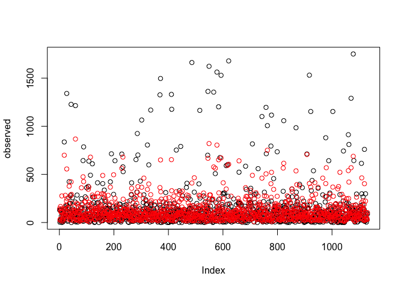

    ## [1] "Srednja absolutna napaka: 69.7672168706825"
    ## [1] "Srednja kvadratna napaka: 19365.4640776844"
    ## [1] "Relativna srednja absolutna napaka: 0.494680245226284"
    ## [1] "Relativna srednja kvadratna napaka: 0.258792955935403"


    ## [1] "Srednja absolutna napaka: 62.9844710717455"
    ## [1] "Srednja kvadratna napaka: 17976.4119691739"
    ## [1] "Relativna srednja absolutna napaka: 0.446587595044395"
    ## [1] "Relativna srednja kvadratna napaka: 0.240230173258587"

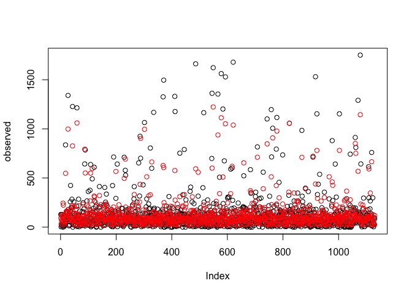

``` r
runRegression(poraba ~ ., regZahodnaTrain, regZahodnaTest)
```

    ## Warning in predict.lm(model, test): prediction from a rank-deficient fit may be
    ## misleading

    ## [1] "Srednja absolutna napaka: 102.234797806236"
    ## [1] "Srednja kvadratna napaka: 40377.2807422382"
    ## [1] "Relativna srednja absolutna napaka: 0.651691692238129"
    ## [1] "Relativna srednja kvadratna napaka: 0.844254033480331"

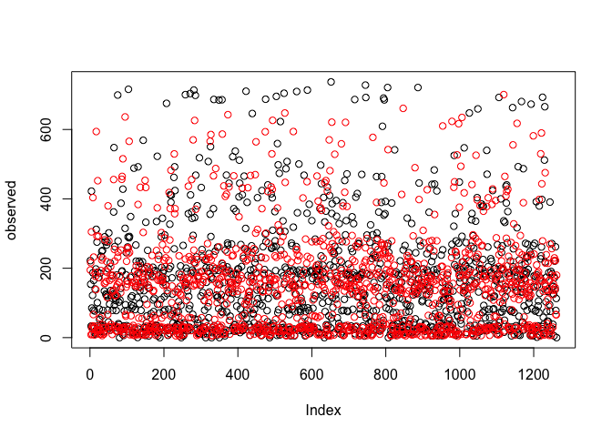

    ## [1] "Srednja absolutna napaka: 105.516186325833"
    ## [1] "Srednja kvadratna napaka: 30080.6996535656"
    ## [1] "Relativna srednja absolutna napaka: 0.672608774123297"
    ## [1] "Relativna srednja kvadratna napaka: 0.628961424484114"


    ## [1] "Srednja absolutna napaka: 86.0077749517434"
    ## [1] "Srednja kvadratna napaka: 20390.91090344"
    ## [1] "Relativna srednja absolutna napaka: 0.548253174131273"
    ## [1] "Relativna srednja kvadratna napaka: 0.426356318704711"

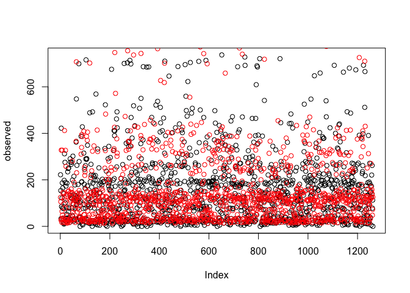

### Ugotovitve

Opazimo, da je klasifikacijska in regresijska napoved obcutno uspesnejsa
za primere iz podmnozice podatkov z vzhodno regijo.
