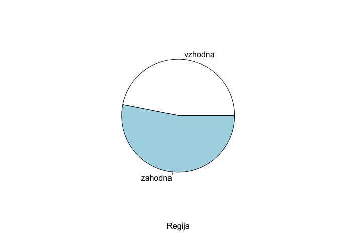
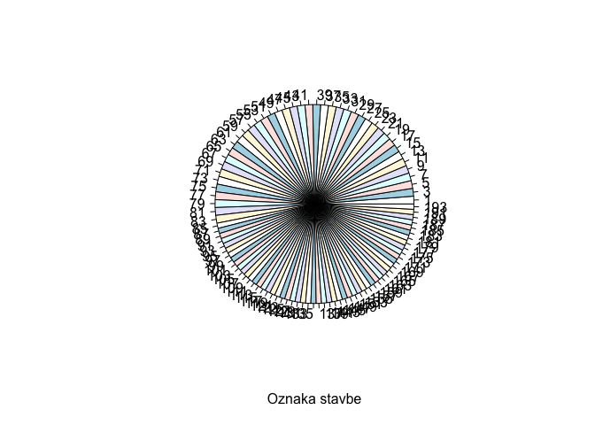

# Seminarska naloga

Cilj seminarske naloge je uporabiti metode strojnega učenja za gradnjo
modelov za napovedovanje porabe električne energije (regresijski
problem) in namembnosti stavbe (klasifikacijski problem), ustrezno
ovrednotiti modele in jasno predstaviti dobljene rezultate.

## Vizualizacija podatkov

### Uvoz podatkov

Najprej uvozimo in na kratko preglejmo podatke.

Opazimo, da imamo 3 atribute tipa “character”: `datum`, `regija` in
`namembnost`. Atributa `regija` in `namembnost` (z indeksi `2` in `4`)
imata le majhno stevilo vrednosti, zato jih bomo faktorizirali. Datum
bomo pa kasneje preuredili v bolj smiselno obliko.

``` r
stavbe <- read.table("trainset.txt", header=T, sep=",")
summary(stavbe)
```

    ##     datum              regija              stavba        namembnost       
    ##  Length:24125       Length:24125       Min.   :  1.00   Length:24125      
    ##  Class :character   Class :character   1st Qu.: 39.00   Class :character  
    ##  Mode  :character   Mode  :character   Median : 79.00   Mode  :character  
    ##                                        Mean   : 87.49                     
    ##                                        3rd Qu.:135.00                     
    ##                                        Max.   :193.00                     
    ##     povrsina       leto_izgradnje   temp_zraka     temp_rosisca    
    ##  Min.   :  329.3   Min.   :1903   Min.   :-7.20   Min.   :-19.400  
    ##  1st Qu.: 4106.6   1st Qu.:1950   1st Qu.:10.00   1st Qu.: -2.800  
    ##  Median : 6763.3   Median :1970   Median :20.00   Median :  2.800  
    ##  Mean   :10958.1   Mean   :1970   Mean   :19.15   Mean   :  3.816  
    ##  3rd Qu.:14409.3   3rd Qu.:2000   3rd Qu.:28.30   3rd Qu.: 11.100  
    ##  Max.   :79000.4   Max.   :2017   Max.   :41.70   Max.   : 25.000  
    ##    oblacnost        padavine          pritisk         smer_vetra   
    ##  Min.   :0.000   Min.   :-1.0000   Min.   : 997.2   Min.   :  0.0  
    ##  1st Qu.:2.000   1st Qu.: 0.0000   1st Qu.:1011.9   1st Qu.: 70.0  
    ##  Median :4.000   Median : 0.0000   Median :1015.9   Median :140.0  
    ##  Mean   :3.718   Mean   : 0.3113   Mean   :1017.1   Mean   :156.6  
    ##  3rd Qu.:6.000   3rd Qu.: 0.0000   3rd Qu.:1021.8   3rd Qu.:250.0  
    ##  Max.   :9.000   Max.   :56.0000   Max.   :1040.9   Max.   :360.0  
    ##  hitrost_vetra        poraba       
    ##  Min.   : 0.000   Min.   :   0.00  
    ##  1st Qu.: 2.100   1st Qu.:  53.48  
    ##  Median : 3.600   Median : 112.90  
    ##  Mean   : 3.756   Mean   : 224.55  
    ##  3rd Qu.: 5.100   3rd Qu.: 215.41  
    ##  Max.   :12.400   Max.   :2756.54

``` r
for (i in list(2,4))
  stavbe[,i] <- as.factor(stavbe[,i])

summary(stavbe)
```

    ##     datum               regija          stavba      
    ##  Length:24125       vzhodna:11315   Min.   :  1.00  
    ##  Class :character   zahodna:12810   1st Qu.: 39.00  
    ##  Mode  :character                   Median : 79.00  
    ##                                     Mean   : 87.49  
    ##                                     3rd Qu.:135.00  
    ##                                     Max.   :193.00  
    ##                 namembnost       povrsina       leto_izgradnje   temp_zraka   
    ##  izobrazevalna       :13301   Min.   :  329.3   Min.   :1903   Min.   :-7.20  
    ##  javno_storitvena    : 2979   1st Qu.: 4106.6   1st Qu.:1950   1st Qu.:10.00  
    ##  kulturno_razvedrilna: 3263   Median : 6763.3   Median :1970   Median :20.00  
    ##  poslovna            : 3057   Mean   :10958.1   Mean   :1970   Mean   :19.15  
    ##  stanovanjska        : 1525   3rd Qu.:14409.3   3rd Qu.:2000   3rd Qu.:28.30  
    ##                               Max.   :79000.4   Max.   :2017   Max.   :41.70  
    ##   temp_rosisca       oblacnost        padavine          pritisk      
    ##  Min.   :-19.400   Min.   :0.000   Min.   :-1.0000   Min.   : 997.2  
    ##  1st Qu.: -2.800   1st Qu.:2.000   1st Qu.: 0.0000   1st Qu.:1011.9  
    ##  Median :  2.800   Median :4.000   Median : 0.0000   Median :1015.9  
    ##  Mean   :  3.816   Mean   :3.718   Mean   : 0.3113   Mean   :1017.1  
    ##  3rd Qu.: 11.100   3rd Qu.:6.000   3rd Qu.: 0.0000   3rd Qu.:1021.8  
    ##  Max.   : 25.000   Max.   :9.000   Max.   :56.0000   Max.   :1040.9  
    ##    smer_vetra    hitrost_vetra        poraba       
    ##  Min.   :  0.0   Min.   : 0.000   Min.   :   0.00  
    ##  1st Qu.: 70.0   1st Qu.: 2.100   1st Qu.:  53.48  
    ##  Median :140.0   Median : 3.600   Median : 112.90  
    ##  Mean   :156.6   Mean   : 3.756   Mean   : 224.55  
    ##  3rd Qu.:250.0   3rd Qu.: 5.100   3rd Qu.: 215.41  
    ##  Max.   :360.0   Max.   :12.400   Max.   :2756.54

### Izris grafov

Najprej vizualizirajmo porazdelitvene vrednosti posameznih atributov, da
dobimo boljsi vpogled v vsak atribut posebej.

``` r
pie(table(stavbe$regija), xlab="Regija")
```



``` r
hist(stavbe$stavba, xlab="Oznaka stavbe", main="Histogram oznak stavb")
```



``` r
pie(table(stavbe$namembnost), xlab="Namembnost")
```


``` r
hist(stavbe$povrsina, xlab="Povrsina (m^2)", main="Histogram povrsine stavb")
```


``` r
hist(stavbe$poraba, xlab="Poraba (kWh)", main="Histogram porabe stavb")
```


``` r
hist(stavbe$leto_izgradnje, xlab="Leto izgradnje", main="Histogram leta izgradnje stavb")
```


``` r
hist(stavbe$temp_zraka, xlab="Temperatura zraka (°C)", main="Histogram temperature zraka")
```


``` r
hist(stavbe$temp_rosisca, xlab="Temperatura rosisca (°C)", main="Histogram temperature rosisca")
```


``` r
hist(stavbe$oblacnost, xlab="Oblacnost", main="Histogram stopnje pokritosti neba z oblaki")
```


``` r
hist(stavbe$oblacnost, xlab="Padavine (mm)", main="Histogram kolicine padavin")
```


``` r
hist(stavbe$oblacnost, xlab="Pritisk (mbar)", main="Histogram zracnega pritiska")
```


``` r
hist(stavbe$smer_vetra, xlab="Smer vetra (°)", main="Histogram smeri vetra")
```


``` r
hist(stavbe$smer_vetra, xlab="Hitrost vetra (m/s)", main="Histogram hitrosti vetra")
```


Pri nadalnji predikciji nam bo koristilo tudi nekaj intuicije o
soodvisnosti med doloceni atributi.

Ze samo po sebi je logicno, da bodo nekateri atributi (npr. povrsina
stavbe \<-> poraba energije) v vecji medsebojni odvisnosti, kot nekateri
drugi atributi (npr. smer vetra \<-> poraba energije);

Naso hipotezo lahko dodatno potrdimo z nekaj grafi, kjer prikazemo
korelacijo med izbranimi pari atributov.

Zdaj izrisimo nekaj korelacijskih grafov, da potrimo ali pa ovrzemo nase
hipoteze. Da bo trend se bolje viden, lahko na graf izrisemo se linearno
regresijsko premico.

Pri porabi elektricne energije v odvisnosti z povrsino stavbe vidimo, da
obstaja jasen trend.

``` r
x <- stavbe$povrsina
y <- stavbe$poraba
plot(x, y, col="lightblue")
abline(lm(y ~ x), col = "red", lwd = 3)
```


Medtem ko pri grafu porabe energije v odvisnosti od smeri vetra jasne
korelacije ni.

``` r
x <- stavbe$smer_vetra
y <- stavbe$poraba
plot(x, y, col="lightblue")
abline(lm(y ~ x), col = "red", lwd = 3)
```


Najboljse bi bilo primerjati vse atribute z vsemi drugimi atributi, ter
prikazati medsebojne odvisnosti, tako bi pridobili visoko nivojski
pogled na odvisnosti med atributi.

Za to vrstno vizualizacijo bomo uporabili dve zunanji knjiznici
`ggplot2` in `ggcorrplot`, ki jih moramo prenesti in namestiti.

Ta graf nam izpise korelacijsko matriko, iz katere lahko razberemo
korelacije med vsemi numericni atributi. Opazimo, da sta v najvecji
medsebojni korelaciji res atributa `poraba` in `povrsina`.

``` r
library(ggplot2)
library(ggcorrplot)

data(stavbe, package="mosaicData")
```

    ## Warning in data(stavbe, package = "mosaicData"): data set 'stavbe' not found

``` r
# izberemo samo numericne atribute
df <- dplyr::select_if(stavbe, is.numeric)

# izracunamo korelacije z metodo cor
r <- cor(df, use="complete.obs")
round(r,2)
```

    ##                stavba povrsina leto_izgradnje temp_zraka temp_rosisca oblacnost
    ## stavba           1.00     0.16          -0.24      -0.52         0.00      0.16
    ## povrsina         0.16     1.00           0.08      -0.08         0.00      0.02
    ## leto_izgradnje  -0.24     0.08           1.00       0.17         0.00     -0.05
    ## temp_zraka      -0.52    -0.08           0.17       1.00         0.61     -0.28
    ## temp_rosisca     0.00     0.00           0.00       0.61         1.00      0.06
    ## oblacnost        0.16     0.02          -0.05      -0.28         0.06      1.00
    ## padavine         0.08     0.01          -0.03      -0.08         0.05      0.16
    ## pritisk          0.40     0.06          -0.13      -0.56        -0.33     -0.04
    ## smer_vetra       0.28     0.05          -0.09      -0.27        -0.11      0.06
    ## hitrost_vetra    0.21     0.03          -0.07      -0.23        -0.15      0.09
    ## poraba           0.11     0.82           0.15      -0.02         0.04      0.01
    ##                padavine pritisk smer_vetra hitrost_vetra poraba
    ## stavba             0.08    0.40       0.28          0.21   0.11
    ## povrsina           0.01    0.06       0.05          0.03   0.82
    ## leto_izgradnje    -0.03   -0.13      -0.09         -0.07   0.15
    ## temp_zraka        -0.08   -0.56      -0.27         -0.23  -0.02
    ## temp_rosisca       0.05   -0.33      -0.11         -0.15   0.04
    ## oblacnost          0.16   -0.04       0.06          0.09   0.01
    ## padavine           1.00   -0.11       0.01          0.00   0.01
    ## pritisk           -0.11    1.00      -0.03         -0.03   0.03
    ## smer_vetra         0.01   -0.03       1.00          0.53   0.03
    ## hitrost_vetra      0.00   -0.03       0.53          1.00   0.03
    ## poraba             0.01    0.03       0.03          0.03   1.00

``` r
ggcorrplot(r,
           hc.order=T, # uredi po korelaciji
           type="lower") # prikazi samo v spodnjem trikotniku
```


