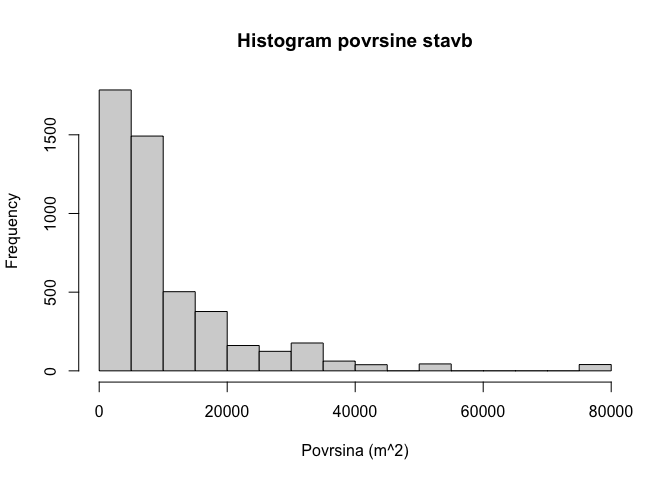
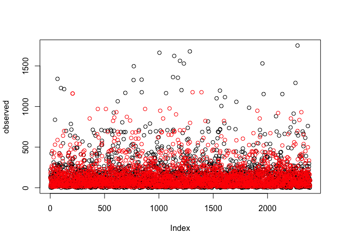
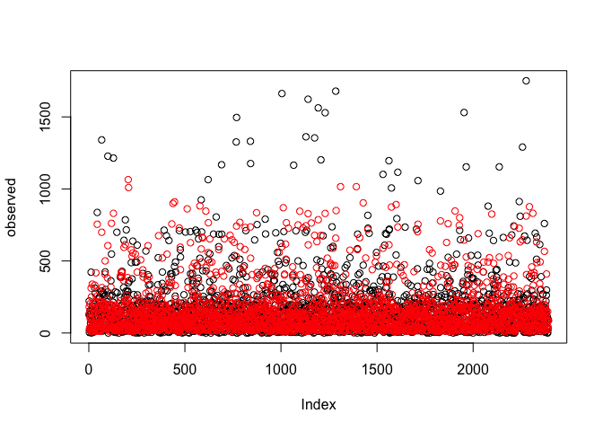
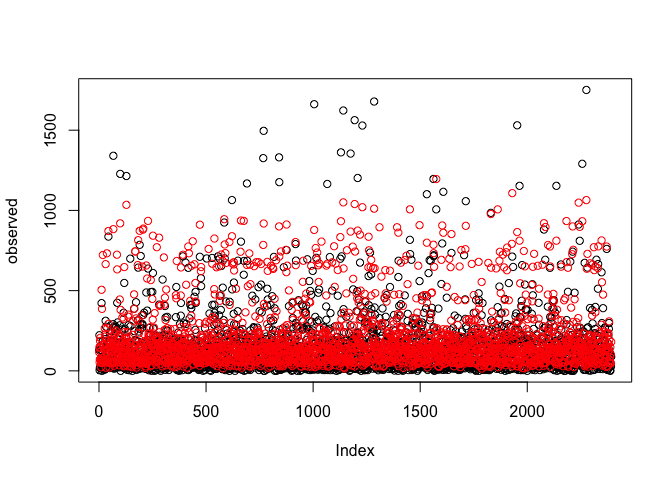

# Seminarska naloga

Cilj seminarske naloge je uporabiti metode strojnega učenja za gradnjo
modelov za napovedovanje porabe električne energije (regresijski
problem) in namembnosti stavbe (klasifikacijski problem), ustrezno
ovrednotiti modele in jasno predstaviti dobljene rezultate.

## Knjiznice in orodja

``` r
library(lubridate) # delo z datumi
```

    ## 
    ## Attaching package: 'lubridate'

    ## The following objects are masked from 'package:base':
    ## 
    ##     date, intersect, setdiff, union

``` r
library(stringr) # delo z znakovnimi nizi
library(ggplot2)
library(ggcorrplot)
library(rpart)
library(rpart.plot)
library(CORElearn) # za ucenje
library(nnet)
library(randomForest)
```

    ## randomForest 4.6-14

    ## Type rfNews() to see new features/changes/bug fixes.

    ## 
    ## Attaching package: 'randomForest'

    ## The following object is masked from 'package:ggplot2':
    ## 
    ##     margin

``` r
source("./common.R") # pomozne metode

set.seed(0) # nastavimo random seed
```

## Vizualizacija podatkov

### Uvoz podatkov

Najprej uvozimo in na kratko preglejmo podatke.

Opazimo, da imamo 3 atribute tipa “character”: `datum`, `regija` in
`namembnost`. Atributa `regija` in `namembnost` (z indeksi `2` in `4`)
imata le majhno stevilo vrednosti, zato jih bomo faktorizirali. Datum
bomo pa kasneje preuredili v bolj smiselno obliko.

``` r
train <- read.table("trainset.txt", header=T, sep=",")
test <- read.table("testset.txt", header=T, sep=",")

# zmanjsamo mnozici za potrebo razvoja
trainSel <- sample(1:nrow(train), as.integer(nrow(train) * 0.01), replace=T)
testSel <- sample(1:nrow(test), as.integer(nrow(test) * 0.004), replace=T)
train <- train[trainSel,]
test <- test[testSel,]

summary(train)
```

    ##     datum              regija              stavba        namembnost       
    ##  Length:241         Length:241         Min.   :  1.00   Length:241        
    ##  Class :character   Class :character   1st Qu.: 37.00   Class :character  
    ##  Mode  :character   Mode  :character   Median : 77.00   Mode  :character  
    ##                                        Mean   : 88.09                     
    ##                                        3rd Qu.:139.00                     
    ##                                        Max.   :191.00                     
    ##     povrsina       leto_izgradnje   temp_zraka     temp_rosisca    
    ##  Min.   :  329.3   Min.   :1903   Min.   :-5.00   Min.   :-19.400  
    ##  1st Qu.: 4274.2   1st Qu.:1950   1st Qu.:11.10   1st Qu.: -1.700  
    ##  Median : 6891.5   Median :1969   Median :19.40   Median :  3.900  
    ##  Mean   :10842.5   Mean   :1969   Mean   :19.09   Mean   :  4.379  
    ##  3rd Qu.:13386.0   3rd Qu.:1999   3rd Qu.:27.80   3rd Qu.: 11.700  
    ##  Max.   :79000.4   Max.   :2017   Max.   :39.40   Max.   : 24.400  
    ##    oblacnost        padavine          pritisk         smer_vetra   
    ##  Min.   :0.000   Min.   :-1.0000   Min.   : 997.2   Min.   :  0.0  
    ##  1st Qu.:2.000   1st Qu.: 0.0000   1st Qu.:1012.1   1st Qu.: 70.0  
    ##  Median :4.000   Median : 0.0000   Median :1015.9   Median :140.0  
    ##  Mean   :3.896   Mean   : 0.5021   Mean   :1017.0   Mean   :156.1  
    ##  3rd Qu.:6.000   3rd Qu.: 0.0000   3rd Qu.:1022.3   3rd Qu.:260.0  
    ##  Max.   :9.000   Max.   :56.0000   Max.   :1037.6   Max.   :360.0  
    ##  hitrost_vetra       poraba       
    ##  Min.   : 0.00   Min.   :   0.67  
    ##  1st Qu.: 2.10   1st Qu.:  55.79  
    ##  Median : 3.60   Median : 107.66  
    ##  Mean   : 3.84   Mean   : 235.06  
    ##  3rd Qu.: 5.10   3rd Qu.: 200.65  
    ##  Max.   :11.80   Max.   :2554.89

``` r
train <- Factorize(train)
test <- Factorize(test)

summary(train)
```

    ##      datum                regija        stavba                      namembnost 
    ##  Min.   :2016-01-01   vzhodna:116   Min.   :  1.00   izobrazevalna       :141  
    ##  1st Qu.:2016-03-26   zahodna:125   1st Qu.: 37.00   javno_storitvena    : 23  
    ##  Median :2016-07-17                 Median : 77.00   kulturno_razvedrilna: 24  
    ##  Mean   :2016-07-08                 Mean   : 88.09   poslovna            : 38  
    ##  3rd Qu.:2016-10-22                 3rd Qu.:139.00   stanovanjska        : 15  
    ##  Max.   :2016-12-27                 Max.   :191.00                             
    ##     povrsina       leto_izgradnje   temp_zraka     temp_rosisca    
    ##  Min.   :  329.3   Min.   :1903   Min.   :-5.00   Min.   :-19.400  
    ##  1st Qu.: 4274.2   1st Qu.:1950   1st Qu.:11.10   1st Qu.: -1.700  
    ##  Median : 6891.5   Median :1969   Median :19.40   Median :  3.900  
    ##  Mean   :10842.5   Mean   :1969   Mean   :19.09   Mean   :  4.379  
    ##  3rd Qu.:13386.0   3rd Qu.:1999   3rd Qu.:27.80   3rd Qu.: 11.700  
    ##  Max.   :79000.4   Max.   :2017   Max.   :39.40   Max.   : 24.400  
    ##    oblacnost        padavine          pritisk         smer_vetra   
    ##  Min.   :0.000   Min.   :-1.0000   Min.   : 997.2   Min.   :  0.0  
    ##  1st Qu.:2.000   1st Qu.: 0.0000   1st Qu.:1012.1   1st Qu.: 70.0  
    ##  Median :4.000   Median : 0.0000   Median :1015.9   Median :140.0  
    ##  Mean   :3.896   Mean   : 0.5021   Mean   :1017.0   Mean   :156.1  
    ##  3rd Qu.:6.000   3rd Qu.: 0.0000   3rd Qu.:1022.3   3rd Qu.:260.0  
    ##  Max.   :9.000   Max.   :56.0000   Max.   :1037.6   Max.   :360.0  
    ##  hitrost_vetra       poraba       
    ##  Min.   : 0.00   Min.   :   0.67  
    ##  1st Qu.: 2.10   1st Qu.:  55.79  
    ##  Median : 3.60   Median : 107.66  
    ##  Mean   : 3.84   Mean   : 235.06  
    ##  3rd Qu.: 5.10   3rd Qu.: 200.65  
    ##  Max.   :11.80   Max.   :2554.89

### Izris grafov

Najprej vizualizirajmo porazdelitvene vrednosti posameznih atributov, da
dobimo boljsi vpogled v vsak atribut posebej.

``` r
pie(table(train$regija), xlab="Regija")
```


``` r
pie(table(train$stavba), xlab="Oznaka stavbe")
```



``` r
pie(table(train$namembnost), xlab="Namembnost")
```


``` r
hist(train$povrsina, xlab="Povrsina (m^2)", main="Histogram povrsine stavb")
```


``` r
hist(train$poraba, xlab="Poraba (kWh)", main="Histogram porabe stavb")
```


``` r
hist(train$leto_izgradnje, xlab="Leto izgradnje", main="Histogram leta izgradnje stavb")
```


``` r
hist(train$temp_zraka, xlab="Temperatura zraka (°C)", main="Histogram temperature zraka")
```


``` r
hist(train$temp_rosisca, xlab="Temperatura rosisca (°C)", main="Histogram temperature rosisca")
```


``` r
hist(train$oblacnost, xlab="Oblacnost", main="Histogram stopnje pokritosti neba z oblaki")
```


``` r
hist(train$oblacnost, xlab="Padavine (mm)", main="Histogram kolicine padavin")
```


``` r
hist(train$oblacnost, xlab="Pritisk (mbar)", main="Histogram zracnega pritiska")
```


``` r
hist(train$smer_vetra, xlab="Smer vetra (°)", main="Histogram smeri vetra")
```


``` r
hist(train$smer_vetra, xlab="Hitrost vetra (m/s)", main="Histogram hitrosti vetra")
```


Pri nadalnji predikciji nam bo koristilo tudi nekaj intuicije o
soodvisnosti med doloceni atributi.

Ze samo po sebi je logicno, da bodo nekateri atributi (npr. povrsina
train \<-> poraba energije) v vecji medsebojni odvisnosti, kot nekateri
drugi atributi (npr. smer vetra \<-> poraba energije);

Naso hipotezo lahko dodatno potrdimo z nekaj grafi, kjer prikazemo
korelacijo med izbranimi pari atributov.

Zdaj izrisimo nekaj korelacijskih grafov, da potrimo ali pa ovrzemo nase
hipoteze. Da bo trend se bolje viden, lahko na graf izrisemo se linearno
regresijsko premico.

Pri porabi elektricne energije v odvisnosti z povrsino train vidimo, da
obstaja jasen trend.

``` r
x <- train$povrsina
y <- train$poraba
plot(x, y, col="lightblue")
abline(lm(y ~ x), col = "red", lwd = 3)
```


Medtem ko pri grafu porabe energije v odvisnosti od smeri vetra jasne
korelacije ni.

``` r
x <- train$smer_vetra
y <- train$poraba
plot(x, y, col="lightblue")
abline(lm(y ~ x), col = "red", lwd = 3)
```


Najboljse bi bilo primerjati vse atribute z vsemi drugimi atributi, ter
prikazati medsebojne odvisnosti, tako bi pridobili visoko nivojski
pogled na odvisnosti med atributi.

Za to vrstno vizualizacijo bomo uporabili dve zunanji knjiznici
`ggplot2` in `ggcorrplot`, ki jih moramo prenesti in namestiti.

Ta graf nam izpise korelacijsko matriko, iz katere lahko razberemo
korelacije med vsemi numericni atributi. Opazimo, da sta v najvecji
medsebojni korelaciji res atributa `poraba` in `povrsina`.

``` r
data(train, package="mosaicData")
```

    ## Warning in data(train, package = "mosaicData"): data set 'train' not found

``` r
# izberemo samo numericne atribute
df <- dplyr::select_if(train, is.numeric)

# izracunamo korelacije z metodo cor
r <- cor(df, use="complete.obs")
round(r,2)
```

    ##                stavba povrsina leto_izgradnje temp_zraka temp_rosisca oblacnost
    ## stavba           1.00     0.11          -0.27      -0.55        -0.04      0.14
    ## povrsina         0.11     1.00           0.04      -0.09         0.02      0.10
    ## leto_izgradnje  -0.27     0.04           1.00       0.17         0.01     -0.11
    ## temp_zraka      -0.55    -0.09           0.17       1.00         0.63     -0.33
    ## temp_rosisca    -0.04     0.02           0.01       0.63         1.00      0.00
    ## oblacnost        0.14     0.10          -0.11      -0.33         0.00      1.00
    ## padavine         0.10    -0.05          -0.03      -0.10         0.02      0.17
    ## pritisk          0.43     0.04          -0.05      -0.52        -0.32      0.01
    ## smer_vetra       0.23     0.03          -0.09      -0.23        -0.08      0.13
    ## hitrost_vetra    0.26     0.01          -0.16      -0.20        -0.11      0.13
    ## poraba           0.10     0.89           0.09      -0.01         0.09      0.10
    ##                padavine pritisk smer_vetra hitrost_vetra poraba
    ## stavba             0.10    0.43       0.23          0.26   0.10
    ## povrsina          -0.05    0.04       0.03          0.01   0.89
    ## leto_izgradnje    -0.03   -0.05      -0.09         -0.16   0.09
    ## temp_zraka        -0.10   -0.52      -0.23         -0.20  -0.01
    ## temp_rosisca       0.02   -0.32      -0.08         -0.11   0.09
    ## oblacnost          0.17    0.01       0.13          0.13   0.10
    ## padavine           1.00   -0.21       0.04         -0.01  -0.04
    ## pritisk           -0.21    1.00      -0.12         -0.01  -0.04
    ## smer_vetra         0.04   -0.12       1.00          0.52   0.05
    ## hitrost_vetra     -0.01   -0.01       0.52          1.00   0.01
    ## poraba            -0.04   -0.04       0.05          0.01   1.00

``` r
ggcorrplot(r,
           hc.order=T, # uredi po korelaciji
           type="lower") # prikazi samo v spodnjem trikotniku
```


## Priprava atributov

### Pomozne metode

Sedaj bomo poskusali izboljsati kvaliteto posameznih atributov. Najbolj
ociten atribut, ki potrebuje izboljsavo oz. obdelavo je `datum`.

Najprej bomo napisali nekaj pomoznih metod za evaluacijo atributov.

Metoda `evalClassFeatures` bo evaluirala podatke z dano formulo z vsemi
definiranimi ocenami za klasifikacijske probleme. Prav tako bo metoda
`evalRegrFeatures` evaluirala atribute z definiranimi ocenami za
regresijske probleme.

``` r
evalFeatures <- function (formula, data, estimators)
{
  for (estimator in estimators) {
    score = attrEval(formula, data, estimator);
    
    cat(paste(estimator, "\n"))
    print(sort(score, decreasing=T))
    cat("\n\n")
  }
}

evalClassFeatures <- function (formula, data)
{
  shortSighted <- list("InfGain", "GainRatio", "Gini", "MDL")
  nonShortSighted <- list("Relief", "ReliefFequalK", "ReliefFexpRank")
  estimators <- c(shortSighted, nonShortSighted)
  evalFeatures(formula, data, estimators)
}

evalRegrFeatures <- function (formula, data)
{
  estimators <- list("MSEofMean", "RReliefFexpRank")
  evalFeatures(formula, data, estimators)
}
```

Poglejmo si vse ocene za trenutno mnozico atributov:

``` r
evalClassFeatures(namembnost ~ ., train)
```

    ## InfGain 
    ##       povrsina leto_izgradnje         stavba         regija         poraba 
    ##     0.26094822     0.18534642     0.16131770     0.15429434     0.11469703 
    ##     temp_zraka     smer_vetra        pritisk  hitrost_vetra          datum 
    ##     0.07377008     0.05349960     0.05193782     0.04212652     0.02949666 
    ##      oblacnost   temp_rosisca       padavine 
    ##     0.02596248     0.02374304     0.01511503 
    ## 
    ## 
    ## GainRatio 
    ##       povrsina         stavba         poraba leto_izgradnje         regija 
    ##     0.46890303     0.41294907     0.37198217     0.18759160     0.15444975 
    ##          datum  hitrost_vetra     temp_zraka   temp_rosisca       padavine 
    ##     0.15046511     0.11957392     0.11922329     0.10046619     0.09475935 
    ##     smer_vetra        pritisk      oblacnost 
    ##     0.08491377     0.07521924     0.03622191 
    ## 
    ## 
    ## Gini 
    ##       povrsina leto_izgradnje         poraba         stavba         regija 
    ##    0.060540963    0.057878804    0.029738764    0.022662621    0.021756999 
    ##     temp_zraka        pritisk     smer_vetra   temp_rosisca          datum 
    ##    0.014648399    0.014162830    0.008913156    0.008086358    0.006572557 
    ##  hitrost_vetra      oblacnost       padavine 
    ##    0.005937140    0.003791630    0.002004274 
    ## 
    ## 
    ## MDL 
    ##       povrsina leto_izgradnje         stavba         regija         poraba 
    ##    0.211822979    0.142179611    0.111053887    0.102526721    0.075439186 
    ##     temp_zraka     smer_vetra        pritisk  hitrost_vetra          datum 
    ##    0.031140071    0.019008371    0.016094986    0.007026086    0.004291756 
    ##       padavine   temp_rosisca      oblacnost 
    ##   -0.007108406   -0.007113917   -0.011369776 
    ## 
    ## 
    ## Relief 
    ## leto_izgradnje       povrsina         stavba         poraba         regija 
    ##     0.39205552     0.22844959     0.18999782     0.10187477     0.02904564 
    ##       padavine          datum     smer_vetra      oblacnost        pritisk 
    ##    -0.01036131    -0.03036747    -0.07899185    -0.08713693    -0.08841735 
    ##   temp_rosisca     temp_zraka  hitrost_vetra 
    ##    -0.11270265    -0.13365855    -0.13512436 
    ## 
    ## 
    ## ReliefFequalK 
    ## leto_izgradnje         regija         stavba       povrsina         poraba 
    ##    0.247349890    0.240853320    0.236383617    0.170676032    0.089869436 
    ##     temp_zraka      oblacnost     smer_vetra          datum   temp_rosisca 
    ##    0.065702746    0.059781838    0.051616427    0.035573951    0.024790658 
    ##        pritisk  hitrost_vetra       padavine 
    ##    0.023151769    0.006647580   -0.001379772 
    ## 
    ## 
    ## ReliefFexpRank 
    ##         regija leto_izgradnje         stavba       povrsina         poraba 
    ##   0.2376891317   0.1948959946   0.1902773310   0.1464373207   0.0735005617 
    ##      oblacnost     temp_zraka     smer_vetra        pritisk          datum 
    ##   0.0622345489   0.0620945516   0.0573620099   0.0461669445   0.0381347190 
    ##   temp_rosisca  hitrost_vetra       padavine 
    ##   0.0305440100   0.0193483169   0.0000963023

``` r
evalRegrFeatures(poraba ~ ., train)
```

    ## MSEofMean 
    ##       povrsina leto_izgradnje     namembnost   temp_rosisca         stavba 
    ##      -47987.59     -128189.82     -130093.89     -133786.24     -135019.76 
    ##     temp_zraka  hitrost_vetra      oblacnost          datum         regija 
    ##     -135379.17     -135613.97     -135613.97     -136172.39     -136236.02 
    ##        pritisk     smer_vetra       padavine 
    ##     -136527.75     -137521.28     -138671.96 
    ## 
    ## 
    ## RReliefFexpRank 
    ##       povrsina     namembnost leto_izgradnje     smer_vetra       padavine 
    ##   0.4148484615   0.1225163627   0.1037141117   0.0124375741   0.0090254730 
    ##         regija         stavba  hitrost_vetra      oblacnost   temp_rosisca 
    ##   0.0009276509  -0.0088403733  -0.0336787316  -0.0351815357  -0.0417578515 
    ##     temp_zraka        pritisk          datum 
    ##  -0.0435313703  -0.0438306320  -0.0574679447

Poskusimo izboljsati prvotno podatkovno mnozico z dodajanjem /
odstranjevanjem atributov.

``` r
classSetBase <- list(train=train, test=test)
classSetExt <- list(train=train, test=test)
classSetExt$train$datum <- NULL
classSetExt$test$datum <- NULL

summary(classSetBase$train)
```

    ##      datum                regija        stavba                      namembnost 
    ##  Min.   :2016-01-01   vzhodna:116   Min.   :  1.00   izobrazevalna       :141  
    ##  1st Qu.:2016-03-26   zahodna:125   1st Qu.: 37.00   javno_storitvena    : 23  
    ##  Median :2016-07-17                 Median : 77.00   kulturno_razvedrilna: 24  
    ##  Mean   :2016-07-08                 Mean   : 88.09   poslovna            : 38  
    ##  3rd Qu.:2016-10-22                 3rd Qu.:139.00   stanovanjska        : 15  
    ##  Max.   :2016-12-27                 Max.   :191.00                             
    ##     povrsina       leto_izgradnje   temp_zraka     temp_rosisca    
    ##  Min.   :  329.3   Min.   :1903   Min.   :-5.00   Min.   :-19.400  
    ##  1st Qu.: 4274.2   1st Qu.:1950   1st Qu.:11.10   1st Qu.: -1.700  
    ##  Median : 6891.5   Median :1969   Median :19.40   Median :  3.900  
    ##  Mean   :10842.5   Mean   :1969   Mean   :19.09   Mean   :  4.379  
    ##  3rd Qu.:13386.0   3rd Qu.:1999   3rd Qu.:27.80   3rd Qu.: 11.700  
    ##  Max.   :79000.4   Max.   :2017   Max.   :39.40   Max.   : 24.400  
    ##    oblacnost        padavine          pritisk         smer_vetra   
    ##  Min.   :0.000   Min.   :-1.0000   Min.   : 997.2   Min.   :  0.0  
    ##  1st Qu.:2.000   1st Qu.: 0.0000   1st Qu.:1012.1   1st Qu.: 70.0  
    ##  Median :4.000   Median : 0.0000   Median :1015.9   Median :140.0  
    ##  Mean   :3.896   Mean   : 0.5021   Mean   :1017.0   Mean   :156.1  
    ##  3rd Qu.:6.000   3rd Qu.: 0.0000   3rd Qu.:1022.3   3rd Qu.:260.0  
    ##  Max.   :9.000   Max.   :56.0000   Max.   :1037.6   Max.   :360.0  
    ##  hitrost_vetra       poraba       
    ##  Min.   : 0.00   Min.   :   0.67  
    ##  1st Qu.: 2.10   1st Qu.:  55.79  
    ##  Median : 3.60   Median : 107.66  
    ##  Mean   : 3.84   Mean   : 235.06  
    ##  3rd Qu.: 5.10   3rd Qu.: 200.65  
    ##  Max.   :11.80   Max.   :2554.89

``` r
summary(classSetExt$train)
```

    ##      regija        stavba                      namembnost     povrsina      
    ##  vzhodna:116   Min.   :  1.00   izobrazevalna       :141   Min.   :  329.3  
    ##  zahodna:125   1st Qu.: 37.00   javno_storitvena    : 23   1st Qu.: 4274.2  
    ##                Median : 77.00   kulturno_razvedrilna: 24   Median : 6891.5  
    ##                Mean   : 88.09   poslovna            : 38   Mean   :10842.5  
    ##                3rd Qu.:139.00   stanovanjska        : 15   3rd Qu.:13386.0  
    ##                Max.   :191.00                              Max.   :79000.4  
    ##  leto_izgradnje   temp_zraka     temp_rosisca       oblacnost    
    ##  Min.   :1903   Min.   :-5.00   Min.   :-19.400   Min.   :0.000  
    ##  1st Qu.:1950   1st Qu.:11.10   1st Qu.: -1.700   1st Qu.:2.000  
    ##  Median :1969   Median :19.40   Median :  3.900   Median :4.000  
    ##  Mean   :1969   Mean   :19.09   Mean   :  4.379   Mean   :3.896  
    ##  3rd Qu.:1999   3rd Qu.:27.80   3rd Qu.: 11.700   3rd Qu.:6.000  
    ##  Max.   :2017   Max.   :39.40   Max.   : 24.400   Max.   :9.000  
    ##     padavine          pritisk         smer_vetra    hitrost_vetra  
    ##  Min.   :-1.0000   Min.   : 997.2   Min.   :  0.0   Min.   : 0.00  
    ##  1st Qu.: 0.0000   1st Qu.:1012.1   1st Qu.: 70.0   1st Qu.: 2.10  
    ##  Median : 0.0000   Median :1015.9   Median :140.0   Median : 3.60  
    ##  Mean   : 0.5021   Mean   :1017.0   Mean   :156.1   Mean   : 3.84  
    ##  3rd Qu.: 0.0000   3rd Qu.:1022.3   3rd Qu.:260.0   3rd Qu.: 5.10  
    ##  Max.   :56.0000   Max.   :1037.6   Max.   :360.0   Max.   :11.80  
    ##      poraba       
    ##  Min.   :   0.67  
    ##  1st Qu.:  55.79  
    ##  Median : 107.66  
    ##  Mean   : 235.06  
    ##  3rd Qu.: 200.65  
    ##  Max.   :2554.89

``` r
regSetBase <- list(train=train, test=test)
regSetExt <- list(train=train, test=test)

ExtendRegSet <- function (set)
{
  set$letni_cas <- as.factor(ToSeason(set$datum))
  set$mesec <- as.factor(ToMonth(set$datum))
  set$zima <- as.factor(IsWinter(set$datum))
  set$vikend <- as.factor(IsWeekend(set$datum))
  set$datum <- NULL
  set
}

regSetExt$train <- ExtendRegSet(regSetExt$train)
regSetExt$test <- ExtendRegSet(regSetExt$test)

summary(regSetBase$train)
```

    ##      datum                regija        stavba                      namembnost 
    ##  Min.   :2016-01-01   vzhodna:116   Min.   :  1.00   izobrazevalna       :141  
    ##  1st Qu.:2016-03-26   zahodna:125   1st Qu.: 37.00   javno_storitvena    : 23  
    ##  Median :2016-07-17                 Median : 77.00   kulturno_razvedrilna: 24  
    ##  Mean   :2016-07-08                 Mean   : 88.09   poslovna            : 38  
    ##  3rd Qu.:2016-10-22                 3rd Qu.:139.00   stanovanjska        : 15  
    ##  Max.   :2016-12-27                 Max.   :191.00                             
    ##     povrsina       leto_izgradnje   temp_zraka     temp_rosisca    
    ##  Min.   :  329.3   Min.   :1903   Min.   :-5.00   Min.   :-19.400  
    ##  1st Qu.: 4274.2   1st Qu.:1950   1st Qu.:11.10   1st Qu.: -1.700  
    ##  Median : 6891.5   Median :1969   Median :19.40   Median :  3.900  
    ##  Mean   :10842.5   Mean   :1969   Mean   :19.09   Mean   :  4.379  
    ##  3rd Qu.:13386.0   3rd Qu.:1999   3rd Qu.:27.80   3rd Qu.: 11.700  
    ##  Max.   :79000.4   Max.   :2017   Max.   :39.40   Max.   : 24.400  
    ##    oblacnost        padavine          pritisk         smer_vetra   
    ##  Min.   :0.000   Min.   :-1.0000   Min.   : 997.2   Min.   :  0.0  
    ##  1st Qu.:2.000   1st Qu.: 0.0000   1st Qu.:1012.1   1st Qu.: 70.0  
    ##  Median :4.000   Median : 0.0000   Median :1015.9   Median :140.0  
    ##  Mean   :3.896   Mean   : 0.5021   Mean   :1017.0   Mean   :156.1  
    ##  3rd Qu.:6.000   3rd Qu.: 0.0000   3rd Qu.:1022.3   3rd Qu.:260.0  
    ##  Max.   :9.000   Max.   :56.0000   Max.   :1037.6   Max.   :360.0  
    ##  hitrost_vetra       poraba       
    ##  Min.   : 0.00   Min.   :   0.67  
    ##  1st Qu.: 2.10   1st Qu.:  55.79  
    ##  Median : 3.60   Median : 107.66  
    ##  Mean   : 3.84   Mean   : 235.06  
    ##  3rd Qu.: 5.10   3rd Qu.: 200.65  
    ##  Max.   :11.80   Max.   :2554.89

``` r
summary(regSetBase$train)
```

    ##      datum                regija        stavba                      namembnost 
    ##  Min.   :2016-01-01   vzhodna:116   Min.   :  1.00   izobrazevalna       :141  
    ##  1st Qu.:2016-03-26   zahodna:125   1st Qu.: 37.00   javno_storitvena    : 23  
    ##  Median :2016-07-17                 Median : 77.00   kulturno_razvedrilna: 24  
    ##  Mean   :2016-07-08                 Mean   : 88.09   poslovna            : 38  
    ##  3rd Qu.:2016-10-22                 3rd Qu.:139.00   stanovanjska        : 15  
    ##  Max.   :2016-12-27                 Max.   :191.00                             
    ##     povrsina       leto_izgradnje   temp_zraka     temp_rosisca    
    ##  Min.   :  329.3   Min.   :1903   Min.   :-5.00   Min.   :-19.400  
    ##  1st Qu.: 4274.2   1st Qu.:1950   1st Qu.:11.10   1st Qu.: -1.700  
    ##  Median : 6891.5   Median :1969   Median :19.40   Median :  3.900  
    ##  Mean   :10842.5   Mean   :1969   Mean   :19.09   Mean   :  4.379  
    ##  3rd Qu.:13386.0   3rd Qu.:1999   3rd Qu.:27.80   3rd Qu.: 11.700  
    ##  Max.   :79000.4   Max.   :2017   Max.   :39.40   Max.   : 24.400  
    ##    oblacnost        padavine          pritisk         smer_vetra   
    ##  Min.   :0.000   Min.   :-1.0000   Min.   : 997.2   Min.   :  0.0  
    ##  1st Qu.:2.000   1st Qu.: 0.0000   1st Qu.:1012.1   1st Qu.: 70.0  
    ##  Median :4.000   Median : 0.0000   Median :1015.9   Median :140.0  
    ##  Mean   :3.896   Mean   : 0.5021   Mean   :1017.0   Mean   :156.1  
    ##  3rd Qu.:6.000   3rd Qu.: 0.0000   3rd Qu.:1022.3   3rd Qu.:260.0  
    ##  Max.   :9.000   Max.   :56.0000   Max.   :1037.6   Max.   :360.0  
    ##  hitrost_vetra       poraba       
    ##  Min.   : 0.00   Min.   :   0.67  
    ##  1st Qu.: 2.10   1st Qu.:  55.79  
    ##  Median : 3.60   Median : 107.66  
    ##  Mean   : 3.84   Mean   : 235.06  
    ##  3rd Qu.: 5.10   3rd Qu.: 200.65  
    ##  Max.   :11.80   Max.   :2554.89

Ponovno evaluiramo ocene atributov:

``` r
evalClassFeatures(namembnost ~ ., classSetExt$train)
```

    ## InfGain 
    ##       povrsina leto_izgradnje         stavba         regija         poraba 
    ##     0.26094822     0.18534642     0.16131770     0.15429434     0.11469703 
    ##     temp_zraka     smer_vetra        pritisk  hitrost_vetra      oblacnost 
    ##     0.07377008     0.05349960     0.05193782     0.04212652     0.02596248 
    ##   temp_rosisca       padavine 
    ##     0.02374304     0.01511503 
    ## 
    ## 
    ## GainRatio 
    ##       povrsina         stavba         poraba leto_izgradnje         regija 
    ##     0.46890303     0.41294907     0.37198217     0.18759160     0.15444975 
    ##  hitrost_vetra     temp_zraka   temp_rosisca       padavine     smer_vetra 
    ##     0.11957392     0.11922329     0.10046619     0.09475935     0.08491377 
    ##        pritisk      oblacnost 
    ##     0.07521924     0.03622191 
    ## 
    ## 
    ## Gini 
    ##       povrsina leto_izgradnje         poraba         stavba         regija 
    ##    0.060540963    0.057878804    0.029738764    0.022662621    0.021756999 
    ##     temp_zraka        pritisk     smer_vetra   temp_rosisca  hitrost_vetra 
    ##    0.014648399    0.014162830    0.008913156    0.008086358    0.005937140 
    ##      oblacnost       padavine 
    ##    0.003791630    0.002004274 
    ## 
    ## 
    ## MDL 
    ##       povrsina leto_izgradnje         stavba         regija         poraba 
    ##    0.211822979    0.142179611    0.111053887    0.102526721    0.075439186 
    ##     temp_zraka     smer_vetra        pritisk  hitrost_vetra       padavine 
    ##    0.031140071    0.019008371    0.016094986    0.007026086   -0.007108406 
    ##   temp_rosisca      oblacnost 
    ##   -0.007113917   -0.011369776 
    ## 
    ## 
    ## Relief 
    ## leto_izgradnje       povrsina         stavba         poraba         regija 
    ##    0.432991192    0.237263577    0.200189270    0.125660089    0.020746888 
    ##       padavine      oblacnost     smer_vetra  hitrost_vetra        pritisk 
    ##   -0.001164738   -0.091286307   -0.092823114   -0.120285065   -0.121632910 
    ##   temp_rosisca     temp_zraka 
    ##   -0.135325287   -0.158498748 
    ## 
    ## 
    ## ReliefFequalK 
    ## leto_izgradnje         regija         stavba       povrsina         poraba 
    ##    0.261739629    0.245492547    0.245014202    0.174224172    0.090160736 
    ##     smer_vetra      oblacnost     temp_zraka        pritisk   temp_rosisca 
    ##    0.054307170    0.053767874    0.041229064    0.025360030    0.018292332 
    ##  hitrost_vetra       padavine 
    ##    0.007274190   -0.000518989 
    ## 
    ## 
    ## ReliefFexpRank 
    ##         regija leto_izgradnje         stavba       povrsina         poraba 
    ##   2.381749e-01   1.997263e-01   1.923662e-01   1.503771e-01   7.509449e-02 
    ##      oblacnost     smer_vetra     temp_zraka        pritisk   temp_rosisca 
    ##   6.306427e-02   5.719465e-02   5.355028e-02   4.725075e-02   3.080138e-02 
    ##  hitrost_vetra       padavine 
    ##   2.324992e-02   9.528363e-05

``` r
evalRegrFeatures(poraba ~ ., regSetExt$train)
```

    ## MSEofMean 
    ##       povrsina leto_izgradnje     namembnost          mesec      letni_cas 
    ##      -47987.59     -128189.82     -130093.89     -132622.40     -132992.11 
    ##   temp_rosisca         stavba     temp_zraka  hitrost_vetra      oblacnost 
    ##     -133786.24     -135019.76     -135379.17     -135613.97     -135613.97 
    ##         regija           zima        pritisk     smer_vetra         vikend 
    ##     -136236.02     -136241.64     -136527.75     -137521.28     -137866.35 
    ##       padavine 
    ##     -138671.96 
    ## 
    ## 
    ## RReliefFexpRank 
    ##       povrsina leto_izgradnje     namembnost     smer_vetra       padavine 
    ##   0.4170920980   0.1134296567   0.1016890217   0.0212758701   0.0117818632 
    ##         vikend         stavba         regija           zima        pritisk 
    ##   0.0111293115   0.0055137624  -0.0005612576  -0.0120742933  -0.0228798657 
    ##  hitrost_vetra      oblacnost   temp_rosisca          mesec     temp_zraka 
    ##  -0.0251266457  -0.0292415364  -0.0316131912  -0.0350674174  -0.0425009603 
    ##      letni_cas 
    ##  -0.0918669125

## Modeliranje

### Klasifikacija

#### Vecinski klasifikator

``` r
# najveckrat se ponovi "izobrazevalna" namembnost
sum(test$namembnost == "izobrazevalna") / length(test$namembnost)
```

    ## [1] 0.4210526

#### Odlocitveno drevo

``` r
dtBase <- rpart(namembnost ~ pritisk, data=classSetBase$train)
EvaluateClassModel(dtBase, classSetBase$train, classSetBase$test)
```

    ## [1] "Brier score: 0.799689016497279"
    ## [1] "Classification accuracy: 0.410526315789474"
    ## [1] "Information score: 0.0612978306668443"

``` r
dtExt <- rpart(namembnost ~ ., data=classSetExt$train)
EvaluateClassModel(dtExt, classSetExt$train, classSetExt$test)
```

    ## [1] "Brier score: 0.803361278629979"
    ## [1] "Classification accuracy: 0.452631578947368"
    ## [1] "Information score: 0.495576684744605"

#### Odlocitveno drevo z rezanjem

Izberemo vrednost parametra cp, ki ustreza minimalni napaki internega
presnega preverjanja.

``` r
dtBase <- rpart(namembnost ~ ., data=classSetBase$train, cp=0)
cpTab <- printcp(dtBase)
```

    ## 
    ## Classification tree:
    ## rpart(formula = namembnost ~ ., data = classSetBase$train, cp = 0)
    ## 
    ## Variables actually used in tree construction:
    ## [1] leto_izgradnje poraba         povrsina       stavba        
    ## 
    ## Root node error: 100/241 = 0.41494
    ## 
    ## n= 241 
    ## 
    ##         CP nsplit rel error xerror     xstd
    ## 1 0.066667      0      1.00   1.00 0.076489
    ## 2 0.060000      3      0.80   0.96 0.076000
    ## 3 0.050000      4      0.74   0.92 0.075419
    ## 4 0.030000      7      0.57   0.83 0.073766
    ## 5 0.010000      8      0.54   0.78 0.072633
    ## 6 0.000000      9      0.53   0.80 0.073105

``` r
row <- which.min(cpTab[,"xerror"])
th <- mean(c(cpTab[row, "CP"], cpTab[row-1, "CP"]))
dtBase <- prune(dtBase, cp=th)
EvaluateClassModel(dtBase, classSetBase$train, classSetBase$test)
```

    ## [1] "Brier score: 0.803361278629979"
    ## [1] "Classification accuracy: 0.452631578947368"
    ## [1] "Information score: 0.495576684744605"

``` r
dtExt <- rpart(namembnost ~ ., data=classSetExt$train, cp=0)
cpTab <- printcp(dtExt)
```

    ## 
    ## Classification tree:
    ## rpart(formula = namembnost ~ ., data = classSetExt$train, cp = 0)
    ## 
    ## Variables actually used in tree construction:
    ## [1] leto_izgradnje poraba         povrsina       stavba        
    ## 
    ## Root node error: 100/241 = 0.41494
    ## 
    ## n= 241 
    ## 
    ##         CP nsplit rel error xerror     xstd
    ## 1 0.066667      0      1.00   1.00 0.076489
    ## 2 0.060000      3      0.80   0.91 0.075259
    ## 3 0.050000      4      0.74   0.84 0.073974
    ## 4 0.030000      7      0.57   0.67 0.069551
    ## 5 0.010000      8      0.54   0.68 0.069866
    ## 6 0.000000      9      0.53   0.65 0.068898

``` r
row <- which.min(cpTab[,"xerror"])
th <- mean(c(cpTab[row, "CP"], cpTab[row-1, "CP"]))
dtExt <- prune(dtExt, cp=th)
EvaluateClassModel(dtExt, classSetExt$train, classSetExt$test)
```

    ## [1] "Brier score: 0.822617404639108"
    ## [1] "Classification accuracy: 0.431578947368421"
    ## [1] "Information score: 0.47931976796757"

#### Naivni Bayes

``` r
nbBase <- CoreModel(namembnost ~ ., data=classSetBase$train, model="bayes")
EvaluateClassModel(nbBase, classSetBase$train, classSetBase$test)
```

    ## [1] "Brier score: 0.863907207678397"
    ## [1] "Classification accuracy: 0.389473684210526"
    ## [1] "Information score: 0.411876290108398"

``` r
nbExt <- CoreModel(namembnost ~ ., data=classSetExt$train, model="bayes")
EvaluateClassModel(nbExt, classSetExt$train, classSetExt$test)
```

    ## [1] "Brier score: 0.862279511310445"
    ## [1] "Classification accuracy: 0.389473684210526"
    ## [1] "Information score: 0.413485682461334"

#### K-bliznjih sosedov

``` r
knnBase <- CoreModel(namembnost ~ ., data=classSetBase$train, model="knn", kInNN=5)
EvaluateClassModel(knnBase, classSetBase$train, classSetBase$test)
```

    ## [1] "Brier score: 0.813473684210527"
    ## [1] "Classification accuracy: 0.389473684210526"
    ## [1] "Information score: 0.494237559603238"

``` r
knnExt <- CoreModel(namembnost ~ ., data=classSetExt$train, model="knn", kInNN=5)
EvaluateClassModel(knnExt, classSetExt$train, classSetExt$test)
```

    ## [1] "Brier score: 0.805894736842106"
    ## [1] "Classification accuracy: 0.442105263157895"
    ## [1] "Information score: 0.533952385607779"

#### Nakljucni gozd

``` r
rfBase <- randomForest(namembnost ~ ., data=classSetBase$train)
EvaluateClassModel(rfBase, classSetBase$train, classSetBase$test);
```

    ## [1] "Brier score: 0.724231494736842"
    ## [1] "Classification accuracy: 0.494736842105263"
    ## [1] "Information score: 0.49802782847666"

``` r
rfExt <- randomForest(namembnost ~ ., data=classSetExt$train)
EvaluateClassModel(rfExt, classSetExt$train, classSetExt$test)
```

    ## [1] "Brier score: 0.729861642105264"
    ## [1] "Classification accuracy: 0.473684210526316"
    ## [1] "Information score: 0.505377348445478"

### Regresija

#### Trivialni model

``` r
meanValue <- mean(regSetBase$train$poraba)
predicted <- rep(meanValue, nrow(regSetBase$test))
observed <- regSetBase$test$poraba

EvaluateTrivialRegModel(observed, predicted)
```

    ## [1] "Srednja absolutna napaka: 161.41582965713"
    ## [1] "Srednja kvadratna napaka: 45970.8718472147"
    ## [1] "Relativna srednja absolutna napaka: 1"
    ## [1] "Relativna srednja kvadratna napaka: 1"


#### Linearna regresija

``` r
lmBase <- lm(poraba ~ ., regSetBase$train)
EvaluateRegModel(lmBase, regSetBase$train, regSetBase$test)
```

    ## [1] "Srednja absolutna napaka: 117.063555444631"
    ## [1] "Srednja kvadratna napaka: 34806.4634352257"
    ## [1] "Relativna srednja absolutna napaka: 0.725229710699935"
    ## [1] "Relativna srednja kvadratna napaka: 0.757141686390152"


``` r
lmExt <- lm(poraba ~ ., regSetExt$train)
EvaluateRegModel(lmExt, regSetExt$train, regSetExt$test)
```

    ## Warning in predict.lm(model, test): prediction from a rank-deficient fit may be
    ## misleading

    ## [1] "Srednja absolutna napaka: 116.750863923369"
    ## [1] "Srednja kvadratna napaka: 34102.7133328619"
    ## [1] "Relativna srednja absolutna napaka: 0.723292530672886"
    ## [1] "Relativna srednja kvadratna napaka: 0.741833077393073"



#### Regresijsko drevo

``` r
baseModel <- rpart(poraba ~ ., data=regSetBase$train)
EvaluateRegModel(baseModel, regSetBase$train, regSetBase$test)
```

    ## [1] "Srednja absolutna napaka: 98.3704076226989"
    ## [1] "Srednja kvadratna napaka: 36473.3706670525"
    ## [1] "Relativna srednja absolutna napaka: 0.60942230902416"
    ## [1] "Relativna srednja kvadratna napaka: 0.793401760755651"


``` r
extModel <- rpart(poraba ~ ., data=regSetExt$train)
EvaluateRegModel(extModel, regSetExt$train, regSetExt$test)
```

    ## [1] "Srednja absolutna napaka: 92.7216167030922"
    ## [1] "Srednja kvadratna napaka: 26414.3560583682"
    ## [1] "Relativna srednja absolutna napaka: 0.5744270366794"
    ## [1] "Relativna srednja kvadratna napaka: 0.574588973342879"



#### Nakljucni gozd

``` r
baseModel <- randomForest(poraba ~ ., data=regSetBase$train)
EvaluateRegModel(baseModel, regSetBase$train, regSetBase$test)
```

    ## [1] "Srednja absolutna napaka: 89.1477740789474"
    ## [1] "Srednja kvadratna napaka: 17167.5843761133"
    ## [1] "Relativna srednja absolutna napaka: 0.552286440978618"
    ## [1] "Relativna srednja kvadratna napaka: 0.373444829003248"


``` r
extModel <- randomForest(poraba ~ ., data=regSetExt$train)
EvaluateRegModel(extModel, regSetExt$train, regSetExt$test)
```

    ## [1] "Srednja absolutna napaka: 95.8406227039265"
    ## [1] "Srednja kvadratna napaka: 17530.6476380049"
    ## [1] "Relativna srednja absolutna napaka: 0.59374983796512"
    ## [1] "Relativna srednja kvadratna napaka: 0.381342509584512"


#### Nevronske mreze

``` r
baseModel <- nnet(poraba ~ ., regSetBase$train, size=5, decay=0.001, maxit=10000, linout=T)
```

    ## # weights:  91
    ## initial  value 46943168.629983 
    ## final  value 23581011.268310 
    ## converged

``` r
EvaluateRegModel(baseModel, regSetBase$train, regSetBase$test)
```

    ## [1] "Srednja absolutna napaka: 121.05793716675"
    ## [1] "Srednja kvadratna napaka: 35825.0248094938"
    ## [1] "Relativna srednja absolutna napaka: 0.749975621498173"
    ## [1] "Relativna srednja kvadratna napaka: 0.779298355022701"



``` r
extModel <- nnet(poraba ~ ., regSetExt$train, size=5, decay=0.001, maxit=10000, linout=T)
```

    ## # weights:  166
    ## initial  value 46863893.041450 
    ## iter  10 value 23873985.833484
    ## iter  20 value 14007830.618434
    ## iter  30 value 13209557.591093
    ## iter  40 value 12429847.516701
    ## iter  50 value 5857918.826374
    ## iter  60 value 5723234.569132
    ## iter  70 value 5694467.548654
    ## iter  80 value 5686735.980477
    ## iter  90 value 5686723.496030
    ## iter 100 value 5599787.445854
    ## iter 110 value 5561449.960043
    ## iter 120 value 5550253.299624
    ## iter 130 value 5541881.503333
    ## iter 140 value 5538719.027791
    ## iter 150 value 5537987.124849
    ## final  value 5537985.526931 
    ## converged

``` r
EvaluateRegModel(extModel, regSetExt$train, regSetExt$test)
```

    ## [1] "Srednja absolutna napaka: 115.633198763589"
    ## [1] "Srednja kvadratna napaka: 58255.0579527194"
    ## [1] "Relativna srednja absolutna napaka: 0.716368394656275"
    ## [1] "Relativna srednja kvadratna napaka: 1.2672167312017"


