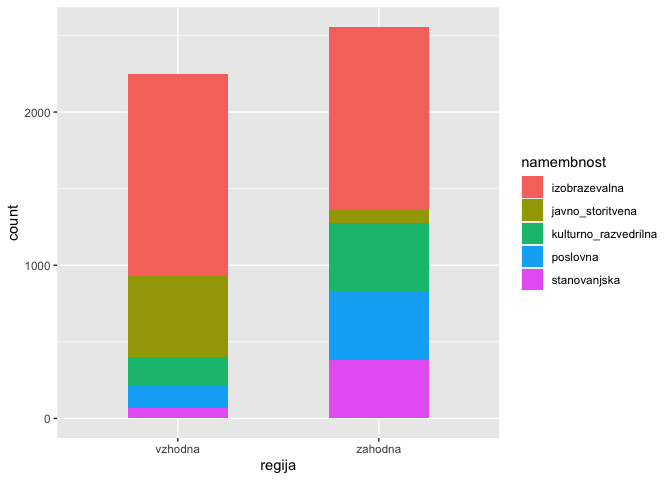

# Seminarska naloga

Cilj seminarske naloge je uporabiti metode strojnega učenja za gradnjo
modelov za napovedovanje porabe električne energije (regresijski
problem) in namembnosti stavbe (klasifikacijski problem), ustrezno
ovrednotiti modele in jasno predstaviti dobljene rezultate.

## Vizualizacija podatkov

### Uvoz podatkov

Najprej uvozimo in na kratko preglejmo podatke.

Opazimo, da imamo 3 atribute tipa “character”: `datum`, `regija` in
`namembnost`. Atributa `regija` in `namembnost` (z indeksi `2` in `4`)
imata le majhno stevilo vrednosti, zato jih bomo faktorizirali. Datum
bomo pa kasneje preuredili v bolj smiselno obliko.

``` r
stavbe <- read.table("trainset.txt", header=T, sep=",")

summary(stavbe)
```

    ##     datum              regija              stavba        namembnost       
    ##  Length:24125       Length:24125       Min.   :  1.00   Length:24125      
    ##  Class :character   Class :character   1st Qu.: 39.00   Class :character  
    ##  Mode  :character   Mode  :character   Median : 79.00   Mode  :character  
    ##                                        Mean   : 87.49                     
    ##                                        3rd Qu.:135.00                     
    ##                                        Max.   :193.00                     
    ##     povrsina       leto_izgradnje   temp_zraka     temp_rosisca    
    ##  Min.   :  329.3   Min.   :1903   Min.   :-7.20   Min.   :-19.400  
    ##  1st Qu.: 4106.6   1st Qu.:1950   1st Qu.:10.00   1st Qu.: -2.800  
    ##  Median : 6763.3   Median :1970   Median :20.00   Median :  2.800  
    ##  Mean   :10958.1   Mean   :1970   Mean   :19.15   Mean   :  3.816  
    ##  3rd Qu.:14409.3   3rd Qu.:2000   3rd Qu.:28.30   3rd Qu.: 11.100  
    ##  Max.   :79000.4   Max.   :2017   Max.   :41.70   Max.   : 25.000  
    ##    oblacnost        padavine          pritisk         smer_vetra   
    ##  Min.   :0.000   Min.   :-1.0000   Min.   : 997.2   Min.   :  0.0  
    ##  1st Qu.:2.000   1st Qu.: 0.0000   1st Qu.:1011.9   1st Qu.: 70.0  
    ##  Median :4.000   Median : 0.0000   Median :1015.9   Median :140.0  
    ##  Mean   :3.718   Mean   : 0.3113   Mean   :1017.1   Mean   :156.6  
    ##  3rd Qu.:6.000   3rd Qu.: 0.0000   3rd Qu.:1021.8   3rd Qu.:250.0  
    ##  Max.   :9.000   Max.   :56.0000   Max.   :1040.9   Max.   :360.0  
    ##  hitrost_vetra        poraba       
    ##  Min.   : 0.000   Min.   :   0.00  
    ##  1st Qu.: 2.100   1st Qu.:  53.48  
    ##  Median : 3.600   Median : 112.90  
    ##  Mean   : 3.756   Mean   : 224.55  
    ##  3rd Qu.: 5.100   3rd Qu.: 215.41  
    ##  Max.   :12.400   Max.   :2756.54

``` r
factorize <- function (data)
{
  for (i in 2:ncol(data)) {
    if (!is.numeric(data[,i])) {
      data[,i] <- as.factor(data[,i]) 
    }
  }
}
factorize(stavbe)
summary(stavbe)
```

    ##     datum              regija              stavba        namembnost       
    ##  Length:24125       Length:24125       Min.   :  1.00   Length:24125      
    ##  Class :character   Class :character   1st Qu.: 39.00   Class :character  
    ##  Mode  :character   Mode  :character   Median : 79.00   Mode  :character  
    ##                                        Mean   : 87.49                     
    ##                                        3rd Qu.:135.00                     
    ##                                        Max.   :193.00                     
    ##     povrsina       leto_izgradnje   temp_zraka     temp_rosisca    
    ##  Min.   :  329.3   Min.   :1903   Min.   :-7.20   Min.   :-19.400  
    ##  1st Qu.: 4106.6   1st Qu.:1950   1st Qu.:10.00   1st Qu.: -2.800  
    ##  Median : 6763.3   Median :1970   Median :20.00   Median :  2.800  
    ##  Mean   :10958.1   Mean   :1970   Mean   :19.15   Mean   :  3.816  
    ##  3rd Qu.:14409.3   3rd Qu.:2000   3rd Qu.:28.30   3rd Qu.: 11.100  
    ##  Max.   :79000.4   Max.   :2017   Max.   :41.70   Max.   : 25.000  
    ##    oblacnost        padavine          pritisk         smer_vetra   
    ##  Min.   :0.000   Min.   :-1.0000   Min.   : 997.2   Min.   :  0.0  
    ##  1st Qu.:2.000   1st Qu.: 0.0000   1st Qu.:1011.9   1st Qu.: 70.0  
    ##  Median :4.000   Median : 0.0000   Median :1015.9   Median :140.0  
    ##  Mean   :3.718   Mean   : 0.3113   Mean   :1017.1   Mean   :156.6  
    ##  3rd Qu.:6.000   3rd Qu.: 0.0000   3rd Qu.:1021.8   3rd Qu.:250.0  
    ##  Max.   :9.000   Max.   :56.0000   Max.   :1040.9   Max.   :360.0  
    ##  hitrost_vetra        poraba       
    ##  Min.   : 0.000   Min.   :   0.00  
    ##  1st Qu.: 2.100   1st Qu.:  53.48  
    ##  Median : 3.600   Median : 112.90  
    ##  Mean   : 3.756   Mean   : 224.55  
    ##  3rd Qu.: 5.100   3rd Qu.: 215.41  
    ##  Max.   :12.400   Max.   :2756.54

### Izris grafov

Najprej vizualizirajmo porazdelitvene vrednosti posameznih atributov, da
dobimo boljsi vpogled v vsak atribut posebej.

``` r
pie(table(stavbe$regija), xlab="Regija")
```


``` r
pie(table(stavbe$stavba), xlab="Oznaka stavbe")
```


``` r
pie(table(stavbe$namembnost), xlab="Namembnost")
```


``` r
hist(stavbe$povrsina, xlab="Povrsina (m^2)", main="Histogram povrsine stavb")
```


``` r
hist(stavbe$poraba, xlab="Poraba (kWh)", main="Histogram porabe stavb")
```


``` r
hist(stavbe$leto_izgradnje, xlab="Leto izgradnje", main="Histogram leta izgradnje stavb")
```


``` r
hist(stavbe$temp_zraka, xlab="Temperatura zraka (°C)", main="Histogram temperature zraka")
```


``` r
hist(stavbe$temp_rosisca, xlab="Temperatura rosisca (°C)", main="Histogram temperature rosisca")
```


``` r
hist(stavbe$oblacnost, xlab="Oblacnost", main="Histogram stopnje pokritosti neba z oblaki")
```


``` r
hist(stavbe$oblacnost, xlab="Padavine (mm)", main="Histogram kolicine padavin")
```


``` r
hist(stavbe$oblacnost, xlab="Pritisk (mbar)", main="Histogram zracnega pritiska")
```


``` r
hist(stavbe$smer_vetra, xlab="Smer vetra (°)", main="Histogram smeri vetra")
```


``` r
hist(stavbe$smer_vetra, xlab="Hitrost vetra (m/s)", main="Histogram hitrosti vetra")
```


Pri nadalnji predikciji nam bo koristilo tudi nekaj intuicije o
soodvisnosti med doloceni atributi.

Ze samo po sebi je logicno, da bodo nekateri atributi (npr. povrsina
stavbe \<-> poraba energije) v vecji medsebojni odvisnosti, kot nekateri
drugi atributi (npr. smer vetra \<-> poraba energije);

Naso hipotezo lahko dodatno potrdimo z nekaj grafi, kjer prikazemo
korelacijo med izbranimi pari atributov.

Zdaj izrisimo nekaj korelacijskih grafov, da potrimo ali pa ovrzemo nase
hipoteze. Da bo trend se bolje viden, lahko na graf izrisemo se linearno
regresijsko premico.

Pri porabi elektricne energije v odvisnosti z povrsino stavbe vidimo, da
obstaja jasen trend.

``` r
x <- stavbe$povrsina
y <- stavbe$poraba
plot(x, y, col="lightblue")
abline(lm(y ~ x), col = "red", lwd = 3)
```


Medtem ko pri grafu porabe energije v odvisnosti od smeri vetra jasne
korelacije ni.

``` r
x <- stavbe$smer_vetra
y <- stavbe$poraba
plot(x, y, col="lightblue")
abline(lm(y ~ x), col = "red", lwd = 3)
```



Najboljse bi bilo primerjati vse atribute z vsemi drugimi atributi, ter
prikazati medsebojne odvisnosti, tako bi pridobili visoko nivojski
pogled na odvisnosti med atributi.

Za to vrstno vizualizacijo bomo uporabili dve zunanji knjiznici
`ggplot2` in `ggcorrplot`, ki jih moramo prenesti in namestiti.

Ta graf nam izpise korelacijsko matriko, iz katere lahko razberemo
korelacije med vsemi numericni atributi. Opazimo, da sta v najvecji
medsebojni korelaciji res atributa `poraba` in `povrsina`.

``` r
library(ggplot2)
library(ggcorrplot)

data(stavbe, package="mosaicData")
```

    ## Warning in data(stavbe, package = "mosaicData"): data set 'stavbe' not found

``` r
# izberemo samo numericne atribute
df <- dplyr::select_if(stavbe, is.numeric)

# izracunamo korelacije z metodo cor
r <- cor(df, use="complete.obs")
round(r,2)
```

    ##                stavba povrsina leto_izgradnje temp_zraka temp_rosisca oblacnost
    ## stavba           1.00     0.16          -0.24      -0.52         0.00      0.16
    ## povrsina         0.16     1.00           0.08      -0.08         0.00      0.02
    ## leto_izgradnje  -0.24     0.08           1.00       0.17         0.00     -0.05
    ## temp_zraka      -0.52    -0.08           0.17       1.00         0.61     -0.28
    ## temp_rosisca     0.00     0.00           0.00       0.61         1.00      0.06
    ## oblacnost        0.16     0.02          -0.05      -0.28         0.06      1.00
    ## padavine         0.08     0.01          -0.03      -0.08         0.05      0.16
    ## pritisk          0.40     0.06          -0.13      -0.56        -0.33     -0.04
    ## smer_vetra       0.28     0.05          -0.09      -0.27        -0.11      0.06
    ## hitrost_vetra    0.21     0.03          -0.07      -0.23        -0.15      0.09
    ## poraba           0.11     0.82           0.15      -0.02         0.04      0.01
    ##                padavine pritisk smer_vetra hitrost_vetra poraba
    ## stavba             0.08    0.40       0.28          0.21   0.11
    ## povrsina           0.01    0.06       0.05          0.03   0.82
    ## leto_izgradnje    -0.03   -0.13      -0.09         -0.07   0.15
    ## temp_zraka        -0.08   -0.56      -0.27         -0.23  -0.02
    ## temp_rosisca       0.05   -0.33      -0.11         -0.15   0.04
    ## oblacnost          0.16   -0.04       0.06          0.09   0.01
    ## padavine           1.00   -0.11       0.01          0.00   0.01
    ## pritisk           -0.11    1.00      -0.03         -0.03   0.03
    ## smer_vetra         0.01   -0.03       1.00          0.53   0.03
    ## hitrost_vetra      0.00   -0.03       0.53          1.00   0.03
    ## poraba             0.01    0.03       0.03          0.03   1.00

``` r
ggcorrplot(r,
           hc.order=T, # uredi po korelaciji
           type="lower") # prikazi samo v spodnjem trikotniku
```


## Priprava atributov

### Pomozne metode

V naslednjem razdelku bomo pri obdelavi podatkov uporabili naslednje
pomozne metode, ter knjiznico \`\`.

``` r
library(lubridate)
```

    ## 
    ## Attaching package: 'lubridate'

    ## The following objects are masked from 'package:base':
    ## 
    ##     date, intersect, setdiff, union

``` r
library(stringr)

toMonth <- function(date) month(as.Date(date));
toSeason <- function(input.date)
{
  numeric.date <- 100*month(input.date)+day(input.date)
  ## input Seasons upper limits in the form MMDD in the "break =" option:
  cuts <- base::cut(numeric.date, breaks = c(0,319,0620,0921,1220,1231)) 
  # rename the resulting groups (could've been done within cut(...levels=) if "Winter" wasn't double
  levels(cuts) <- c("Winter","Spring","Summer","Fall","Winter")
  return(cuts)
}
isWeekend <- function(input.date)
{
  weekday <- strftime(input.date,'%A')
  str_detect(strftime(stavbe$datum,'%A'), "Sunday|Monday")
}
isWinter <- function(input.date)
{
  toSeason(input.date) == "Winter"
}
```

Sedaj bomo poskusali izboljsati kvaliteto posameznih atributov. Najbolj
ociten atribut, ki potrebuje izboljsavo oz. obdelavo je `datum`.

Najprej bomo napisali nekaj pomoznih metod za evaluacijo atributov.

Metoda `evalClassFeatures` bo evaluirala podatke z dano formulo z vsemi
definiranimi ocenami za klasifikacijske probleme. Prav tako bo metoda
`evalRegrFeatures` evaluirala atribute z definiranimi ocenami za
regresijske probleme.

``` r
library(CORElearn)

evalFeatures <- function (formula, data, estimators)
{
  for (estimator in estimators) {
    score = attrEval(formula, data, estimator);
    
    cat(paste(estimator, "\n"))
    print(sort(score, decreasing=T))
    cat("\n\n")
  }
}

evalClassFeatures <- function (formula, data)
{
  shortSighted <- list("InfGain", "GainRatio", "Gini", "MDL")
  nonShortSighted <- list("Relief", "ReliefFequalK", "ReliefFexpRank")
  estimators <- c(shortSighted, nonShortSighted)
  evalFeatures(formula, data, estimators)
}

evalRegrFeatures <- function (formula, data)
{
  estimators <- list("MSEofMean", "RReliefFexpRank")
  evalFeatures(formula, data, estimators)
}
```

Poglejmo si vse ocene za trenutno mnozico atributov:

``` r
evalClassFeatures(namembnost ~ ., stavbe)
```

    ## Changing dependent variable to factor with levels: izobrazevalna javno_storitvena kulturno_razvedrilna poslovna stanovanjska

    ## Warning in attrEval(formula, data, estimator): Possibly this is an error caused
    ## by regression formula and classification attribute estimator or vice versa.

    ## InfGain 
    ##       povrsina         regija         stavba leto_izgradnje     temp_zraka 
    ##    0.242867703    0.187635967    0.187635967    0.170489197    0.058759648 
    ##          datum         poraba        pritisk     smer_vetra      oblacnost 
    ##    0.051873098    0.046933702    0.038678565    0.031117122    0.014874294 
    ##  hitrost_vetra   temp_rosisca       padavine 
    ##    0.007483121    0.006136749    0.004304307 
    ## 
    ## 
    ## Changing dependent variable to factor with levels: izobrazevalna javno_storitvena kulturno_razvedrilna poslovna stanovanjska

    ## Warning in attrEval(formula, data, estimator): Possibly this is an error caused
    ## by regression formula and classification attribute estimator or vice versa.

    ## GainRatio 
    ##         stavba       povrsina         poraba         regija leto_izgradnje 
    ##     0.39862226     0.36396346     0.33856626     0.18815751     0.17093675 
    ##     temp_zraka        pritisk   temp_rosisca     smer_vetra      oblacnost 
    ##     0.07425728     0.04411888     0.03356320     0.03119261     0.02742681 
    ##       padavine  hitrost_vetra          datum 
    ##     0.02718947     0.02582828     0.00627207 
    ## 
    ## 
    ## Changing dependent variable to factor with levels: izobrazevalna javno_storitvena kulturno_razvedrilna poslovna stanovanjska

    ## Warning in attrEval(formula, data, estimator): Possibly this is an error caused
    ## by regression formula and classification attribute estimator or vice versa.

    ## Gini 
    ##       povrsina leto_izgradnje         regija         stavba         poraba 
    ##   0.0812406365   0.0526331906   0.0292248014   0.0292248014   0.0172333605 
    ##     temp_zraka          datum        pritisk     smer_vetra      oblacnost 
    ##   0.0098485629   0.0083911589   0.0069052732   0.0055992237   0.0025554217 
    ##  hitrost_vetra   temp_rosisca       padavine 
    ##   0.0013654599   0.0010846709   0.0007024586 
    ## 
    ## 
    ## Changing dependent variable to factor with levels: izobrazevalna javno_storitvena kulturno_razvedrilna poslovna stanovanjska

    ## Warning in attrEval(formula, data, estimator): Possibly this is an error caused
    ## by regression formula and classification attribute estimator or vice versa.

    ## MDL 
    ##       povrsina         regija         stavba leto_izgradnje     temp_zraka 
    ##    0.241739833    0.186436871    0.186436871    0.169517637    0.057774668 
    ##         poraba        pritisk     smer_vetra      oblacnost  hitrost_vetra 
    ##    0.046023490    0.037743430    0.030187093    0.014010364    0.006574901 
    ##   temp_rosisca       padavine          datum 
    ##    0.005322963    0.003582116   -0.079678101 
    ## 
    ## 
    ## Changing dependent variable to factor with levels: izobrazevalna javno_storitvena kulturno_razvedrilna poslovna stanovanjska

    ## Warning in attrEval(formula, data, estimator): Possibly this is an error caused
    ## by regression formula and classification attribute estimator or vice versa.

    ## Relief 
    ##       povrsina leto_izgradnje         poraba         regija       padavine 
    ##   0.0889016180   0.0755267097   0.0447741638   0.0000000000  -0.0005412841 
    ##      oblacnost     temp_zraka   temp_rosisca  hitrost_vetra        pritisk 
    ##  -0.0062176166  -0.0068211817  -0.0080754329  -0.0088129701  -0.0115462389 
    ##     smer_vetra         stavba          datum 
    ##  -0.0118341969  -0.0185909614  -0.0847253886 
    ## 
    ## 
    ## Changing dependent variable to factor with levels: izobrazevalna javno_storitvena kulturno_razvedrilna poslovna stanovanjska

    ## Warning in attrEval(formula, data, estimator): Possibly this is an error caused
    ## by regression formula and classification attribute estimator or vice versa.

    ## ReliefFequalK 
    ## leto_izgradnje         stavba       povrsina         poraba         regija 
    ##    0.278877131    0.235649559    0.210251404    0.134850991    0.103119921 
    ##          datum     temp_zraka     smer_vetra        pritisk   temp_rosisca 
    ##    0.103075148    0.055162709    0.053875801    0.050310370    0.036556668 
    ##  hitrost_vetra      oblacnost       padavine 
    ##    0.035755276    0.029360374    0.004076341 
    ## 
    ## 
    ## Changing dependent variable to factor with levels: izobrazevalna javno_storitvena kulturno_razvedrilna poslovna stanovanjska

    ## Warning in attrEval(formula, data, estimator): Possibly this is an error caused
    ## by regression formula and classification attribute estimator or vice versa.

    ## ReliefFexpRank 
    ## leto_izgradnje         stavba       povrsina          datum         poraba 
    ##    0.303846017    0.266510448    0.208895707    0.129833629    0.126339326 
    ##         regija     smer_vetra     temp_zraka        pritisk   temp_rosisca 
    ##    0.123741661    0.061417632    0.060669026    0.055773086    0.040549678 
    ##  hitrost_vetra      oblacnost       padavine 
    ##    0.037002331    0.032423581    0.004884978

``` r
evalRegrFeatures(poraba ~ ., stavbe)
```

    ## MSEofMean 
    ##       povrsina leto_izgradnje         stavba     namembnost         regija 
    ##      -49643.37      -93093.85      -96620.67      -98182.44      -99578.23 
    ##          datum   temp_rosisca     smer_vetra        pritisk     temp_zraka 
    ##      -99580.03     -100039.15     -100503.28     -100513.20     -100523.85 
    ##  hitrost_vetra      oblacnost       padavine 
    ##     -100591.84     -100652.53     -100694.52 
    ## 
    ## 
    ## RReliefFexpRank 
    ##       povrsina leto_izgradnje     namembnost         regija       padavine 
    ##   4.735627e-01   7.218319e-02   4.633767e-03  -8.942099e-06  -5.177722e-05 
    ##        pritisk  hitrost_vetra      oblacnost     temp_zraka   temp_rosisca 
    ##  -1.716134e-02  -2.192862e-02  -2.304445e-02  -2.395132e-02  -2.857306e-02 
    ##     smer_vetra         stavba          datum 
    ##  -2.977830e-02  -3.200896e-02  -1.115974e-01

Dodamo atributa `letni_cas` ter `mesec`.

``` r
stavbe$letni_cas <- toSeason(stavbe$datum)
stavbe$mesec <- toMonth(stavbe$datum)
stavbe$zima <- isWinter(stavbe$datum)
stavbe$vikend <- isWeekend(stavbe$datum)

# faktoriziramo atribute
factorize(stavbe)
```

Ponovno evaluiramo ocene atributov:

``` r
evalClassFeatures(namembnost ~ ., stavbe)
```

    ## Changing dependent variable to factor with levels: izobrazevalna javno_storitvena kulturno_razvedrilna poslovna stanovanjska

    ## Warning in attrEval(formula, data, estimator): Possibly this is an error caused
    ## by regression formula and classification attribute estimator or vice versa.

    ## InfGain 
    ##       povrsina         regija         stavba leto_izgradnje     temp_zraka 
    ##   0.2428677028   0.1876359670   0.1876359670   0.1704891974   0.0587596484 
    ##          datum         poraba        pritisk     smer_vetra      oblacnost 
    ##   0.0518730975   0.0469337020   0.0386785653   0.0311171224   0.0148742944 
    ##  hitrost_vetra      letni_cas   temp_rosisca       padavine           zima 
    ##   0.0074831206   0.0065647882   0.0061367490   0.0043043066   0.0032470091 
    ##          mesec         vikend 
    ##   0.0018301619   0.0001487495 
    ## 
    ## 
    ## Changing dependent variable to factor with levels: izobrazevalna javno_storitvena kulturno_razvedrilna poslovna stanovanjska

    ## Warning in attrEval(formula, data, estimator): Possibly this is an error caused
    ## by regression formula and classification attribute estimator or vice versa.

    ## GainRatio 
    ##         stavba       povrsina         poraba         regija leto_izgradnje 
    ##   0.3986222639   0.3639634551   0.3385662628   0.1881575124   0.1709367452 
    ##     temp_zraka        pritisk   temp_rosisca     smer_vetra      oblacnost 
    ##   0.0742572812   0.0441188834   0.0335631970   0.0311926138   0.0274268124 
    ##       padavine  hitrost_vetra          datum           zima      letni_cas 
    ##   0.0271894663   0.0258282835   0.0062720703   0.0035411520   0.0033510681 
    ##          mesec         vikend 
    ##   0.0024846718   0.0001734056 
    ## 
    ## 
    ## Changing dependent variable to factor with levels: izobrazevalna javno_storitvena kulturno_razvedrilna poslovna stanovanjska

    ## Warning in attrEval(formula, data, estimator): Possibly this is an error caused
    ## by regression formula and classification attribute estimator or vice versa.

    ## Gini 
    ##       povrsina leto_izgradnje         regija         stavba         poraba 
    ##   8.124064e-02   5.263319e-02   2.922480e-02   2.922480e-02   1.723336e-02 
    ##     temp_zraka          datum        pritisk     smer_vetra      oblacnost 
    ##   9.848563e-03   8.391159e-03   6.905273e-03   5.599224e-03   2.555422e-03 
    ##  hitrost_vetra      letni_cas   temp_rosisca       padavine           zima 
    ##   1.365460e-03   1.198397e-03   1.084671e-03   7.024586e-04   5.945053e-04 
    ##          mesec         vikend 
    ##   3.350408e-04   2.772223e-05 
    ## 
    ## 
    ## Changing dependent variable to factor with levels: izobrazevalna javno_storitvena kulturno_razvedrilna poslovna stanovanjska

    ## Warning in attrEval(formula, data, estimator): Possibly this is an error caused
    ## by regression formula and classification attribute estimator or vice versa.

    ## MDL 
    ##       povrsina         regija         stavba leto_izgradnje     temp_zraka 
    ##   0.2417398333   0.1864368712   0.1864368712   0.1695176365   0.0577746680 
    ##         poraba        pritisk     smer_vetra      oblacnost  hitrost_vetra 
    ##   0.0460234897   0.0377434302   0.0301870929   0.0140103639   0.0065749006 
    ##   temp_rosisca      letni_cas       padavine           zima          mesec 
    ##   0.0053229630   0.0039963317   0.0035821162   0.0023411337   0.0009507798 
    ##         vikend          datum 
    ##  -0.0007426675  -0.0796781010 
    ## 
    ## 
    ## Changing dependent variable to factor with levels: izobrazevalna javno_storitvena kulturno_razvedrilna poslovna stanovanjska

    ## Warning in attrEval(formula, data, estimator): Possibly this is an error caused
    ## by regression formula and classification attribute estimator or vice versa.

    ## Relief 
    ##       povrsina leto_izgradnje         poraba         regija           zima 
    ##   5.834450e-02   4.772560e-02   2.265479e-02   0.000000e+00  -4.145078e-05 
    ##      letni_cas       padavine         vikend     temp_zraka          mesec 
    ##  -8.290155e-05  -1.330788e-04  -2.113990e-03  -3.116805e-03  -3.380122e-03 
    ##   temp_rosisca        pritisk      oblacnost  hitrost_vetra     smer_vetra 
    ##  -4.396521e-03  -5.202405e-03  -5.264249e-03  -5.465263e-03  -7.132604e-03 
    ##          datum         stavba 
    ##  -2.955440e-02  -4.396402e-02 
    ## 
    ## 
    ## Changing dependent variable to factor with levels: izobrazevalna javno_storitvena kulturno_razvedrilna poslovna stanovanjska

    ## Warning in attrEval(formula, data, estimator): Possibly this is an error caused
    ## by regression formula and classification attribute estimator or vice versa.

    ## ReliefFequalK 
    ## leto_izgradnje         stavba       povrsina          datum     smer_vetra 
    ##   0.2164811392   0.1869014278   0.1604881927   0.1563177768   0.1030853550 
    ##         regija         poraba     temp_zraka        pritisk  hitrost_vetra 
    ##   0.1030509245   0.0999246412   0.0862955211   0.0858721266   0.0774907852 
    ##   temp_rosisca      oblacnost          mesec         vikend      letni_cas 
    ##   0.0685705312   0.0669798685   0.0509975442   0.0221165781   0.0062707781 
    ##       padavine           zima 
    ##   0.0051411298   0.0005981803 
    ## 
    ## 
    ## Changing dependent variable to factor with levels: izobrazevalna javno_storitvena kulturno_razvedrilna poslovna stanovanjska

    ## Warning in attrEval(formula, data, estimator): Possibly this is an error caused
    ## by regression formula and classification attribute estimator or vice versa.

    ## ReliefFexpRank 
    ## leto_izgradnje         stavba          datum       povrsina         regija 
    ##   0.2394468033   0.2189586557   0.1658890031   0.1632827758   0.1305678490 
    ##     smer_vetra     temp_zraka        pritisk         poraba  hitrost_vetra 
    ##   0.1146440013   0.0994270702   0.0950729777   0.0905116673   0.0788345087 
    ##   temp_rosisca      oblacnost          mesec         vikend       padavine 
    ##   0.0730354003   0.0698344530   0.0536079663   0.0225813456   0.0057133685 
    ##      letni_cas           zima 
    ##   0.0055552908   0.0002812301

``` r
evalRegrFeatures(poraba ~ ., stavbe)
```

    ## MSEofMean 
    ##       povrsina leto_izgradnje         stavba     namembnost         regija 
    ##      -49643.37      -93093.85      -96620.67      -98182.44      -99578.23 
    ##          datum   temp_rosisca          mesec      letni_cas     smer_vetra 
    ##      -99580.03     -100039.15     -100482.28     -100492.86     -100503.28 
    ##        pritisk     temp_zraka  hitrost_vetra      oblacnost         vikend 
    ##     -100513.20     -100523.85     -100591.84     -100652.53     -100668.71 
    ##           zima       padavine 
    ##     -100693.46     -100694.52 
    ## 
    ## 
    ## RReliefFexpRank 
    ##       povrsina leto_izgradnje         regija       padavine           zima 
    ##   4.810538e-01   2.352275e-02  -1.526087e-06  -1.835613e-05  -1.467207e-04 
    ##      letni_cas         vikend     temp_zraka          mesec        pritisk 
    ##  -4.512166e-04  -3.343471e-03  -4.455262e-03  -5.109809e-03  -5.874341e-03 
    ##   temp_rosisca  hitrost_vetra      oblacnost     smer_vetra     namembnost 
    ##  -8.045726e-03  -8.115391e-03  -9.764533e-03  -1.118872e-02  -2.125993e-02 
    ##          datum         stavba 
    ##  -3.540041e-02  -5.656290e-02
